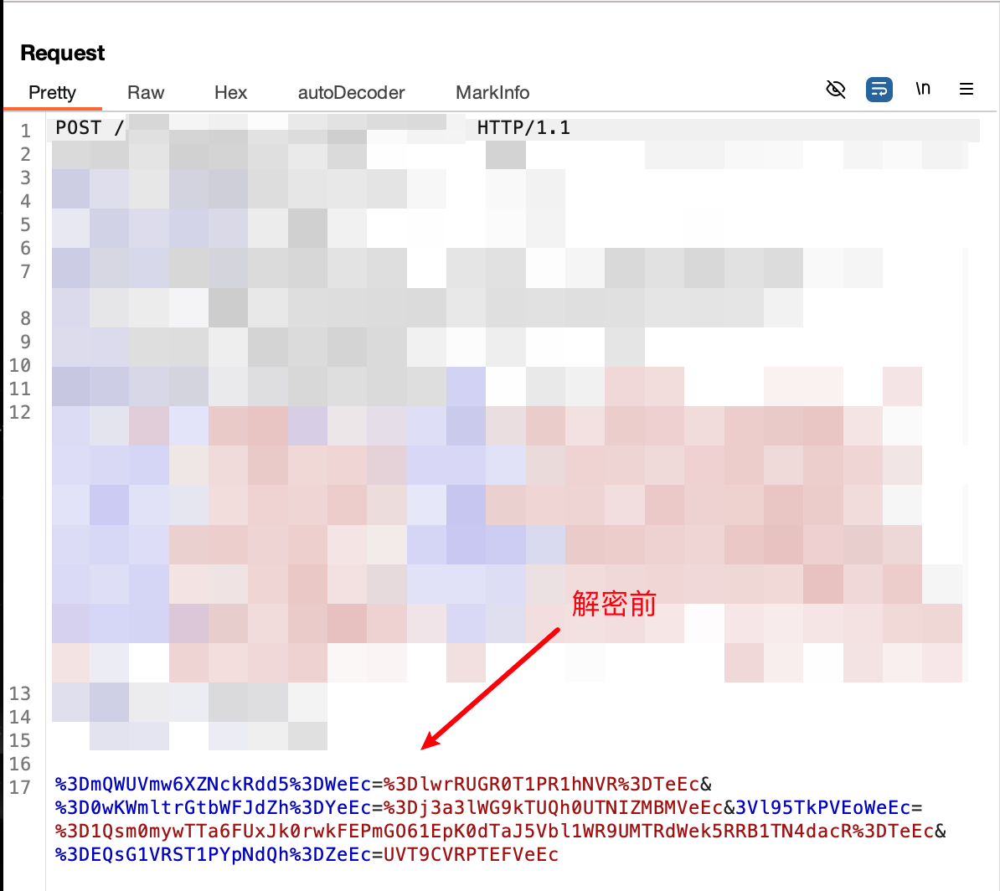
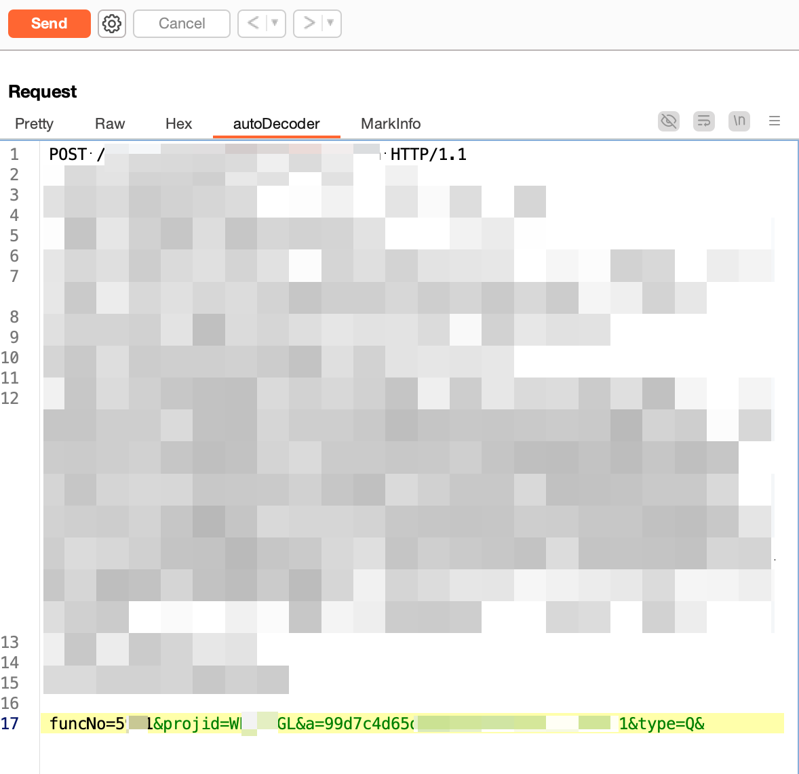

# 002-渗透案例：记一次简单前端加密案例


&lt;!--more--&gt;

## 前端JS分析
在一个项目上遇到的数据包加密，发现键值对都进行了加密使其不可读，数据包示例如下：
```http
POST /xxxxx/xxxxx HTTP/1.1
Host: xxxxxxxx

%3DmQWUVmw6XZNckRdd5%3DWeEc=%3DlwrRUGR0T1PR1hNVR%3DTeEc&amp;%3D0wKWmltrGtbWFJdZh%3DYeEc=%3Dj3a3lWG9kTUQh0UTNIZMBMVeEc&amp;3Vl95TkPVEoWeEc=%3D1Qsm0mywTTa6FUxJk0rwkFEPmGO61EpK0dTaJ5Vbl1WR9UMTRdWek5RRB1TN4dacR%3DTeEc&amp;%3DEQsG1VRST1PYpNdQh%3DZeEc=UVT9CVRPTEFVeEc
```

通过前端js分析后，发现使用的是 `picList.encode(picList.encode2(param))`

仔细研究后发现，它跟 picList 其实关系不大，是开发者自己编写的一段js

对该前端代码进行分析，核心代码 jquery.picList.js 如下：

```js
var picList = {
	base64EncodeChars: &#39;ABCDEFGHIJKLMNOPQRSTUVWXYZabcdefghijklmnopqrstuvwxyz0123456789&#43;/&#39;,
	base64DecodeChars: new Array(-1, -1, -1, -1, -1, -1, -1, -1, -1, -1, -1, -1, -1, -1, -1, -1, -1, -1, -1, -1, -1, -1, -1, -1, -1, -1, -1, -1, -1, -1, -1, -1, -1, -1, -1, -1, -1, -1, -1, -1, -1, -1, -1, 62, -1, -1, -1, 63, 52, 53, 54, 55, 56, 57, 58, 59, 60, 61, -1, -1, -1, -1, -1, -1, -1, 0, 1, 2, 3, 4, 5, 6, 7, 8, 9, 10, 11, 12, 13, 14, 15, 16, 17, 18, 19, 20, 21, 22, 23, 24, 25, -1, -1, -1, -1, -1, -1, 26, 27, 28, 29, 30, 31, 32, 33, 34, 35, 36, 37, 38, 39, 40, 41, 42, 43, 44, 45, 46, 47, 48, 49, 50, 51, -1, -1, -1, -1, -1),
	base64encode: function (r) {
		for (var e, a, t, o = r.length, h = 0, c = &#39;&#39;; h &lt; o;) {
			if (e = 255 &amp; r.charCodeAt(h&#43;&#43;), h == o) {
				c = (c &#43;= this.base64EncodeChars.charAt(e &gt;&gt; 2)) &#43; this.base64EncodeChars.charAt((3 &amp; e) &lt;&lt; 4) &#43; &#39;==&#39;;
				break;
			}
			if (a = r.charCodeAt(h&#43;&#43;), h == o) {
				c = (c = (c &#43;= this.base64EncodeChars.charAt(e &gt;&gt; 2)) &#43; this.base64EncodeChars.charAt((3 &amp; e) &lt;&lt; 4 | (240 &amp; a) &gt;&gt; 4)) &#43; this.base64EncodeChars.charAt((15 &amp; a) &lt;&lt; 2) &#43; &#39;=&#39;;
				break;
			}
			t = r.charCodeAt(h&#43;&#43;), c = (c = (c = (c &#43;= this.base64EncodeChars.charAt(e &gt;&gt; 2)) &#43; this.base64EncodeChars.charAt((3 &amp; e) &lt;&lt; 4 | (240 &amp; a) &gt;&gt; 4)) &#43; this.base64EncodeChars.charAt((15 &amp; a) &lt;&lt; 2 | (192 &amp; t) &gt;&gt; 6)) &#43; this.base64EncodeChars.charAt(63 &amp; t);
		}
		return c;
	},
	base64decode: function (r) {
		for (var e, a, t, o, h = r.length, c = 0, s = &#39;&#39;; c &lt; h;) {
			for (; e = this.base64DecodeChars[255 &amp; r.charCodeAt(c&#43;&#43;)], c &lt; h &amp;&amp; -1 == e;);
			if (-1 == e)
				break;
			for (; a = this.base64DecodeChars[255 &amp; r.charCodeAt(c&#43;&#43;)], c &lt; h &amp;&amp; -1 == a;);
			if (-1 == a)
				break;
			s &#43;= String.fromCharCode(e &lt;&lt; 2 | (48 &amp; a) &gt;&gt; 4);
			do {
				if (61 == (t = 255 &amp; r.charCodeAt(c&#43;&#43;)))
					return s;
			} while (t = this.base64DecodeChars[t], c &lt; h &amp;&amp; -1 == t);
			if (-1 == t)
				break;
			s &#43;= String.fromCharCode((15 &amp; a) &lt;&lt; 4 | (60 &amp; t) &gt;&gt; 2);
			do {
				if (61 == (o = 255 &amp; r.charCodeAt(c&#43;&#43;)))
					return s;
			} while (o = this.base64DecodeChars[o], c &lt; h &amp;&amp; -1 == o);
			if (-1 == o)
				break;
			s &#43;= String.fromCharCode((3 &amp; t) &lt;&lt; 6 | o);
		}
		return s;
	},
	utf16to8: function (r) {
		for (var e, a = &#39;&#39;, t = r.length, o = 0; o &lt; t; o&#43;&#43;)
			1 &lt;= (e = r.charCodeAt(o)) &amp;&amp; e &lt;= 127 ? a &#43;= r.charAt(o) : a = 2047 &lt; e ? (a = (a &#43;= String.fromCharCode(224 | e &gt;&gt; 12 &amp; 15)) &#43; String.fromCharCode(128 | e &gt;&gt; 6 &amp; 63)) &#43; String.fromCharCode(128 | e &gt;&gt; 0 &amp; 63) : (a &#43;= String.fromCharCode(192 | e &gt;&gt; 6 &amp; 31)) &#43; String.fromCharCode(128 | e &gt;&gt; 0 &amp; 63);
		return a;
	},
	utf8to16: function (r) {
		for (var e, a, t, o = &#39;&#39;, h = r.length, c = 0; c &lt; h;)
			switch ((e = r.charCodeAt(c&#43;&#43;)) &gt;&gt; 4) {
			case 0:
			case 1:
			case 2:
			case 3:
			case 4:
			case 5:
			case 6:
			case 7:
				o &#43;= r.charAt(c - 1);
				break;
			case 12:
			case 13:
				a = r.charCodeAt(c&#43;&#43;), o &#43;= String.fromCharCode((31 &amp; e) &lt;&lt; 6 | 63 &amp; a);
				break;
			case 14:
				a = r.charCodeAt(c&#43;&#43;), t = r.charCodeAt(c&#43;&#43;), o &#43;= String.fromCharCode((15 &amp; e) &lt;&lt; 12 | (63 &amp; a) &lt;&lt; 6 | (63 &amp; t) &lt;&lt; 0);
			}
		return o;
	},
	randomStr: function (r) {
		for (var e = &#39;poiuytrewqasdfghjklmnbvcxzQWERTYUIOPLKJHGFDSAZXCVBNM123456789&#39;, a = &#39;&#39;, t = 0; t &lt; r; t&#43;&#43;)
			a &#43;= e.charAt(Math.ceil(100000000 * Math.random()) % e.length);
		return a;
	},
	encode: function (r) {
		$.ECOND.picture &amp;&amp; $.ECOND.picture, r &#43;= this.randomStr(5);
		for (var e, a = (str = picList.base64encode(picList.utf16to8(r))).split(&#39;&#39;), t = 0; t &lt; Math.floor(a.length / 2); t&#43;&#43;)
			t % 2 == 0 &amp;&amp; (e = a[t], a[t] = a[a.length - 1 - t], a[a.length - 1 - t] = e);
		return $.ECOND.picture &amp;&amp; &#39;&#39; != $.ECOND.picture ? a.join(&#39;&#39;) &#43; &#39;cEe&#39; : a.join(&#39;&#39;) &#43; &#39;eEc&#39;;
	},
	encode2: function (r) {
		return picList.base64encode(picList.utf16to8(r));
	}
};
```

前端 加密方式类似于： `picList.encode(picList.encode2(param))`

对这段JS进行分析，encode2 其实就相当于 base64 编码，就不分析了。

对 encode 函数进行分析
```JS
	encode: function (r) {
		// $.ECOND.picture是一个全局配置，暂时忽略；randomStr(5)生成随机5位字符串并附加到r后面
		$.ECOND.picture &amp;&amp; $.ECOND.picture, r &#43;= this.randomStr(5);
		// picList.base64encode 就是 base64编码，picList.utf16to8(r)进行utf-8编码转化
		// 将base64编码后的str分割成字符数组a。然后进行一个循环，交换某些位置的字符
		for (var e, a = (str = picList.base64encode(picList.utf16to8(r))).split(&#39;&#39;), t = 0; t &lt; Math.floor(a.length / 2); t&#43;&#43;)
			// 当t是偶数时，进行a[t] 与 a[len-1-t] 交换，类似首位交换
			t % 2 == 0 &amp;&amp; (e = a[t], a[t] = a[a.length - 1 - t], a[a.length - 1 - t] = e);
			// 最后根据$.ECOND.picture的情况，在结果后添加不同的后缀
		return $.ECOND.picture &amp;&amp; &#39;&#39; != $.ECOND.picture ? a.join(&#39;&#39;) &#43; &#39;cEe&#39; : a.join(&#39;&#39;) &#43; &#39;eEc&#39;;
	},
```

## Python脚本
分析完这个JS后，基于AI生成编写Python加解密脚本

```python
import base64
import random
import string
from urllib.parse import quote, unquote

def randomStr(length):
    letters = string.ascii_letters
    return &#39;&#39;.join(random.choice(letters) for i in range(length))

def utf16to8(s):
    return s.encode(&#39;utf-8&#39;)

def utf8to16(s):
    return s.decode(&#39;utf-8&#39;)

def base64encode(s):
    return base64.b64encode(s).decode(&#39;utf-8&#39;)

def base64decode(s):
    return base64.b64decode(s)

ECOND = {
    &#39;picture&#39;: None 
}

def encode(r):
    # 给字符串 r 后面拼接随机5位字符串
    r = r &#43; randomStr(5)

    # 先将 r 转换为 UTF - 8 编码，再进行 Base64 编码
    encoded_str = base64encode(utf16to8(r))
    a = list(encoded_str)

    # 对编码后的字符串按字符拆分成数组，然后对数组的前半部分元素进行交换操作
    for t in range(len(a) // 2):
        if t % 2 == 0:
            # 如果当前索引 t 是偶数，交换数组中索引为 t 和 len(a) - 1 - t 的元素
            a[t], a[len(a) - 1 - t] = a[len(a) - 1 - t], a[t]

    # 根据 ECOND[&#39;picture&#39;] 的值进行判断，若存在且不为空，则拼接上 &#34;cEe&#34;，否则拼接上 &#34;eEc&#34;
    result = &#39;&#39;.join(a)
    if ECOND.get(&#39;picture&#39;):
        return result &#43; &#34;cEe&#34;
    else:
        return result &#43; &#34;eEc&#34;

def decode(r):
    # 移除拼接的后缀 &#34;cEe&#34; 或 &#34;eEc&#34;
    if r.endswith(&#34;cEe&#34;):
        r = r[:-3]
    elif r.endswith(&#34;eEc&#34;):
        r = r[:-3]

    a = list(r)
    # 逆向交换数组前半部分中索引为偶数的元素
    for t in range(len(a) // 2):
        if t % 2 == 0:
            a[t], a[len(a) - 1 - t] = a[len(a) - 1 - t], a[t]

    # 将数组元素拼接成字符串并进行 Base64 解码
    decoded_str = base64decode(&#39;&#39;.join(a))
    # 将 UTF - 8 编码的字符串转换为 UTF - 16 编码
    decoded_str = utf8to16(decoded_str)
    # 移除拼接的长度为 5 的随机字符串
    decoded_str = decoded_str[:-5]
    return decoded_str

def main():
    # 定义一个输入字符串    
    encoded_input = &#34;hUWWL2VH9Tkiz0pMWNEOPJlcZdtYeEc&#34;
    encoded_input = unquote(encoded_input)

    plain_input = &#39;helloworld&#39;

    # 调用 encode 函数进行编码
    encoded_output = quote(encode(base64encode(plain_input.encode(&#39;utf-8&#39;))))
    # 调用 decode 函数进行解码
    decoded_output = base64decode(decode(encoded_input)).decode(&#39;utf-8&#39;)

    # 打印结果
    print(f&#34;输入明文字符串: \n{plain_input}&#34;)
    print(f&#34;编码后的结果: \n{encoded_output}&#34;)
    print(f&#34;&#34;)
    print(f&#34;输入编码字符串: \n{encoded_input}&#34;)
    print(f&#34;解码后的结果: \n{decoded_output}&#34;)

if __name__ == &#34;__main__&#34;:
    main()
```


## AutoDecode脚本

在该项目上我使用Burpsuite 配合插件AutoDecode进行测试，因此需要编写AutoDecode相应的加密秘脚本。

注意该脚本未实现 encode 加密模块，decode模块可用

```python
# -*- coding:utf-8 -*-
# author: Xavier

from flask import Flask,Response,request,jsonify
from pyDes import *
from urllib.parse import parse_qs, quote, unquote
import base64
import chardet
import random
import string

app = Flask(__name__)

def randomStr(length):
    letters = string.ascii_letters
    return &#39;&#39;.join(random.choice(letters) for i in range(length))

def utf16to8(s):
    return s.encode(&#39;utf-8&#39;)

def utf8to16(s):
    return s.decode(&#39;utf-8&#39;)

def base64encode(s):
    return base64.b64encode(s).decode(&#39;utf-8&#39;)

def base64decode(s):
    return base64.b64decode(s)

# 模拟 $.ECOND.picture
ECOND = {
    &#39;picture&#39;: None  
}

def encode(r):
    r = r &#43; randomStr(5)
    encoded_str = base64encode(utf16to8(r))
    a = list(encoded_str)

    for t in range(len(a) // 2):
        if t % 2 == 0:
            # 如果当前索引 t 是偶数，交换数组中索引为 t 和 len(a) - 1 - t 的元素
            a[t], a[len(a) - 1 - t] = a[len(a) - 1 - t], a[t]

    result = &#39;&#39;.join(a)
    if ECOND.get(&#39;picture&#39;):
        return result &#43; &#34;cEe&#34;
    else:
        return result &#43; &#34;eEc&#34;

def decode(r):
    # 移除拼接的后缀 &#34;cEe&#34; 或 &#34;eEc&#34;
    if r.endswith(&#34;cEe&#34;):
        r = r[:-3]
    elif r.endswith(&#34;eEc&#34;):
        r = r[:-3]

    a = list(r)
    # 逆向交换数组前半部分中索引为偶数的元素
    for t in range(len(a) // 2):
        if t % 2 == 0:
            a[t], a[len(a) - 1 - t] = a[len(a) - 1 - t], a[t]

    decoded_str = base64decode(&#39;&#39;.join(a))
    decoded_str = utf8to16(decoded_str)
    decoded_str = decoded_str[:-5]  # 移除随机字符串
    return decoded_str

@app.route(&#39;/encode&#39;,methods=[&#34;POST&#34;])
def encrypt():
	……
	encry_param &#43;= &#39;&#39;
    return encry_param

@app.route(&#39;/decode&#39;,methods=[&#34;POST&#34;])
def decrypt():
    form_data = request.form.get(&#39;dataBody&#39;)
    # 使用 parse_qs 函数解析表单数据
    params_dict = parse_qs(form_data)
    decrypt_param = &#39;&#39;
    # 打印提取的键值对
    for key, values in params_dict.items():
        for value in values:
            print(f&#34;Key: {key}, Value: {value}&#34;)
            # 解密参数
            key = base64decode(decode(key)).decode(&#39;utf-8&#39;)
            value = base64decode(decode(value)).decode(&#39;utf-8&#39;)
            print(f&#34;Decoded Key: {key}, Decoded Value: {value}&#34;)
            decrypt_param &#43;= key &#43; &#39;=&#39; &#43; value &#43; &#39;&amp;&#39;

    decrypt_param &#43;= &#39;&#39;
    
    return decrypt_param

if __name__ == &#39;__main__&#39;:
    app.debug = True # 设置调试模式，生产模式的时候要关掉debug
    app.run(host=&#34;0.0.0.0&#34;,port=&#34;8888&#34;)

```


## 最终效果

配置完AutoDecode，启动Python脚本后，最后实现了对数据包的自动加解密，效果如下所示：

解密前：



解密后：



---

> 作者: Xavier  
> URL: http://localhost:1313/posts/002-casesimpleencryptioncase/  

