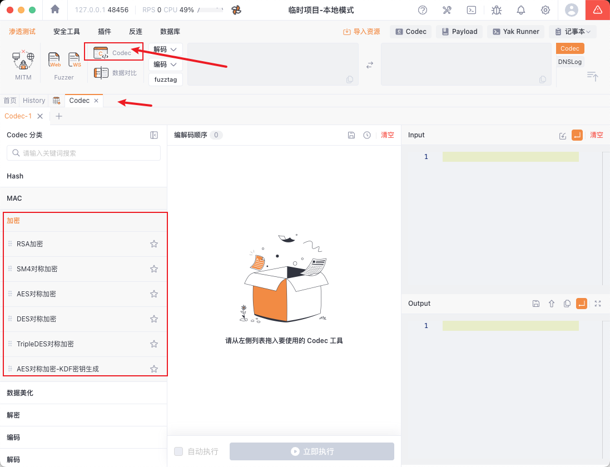

# 前端JS加解密对抗方法简述


本文主要介绍常见的应对前端JS加解密的方法

## 零、简述

常见需要前端JS调试完成加解密对抗的情况有：

1. 参数值加密：如登录过程中对用户名、密码进行了加密；
2. 键值加密：对参数的键值都进行了加密；
3. 数据包全加密：对数据包请求体进行了全加密；
4. 数据包签名：对数据包内容进行了某种签名算法以防篡改；
5. 组合利用

**常见加解密方法**有：

1. 对称加密：AES、SM4(国密)、 DES、3DES、SM1、SM7、RC5、RC6、RC4、ZUC、SSF446等

   特点：加解密使用同一个密钥，可逆

2. 非对称加密：RSA, SM2. SM9, Rabin, DH, DSA, ECC

   特点：密钥是成对的，分为公钥和私钥；

3. 散列算法：MD5、 SM3、 MAC, HMAC, SHA-1, SHA-2 (SHA-224. SHA-256, SHA-512/224. SHA-512/256) 等

   特点：无密钥，不可逆，固定长度


**问题解决思路**：

1. 分析加密算法，确认加密方式，还原加解密流程

2. 分析密钥来源：

   若为客户端生成密钥：密钥固定（硬编码密钥）/密钥随机（分析密钥生成算法）

   若为服务器返回密钥：则重新建立连接并进行抓包，获取密钥，再加解密

3. 若无法还原加解密流程：通常是存在魔改算法或混淆场景，通过定位明文将其转发，篡改明文后再转发回去走加密流程

## 一、常见加解密定位

常见的渗透测试场景包括web/小程序/公众号/app，在不同场景下的分析方法有所区别。

本文主要以Web端为例，其他场景不过多讨论。

### web端

定位加密算法：

**1、全局搜索关键字**

- 参数名、“参数名=、参数名=、参数名：

- URI、API接口、加密算法关键词

```
encrypt, decrypt, JSON.stringify, JSON.parse, secret，secretkey，publickey, privatekey，padding，
key, aes, sm4, rsa, sm2，des, iv, pkcs
```

搜索的关键词越短，出来的误报也就越多，所以要选好关键词

**2、断点调试**

找到一些关键词或关键动作打上断点，比如疑似加解密函数部分，鼠标点击特定按钮事件，网络请求等。

- 调用堆栈：可在浏览器点击对应请求后，右侧面板查看请求调用堆栈，然后打断点跟踪定位
- XHR断点：在source资源面板右下角，可以添加URL关键字，在发起网络请求时触发
- 事件监听断点：可以在发生相关事件时触发断点，如登陆时触发click点击事件
- DOM断点：可以在子元素改变时、属性改变时和元素被移除时触发断点，如滑块验证码

**3、hook**

在找不到关键字时，如混淆场景下，可以通过hook某些通用方法寻找突破口，如 JSON.stringify、JSON.parse

还可以hook如 cookie、header、URL、eval、Function、绕debugger等

### APP端

定位加密算法：

**1、静态分析**

需要先对APP进行逆向，通过脱壳反编译得到源码；

然后也是jadx全局搜索关键字，类似Web思路，搜索如sign，加引号的“sign”等。

**2、hook**

也可以通过frida来hook一些java层的常见类/方法。

JAVA 层常见方法hook：

- HashMap的put方法；

- Log日志；

- JSONObject的 Jput、JgetString方法；

其他，如：

- ArrayList的add、addAll、set方法等；
- TextUtils的isEmpty方法；
- Collections的sort 方法；
- Toast的show方法；
- String的getBytes、 isEmpty方法、StringBuilder, StringBuffer；
- 常见加密库相关的hook（自吐算法）等

**3、动态调试**：

log插桩、JEB、IDA、unidbg

**4、H5调试**

Android：

1. 安卓手机开启adb调试，
2. 电脑端 Edge浏览器访问edge://inspect，Chrome浏览器访问chrome://inspect
3. 手机访问h5页面，在浏览器点击inspect打开 devtools即可调试

IOS：

1. mac safari设置中开启网页开发者功能
2. iphone下safari设置中开启JavaScript、网页检查器
3. 在手机Safari 浏览器打开需要调试的网站，然后在电脑上的Safari浏览器点击『开发』-&gt;『选择你的手机』-&gt;『选择需要调试的网址』即可打开手机网页的控制台

工具：

- [iOS WebKit Debug Proxy](https://github.com/google/ios-webkit-debug-proxy) ，支持Mac、Windows、Linux 调试 IOS

### 小程序

开启小程序调试：

- [WeChatOpenDevTool](https://github.com/JaveleyQAQ/WeChatOpenDevTools-Python)，微信小程序强制开启开发者工具，也适用于开启微信内置浏览器F12控制台

然后可以像Web一样进行调试

### 公众号

微信内置浏览器调试

1. 手机用usb连接至电脑

2. 手机微信内点击`http://debugxweb.qq.com/?inspector=true`（只要跳转过微信首页就是开启了调试）

3. 微信内打开所需调试网址, 例如`weixin.qq.com`

4. chrome浏览器打开`chrome://inspect/#devices`会看到我们打开的网页`weixin.qq.com`

   Edge浏览器 `edge://inspect`

5. 在点击chrome里的inspect 直接调试(可以直接用鼠标进行操作)

其他H5调试方法：

```sh
npm install -g spy-debugger
```

- [spy-debugger](https://github.com/wuchangming/spy-debugger)，微信调试，各种WebView样式调试、手机浏览器的页面真机调试。便捷的远程调试手机页面、抓包工具，支持：HTTP/HTTPS，无需USB连接设备。
- 上面提到的 WeChatOpenDevTool 也可用。

## 二、自动加解密思路

定位到关键加解密函数后，可以了解到程序的加解密流程和算法。一些常见的加解密算法可以通过 cyberchef 进行验证。

在测试过程中，我们肯定无法接受每次进行手动加解密，因此我们需要一些方法完成自动化加解密，常见方法有：

- 浏览器控制台编写JS代码
- 代理服务中转
- JSRPC调试
- CDP调试

## 三、控制台模拟操作

平时测试的时候，可能会遇到一些接口（如登陆接口）中的某些数据是加密的。

通常逻辑是通过对JS代码进行逆向分析后，了解到前端加密算法和关键函数，拿到密钥，然后编写相应脚本模拟加密过程构造想要的数据。

对于一些简单的场景也可以通过JS模拟前端的操作，可以免去对加解密的调试。

整理流程如下：

1. 定位输入框和按钮
2. 设置数据
3. 点击按钮

分析前端代码，找到我们要的登录框输入点


然后定位到数据，有jquery的话会方便很多，没有就使用原生的js也不影响

```js
document.getElementsByName(&#34;username&#34;)[0]
document.getElementsByName(&#34;password&#34;)[0]
document.getElementsByClassName(&#34;btn btn-primary btn-block&#34;)[0]
```

如果不好找，可以直接编辑html，手动添加`id`属性，然后通过`id`进行定位

```html
&lt;input id=&#34;testusername&#34; data-v-ad2189ae=&#34;&#34; type=&#34;text&#34; name=&#34;username&#34; placeholder=&#34;请输入手机/邮箱&#34;&gt;
```

```js
document.getElementById(&#34;testusername&#34;)
```


定位后该插入数据的就插入数据，该点击的就点击，具体看下面的实现代码

```js
// 设置用户名、密码字典列表
var usernames = new Array(&#39;13299999999&#39;,&#39;13333333333&#39;,&#39;18888888888&#39;,&#39;13000000000&#39;);
var passwords = new Array(&#39;qwe123&#39;,&#39;root&#39;,...,&#39;FALSE&#39;);
// 遍历字典列表，插入相应数据，模拟点击操作
for (i in usernames) {
    document.getElementById(&#34;testusername&#34;).value=usernames[i]
    for (j in passwords) {
        document.getElementById(&#34;testpassword&#34;).value=passwords[j]
        document.getElementsByClassName(&#34;btn btn-primary btn-block&#34;)[0].click()
    }
}
```

效果：


## 四、代理服务中转

通过对JS代码进行逆向分析后，了解到前端加密算法和关键函数，拿到密钥后，然后编写相应脚本模拟加密过程构造想要的数据。

编写通过工具或Python脚本等进行代理中转，通过脚本对数据包进行加解密处理。

介绍一些相关工具

- mitmproxy
- Burp插件autoDecoder
- Yakkit 热加载

### MITMProxy

[mitmproxy](https://mitmproxy.org) 是一款免费的开源交互式 HTTPS 代理工具。

- [Github项目地址](https://github.com/mitmproxy/mitmproxy)
- [官方文档](https://docs.mitmproxy.org/stable/)
- [详细版文档](https://github.com/mochazi/mitmproxy-doc-cn/tree/master)，写脚本时推荐参考

这里使用Burp&#43;mitmproxy进行配合，可以配置上下游代理进行加解密

- 配置下游代理：

  则是接收客户端加密请求进行解密，将解密后数据包发给burp。

  当接收burp到明文后进行加密，将加密后数据包发给客户端。

- 配置上游代理：

  则是接收burp明文请求后进行加密，将加密后数据包发给服务端。

  当接收服务端加密响应，解密，发给burp。


1、下游代理：请求解密，响应加密（如decrypt.py）

```sh
mitmdump --mode upstream:http://127.0.0.1:8080 -s decrypt.py --listen-port 9999 --ssl-insecure
```

```python
from mitmproxy import http, ctx
import re
from aesCipher import * 

class decryptData:
# 解密请求包，发给burp
	def request(self, flow: http.HTTPFlow) -&gt; None:
    info = ctx.log.info
    if &#34;www.test.com&#34; in flow.request.headers[&#34;Host&#34;]:
      try:
        param = flow.request.get_text
        pattern = r&#34;encryptedData=(.*)&#34;
        match = re.search(pattern, param) 
        if match:
          plainText = decrypt_aes_cbc(match.group(1),key,iv) 
          request_body = &#34;encryptedData=&#34; &#43; plainText 
          flow.request.set_text(request_body) 
        except Exception as e:
          info(e)
   # 加密响应包，发给客户端
  def response(self, flow: http.HTTPFlow) -&gt; None:
    pass
  addons = [
    decryptData()
  ]
```


2、上游代理：请求加密，响应加密（如encrypt.py）

```sh
mitmdump -s encrypt.py --listen-port 8990 --ssl-insecure
```

```python
from mitmproxy import http, ctx
import re
from aesCipher import * 

class encryptData:
# 加密请求包，发给服务器
  def request(self, flow: http.HTTPFlow) -&gt; None:
    info = ctx.log.info
    if &#34;www.test.com&#34; in flow.request.headers[&#34;Host&#34;]:
      try:
        param = flow.request.get_text
        pattern = r&#34;encryptedData=(.*)&#34;
        match = re.search(pattern, param) 
        if match:
          cipherText = encrypt_aes_cbc(match.group(1),key,iv) 
          request_body = &#34;encryptedData=&#34; &#43; cipherText 
          flow.request.set_text(request_body) 
        except Exception as e:
          info(e)
	# 解密响应包，发给burp
	def response(self, flow: http.HTTPFlow) -&gt; None:
    pass
  addons = [
    encryptData()
  ]
```


### autoDecoder

项目地址：https://github.com/f0ng/autoDecoder 

**加解密方式**

1. 自带算法进行加解密：直接通过插件自带的算法去加解密数据包(较为简单，仅支持部分AES、DES、DESede加密)
2. 自定义接口进行加解密：通过python的flask框架去编写加解密数据包的api ，可自定义加解密的内容，默认传入的参数是整个请求体（request body）与整个响应体（response body），支持复杂的加解密算法，当然，这些都需要自行去写代码解密了


python代码模板

```python
# -*- coding:utf-8 -*-
# author:f0ngf0ng
from flask import Flask,Response,request
from pyDes import *
import base64

def des_encrypt(s):
    &#34;&#34;&#34;
    DES 加密
    :param s: 原始字符串
    :return: 加密后字符串，16进制
    &#34;&#34;&#34;
    secret_key = &#34;f0ngtest&#34;
    iv = &#34;f0ngf0ng&#34;
    k = des(secret_key, CBC, iv, pad=None, padmode=PAD_PKCS5)
    en = k.encrypt(s, padmode=PAD_PKCS5)
    return base64.encodebytes(en).decode()

def des_decrypt(s):
    &#34;&#34;&#34;
    DES 解密
    :param s: 加密后的字符串，16进制
    :return:  解密后的字符串
    &#34;&#34;&#34;
    secret_key = &#34;f0ngtest&#34;
    iv = &#34;f0ngf0ng&#34;
    k = des(secret_key, CBC, iv, pad=None, padmode=PAD_PKCS5)
    de = k.decrypt(base64.decodebytes(bytes(s,encoding=&#34;utf-8&#34;)), padmode=PAD_PKCS5)
    return de.decode()

app = Flask(__name__)

@app.route(&#39;/encode&#39;,methods=[&#34;POST&#34;])
def encrypt():
    param = request.form.get(&#39;data&#39;)  # 获取  post 参数
    encry_param = des_encrypt(param.strip(&#34;\n&#34;))
    print(param)
    print(encry_param)
    return encry_param

@app.route(&#39;/decode&#39;,methods=[&#34;POST&#34;])
def decrypt():
    param = request.form.get(&#39;data&#39;)  # 获取  post 参数
    decrypt_param = des_decrypt(param.strip(&#34;\n&#34;))
    print(param)
    print(decrypt_param)
    return decrypt_param

if __name__ == &#39;__main__&#39;:
    app.debug = True # 设置调试模式，生产模式的时候要关掉debug
    app.run(host=&#34;0.0.0.0&#34;,port=&#34;8888&#34;)
```


### Yakkit 热加载

[Yakit](https://www.yaklang.com/) 是一个基于yak语言编写的工具，功能类似Burpsuite，主要功能有拦截http(s)数据包，漏洞检测，网站地图，自动/手动测试web应用，编码解码，请求与响应差异数据化等功能。

#### 热加载

在聊热加载之前，我们首先需要对其进行了解：什么是热加载？

广义上来说，热加载是一种允许在不停止或重启应用程序的情况下，动态加载或更新特定组件或模块的功能。这种技术常用于开发过程中，提高开发效率和用户体验。

在Yakit 中，热加载是一种高级技术，让 Yak 成为 Web Fuzzer 和用户自定义代码中的桥梁，它允许我们编写一段 Yak 函数，在 Web Fuzzer 过程中使用，从而实现自定义 fuzztag 或更多功能。


在MITM界面点击下方 “**热加载**”标签页，在恰当的 Hook 点编写我们希望操作流量做的事儿，然后加载进引擎中，等待流量执行。 

通过一个简单的图例展示热加载代码在流量劫持中的过程：


以下给出示例，具体代码需要根据具体场景编写。

- 自动放行流量：热加载hijackSaveHTTPFlow方法，

- 手动劫持流量：hijackHTTPRequest&#43;beforeRequest处理请求，hijackHTTPResponse&#43;afterRequest处理响应


**1、自动放行流量**

热加载hijackSaveHTTPFlow方法，可以对自动放行的请求和响应进行解密，并且不影响原请求响应

```js
hijackSaveHTTPFlow = func(flow /* *yakit.HTTPFlow */, modify /* func(modified *yakit.HTTPFlow) */, drop/* func0 */ {
  key = &#34;1234567890123456&#34;
  iv = &#34;1234567890123456&#34;
	
  // 解密请求
	request, _ = codec.StrconvUnquote(flow.Request)
	reqBody = string(poc.GetHTTPPacketBody(request))
	regexp = `encryptedData= (*)`
  cipherUrl = re.FindSubmatch(reqBody, regexp/*string*/)[1]
  cipherB64 = codec.DecodeUrl(cipherUrl) ~
  cipherBytes = codec.DecodeBase64(cipherB64) ~
  plainText = string(codec.AE§CBCDecrypt(key /*type: []byte*/, cipherBytes, iv /*type: []byte*/)~)
	flow. Request = str.ReplaceAll (request,cipherUrl, plainText)

// // 解密响应
// response, _ = codec.StrconvUnquote(flow. Response) //......
// flow.Response = str.ReplaceAll(response,ciphel, plain Text) 
  modify(flow)
}
```


**2、手动劫持流量**

2.1、热加载hijackHTTPRequest 方法，可以对手动劫持的请求进行解密，但发给服务器之前，需要配合beforeRequest 方法再进行加密

处理响应: hijackHTTPResponse&#43;afterRequest

```js
hijackHTTPRequest = func(isHttps, url, req, forward /*func(modifiedRequest []byte)*/, drop /*func() */) {
  key = &#34;1234567890123456&#34;
  iv = &#34;1234567890123456&#34;
  reqBody = string(poc.GetHTTPPacketBody(req))
  regexp = `encryptedData=(.*)`
  cipherUrl = re.FindSubmatch(reqBody, regexp/*string*/)[1]
  cipherB64 = codec. DecodeUr(cipherUrl)~
  cipherBytes = codec.DecodeBase64(cipherB64)~
  plainText = string(codec.AESCBCDecrypt(key /*type:[]byte*/, cipherBytes, iv /*type:[]byte*/)~)
  modified = req.ReplaceAll(cipherUrl, plainText)
  forward(poc.FixHTTPRequest(modified))
}
```

2.2、beforeRequest方法，发给服务器之前，还原加密流程进行加密

```js
beforeRequest = func(ishttps, oreq/*原始请求*/，req/*hijack修改后的请求*/){
  key = &#34;1234567890123456&#34;
  iv = &#34;1234567890123456&#34;
  reqBody = string(poc.GetHTTPPacketBody(req))
  regexp = `encryptedData=(.*)`
  plainText = re.FindSubmatch(reqBody, regexp/*string*/)[1] 
  cipherBytes = codec.AESCBCEndypt(key /*type: []byte*/, plainText, iv /*type: [byte*/)~
  cipherB64 = codec.EncodeBase64(cipherBytes)
  cipherUrl = codec.EscapeUrl(cipherB64)
  req = req.ReplaceAll(plainText, cipherUrl)
  return [byte(req)
}
```


WebFuzzer模块，也可以使用热加载来进行批量枚举爆破

编写热加载的函数，如rsa函数进行RSA加密

```js
rsa = func(param) {
  pemBytes = []byte(`-----BEGIN PUBLIC KEY -----
  MIGfMA0GCSqGSIb3DQEBAQUAA4GNADCBiQKBgQDRvA7giwinEkaTYIIDYCkzujvi
  NH&#43;up0XAKXQot8RixKGpB7nr8AdidEvuo&#43;wVCxZwDK3hlcRGrrqt0Gxqwc11btiM
  DSj92Mr3xSaJcshZU8kfj325L8DRh9jpruphHBfh955ihvbednGAvOHOrz3Qy3cb
  ocDbsNeCwNpRxwjldQIDAQAB
  -----END PUBLIC KEY -----`)
  cipherB64 = codec.EncodeBase64(codec.RSAEncryptWithPKCS1v15(pemBytes /*type:
[]byte*/, param) ~)
  cipherUrl = codec.EscapeUrl(cipherB64)
  return cipherUrl
}
```

在请求包中标记需要执行RSA加密的部分，调用热加载函数rsa


*因为{}这部分代码在github上渲染时会报错，所以干脆换图片了。*


官方案例：[热加载场景案例：爆破aes cbc加密](https://www.yaklang.com/products/Web%20Fuzzer/fuzz-hotpatch-example2/)

可以通过官方案例更深入了解 Yakit 的热加载功能及用法

官方中的AES加密函数 handle

```yak
handle = func(p) {
    key = codec.DecodeHex(&#34;31323334313233343132333431323334&#34;)~
    iv = codec.DecodeHex(&#34;03395d68979ed8632646813f4c0bbdb3&#34;)~
    usernameDict = [&#34;admin&#34;]
    // passwordDict = x&#34;{{x(pass_top25)}}&#34; // 我们可以使用x前缀字符串来通过fuzztag语法获取pass_top25字典中的值
    passwordDict = [&#34;admin&#34;, &#34;123456&#34;, &#34;admin123&#34;, &#34;88888888&#34;, &#34;666666&#34;] // 也可以直接使用手写的list
    resultList = []
    for username in usernameDict {
        for password in passwordDict {
            m = {&#34;username&#34;: username, &#34;password&#34;: password}
            jsonInput = json.dumps(m)
            result = codec.AESCBCEncryptWithPKCS7Padding(key, jsonInput, iv)~
            base64Result = codec.EncodeBase64(result)
            resultList.Append(base64Result)
        }
    }
    return resultList
}
```

请求包中将data参数设置为`{{yak(handle)}}`


#### Codec模块

Codec功能允许安全研究人员对数据进行各种编码、解码和加密操作。通过图形化界面，用户可以轻松构建复杂的数据转换流程，而无需编写大量代码。这种可视化编排方式大大提高了测试效率，特别是面对各种自定义算法时。

Yakit的v1.3.1sp1版本和Yaklang v1.3.1，我们推出了新版的 Codec 模块。替代之前比较简陋的编解码页面。

新版的Codec页面在设计上借鉴了编解码工具的优秀前辈：CyberChef。采用的”序列形式“的编解码形式，支持配置一条多种编解码组合而成的序列，达成一键处理一些复杂的编解码情况。



**实际应用场景**

1. **登录测试场景**：当目标网站使用前端转换时，可以先通过Codec分析出算法，然后直接在WebFuzz中应用相同的转换流程进行测试。
2. **API参数测试**：对于使用转换参数的API接口，可以先用Codec处理样本数据，修改后再转换回传，实现中间人测试。
3. **数据变形测试**：通过组合多个Codec操作，可以快速生成各种变形的测试数据，用于模糊测试。

注意codec可以直接用在热加载中，但不能在yakit runner中调用

对于MITM(中间人)场景中的热加载需求，用户可以在`hijackHTTPResponse`方法中调用预定义的Codec流程。虽然具体实现代码未在原文中展示，但基于Yakit的架构设计，这通常涉及加载保存的Codec配置并应用到实时流量上。

```js
// 解密插件
handle = func(origin) {
  key = &#34;1234567890123456&#34;
  iv = &#34;1234567890123456&#34;
  cipherB64 = codec.DecodeUrlorigin) ~
  cipherBytes = codec.DecodeBase64(cipherB64) ~
  plainText = string(codec.AESCBCDecrypt(key, cipherBytes, iv) ~) 
  return plainText
}

//加密插件
handle = func(origin) {
  key = &#34;1234567890123456&#34;
  iv = 1234567890123456&#34;
  cipherBytes = string(codec.AESCBCEncrypt(key, origin, iv) ~) 
  cipherB64 = codec.EncodeBase64(cipherBytes) 
  cipherUrl = codec. EscapeUr|(cipherB64)
  return cipherUrl 
}
```

推荐阅读：

- [Yakit技能联动：codec &amp; WebFuzzer](https://yaklang.com/articles/codec-and-yakit/)
- [yakit热加载常用API学习](https://muhe-blog.github.io/2025/06/30/yakit%E7%83%AD%E5%8A%A0%E8%BD%BD%E5%B8%B8%E7%94%A8API%E5%AD%A6%E4%B9%A0/) 


## 五、JSRPC

JSRPC简单来说就是远程调用JavaScript函数的方法。

RPC（Remote Procedure Call，远程过程调用）是一种通过网络让程序调用另一台计算机上的服务或程序的技术。它允许程序在不同的地址空间（通常是不同的计算机）之间调用函数或方法，并且可以基于多种协议实现。

### JSRPC原理

JSRPC的原理是在客户端（即浏览器）注入 JSRPC环境，使客户端与JSRPC服务器建立WebSocket连接，保持通信。然后在客户端注册需要用到的加解密函数的demo，这样当JSRPC服务器发送信息给客户端时，客户端接收到并执行相应的方法，然后将结果发送回服务器。服务器接收到结果并将其显示出来。

JSRPC 一般都是基于 WebSocket 或者 WebSocket Secure协议实现，这里简单介绍一下这俩协议：

- WebSocket 是基于 TCP 的应用层协议，采用双向通信模式，就像一根两端开口的管道。当客户端和服务器建立连接后，双方都能随时向对方发送数据，其协议请求 url 以 ws:// 开头。这种特性使得 WebSocket 适用于需要实时交互的场景，如在线聊天、实时数据展示等。
- WebSocket Secure（WSS）是 WebSocket 的加密版本，也是采用双向通信模式，请求协议以 wss:// 开头。为了维持稳定的长连接，WSS 通常需要每隔一段时间发送心跳包，比如简单的 ping 消息。正因如此，WSS 常用于对数据安全性要求较高的场景，像社交聊天室、股票实时报价、直播间信息流等。
- WebSocket 与 WSS 的关系 和 http 与 https 的关系类似。

### 整体流程


### 使用方法

#### JsRPC项目

JsRPC-hliang 是用 go 语言写的，是专门为 JS 逆向做的项目。
Github项目地址：https://github.com/jxhczhl/jsrpc

从Github下载 jsrpc服务端 环境，搭建RPC服务端

**1、启动服务端**

启动一个JSRPC服务，然后监听12080端口，

```sh
$ ./jsRpc
       __       _______..______      .______     ______
      |  |     /       ||   _  \     |   _  \   /      |
      |  |    |   (----`|  |_)  |    |  |_)  | |  ,----&#39;
.--.  |  |     \   \    |      /     |   ___/  |  |
|  `--&#39;  | .----)   |   |  |\  \----.|  |      |  `----.
 \______/  |_______/    | _| `._____|| _|       \______|

INFO[2025-04-29 18:08:08] 当前监听地址：0.0.0.0:12080 ssl启用状态：false

```

**2、注入环境**

网页开启F12控制台，在客户端控制台注入JSRPC环境。

打开 [/resouces/JsEnv_De.js](https://github.com/jxhczhl/JsRpc/blob/main/resouces/JsEnv_Dev.js) 复制文件中的全部代码，粘贴到浏览器控制台并执行(注意：可以在浏览器开启的时候就先注入环境，不要在调试断点时候注入)

**3、建立通信**

然后在控制台建立链接JSRPC服务器的通信

```js
// 注入环境后连接通信
var demo = new Hlclient(&#34;ws://127.0.0.1:12080/ws?group=zzz&#34;);
// 可选  
//var demo = new Hlclient(&#34;ws://127.0.0.1:12080/ws?group=zzz&amp;clientId=hliang/&#34;&#43;new Date().getTime())
```

上述语句执行成功后，服务端会有如下提示：

```
INFO[2025-04-29 18:08:08] 当前监听地址：0.0.0.0:12080 ssl启用状态：false
INFO[2025-04-29 18:11:25] [新上线group:zzz,clientId:-&gt;e87f9ab1-59a2-4526-971b-5e373a4af448]
```

**4、定位关键函数**

找到加解密、签名、校验等逻辑所在的关键函数，打断点，为关键函数注册可以远程调用的方法。

示例：
在浏览器控制台中进行注册

```js
// 注册一个方法 第一个参数hello为方法名，
// 第二个参数为函数，resolve里面的值是想要的值(发送到服务器的)
demo.regAction(&#34;hello&#34;, function (resolve) {
    //这样每次调用就会返回“好困啊&#43;随机整数”
    var Js_sjz = &#34;好困啊&#34;&#43;parseInt(Math.random()*1000);
    resolve(Js_sjz);
})
```

访问接口，获得js端的返回值: `http://127.0.0.1:12080/go?group=zzz&amp;action=hello`

最常用的是带参数取值，可以这么用

```js
//假设有一个函数 需要传递两个参数
function hlg(User,Status){
    return User&#43;&#34;说：&#34;&#43;Status;
}

demo.regAction(&#34;hello3&#34;, function (resolve,param) {
    //这里还是param参数 param里面的key 是先这里写，但到时候传接口就必须对应的上
    res=hlg(param[&#34;user&#34;],param[&#34;status&#34;])
    resolve(res);
})
```

python脚本中调用

```python
url = &#34;http://127.0.0.1:12080/go&#34;
data = {
    &#34;group&#34;: &#34;zzz&#34;,
    &#34;action&#34;: &#34;hello3&#34;,
    &#34;param&#34;: json.dumps({&#34;user&#34;:&#34;黑脸怪&#34;,&#34;status&#34;:&#34;好困啊&#34;})
}
print(data[&#34;param&#34;]) #dumps后就是长这样的字符串{&#34;user&#34;: &#34;\u9ed1\u8138\u602a&#34;, &#34;status&#34;: &#34;\u597d\u56f0\u554a&#34;}
res=requests.post(url, data=data) #这里换get也是可以的
print(res.text)
```

后续就是需要注册需要调用哪个函数的方法，JSRPC作者也是提供了demo，过一遍就行。

**5、测试调用**

访问对应链接，测试是否正常进行加解密

这里我们只需要注册相应调用函数的方法就可以了

```python
import requests
import json

js_code = &#34;&#34;&#34;
(function(){
    console.log(&#34;test&#34;)
    return &#34;执行成功&#34;
})()
&#34;&#34;&#34;

url = &#34;http://localhost:12080/execjs&#34;
data = {
    &#34;group&#34;: &#34;zzz&#34;,
    &#34;code&#34;: js_code
}
res = requests.post(url, data=data)
print(res.text)


url = &#34;http://127.0.0.1:12080/go&#34;
data = {
    &#34;group&#34;: &#34;zzz&#34;,
    &#34;action&#34;: &#34;hello3&#34;,
    &#34;param&#34;: json.dumps({&#34;user&#34;:&#34;黑脸怪&#34;,&#34;status&#34;:&#34;好困啊&#34;})
}
print(data[&#34;param&#34;]) #dumps后就是长这样的字符串{&#34;user&#34;: &#34;\u9ed1\u8138\u602a&#34;, &#34;status&#34;: &#34;\u597d\u56f0\u554a&#34;}
res=requests.post(url, data=data) #这里换get也是可以的
print(res.text)
```

**项目上使用**

通过调试，找到加解密位置，将加解密函数进行注册，通过`go?group={}&amp;action={}&amp;param={}`接口调用注册的函数实现加解密。

逻辑调试通顺后，可以使用 mitmproxy 进行代理

- https://github.com/mitmproxy/mitmproxy
- https://github.com/mochazi/mitmproxy-doc-cn

Burp配置上游代理，设置代理条件即可进行自动化调用jsRpc进行加解密

若不使用jsrpc，传统方法是先找到前端所有涉及加解密部分JS代码并替换为空，把这部分代码补充环境到可以本地运行后，再通过mitmproxy或burp插件做到拦截请求时明文，发送请求后加密，相对的响应部分同理

而jsrpc的出现，可以让我们跳过扣代码补环境这一步，直接在发送请求时调用前端原本的加密函数进行加密处理

案例：

- [JsRpc联动burp实现自动加解密（详细版）](https://xz.aliyun.com/news/17198)：用案例讲解JsRpc，配合Burp


#### Sekiro框架

Sekiro 是由邓维佳大佬，俗称渣总，其功能更加强大，写的一个基于长链接和代码注入的 Android Private API 暴露框架，可以用在 APP 逆向、APP 数据抓取、Android 群控等场景，同时 Sekiro 也是目前公开方案唯一稳定的 JSRPC 框架。

项目地址：https://github.com/yint-tech/sekiro-open

官方文档：https://sekiro.iinti.cn/sekiro-doc/


#### frida-rpc

1、打开app，手机启用frida
2、电脑通过frida调用内存中的签名函数，并开启本地接口传递参数值

相关脚本

```python
from fastapi import FastAPI, HTTPException 
from pydantic import BaseModel
import uvicorn
import frida

# hook关键函数，生成签名值
jsCode = &#34;&#34;&#34;
  function getsign(data){
    let result = &#34;&#34;;
    Java.perform(function () {
    	let XX = Java.use(&#34;java.XX.XX&#34;).$new();
    	result = Java.use(&#34;com.xx.SignUtils&#34;).c(XX, XX) 
    })
    return result;
  } 
	rpc.exports = (rpcfunc: getsign);
&#34;&#34;&#34;

process = frida.get_usb._device().attach（XX）#包名注入 
script = process.create_script(jsCode)
script.load()
```


```python
def get_ts(): # 其他戳参数生成
  ts = XXX
  return ts

app = FastAPI() # 创建 FastAPI 应用

class ParamsRequest(BaseModel):# 定义请求模型
  params: str

class SignResponse(BaseModel): # 定义响应模型
  sign: str
  Ts: str

@app.post（&#34;/sign&#34;， response_model=SignResponse） # 定义 sign接口 
async def sign(request: ParamsRequest):
  try:
    Ts = get_ts()
    sign = script.exports_sync.rpcfunc(request.params&#43;Ts) 
    return {&#34;sign&#34;:sign, &#34;Ts&#34;: Ts}
  except Exception as e:
    raise HTTPException(status_code=500, detail = str(e)) 
    
if _name_ == &#34;_main_&#34;:
  uvicorn.run（app, host=&#34;127.0.0.1&#34;， port=12345） # 启动应用
```


3、yakit通过热加载模块，调用本地接口，传递篡改请求包参数

```js
beforeRequest = func(req) {
  reqBody = str.ExtractJson(req)
  Type = poc.GetHTTPPacketHeader(req,&#34;Type&#34;)
  signOld = poc.GetHTTPPacketHeader(req,&#34;Sign&#34;)
  tsOld = poc.GetHTTPPacketHeader(req,&#34;Ts&#34;)
  params = Type=`&#43; Type &#43; `&amp;Data=`&#43; reqBody &#43;`&amp;Ts`=`
  data=(&#34;params&#34;:params)
  res = json.loads(http.Post(`http://127.0.0.1:12345/sign`, http.json(data))~.Data())
  signNew = res[&#34;sign&#34;]
  tsNew = res[&#34;Ts&#34;]
  req = req.ReplaceAll(signOld,signNew).ReplaceAll(tsOld, tsNew)
  return []byte(req)
}
```


## 六、CDP

CDP协议（Chrome DevTools Protocol）是Chrome 原生支持的调试协议，通过 WebSocket 连接控制浏览器实例。

### CDP协议原理

支持动态监控 JS 执行、修改 DOM、调用函数等，适用于加解密逻辑的实时调试。
通过 Chrome 浏览器的原生调试接口（CDP），可在断点处直接执行 JS 表达式，获取作用域内的变量或调用函数，深度利用浏览器调试功能。

### 整体流程

**工作流**：

- 启动 Chrome 时开启调试端口（`--remote-debugging-port=9222`）。
- 通过 CDP 客户端（如 Puppeteer）发送命令执行 JS 函数或捕获加密过程

典型工具：Chrome DevTools、基于 CDP 的自定义脚本（如 Python 调用）

练手地址：https://github.com/0ctDay/encrypt-decrypt-vuls
原创项目：https://github.com/Nstkm001/CDP_test

用于快速生成加解密接口，利用cdp协议对断点帧进行调用。

1.启用node cdp.js对cdp监听。
2.使用python去启动调试的web进行连接cdp。
3.打开f12定好断点,运行到断点。
4.调用加解密表达式。
5.规划并填充至中间代理脚本。

案例：[Cdp协议深度应用Web渗透加解密](https://forum.butian.net/share/4315)


## 参考文献

- [网页接口加密暴破](https://blog.gm7.org/docs/%E6%B8%97%E9%80%8F%E6%B5%8B%E8%AF%95/%E6%80%9D%E8%B7%AF%E6%8A%80%E5%B7%A7/%E7%BD%91%E9%A1%B5%E6%8E%A5%E5%8F%A3%E5%8A%A0%E5%AF%86%E6%9A%B4%E7%A0%B4/)——d4mlts
- [burp自定义解密数据插件](https://mp.weixin.qq.com/s/B-lBbVpJsPdCp1pjz2Rxdg)
- [热加载](https://www.yaklang.com/products/Web%20Fuzzer/fuzz-hotpatch/)、[热加载场景案例：爆破aes cbc加密](https://www.yaklang.com/products/Web%20Fuzzer/fuzz-hotpatch-example2/)、[Yakit技能联动：codec &amp; WebFuzzer](https://yaklang.com/articles/codec-and-yakit/) —— YAK
- [yakit热加载常用API学习](https://muhe-blog.github.io/2025/06/30/yakit%E7%83%AD%E5%8A%A0%E8%BD%BD%E5%B8%B8%E7%94%A8API%E5%AD%A6%E4%B9%A0/)
- [JsRpc联动burp实现自动加解密（详细版）](https://xz.aliyun.com/news/17198)：用案例讲解JsRpc，配合Burp


## 文件属性

创建时间：2025-06-04   22:19

修订记录：

- 2025-06-04 ，此次修订内容| 新建
- 2025-07-27 ，完成1.0版本 | 上传

备注：
拖延症拖太久了，这文章写的跟原本预期不太一样，很多东西没填充进去，感觉有点水了。

有机会再把里面的一些方法具体拿出来说说，着急写完，不管了（狗头 :dog:  ）。


---

> 作者: Xavier  
> URL: http://localhost:1313/posts/20250710-%E5%89%8D%E7%AB%AFjs%E5%8A%A0%E8%A7%A3%E5%AF%86%E5%AF%B9%E6%8A%97/  

