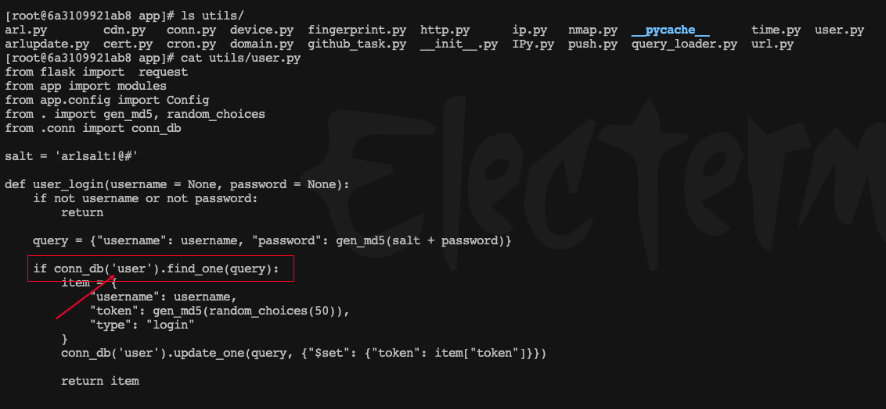
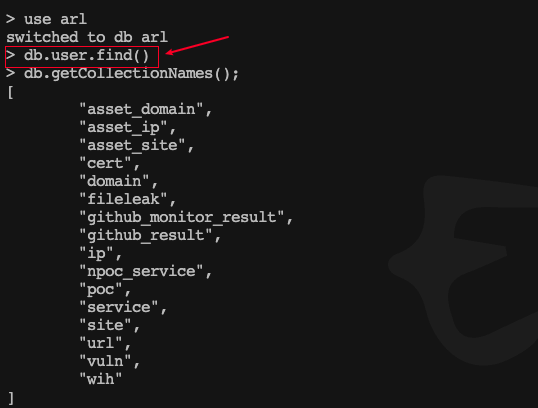
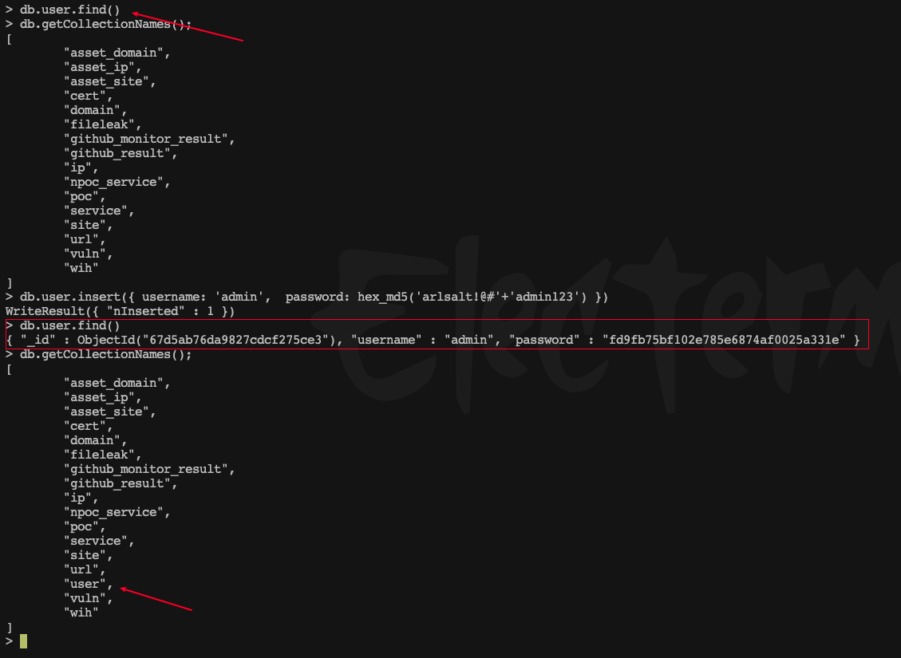

# ARL灯塔Docker版搭建记录


&lt;!--more--&gt;

之前的云服务器不用了，换了个新的，因此ARL也要重新搭建了，之前搭建的时候没有做笔记，所以这次就记一下。

ARL主仓库已经关闭很久了，用的ARL docker镜像仓库： [ARL-docker](https://github.com/honmashironeko/ARL-docker)

中间需要解决几个问题，前三个我就不说了，本文主讲第4步。

1. docker 的安装
2. docker 镜像仓库，代理访问
3. Linux 搭建 代理，我用的clash
4. ARL-docker 搭建

## ARL-docker 搭建

在线下载安装法

下载部署脚本项目：`git clone https://github.com/honmashironeko/ARL-docker.git`

进入项目文件夹：`cd ARL-docker/`

添加运行权限：`chmod &#43;x setup-arl.sh`

执行部署脚本：`bash setup-arl.sh`

可能会在运行的时候报错一次，不需要管他，重新运行一遍 bash setup-arl.sh 即可。

启动 ARL 命令：`docker-compose up -d`

接下来就是记录一些问题、排查过程及解决办法了。

## Q1：服务无法启动
### 问题描述
启动 ARL 命令：`docker-compose up -d`
`docker ps` 发现服务无法启动
有三个容器无法正常启动 arl_web、arl_worker、arl_scheduler，

```sh
[root@localhost ARL-docker]# docker ps -a
CONTAINER ID     IMAGE                           COMMAND               CREATED        STATUS          PORTS          NAMES
7045ec724fa5      honmashironeko/arl-docker-all       &#34;sh -c &#39;gen_crt.sh...&#34;   5 hours ago    Restarting (1) 3 minutes ago                                            arl_web
94a3497339c0      honmashironeko/arl-docker-all       &#34;sh -c &#39;wait-for-i...&#34;   5 hours ago    Restarting (255) 3 minutes ago                                          arl_worker
3bdd87b9a0f3      honmashironeko/arl-docker-all       &#34;sh -c &#39;wait-for-i...&#34;   5 hours ago    Restarting (255) 3 minutes ago                                          arl_scheduler
58f66a52f583      rabbitmq:3.8.19-management-alpine   &#34;docker-entrypoint...&#34;   5 hours ago    Up 7 minutes      4369/tcp, 5671-5672/tcp, 15671-15672/tcp, 15691-15692/tcp, 25672/tcp   arl_rabbitmq
457a964ab6dc      mongo:4.0.27                        &#34;docker-entrypoint...&#34;   5 hours ago    Up 7 minutes      27017/tcp                                                 arl_mongodb
```

排查日志：
```sh
docker logs --tail 20 &lt;CONTAINER ID&gt;
```

有几个权限报错：
```
Error: Error: &#39;arl_web.log&#39; isn&#39;t writable [PermissionError(13, &#39;Permission denied&#39;)]
```
还有个`/code/app/config.yaml` 的权限报错，日志刷没了，不记得具体报错命令了。

看配置文件是本地文件和容器文件的映射

```sh
[root@localhost ARL-docker]# cat docker-compose.yml
……
services:
    web:
    ……
        volumes:
          - ./arl_web.log:/code/arl_web.log
          - ./config-docker.yaml:/code/app/config.yaml
```

检查文件、目录权限，容器内用户身份，检查 SELinux

### 解决办法

最后我找到的解决办法是关闭SELinux

```sh
sudo sestatus        # 查看 SELinux 状态
sudo setenforce 0 # 临时关闭 SELinux
```

```sh
[root@localhost ARL-docker]# sestatus
SELinux status:                 enabled
SELinuxfs mount:                /sys/fs/selinux
SELinux root directory:         /etc/selinux
Loaded policy name:             targeted
Current mode:                   enforcing
Mode from config file:          enforcing
Policy MLS status:              enabled
Policy deny_unknown status:     allowed
Max kernel policy version:      31
[root@localhost ARL-docker]# sudo setenforce 0
[root@localhost ARL-docker]# sestatus
SELinux status:                 enabled
SELinuxfs mount:                /sys/fs/selinux
SELinux root directory:         /etc/selinux
Loaded policy name:             targeted
Current mode:                   permissive
Mode from config file:          enforcing
Policy MLS status:              enabled
Policy deny_unknown status:     allowed
Max kernel policy version:      31
```

清除一下，之后再重启下就解决了。

```sh
[root@localhost ARL-docker]# docker-compose down
[&#43;] Running 6/6
 ✔ Container arl_web           Removed                          0.3s 
 ✔ Container arl_scheduler     Removed                          0.3s 
 ✔ Container arl_worker        Removed                          0.3s 
 ✔ Container arl_rabbitmq      Removed                          0.0s 
 ✔ Container arl_mongodb       Removed                          0.0s 
 ✔ Network arl-docker_default  Removed                          0.2s 
[root@localhost ARL-docker]# docker-compose up -d
[&#43;] Building 0.0s (0/0)
[&#43;] Running 6/6
 ✔ Network arl-docker_default  Created                          0.2s 
 ✔ Container arl_mongodb       Started                          0.9s 
 ✔ Container arl_rabbitmq      Started                          0.9s 
 ✔ Container arl_worker        Started                          1.6s 
 ✔ Container arl_scheduler     Started                          1.6s 
 ✔ Container arl_web           Started                          1.7s 
[root@localhost ARL-docker]#
```

## Q2：Web密码错误

### 问题描述
前往ARLweb页面：`https://IP:5003/`，账号：`admin`，密码：`honmashironeko`，提示密码错误

进 arl_web 服务容器看了下代码
```sh
[root@localhost ARL-docker]# docker exec -it arl_web /bin/bash
[root@6a3109921ab8 code]# ls
app  arl_web.log  frontend  requirements.txt  test
```

```python
[root@6a3109921ab8 app]# cat utils/user.py 
from flask import  request
from app import modules
from app.config import Config
from . import gen_md5, random_choices
from .conn import conn_db

salt = &#39;arlsalt!@#&#39;

def user_login(username = None, password = None):
    if not username or not password:
        return

    query = {&#34;username&#34;: username, &#34;password&#34;: gen_md5(salt &#43; password)}

    if conn_db(&#39;user&#39;).find_one(query):
        item = {
            &#34;username&#34;: username,
            &#34;token&#34;: gen_md5(random_choices(50)),
            &#34;type&#34;: &#34;login&#34;
        }
        conn_db(&#39;user&#39;).update_one(query, {&#34;$set&#34;: {&#34;token&#34;: item[&#34;token&#34;]}})

        return item

```



又看了MongoDB数据库，没发现有账号记录

```sql
[root@localhost xavier]# docker exec -ti arl_mongodb mongo -u admin -p admin
MongoDB shell version v4.0.27
connecting to: mongodb://127.0.0.1:27017/?gssapiServiceName=mongodb
Implicit session: session { &#34;id&#34; : UUID(&#34;dd7329eb-ea82-4041-a454-d43aedb1328b&#34;) }
MongoDB server version: 4.0.27
Welcome to the MongoDB shell.
…………
&gt; use arl
switched to db arl
&gt; db.user.find()
&gt; db.getCollectionNames();
[
        &#34;asset_domain&#34;,
        &#34;asset_ip&#34;,
        &#34;asset_site&#34;,
        &#34;cert&#34;,
        &#34;domain&#34;,
        &#34;fileleak&#34;,
        &#34;github_monitor_result&#34;,
        &#34;github_result&#34;,
        &#34;ip&#34;,
        &#34;npoc_service&#34;,
        &#34;poc&#34;,
        &#34;service&#34;,
        &#34;site&#34;,
        &#34;url&#34;,
        &#34;vuln&#34;,
        &#34;wih&#34;
]
```
没看到有user表



### 解决办法

添加账户记录

```sql
&gt; db.user.insert({ username: &#39;admin&#39;,  password: hex_md5(&#39;arlsalt!@#&#39;&#43;&#39;admin123&#39;) })
WriteResult({ &#34;nInserted&#34; : 1 })
&gt; db.user.find()
{ &#34;_id&#34; : ObjectId(&#34;67d5ab76da9827cdcf275ce3&#34;), &#34;username&#34; : &#34;admin&#34;, &#34;password&#34; : &#34;fd9fb75bf102e785e6874af0025a331e&#34; }
&gt; db.getCollectionNames();
[
        &#34;asset_domain&#34;,
        &#34;asset_ip&#34;,
        &#34;asset_site&#34;,
        &#34;cert&#34;,
        &#34;domain&#34;,
        &#34;fileleak&#34;,
        &#34;github_monitor_result&#34;,
        &#34;github_result&#34;,
        &#34;ip&#34;,
        &#34;npoc_service&#34;,
        &#34;poc&#34;,
        &#34;service&#34;,
        &#34;site&#34;,
        &#34;url&#34;,
        &#34;user&#34;,
        &#34;vuln&#34;,
        &#34;wih&#34;
]
```



最后用了admin、admin123 成功登录。


---

> 作者: Xavier  
> URL: https://www.bthoughts.top/posts/arl_setup_record/  

