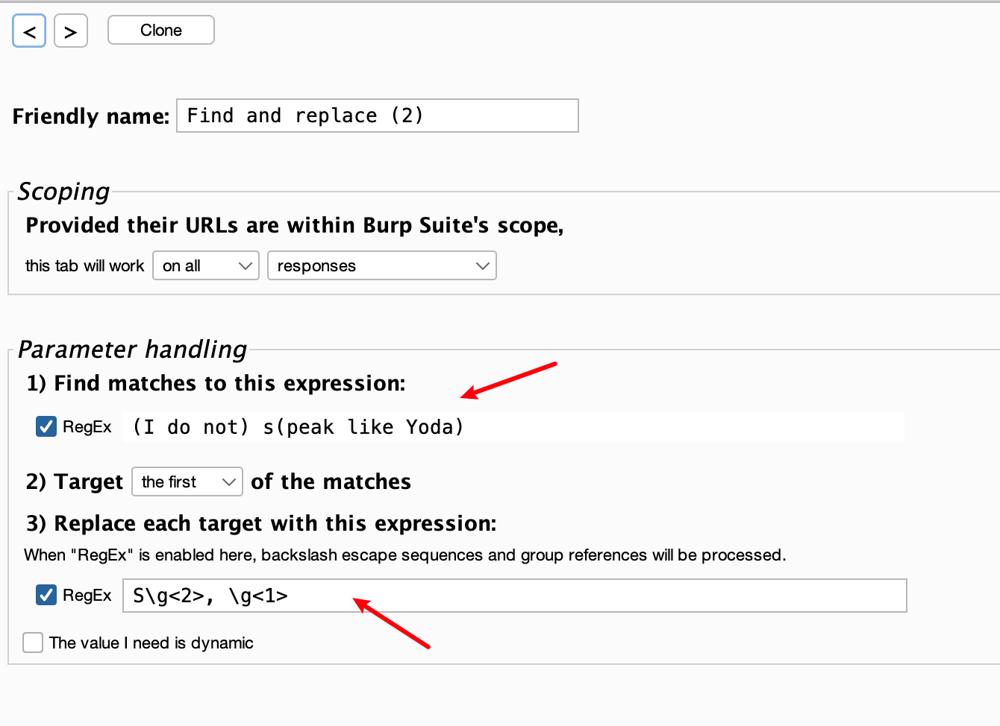

# Burp-CPH插件心得


&lt;!--more--&gt;
#tools/Burp/Burp-plug

## 简介
CPH：Custom Parameter Handler extension for Burp Suite.

Burp Suite 的自定义参数处理扩展：一款用于精准修改HTTP消息的工具。

CPH 提供了一种简单的方法来修改 HTTP 消息的任何部分，即使使用宏也可以进行精确的操作。通常，宏仅支持 HTTP 参数（name=value），但使用此扩展可以定位任何内容。

功能：
- 根据范围和模式匹配，自动修改请求和响应。
- 查找和替换，完全支持 RegEx。
- 范围限定到特定的 Burp Suite 工具。
- 指定特定匹配项（仅第一个、所有匹配项或手动选择）。
- 支持修改动作的连接和排序，以及根据先前的响应进行下一项修改的能力。

保存/加载配置：
- 快速保存/快速加载（在 Burp/Extender 会话之间持续存在）。
- 从 JSON 文件导入/导出。
- 运行宏后，从其最终响应中提取替换值。
- 修改宏中的每个请求/响应。

### CPH VS 宏：
CPH的优势：
- CPH 可以处理 HTTP 消息的任何部分
	- 宏只能动态派生格式为`name=value`的参数；即它不能对 JSON、RESTful（如`/user/123`）或任何其他序列化等格式进行操作。
- CPH 可以修改请求和/或响应
    - 宏只能修改请求
- CPH 将所有必要的配置集中到了一起
    - 宏需要额外配置会话处理规则（session handling rules）
- CPH 可以检查 HTTP 消息的任何部分，以确定其是否应在范围内
    - 宏依赖于触发它们的会话处理规则中设置的范围，并且此范围仅限于协议、主机、端口和路径

CPH的难点：
- 正则表达式的编写
- 日志不够详细
### 问题场景
- 解决CSRF Token
- 解决随机字符串
- 解决流程化操作

CSRF Token：
CSRF Token 比较好理解，每次访问网页，服务器会随机返回一个CSRF Token在前端界面中，下一步请求包中需要使用该Token，该工具可以自动化提取该Token并进行替换，让每次发送的CSRF Token都是有效的。

随机字符串：
这种情况下的可能的场景有：
1. 请求某个接口，服务端返回一个随机 key，下一个请求包需要使用该key才能访问下一个接口获取数据。
2. 登录过程有验证码回显，获取验证码的值，再进行登录

其实上述的常见本质上都是一样的。

流程化操作：
类似Burp自带的宏，宏中可以进行 `key1=value2&amp;key2=value2` 形式的数据替换，但不支持JSON等其他格式，该工具可以完成相应的动作。

该工具可以作为宏的替代或补充。

## UI 介绍
本文的介绍基于BurpSuite 商店 BApp Store 中的 CPH V3.0a 版本。

### 1、Options页面
首先，首次加载时默认只有一个Options页面，如下所示：


左上角依次是：
- verbosity level，日志输出的详细程度，默认是 3 INFO 级别，输出的内容可在 Burp Extensions中查看
- Quicksave/Quickload：快速保存/快速加载（在 Burp/Extender 会话之间持续存在）
- Export Config / Import Config：从 JSON 文件导入/导出CPH选项卡配置文件
- Visit Wiki： 访问Github Wiki 
- Show EMV：打开修改查看器 (EMV)页面
- `Running built-in httpd on 127.0.0.1:9001`：启动内置的测试用例

右上角是 `Tool scop settings`：用于控制工具生效的范围。

下方是 版面最大`Quickstart guide`，这块就不提了。

### 2、选项卡


从上往下依次是：

- `&lt; &gt; `：左右箭头，用来调整当前选项卡的位置，前移或后移
- Clone 按钮：克隆当前选项卡到新选项卡
- Friendly Name： 当前标签卡名称，可自定义修改

第二块内容是范围 Scoping：

用于指定当前选项卡的生效范围，首先需要确保 URL 在Burpsuite的范围中。

```
on all requests    # 全部请求包
on all responses   # 全部请求包
on all requests and responses    # 全部请求包与响应包
```

```
only on requests 
only on responses 
only on requests and responses  

这三种需要配置正则，只在满足匹配条件的URL上执行当前选项卡
```

第三块内容是参数处理 Parameter handing

- Automatically URL-encode the first line of the request, if modified（修改后自动对请求的第一行进行 URL 编码）

- Change the destination of the request。更改请求包的去向，重定向到另一个ip或域名

- 1）Find matches to this expression：（查找与此表达式匹配的内容）

- 2）Target `the first/each/a subset` of the matches：（选择 第一个/每个/集合中的 匹配项）subset集合详见 定位匹配 说明。

- 3）Replace each target with this expression: （用以下表达式替换每个目标：）

  启用“RegEx”时，将处理转义序列和组引用。后面输入框中写正则表达式。
  The value I need is dynamic（我需要的值是动态的），如果勾选这一项，将打开4）功能

- 4）In the expression above, refer to the named RegEx groups you&#39;ll define below in order to insert:（在上面的表达式中，请参考下面定义的 RegEx 命名组以插入：）

  下拉列表中有3种模式：

  - values returned by issuing a single request，通过发出单个请求返回的值
  - values returned by issuing a sequence of requests，通过发出一系列请求返回的值
  - values in the cached response of a previous CPH tab，前一个 CPH 选项卡的缓存响应中的值


## 用法
具体用法可以参考 [burp-cph-wiki](https://github.com/elespike/burp-cph/wiki)

给了相应的教程，花点时间就能学会理解并使用，但是这款工具需要具备正则表达式的编写能力。

### 明确范围

**CPH 只会针对 Burp Suite 范围内的消息。**
&gt; ⚠️如果请求/响应不在 Burp 的范围内，CPH 将忽略它⚠️

需要先把目标网站添加到 Burp 的 Target列表中。

我平时一般不怎么用Target这项功能，因此觉得有点多余


### 有效修改查看器 (EMV)
EMV 显示每个选项卡对 HTTP 消息的最终修改的差异，并可以有效帮助您微调 CPH 配置。

&gt; ℹ️请注意，EMV 选项卡将仅显示由 CPH 中相应选项卡修改的消息。

也就是说如果通过`Session handling rules`调用的具体修改是看不到的。

而且EMV感觉好像有Bug，只能查看最开始的一个包

### 1.字符串查找替换

CPH 允许在请求或响应中找到目标字符串，然后用新的所需值替换目标字符串。

您想要的值可能来源于：
- 正则表达式
- CPH 实时发出的请求的响应
- Burp 宏的最终响应
- 上一个 CPH 选项卡的缓存响应

#### 文本匹配
最简单的查找替换就是文本匹配模式，例如：
```
hello xiaoming --&gt; hello xiaohong
即 交互式案例1：
I do not speak like Yoda!
I do not speak like Mr. Mackey, m&#39;kay?
```


#### 正则匹配

利用正则进行匹配，支持正则分组语法。

利用正则分组，调整语句，如：
```sh
# 交互式案例2，注意正则的写法
I do not speak like Yoda
Speak like Yoda, I do not!
```



#### 定位匹配

这是一个很有意思的设计，与Python切片类似。

如果某个特定匹配在给定的 HTTP 消息中出现多次，则可以定位特定匹配，但并非所有匹配都应该修改。

负值有效。无效值（例如字母）将被忽略。支持`0:3,-1`这种写法，表示对前3个和最后1个匹配项进行替换。

选择：`Target a subset of the matches`

```sh
# 交互式案例4，注意定位匹配的写法
# 匹配 [ ] 符号，选择其中的0,4,8 进行替换
## 原响应：
[0][ ]1st  [1][ ]2nd  [2][ ]3rd

[3][ ]4th  [4][ ]5th  [5][ ]6th

[6][ ]7th  [7][ ]8th  [8][ ]9th

## 预期响应：
[0][X]1st  [1][ ]2nd  [2][ ]3rd

[3][ ]4th  [4][X]5th  [5][ ]6th

[6][ ]7th  [7][ ]8th  [8][X]9th
```


### 2.替换动态值

发出单独的请求以使用其响应中的动态值

如果需要发出单独的请求以提取要使用的新值（例如，CSRF令牌），且必要的请求已经存在于Burp Suite的其他地方（例如，Target，Proxy，Repeater等），只需右键单击所述请求并选择发送到CPH。

否则，创建一个 CPH 选项卡并：

1. 勾选：我需要的值是动态（`The value I need is dynamic`）
2. 在下拉菜单中选择：发出单个请求返回的值（`values returned by issuing a single request`）
3. 然后，将请求复制/粘贴（或手动输入）到左侧窗格中。 
   这块 UI 有点小问题，如果只看到响应包框的话，可以 找到三个点 位置看能不能调整大小。

最后，配置一个适当的表达式以便从相关响应中提取值。

```sh
# 交互式案例4，注意正则的写法
# 从响应包中匹配返回值：(?P&lt;number&gt;\d{1,5})$，并在请求包中进行替换 /1/\g&lt;number&gt;
## 原响应：
Try again!
New number: &lt;random number&gt;

## 预期响应：
&lt;number&gt; was correct!
New number: &lt;random number&gt;
```


### 3. 宏 VS CPH

利用CPH 实现 Burp 宏的功能。

案例场景：
校验随机Cookie，访问请求：
1. 访问 `/number`，获取校验码 value；
2. 访问`/cookie`，设置cookie
3. 配置 `Cookie: number=&lt;value&gt;`，使用POST请求，访问 `/number`，修改number值。
```http
POST /number HTTP/1.1
Host: 127.0.0.1:9001
Content-Length: 10
Cookie: number=&lt;value&gt;

number=123
```

在这个场景下，Burp宏 与 CPH 都可以实现。

Burp的配置文件：[ Burp 宏文件](https://raw.githubusercontent.com/elespike/burp-cph-demos/master/dynamic/macros_vs_cph/macros.json)和[ Burp Session rules文件](https://raw.githubusercontent.com/elespike/burp-cph-demos/master/dynamic/macros_vs_cph/rules.json)

CPH 配置文件：[ CPH config file](https://raw.githubusercontent.com/elespike/burp-cph-demos/master/dynamic/macros_vs_cph/cph_config.json)


### 4. Burp 宏结合 CPH
案例场景：
按照以下流程进行校验：
1. 访问 `/number`，获取第一个校验码 value1；
2. 访问`/1?number=&lt;value1&gt;`，获取第二个校验码 value2；
3. 访问`/2?number=&lt;value2&gt;`，获取第三个校验码 value3；
4. 访问`/3?number=&lt;value3&gt;`，获取第四个校验码 value4；
5. 访问`/check/&lt;value4&gt;` 通过最终的校验。
    其中1-4步都可以通过Burp 宏解决，最后一步宏无法完成，需要使用CPH进行替换。

Burp的配置文件：[此 Burp 宏文件](https://raw.githubusercontent.com/elespike/burp-cph-demos/master/dynamic/final_macro/macros.json)和[此 Burp 规则文件](https://raw.githubusercontent.com/elespike/burp-cph-demos/master/dynamic/final_macro/rules.json)

CPH 配置文件：[CPH config file](https://raw.githubusercontent.com/elespike/burp-cph-demos/master/dynamic/final_macro/cph_config.json)


### 5. 利用缓存响应
案例场景：
按照以下流程进行校验：
1. 访问 `/number`，获取第一个校验码 value1；
2. 访问`/1/&lt;value1&gt;`，通过校验后获取新校验码 value2；
3. 访问`/2/&lt;value2&gt;`，通过校验后获取新校验码 value3；
4. 访问`/3/&lt;value3&gt;`，通过校验后获取新校验码 value4。
5. 访问`/check/&lt;value4&gt;` 通过最终的校验。

上述场景下，Burp宏无法实现校验码的替换，可以利用CPH的缓存响应功能进行实现。

勾选： 我需要的值是动态（`The value I need is dynamic`）
在下拉列表中选择：上一个 CPH 选项卡的缓存响应中的值 （`values in the cached response of a previous CPH tab`）

Burp的配置文件：[此 Burp 宏文件](https://raw.githubusercontent.com/elespike/burp-cph-demos/master/dynamic/cached/macros.json)和[此 Burp 规则文件](https://raw.githubusercontent.com/elespike/burp-cph-demos/master/dynamic/cached/rules.json)

CPH 配置文件：[CPH config file](https://raw.githubusercontent.com/elespike/burp-cph-demos/master/dynamic/cached/cph_config.json)


### 6. CPH 代替 宏
https://github.com/elespike/burp-cph/wiki/09.-CPH-as-an-alternative-to-macros

案例场景：
按照以下流程进行校验：

1. 访问 `/number`，获取第一个校验码 value1；
2. 访问`/1/&lt;value1&gt;`，通过校验后获取新校验码 value2；
3. 访问`/2/&lt;value2&gt;`，通过校验后获取新校验码 value3；
4. 访问`/3/&lt;value3&gt;`，通过校验后获取新校验码 value4。
5. 访问`/check/&lt;value4&gt;` 通过最终的校验。

这里的案例场景与5一样，但是这次不使用宏和缓存响应功能，纯粹依靠CPH进行实现。

CPH 配置文件：[CPH config file](https://raw.githubusercontent.com/elespike/burp-cph-demos/master/dynamic/cph_macro_alternative.json)

CPH 进行范围匹配，会自动篡改标签中定义范围内的数据，因此它的调用逻辑是逆序的，如下所示：
1. 监测到用户访问`/check/&lt;value&gt;` ，其中`&lt;value&gt;`值是动态的来自`/3/&lt;value&gt;`，于是去请求`/3/&lt;value3&gt;`
2. 监测到访问`/3/&lt;value&gt;`，其中`&lt;value&gt;`值是动态的来自`/2/&lt;value&gt;`，于是去请求`/2/&lt;value3&gt;`
3. 监测到访问`/2/&lt;value&gt;`，其中`&lt;value&gt;`值是动态的来自`/1/&lt;value&gt;`，于是去请求`/1/&lt;value3&gt;`
4. 监测到访问`/1/&lt;value&gt;`，其中`&lt;value&gt;`值是动态的来自`/number`，于是去请求`/number`
5. 请求`/number` 获取动态值，并替换给`/1/&lt;value&gt;`，后面也是如此依次进行。

### 6. 正则表达式


#### RegEx 标志

在模式的开头，您可以按如下方式指定正则表达式标志：  `(?Limuxs)`

- `L`：取决于语言环境（`locale dependent`）
- `i`: 忽略大小写
- `m`：多行
- `u`:  unicode
- `x`：详细
- `s`:`.`匹配所有内容（通常不匹配`\n`）


#### 前瞻和后瞻断言
CPH 支持正向/负向 前瞻和后瞻断言

正向前瞻断言：`\d{5}(?=00000)`，改为负向前瞻断言 ：`\d{5}(?!00000)`

正向后瞻断言：`(?&lt;=00000)\d{5}`，改为负向后瞻断言 ： ，`(?&lt;!00000)\d{5}`

### 快捷键
虽然感觉没啥必要，但是还是写一下
```
Ctrl&#43;N	创建新标签页
Ctrl&#43;Shift&#43;N	克隆当前标签
Ctrl&#43;W	关闭当前标签
Ctrl&#43;E	启用/禁用当前选项卡
Ctrl&#43;,	选择上一个标签
Ctrl&#43;.	选择下一个标签
Ctrl&#43;Shift,	向后移动标签
Ctrl&#43;Shift.	向前移动标签
```


## JSON测试用例
个人编写的一个简单测试

案例场景：
从上一个响应包中提取所需的JSON数据，赋值给目标请求的相应JSON参数。

测试代码：
```python
from flask import Flask, request, jsonify
import requests
import random
from flask_caching import Cache

app = Flask(__name__)
cache = Cache(app, config={&#39;CACHE_TYPE&#39;: &#39;simple&#39;})

@app.route(&#39;/api1&#39;, methods=[&#39;GET&#39;])
def api1():
    result = random.randint(1, 100)
    cache.set(&#39;result&#39;, result)
    return jsonify({&#34;验证码&#34;: result,&#34;yzm&#34;: result, &#34;message&#34;: &#34;success&#34;})

@app.route(&#39;/api/check&#39;, methods=[&#39;POST&#39;])
def api4():
    data = request.get_json()
    if data is None or &#39;index&#39; not in data:
        return jsonify({&#34;error&#34;: &#34;Invalid JSON data or missing &#39;index&#39; field&#34;})
    
    index = int(data[&#39;index&#39;])
    result_from_api1 = int(cache.get(&#39;result&#39;))
    
    if index == result_from_api1:
        return jsonify({&#34;message&#34;: &#34;check successfully!&#34;})
    else:
        return jsonify({&#34;message&#34;: &#34;invaild value!&#34;})

if __name__ == &#39;__main__&#39;:
    app.run(debug=True)
```


配置：

```json
Parameter handling: 
# 1) Find matches to this expression:
{&#34;index&#34;: 123}
# 3) Replace each target with this expression:
{&#34;index&#34;: \g&lt;number&gt;}
# 4) In the expression above, refer to the named RegEx groups you&#39;ll define below in order to insert:
&#34;\\u9a8c\\u8bc1\\u7801&#34;\: (?P&lt;number&gt;\d{1,5})\n\}\n
```


## 参考

- 项目地址：https://github.com/elespike/burp-cph/
- wiki地址：https://github.com/elespike/burp-cph/wiki
- [Burp Suiteの拡張機能 Custom-Request-Handlerを作成しました](https://blog.cybozu.io/entry/2018/07/05/170000)
- 


---

> 作者: Xavier  
> URL: http://localhost:1313/posts/burp-cph-usage/  

