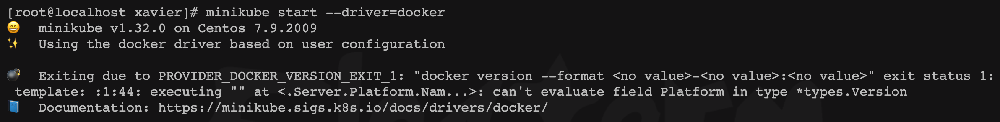
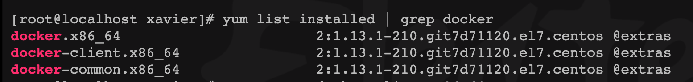
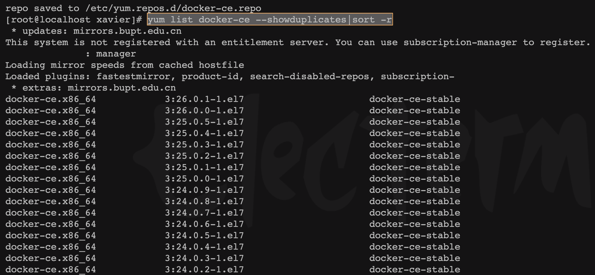
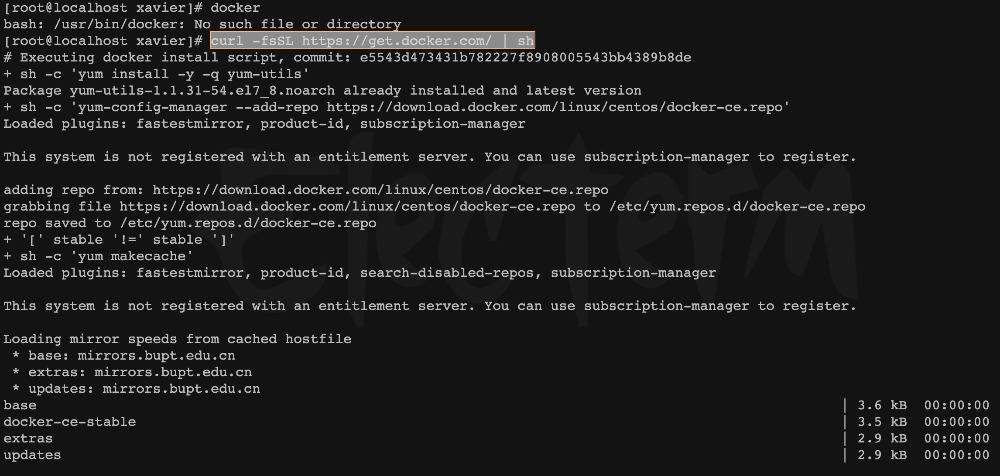

# Docker低版本升级


&lt;!--more--&gt;

## 前言

因为需要安装minikube，其中有Docker版本要求，当前版本太低了，需要升级。

```sh
[root@localhost xavier]# minikube start --driver=docker
😄  minikube v1.32.0 on Centos 7.9.2009
✨  Using the docker driver based on user configuration

💣  Exiting due to PROVIDER_DOCKER_VERSION_EXIT_1: &#34;docker version --format &lt;no value&gt;-&lt;no value&gt;:&lt;no value&gt;&#34; exit status 1: template: :1:44: executing &#34;&#34; at &lt;.Server.Platform.Nam...&gt;: can&#39;t evaluate field Platform in type *types.Version
📘  Documentation: https://minikube.sigs.k8s.io/docs/drivers/docker/
```



确认当前版本：

```sh
docker -v 
docker --version
docker version
```

```sh
[root@localhost xavier]# docker --version
Docker version 1.13.1, build 7d71120/1.13.1
```

&lt;img src=&#34;resource/index.assets/image-20240419113041109.png&#34; alt=&#34;image-20240419113041109&#34; style=&#34;zoom:50%;&#34; /&gt;

&lt;img src=&#34;resource/index.assets/image-20240419113133962.png&#34; alt=&#34;image-20240419113133962&#34; style=&#34;zoom:50%;&#34; /&gt;

检查当前安装的软件包

```sh
rpm -qa | grep docker
yum list installed | grep docker

[root@localhost xavier]# yum list installed | grep docker
docker.x86_64                       2:1.13.1-210.git7d71120.el7.centos @extras  
docker-client.x86_64                2:1.13.1-210.git7d71120.el7.centos @extras  
docker-common.x86_64                2:1.13.1-210.git7d71120.el7.centos @extras
```



## yum安装

配置yum镜像源，更新yum，
```sh
# 安装yum管理工具
yum install -y yum-utils
# 添加国内镜像源
yum-config-manager --add-repo https://mirrors.aliyun.com/docker-ce/linux/centos/docker-ce.repo

sudo yum update -y
```


检索想要安装的版本

```sh
yum list docker-ce --showduplicates|sort -r

[root@localhost xavier]# yum list docker-ce --showduplicates|sort -r
...
docker-ce.x86_64            3:18.09.6-3.el7                     docker-ce-stable
docker-ce.x86_64            3:18.09.5-3.el7                     docker-ce-stable
docker-ce.x86_64            18.03.1.ce-1.el7.centos             docker-ce-stable
docker-ce.x86_64            18.03.0.ce-1.el7.centos             docker-ce-stable
docker-ce.x86_64            17.12.1.ce-1.el7.centos             docker-ce-stable
docker-ce.x86_64            17.03.3.ce-1.el7                    docker-ce-stable
...
```



安装指定版本的docker

```sh
yum -y install docker-ce-18.03.1.ce-1.el7.centos 
[root@localhost ~]# systemctl start docker 
[root@localhost ~]# docker --version
```

yum安装有可能无法安装最新版本，因为yum库相对官网会滞后一些。

## 安装最新版本
这种情况下，需要对原有docker进行卸载
```sh
sudo yum remove docker.xxxx

[root@localhost xavier]# yum remove docker.x86_64 docker-client.x86_64 docker-common.x86_64
```


curl 从官网获取最新版本

```sh
curl -fsSL https://get.docker.com/ | sh
```

```sh
[root@localhost xavier]# curl -fsSL https://get.docker.com/ | sh
# Executing docker install script, commit: e5543d473431b782227f8908005543bb4389b8de
&#43; sh -c &#39;yum install -y -q yum-utils&#39;
Package yum-utils-1.1.31-54.el7_8.noarch already installed and latest version
&#43; sh -c &#39;yum-config-manager --add-repo https://download.docker.com/linux/centos/docker-ce.repo&#39;
Loaded plugins: fastestmirror, product-id, subscription-manager

This system is not registered with an entitlement server. You can use subscription-manager to register.

adding repo from: https://download.docker.com/linux/centos/docker-ce.repo
grabbing file https://download.docker.com/linux/centos/docker-ce.repo to /etc/yum.repos.d/docker-ce.repo
repo saved to /etc/yum.repos.d/docker-ce.repo
&#43; &#39;[&#39; stable &#39;!=&#39; stable &#39;]&#39;
&#43; sh -c &#39;yum makecache&#39;
Loaded plugins: fastestmirror, product-id, search-disabled-repos, subscription-manager

This system is not registered with an entitlement server. You can use subscription-manager to register.

Loading mirror speeds from cached hostfile
 * base: mirrors.bupt.edu.cn
 * extras: mirrors.bupt.edu.cn
 * updates: mirrors.bupt.edu.cn
base                                           | 3.6 kB  00:00:00     
docker-ce-stable                               | 3.5 kB  00:00:00     
extras                                         | 2.9 kB  00:00:00     
updates                                        | 2.9 kB  00:00:00     
Metadata Cache Created
&#43; sh -c &#39;yum install -y -q docker-ce docker-ce-cli containerd.io docker-compose-plugin docker-ce-rootless-extras docker-buildx-plugin&#39;
warning: /var/cache/yum/x86_64/7/docker-ce-stable/packages/docker-buildx-plugin-0.13.1-1.el7.x86_64.rpm: Header V4 RSA/SHA512 Signature, key ID 621e9f35: NOKEY
Public key for docker-buildx-plugin-0.13.1-1.el7.x86_64.rpm is not installed
Importing GPG key 0x621E9F35:
 Userid     : &#34;Docker Release (CE rpm) &lt;docker@docker.com&gt;&#34;
 Fingerprint: 060a 61c5 1b55 8a7f 742b 77aa c52f eb6b 621e 9f35
 From       : https://download.docker.com/linux/centos/gpg

================================================================================

To run Docker as a non-privileged user, consider setting up the
Docker daemon in rootless mode for your user:

    dockerd-rootless-setuptool.sh install

Visit https://docs.docker.com/go/rootless/ to learn about rootless mode.


To run the Docker daemon as a fully privileged service, but granting non-root
users access, refer to https://docs.docker.com/go/daemon-access/

WARNING: Access to the remote API on a privileged Docker daemon is equivalent
         to root access on the host. Refer to the &#39;Docker daemon attack surface&#39;
         documentation for details: https://docs.docker.com/go/attack-surface/

================================================================================

```





重启doker

```sh
service docker restart 
docker -v

[root@localhost xavier]# service docker restart
Redirecting to /bin/systemctl restart docker.service
[root@localhost xavier]# docker -v
Docker version 26.0.1, build d260a54
```

&lt;img src=&#34;resource/index.assets/image-20240419125726158.png&#34; alt=&#34;image-20240419125726158&#34; style=&#34;zoom:50%;&#34; /&gt;


---

> 作者: Xavier  
> URL: https://www.bthoughts.top/posts/docker%E4%BD%8E%E7%89%88%E6%9C%AC%E5%8D%87%E7%BA%A7/  

