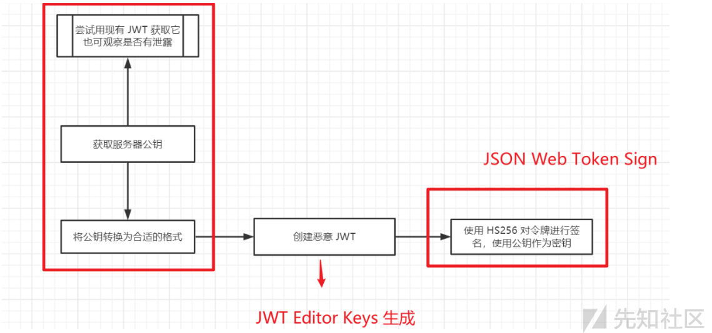

# JWT安全笔记


&lt;!--more--&gt;

## 写在前面

这篇文章是对我早年笔记中的整理，可能略显粗糙，主要描述常见的JWT的安全漏洞。

关于JWT的安全，非常推荐从[Burpsuite的相应教材](https://portswigger.net/web-security/jwt)和[Burpsuite JWT 靶场](https://portswigger.net/web-security/all-labs#jwt)进行学习。

## JWT

#### **JWT结构**

JWT（JSON Web Token）由三部分组成： `Header.Payload.Signature`

JWT 的 Header 部分用于声明令牌类型（typ）与签名算法（alg）， Header 经 Base 编码后，作为 JWT 的第一部分。

常见签名算法：HS256（对称签名）、RS256（非对称算法）、ES256（椭圆曲线）；

需要注意的是，`typ`字段只是用于标识 Token 类型，并不会影响是否加密。JWT 分为两种形式：JWS（仅签名）和 JWE（加密），其中只有 JWE 才会对 Payload 内容进行加密。

Payload 用于存储用户信息以及业务数据

Signature（签名）用于对 Header 和 Payload 进行校验，防止内容被篡改。服务器会使用密钥对 JWT 进行签名，并在接收请求时进行验证。其生成方式如下：

```
Signature = HMACSHA256( base64UrlEncode(header) &#43; &#34;.&#34; &#43; base64UrlEncode(payload), secret )
```

#### **JWT认证流程**

- 用户登录 → 服务器生成 JWT → 返回给前端 → 前端每次请求带上 JWT → 服务器验证 JWT 有效 → 允许访问


## 弱签名密钥-JWT 破解
利用JWT私钥字典： https://github.com/wallarm/jwt-secrets

```shell
$ git clone https://github.com/wallarm/jwt-secrets/jwt.secrets.list
$ brew install hashcat
$ hashcat -m 16500 /tmp/jwt.hash /path/to/jwt.secrets.list

$ hashcat -m 16500 jwt.hash ~/Desktop/hacksafe/1-Dictionary/2-口令字典/rockyou.txt

$ john jwt.txt --wordlist=/usr/share/wordlists/rockyou.txt --format=HMAC-SHA256
```

相应Burp Lab：[lab-jwt-authentication-bypass-via-weak-signing-key](https://portswigger.net/web-security/jwt/lab-jwt-authentication-bypass-via-weak-signing-key)。


## 签名未验证

JWT 库通常提供一种验证令牌的方法和另一种仅对其进行解码的方法。例如，Node.js 库 `jsonwebtoken` 包含 `verify()` 和 `decode()` 方法。

开发人员偶尔会混淆这两种方法，仅将传入的令牌传递给`decode()`方法。这实际上意味着应用程序完全不验证签名。

这导致部分系统在解析 JWT 时，仅解析 Payload 内容，而未校验 Signature，攻击者可以直接修改payload，访问受限制的资源。

相应Burp Lab：[lab-jwt-authentication-bypass-via-unverified-signature](https://portswigger.net/web-security/jwt/lab-jwt-authentication-bypass-via-unverified-signature)：

```
该实验室使用基于JWT的机制来处理会话。由于实现缺陷，服务器不会验证它收到的任何JWT的签名。
要解决实验室问题，请修改您的会话令牌以访问/admin的管理面板，然后删除用户carlos。
您可以使用以下凭据登录自己的帐户：wiener:peter
```


**解题思路**：

- 访问环境之后，使用提供的用户登录。查看cookie为jwt格式，jwt token中存在sub字段对应用户名，winner用户无权限，更改sub=administrator，请求/admin成功


## 签名用None

JWT Header中alg的值用于告诉服务器使用哪种算法对令牌进行签名和验证，目前可以选择HS256，即HMAC和SHA256。

但 JWT 同时也支持将 alg 算法设定为&#34;None&#34;，如果&#34;alg&#34;字段设为&#34;None&#34;，则表示不签名，这样一来任何token都是有效的，设定该功能的最初目的是为了方便调试，但若在生产环境中未关闭该功能，攻击者可以通过将alg字段设置为&#34;None&#34;来伪造伪造 token，从而冒充任意用户登陆网站

```
{
    &#34;alg&#34;: &#34;none&#34;,
    &#34;typ&#34;: &#34;JWT&#34;
}
```

攻击手法：

- 如果后端未严格限制签名算法，攻击者可以将 `alg: HS256` 替换为`alg: none`，并删除第三段签名部分：`Header.Payload.`

- 如果后端仍然接受该 Token，则攻击者可以伪造任意 Payload，从而绕过认证。


## 有缺陷的签名验证

按照设计，服务器通常不会存储其签发的任何JWT相关信息。相反，每个令牌都是一个完全独立的实体。这一机制具备多项优势，但也会引发一个根本性问题——服务器实际上并不了解令牌的原始内容，甚至也不清楚原始签名是什么。因此，若服务器未能对签名进行有效验证，攻击者便可随意修改令牌的其余部分，而不会受到任何限制。

例如：`{ &#34;username&#34;: &#34;carlos&#34;, &#34;isAdmin&#34;: false }`，如果服务器基于这个`username`识别会话，修改其值可能会让攻击者冒充其他已登录用户。类似地，如果`isAdmin`值被用于访问控制，这可能成为权限提升的简单途径。

相应Burp Lab：[lab-jwt-authentication-bypass-via-flawed-signature-verification](https://portswigger.net/web-security/jwt/lab-jwt-authentication-bypass-via-flawed-signature-verification)

```
该实验室使用基于JWT的机制来处理会话。服务器的配置不安全，无法接受未签名的JWT。
要解决实验室问题，请修改您的会话令牌以访问/admin的管理面板，然后删除用户carlos。
您可以使用以下凭据登录自己的帐户：wiener:peter
```


**解题思路**：

在 Burp Repeater 中，访问`/admin`接口观察发现，只有以`administrator`用户身份登录时才能访问管理面板。

修改`sub=administrator`，response为401

修改`alg=none`，response为401

删除签名，并保留后面`.`符号。执行修改后的jwt token，在response中发现`/admin/delete?username=carlos`接口


## JWT header注入

如果服务端使用了非常脆弱的密钥，我们甚至有可能一个字符一个字符地来暴力破解这个密钥，根据JWS规范只有alg报头参数是强制的，然而在实践中JWT报头通常包含几个其他参数，以下是攻击者特别感兴趣的：

- jwk(JSON Web Key)：提供一个代表密钥的嵌入式JSON对象
- jku(JSON Web Key Set URL)：提供一个URL，服务器可以从这个URL获取一组包含正确密钥的密钥
- kid(密钥id)：提供一个ID，在有多个密钥可供选择的情况下服务器可以用它来识别正确的密钥，根据键的格式这可能有一个匹配的kid参数

这些用户可控制的参数每个都告诉接收方服务器在验证签名时应该使用哪个密钥，下面我们将介绍如何利用这些参数来注入使用您自己的任意密钥而不是服务器的密钥签名修改过的JWT


### 注入场景1-JWK

JWT Header 支持`jwk`字段，用于直接携带公钥信息。部分系统会从该字段中提取公钥进行签名验证。如果服务器未校验`jwk`的来源或合法性，攻击者可在 Header 中注入自己的公钥，并使用对应私钥生成签名，从而绕过认证。

示例：

```json
{  
	&#34;alg&#34;:&#34;RS256&#34;,  
	&#34;jwk&#34;: { 攻击者公钥 }  
}
```

并使用对应私钥重新签名 JWT。

**先决条件：**

- 服务器使用非对称算法    
- 服务器支持从 Header 中的`jwk`字段读取公钥    
- 能够生成合法的公私钥对

下面我们介绍如何通过JWK参数注入自签名的JWT，JWS(JSON Web Signature)规范描述了一个可选的jwk header参数，服务器可以使用该参数以jwk格式将其公钥直接嵌入令牌本身，您可以在下面的JWT head中看到具体的示例:

```json
{
  &#34;kid&#34;: &#34;ed2Nf8sb-sD6ng0-scs5390g-fFD8sfxG&#34;,
  &#34;typ&#34;: &#34;JWT&#34;,
  &#34;alg&#34;: &#34;RS256&#34;,
  &#34;jwk&#34;: {
    &#34;kty&#34;: &#34;RSA&#34;,
    &#34;e&#34;: &#34;AQAB&#34;,
    &#34;kid&#34;: &#34;ed2Nf8sb-sD6ng0-scs5390g-fFD8sfxG&#34;,
    &#34;n&#34;: &#34;yy1wpYmffgXBxhAUJzHHocCuJolwDqql75ZWuCQ_cb33K2vh9m&#34;
  }
}
```

理想情况下服务器应该只使用有限的公钥白名单来验证JWT签名，然而错误配置的服务器有时会使用jwk参数中嵌入的键值，您可以通过使用自己的RSA私钥对修改后的JWT进行签名，然后在jwk头中嵌入匹配的公钥来利用这种行为，Burpsuite的JWT Editor扩展提供了一个有用的功能来帮助您测试此漏洞，您可以在Burp中手动添加或修改JWT参数

相应Burp Lab：[JWT authentication bypass via jwk header injection](https://portswigger.net/web-security/jwt/lab-jwt-authentication-bypass-via-jwk-header-injection)


### 注入场景2-JKU

JWT Header 支持`jku`（JSON Web Key URL）字段，用于指定公钥的远程地址。服务器在验证 JWT 时，可能会从该地址获取公钥。如果服务器未限制`jku`的来源（如域名白名单），攻击者可将其指向恶意服务器，从而让目标系统加载攻击者控制的公钥。

```json
{  
  &#34;alg&#34;:&#34;RS256&#34;,  
  &#34;jku&#34;:&#34;http://attacker.com/jwk.json&#34;  
}
```

攻击者控制该地址返回自己的公钥。

**先决条件：**
- 服务器使用非对称签名算法    
- 服务器支持从`jku`指定的远程地址加载公钥

有些服务器可以使用jku(jwk Set URL)头参数来引用包含密钥的JWK集，而不是直接使用JWK头参数来嵌入公钥，当验证签名时，服务器从这个URL获取相关的密钥，这里的JWK集其实是一个JSON对象，包含一个代表不同键的JWK数组，下面是一个简单的例子：

```json
{
  &#34;keys&#34;: [
    {
       kty&#34;: &#34;RSA&#34;,
       &#34;e&#34;: &#34;AQAB&#34;,
       &#34;kid&#34;: &#34;75d0ef47-af89-47a9-9061-7c02a610d5ab&#34;,
       &#34;n&#34;: &#34;o-yy1wpYmffgXBxhAUJzHHocCuJolwDqql75ZWuCQ_cb33K2vh9mk6GPM9gNN4Y_qTVX67WhsN3JvaFYw-fhvsWQ&#34;
    },
    {
       &#34;kty&#34;: &#34;RSA&#34;,
       &#34;e&#34;: &#34;AQAB&#34;,
       &#34;kid&#34;: &#34;d8fDFo-fS9-faS14a9-ASf99sa-7c1Ad5abA&#34;,
       &#34;n&#34;: &#34;fc3f-yy1wpYmffgXBxhAUJzHql79gNNQ_cb33HocCuJolwDqmk6GPM4Y_qTVX67WhsN3JvaFYw-dfg6DH-asAScw&#34;
    }
  ]
}
```

JWK集合有时会通过一个标准端点公开，比如:/.well-known/jwks.json，更安全的网站只会从受信任的域获取密钥，但有时您可以利用URL解析差异来绕过这种过滤，下面我们通过一个靶场来实践以下  

相应Burp Lab 靶场地址：[JWT authentication bypass via jku header injection](https://portswigger.net/web-security/jwt/lab-jwt-authentication-bypass-via-jku-header-injection)

### 注入场景3-KID

JWT Header 支持`kid`（Key ID）字段，服务器通常根据该字段选择对应的密钥进行验证。如果后端在处理`kid`时未进行严格校验，可能将其作为文件路径或命令参数使用，从而导致路径遍历、文件读取甚至命令执行。本质是密钥选择逻辑可控的问题，与算法无关。

示例：

```json
{  &#34;kid&#34;:&#34;../../../../etc/passwd&#34;  }
```

在某些实现中，服务器可能会直接读取或执行该参数。

**先决条件：**
- 服务器根据`kid`动态选择密钥    
- `kid`参数未经过严格过滤或限制    
- 验签结果依赖该 key

#### 文件读取
服务器可能使用几个密钥来签署不同种类的数据，因此JWT的报头可能包含kid(密钥id)参数，这有助于服务器在验证签名时确定使用哪个密钥，验证密钥通常存储为一个JWK集，在这种情况下服务器可以简单地查找与令牌具有相同kid的JWK，然而JWS规范没有为这个ID定义具体的结构——它只是开发人员选择的任意字符串，例如:它们可能使用kid参数指向数据库中的特定条目，甚至是文件的名称，如果这个参数也容易受到目录遍历的攻击，攻击者可能会迫使服务器使用其文件系统中的任意文件作为验证密钥，例如：

```
{
    &#34;kid&#34;: &#34;../../path/to/file&#34;,
    &#34;typ&#34;: &#34;JWT&#34;,
    &#34;alg&#34;: &#34;HS256&#34;,
    &#34;k&#34;: &#34;asGsADas3421-dfh9DGN-AFDFDbasfd8-anfjkvc&#34;
}
```

如果服务器也支持使用对称算法签名的jwt就会特别危险，在这种情况下攻击者可能会将kid参数指向一个可预测的静态文件，然后使用与该文件内容匹配的秘密对JWT进行签名，从理论上讲您可以对任何文件这样做，但是最简单的方法之一是使用/dev/null，这在大多数Linux系统上都存在，由于这是一个空文件，读取它将返回一个空字符串，因此用空字符串对令牌进行签名将会产生有效的签名  

靶场地址：[JWT authentication bypass via kid header path traversal](https://portswigger.net/web-security/jwt/lab-jwt-authentication-bypass-via-kid-header-path-traversal)

#### SQL注入
`kid`也可以从数据库中提取数据，这时候就有可能造成SQL注入攻击，通过构造SQL语句来获取数据或者是绕过signature的验证

```json
{
    &#34;alg&#34; : &#34;HS256&#34;,
    &#34;typ&#34; : &#34;jwt&#34;,
    &#34;kid&#34; : &#34;key11111111&#39; || union select &#39;secretkey&#39; -- &#34;
}
```

#### 命令注入

对`kid`参数过滤不严也可能会出现命令注入问题，但是利用条件比较苛刻。如果服务器后端使用的是Ruby，在读取密钥文件时使用了`open`函数，通过构造参数就可能造成命令注入。

```
&#34;kid&#34; : &#34;/path/to/key_file|whoami&#34;
```

对于其他的语言，例如php，如果代码中使用的是`exec`或者是`system`来读取密钥文件，那么同样也可以造成命令注入，当然这个可能性就比较小了。

### 其他头部参数

**其他值得关注的JWT头部参数**

以下标头参数对攻击者而言也可能具有利用价值：

- `cty`（Content Type）——有时用于为JWT载荷中的内容声明媒体类型。这通常会在标头中省略，但底层解析库可能仍支持它。如果你找到了绕过签名验证的方法，可以尝试注入一个`cty`标头，将内容类型更改为`text/xml`或`application/x-java-serialized-object`，这有可能为 XXE 和 反序列化攻击创造新的利用途径。
- `x5c`（X.509 Certificate Chain，X.509 证书链）——有时用于传递用于对 JWT 进行数字签名的密钥的 X.509 公钥证书或证书链。此标头参数可用于注入自签名证书，类似于上文讨论的 `jwk`标头注入攻击。由于 X.509 格式及其扩展的复杂性，解析这些证书也可能引入漏洞。如需了解更多详情，请查看[CVE-2017-2800](https://talosintelligence.com/vulnerability_reports/TALOS-2017-0293)和[CVE-2018-2633](https://mbechler.github.io/2018/01/20/Java-CVE-2018-2633)。


## JWT算法混淆

### 算法混淆

算法混淆攻击(也称为密钥混淆攻击)是指攻击者能够迫使服务器使用不同于网站开发人员预期的算法来验证JSON web令牌(JWT)的签名，这种情况如果处理不当，攻击者可能会伪造包含任意值的有效jwt而无需知道服务器的秘密签名密钥  

JWT可以使用一系列不同的算法进行签名，其中一些，例如：`HS256(HMAC&#43;SHA-256)`使用&#34;对称&#34;密钥，这意味着服务器使用单个密钥对令牌进行签名和验证，显然这需要像密码一样保密

其他算法，例如：`RS256(RSA&#43;SHA-256)` 使用&#34;非对称&#34;密钥对，它由一个私钥和一个数学上相关的公钥组成，私钥用于服务器对令牌进行签名，公钥可用于验证签名，顾名思义，私钥必须保密，但公钥通常是共享的，这样任何人都可以验证服务器发出的令牌的签名

JWT 支持对称签名算法（如 HS256）和非对称签名算法（如 RS256）。在正常情况下，RS256 使用私钥进行签名，并使用公钥进行验证。如果服务器在验证 JWT 时未对算法类型进行限制，而是直接信任 Header 中的`alg`字段，则可能产生算法混淆漏洞。

可将 JWT Header 中的： `alg: RS256` 修改为：`alg: HS256` 并使用服务器的公钥作为对称密钥（Secret）重新生成签名。如果服务器在验证时错误地将该公钥作为 HMAC 密钥使用，则签名验证将通过，从而使攻击者能够伪造合法 Token，实现权限绕过。

**先决条件：**
- 系统使用非对称签名算法（如 RS256） 
- 服务器信任 JWT Header 中的 alg 字段    
- 攻击者能够获取服务器公钥（在正常情况下，服务器公钥通常不会直接暴露，但部分系统可能由于配置不当或开放接口，导致公钥可被获取）
### 混淆攻击

算法混乱漏洞通常是由于JWT库的实现存在缺陷而导致的，尽管实际的验证过程因所使用的算法而异，但许多库都提供了一种与算法无关的方法来验证签名，这些方法依赖于令牌头中的alg参数来确定它们应该执行的验证类型，下面的伪代码显示了一个简单的示例，说明了这个泛型verify()方法在JWT库中的声明：

```js
function verify(token, secretOrPublicKey){
    algorithm = token.getAlgHeader();
    if(algorithm == &#34;RS256&#34;){
        // Use the provided key as an RSA public key
    } else if (algorithm == &#34;HS256&#34;){
        // Use the provided key as an HMAC secret key
    }
}
```

使用这种方法的网站开发人员认为它将专门处理使用RS256这样的非对称算法签名的JWT时，问题就出现了，由于这个有缺陷的假设他们可能总是传递一个固定的公钥给方法，如下所示:

```
publicKey = &lt;public-key-of-server&gt;;
token = request.getCookie(&#34;session&#34;);
verify(token, publicKey);
```

在这种情况下如果服务器接收到使用对称算法(例如:HS256)签名的令牌，库通用verify()方法会将公钥视为HMAC密钥，这意味着攻击者可以使用HS256和公钥对令牌进行签名，而服务器将使用相同的公钥来验证签名(备注:用于签署令牌的公钥必须与存储在服务器上的公钥完全相同，这包括使用相同的格式(如X.509 PEM)并保留任何非打印字符，例如:换行符,在实践中您可能需要尝试不同的格式才能使这种攻击奏效)

攻击流程简易视图如下：




## 令牌派生公钥

在公钥不可用的情况下仍可以通过使用 `jwt _ forgery.py`之类的工具从一对现有的JWT中获取密钥来测试算法混淆，您可以在[rsa_sign2n](https://github.com/silentsignal/rsa_sign2n) GitHub存储库中找到几个有用的脚本。


## 敏感信息泄露

JWT敏感信息泄露是指攻击者通过某种方式获取了JWT中包含的敏感信息，例如:用户的身份、权限或其他敏感数据，这种攻击可能会导致恶意用户冒充合法用户执行未经授权的操作或者访问敏感信息，常见的JWT敏感信息泄露方式包括：

- 窃取JWT：攻击者通过窃取JWT令牌来获取其中的敏感信息，这可以通过窃取存储在客户端的JWT令牌或者通过攻击服务器端的JWT签名算法来实现
- 窃取载荷：攻击者可以在传输过程中窃取JWT的载荷部分，这可以通过窃听网络流量或者拦截JWT令牌来实现
- 暴力破解：攻击者可以通过暴力破解JWT签名算法来获取JWT中包含的敏感信息

## 密钥硬编码类

JWT中的密钥是用于对令牌进行签名或加密的关键信息，在实现JWT时密钥通常存储在应用程序代码中即所谓的&#34;硬编码&#34;，这种做法可能会导致以下安全问题：

- 密钥泄露：硬编码的密钥可以被攻击者轻松地发现和窃取，从而导致JWT令牌被篡改或解密，进而导致安全漏洞
- 密钥管理：硬编码的密钥难以进行集中管理，无法灵活地进行密钥轮换、密钥失效等操作，从而增加了密钥管理的难度
- 密钥复用：硬编码的密钥可能会被多个应用程序或服务共享使用，这可能会导致一个应用程序出现安全漏洞后，其他应用程序也会受到影响


硬编码类漏洞用很多，例如：

- CVE-2021-44910：[SpringBlade框架JWT认证缺陷漏洞](https://mdr.skyeye.qianxin.com/forum/share/973)，JWT 密钥硬编码导致可伪造任意用户凭证。
- CVE-2022-29266：Apache Apisix jwt插件 密钥泄漏
- CVE-2023-22463：KubePi JWT硬编码漏洞
- CVE-2024-43441：Apache HugeGraph JWT Token密钥硬编码漏洞


## 会话续期

### 续期机制

JWT 支持`exp`（Expiration Time）字段，用于表示 Token 的过期时间。服务器在验证 JWT 时，应校验当前时间是否超过该字段。

JWT 的续期机制是指在JWT过期之后通过一定的方式来更新JWT令牌，使其可以继续使用以减少用户需要频繁重新登录的情况，常见的JWT续期机制包括：
- 刷新令牌：在用户登录时除了获取JWT令牌外还会获取一个刷新令牌，当JWT令牌过期时可以使用刷新令牌来获取新的JWT令牌，刷新令牌的有效期通常比JWT令牌长并且会在每次使用后更新有效期以确保安全性
- 延长有效期：在JWT令牌过期之前服务器可以根据某些条件来判断是否需要延长JWT令牌的有效期，例如：用户在活跃状态、令牌过期时间较短等，如果满足条件服务器将发送一个新的JWT令牌以替换原来的JWT令牌
- 自动续期：在使用JWT令牌时服务器可以检查JWT令牌的有效期并在需要时自动为其续期，这通常需要与前端应用程序进行配合以确保用户可以无缝地使用应用程序，而不需要重新登录

### 无限使用（过期时间未校验）

用户登录成功获取到一个JWT Token，有效期为1小时，但是在过期后发现使用之前过期的JWT Token可以继续进行会话操作

如果后端未对`exp`字段进行校验，或未开启过期验证机制，则即使 Token 已过期，仍然可以被继续使用。

**验证思路：**
- 使用已过期的 Token 访问接口
- 或手动修改`exp`为未来时间

如果服务器仍然接受请求，则说明未校验过期时间，漏洞成立。

### Token刷新缺陷

JWT Token在续期设计时由于代码编写错误将新老token更新逻辑设计错误，使得新Token和老Token一致，导致JWT 续期失败

### N个新Token生成

功能测试时发现JWT Token首次生成时默认失效时120分钟，续期业务逻辑中仅在JWT Token的后1/3时间，也就是80-120分钟时进行续期操作，在此期间用户的Token会进行刷新操作，使用新的Token请求到服务器段，服务器端会返回一个新的JWT Token到前端，供前端使用。

但是在续期期间旧的Token可以无限制生成多个有效的JWT Token，存在一定程度上的被利用风险。

## 案例分享

再分享下在实际渗透测试案例中遇到的跟JWT相关的漏洞，不一定是JWT本身的漏洞。

注意：这些漏洞评级主要是在项目上，SRC不一定认。

### 1、低危：JWT泄露

通过对JS前端代码进行分析，发现有完整的JWT Token，虽然该Token已过期，但对其进行解码后后，包含了系统中存在的用户名、姓名、手机号、身份证等信息，因此提交了低危。

项目中遇到的JWT Token，包含过 userid、用户名、密码、姓名、手机号、身份证、角色ID、admin标识

### 2、中危：会话注销漏洞

用户登录时，会获取到一个有效的JWT Token；但是在用户注销时，却没有及时注销 JWT Token，而是正常等它过了有效期。

当用户注销后，仍然可以使用 JWT Token进行正常业务访问，调用相关业务功能接口。

### 3、高危：JWT密钥弱口令

获取完整的JWT Token，使用JWT 密钥字典进行枚举，最终成功枚举出密钥

```
hashcat -m 16500 /tmp/jwt.hash /path/to/jwt.secrets.list
john jwt.txt --wordlist=/usr/share/wordlists/rockyou.txt --format=HMAC-SHA256
```

- [JWT_GUI](https://github.com/Aiyflowers/JWT_GUI)：基于pyqt5和pyjwt实现的jwt加解密爆破一体化工具

### 4、高危：JWT未验证有效期

这是在攻防项目中遇到的，在信息搜集时发现js中存在JWT Token信息，使用这个设置为Authorization请求头可以正常访问目标系统，直接拿分。

这个系统没有验证JWT Token的有效期，可以直接使用JS代码中的JWT Token。

### 5、高危：前端硬编码密钥

之前的案例我们在前端JS中找到了JWT Token，但这个案例中，我们找到了JWT Token的密钥。

这个网站不知道处于什么愿意，通过客户度JS代码去生成JWT Token，分析这段代码，找到了它的JWT密钥，因此导致我们可以任意伪造用户Token。

跟这份报告很像：[H1-638635：Insecure Zendesk SSO implementation by generating JWT client-side](https://hackerone.com/reports/638635)


## 工具集合

### JWT_Tool

[jwt_tool](https://github.com/ticarpi/jwt_tool)：检查令牌有效性、测试已知漏洞、扫描错误配置或已知弱点等。

1、检查令牌的有效性  
2、测试已知漏洞：  

- CVE-2015-2951：alg=none签名绕过漏洞  
- CVE-2016-10555：RS / HS256公钥不匹配漏洞  
- CVE-2018-0114：Key injection漏洞  
- CVE-2019-20933 / CVE-2020-28637：Blank password漏洞  
- CVE-2020-28042：Null signature漏洞  
3、扫描配置错误或已知漏洞  
4、Fuzz声明值以引发意外行为  
5、测试secret/key file/public key/ JWKS key的有效性  
6、通过高速字典攻击识别低强度key  
7、时间戳篡改  
8、RSA和ECDSA密钥生成和重建(来自JWKS文件)  
9、伪造新的令牌头和有效载荷内容，并使用密钥或通过其他攻击方法创建新的签名

检测重点字段
- Header：alg、kid、jwk、jku这些字段通常与 JWT 安全漏洞相关。
- Payload：role、admin、user、uid、sub这些字段通常与权限控制相关，修改后可能导致权限绕过。

### MyJWT

[MyJWT](https://github.com/tyki6/MyJWT/) 功能说明:

- copy new jwt to clipboard
- user Interface (thanks questionary)
- color output
- modify jwt (header/Payload)
- None Vulnerability
- RSA/HMAC confusion
- Sign a jwt with key
- Brute Force to guess key
- crack jwt with regex to guess key
- kid injection
- Jku Bypass
- X5u Bypass

### Burp插件

**Burp Suite 插件**:

- JWT Editor是一款功能全面的工具，用于在 Burp 中分析和操作 JSON Web Tokens (JWT)。它为 JSON Web Signatures (JWS) 和 JSON Web Encryptions (JWE) 提供了丰富的编辑功能，并支持对 JWS 实现及其在 Burp 中的使用进行一些常见的攻击。

### 其他

- Hashcat：弱密钥爆破。
- jwt.io：在线jwt解码、编码、测试签名。

## 参考文献
- BurpSuite [JWT attacks](https://portswigger.net/web-security/jwt)
- [JWT渗透姿势一篇通](https://xz.aliyun.com/news/12352)
- https://lab.wallarm.com/340-weak-jwt-secrets-you-should-check-in-your-code/
- [JWT认证机制与安全检测实践](http://freebuf.com/articles/vuls/478839.html)
## 文件属性

创建时间：2026-05-11   10:11

修订记录：
- 2026-05-23 ，总结笔记内容形成文章| 新建

备注：

- 完成比完美更重要。

---

> 作者: Xavier  
> URL: http://localhost:1313/posts/jwtsecurity/  

