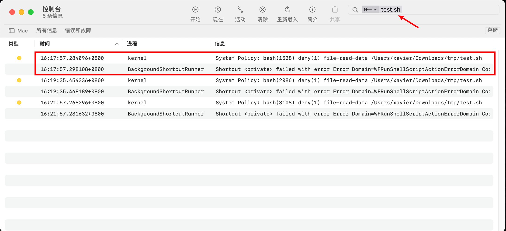

# MacOS初识SIP


&lt;!--more--&gt;
## 前言

因为一些原因，设计了一套快捷指令，中间涉及到一个sh脚本的运行，通过快捷指令运行时就会报错：`operation not permitted`

奇怪的是在快捷指令窗口下运行一切正常，但是从其他地方直接调用，例如通过Command&#43;Space 打开**Spotlight Search**下执行就换出现报错。

以测试用快捷指令”Mytest“为例，快捷指令窗口下运行成功截图：

&lt;img src=&#34;resource/1-快捷指令sh脚本报错operation_not_permitted.assets/image-20240408223453505.png&#34; alt=&#34;image-20240408223453505&#34; style=&#34;zoom:50%;&#34; /&gt;


通过**Spotlight Search**运行Mytest失败截图：

&lt;img src=&#34;resource/1-快捷指令sh脚本报错operation_not_permitted.assets/image-20240408223512224.png&#34; alt=&#34;image-20240408223512224&#34; style=&#34;zoom:80%;&#34; /&gt;

接下去记录下整个排查过程。

**省流**：解决办法：换个目录，将脚本从系统目录移动到用户目录下。

```sh
mv /users/xavier/Downloads/tmp/test.sh /users/xavier/MyScripts/test.sh
```

​    

**文章目的**：分享排查思路和过程、介绍SIP

## Step 1：初步检查

遇到 &#34;operation not permitted&#34; 错误，这通常意味着系统安全设置或权限设置阻止了脚本的执行。

接下去进行了如下检查：

1. **脚本内容**：检查脚本内容，确保脚本中没有尝试执行需要更高权限的操作。没问题。
2. **sh脚本执行权限**，`chmod 755 test.sh`，具有可执行权限。没问题
3. **系统偏好设置**：打开“系统偏好设置” &gt; “安全性与隐私” &gt; “隐私”标签页，检查“完全磁盘访问”列表，给快捷指令应用或终端应用（terminal）访问磁盘上文件的权限。 没问题。
4. **Gatekeeper 设置**：在“安全性与隐私” &gt; “通用”标签页中，设置允许从“App Store 和被认同的开发者”或“任何来源”安装应用。没问题
5. **管理员权限**：尝试以管理员身份运行sh脚本。无影响，还是不行。

在我当前已有认知中所有可能的方法都不能解决问题，那么要尝试定位问题产生的原因。


## Step 2：日志调查

这是一个超出我当前认知的一个问题，需要一步步排查定位问题，目前快捷指令给出的反馈`.../test.sh: Operation not permitted`太粗糙，需要找更精细的报错日志。

使用MacOS的 控制台应用（Console.app）以获取更多关于错误的详细信息。

又重复执行了一边快捷指令，使用Console.app抓取日志信息，然后通过搜索`test.sh`定位到详细的日志内容：



BackgroundShortcutRunner进程就是快捷指令app，注意到在它上面有一条kernel进程的报错信息，内容如下：

```sh
System Policy: bash(1538) deny(1) file-read-data /Users/xavier/Downloads/tmp/test.sh
```

接下去就是搜索该报错信息是什么意思，怎么解决。

## Step 3：定位问题

```sh
System Policy: bash(1538) deny(1) file-read-data /Users/xavier/Downloads/tmp/test.sh
```

通过搜索得知，这个日志信息表明 macOS 的系统策略（很可能是 SIP，即 System Integrity Protection）阻止了 bash 进程（进程ID为1538）读取 `/Users/xavier/Downloads/tmp/test.sh` 文件数据。

问题就在这个SIP策略。当脚本位于受 SIP 保护的目录中，或者脚本试图执行被 SIP 保护的操作，就可能会遇到权限问题。

这次遇到的情况就是因为我们的脚本被放在了受SIP保护的目录中，因此解决办法非常简单。

在解决问题之前，我想先了解下SIP。

​    

**SIP是什么？**

SIP ，即系统完整性保护（System Integrity Protection），是 macOS 的一个安全功能，用于保护系统文件和目录，防止这些文件及目录被没有特定权限的进程修改，包括root用户或拥有root权限的用户。

SIP通过一系列**内核强制实施**的机制来达成这一目标，它限制了关键系统文件的可写性，并对特定关键文件系统位置中的组件进行只读限制。

SIP的保护范围包括多个重要的系统目录和文件，例如/System、/usr、/bin、/sbin以及OSX的预装应用。这些目录和文件在系统启动时会被加载，并且对于保持系统的稳定性和安全性至关重要。SIP确保这些文件和目录不会被恶意代码或其他未经授权的进程修改。


## Step 4：解决问题

之前说了这次遇到的问题就是因为我们的脚本被放在了受SIP保护的目录中，因此解决办法非常简单，只需要将脚本换个位置，放到用户目录下即可，SIP 通常不会阻止读取用户目录下的文件。

**移动脚本到用户目录**：

```sh
mv /users/xavier/Downloads/tmp/test.sh /users/xavier/MyScripts/test.sh
```


当然还有一种办法，就是**禁用SIP**，但是**强烈不推荐，后果自负**，我没试过

- 如果确定需要禁用 SIP 来运行脚本，请小心操作，因为这可能会降低系统的安全性。
- 在终端运行 `sudo csrutil status` 检查 SIP 的状态，
- 使用 `sudo csrutil disable` ，禁用SIP（需要重启）。

## 总结

在排查问题过程中，要尽可能找细节全面的日志信息进行辅助判断。

写程序过程中也要注意报错信息处理，能帮助我们更快定位和解决问题。

（又水一篇文章~ :laughing: ）


---

> 作者: Xavier  
> URL: https://www.bthoughts.top/posts/macos-%E5%88%9D%E8%AF%86sip/  

