# Mac下Android APP抓包配置


换了M系列芯片的Mac，过去常用的模拟器都不太支持，之前用谷歌的Android-emulator-m1-preview，后来支持Android Studio了，就用Android Studio配置测试环境。

## 一、难点：
- APP存在root检测；
- APP不走WiFi设置的代理；
- HTTPS抓包无法解密；
- 传统抓包无效

## 二、思路：
- 模拟器（Android Studio 的 AVD）
- 代理转发工具（Clash）
- 抓包软件（burpsuite，Charles，Fiddler都行），导入系统证书解密https

所需工具即：一个合适的模拟器&#43;支持https的抓包软件&#43;流量转发工具

本文即AVD&#43;Clash&#43;Burp

## 三、行动
### 3.1 创建Android Virtual Device（AVD）
国内的各种模拟器不太支持m1芯片，于是就上手Android Studio中的 AVD。
配置自己选合适的，我是 Pixel 5 &#43; Tiramisu(API 33)，需要多试几个版本

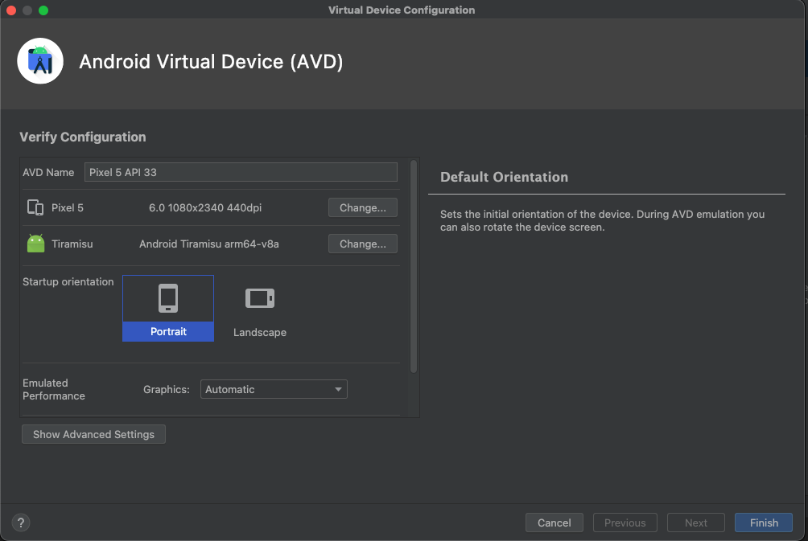

可能遇到的问题：

- Android版本太低，APP不支持；
- Android版本有root，APP存在检测，不允许在root环境下运行；
- Android架构冲突，APP无法安装；
- 其他

创建过程如下：

1. Open一个空文件夹作为新项目，或者直接选择`Profile or Debug APK`加载一个APK都可以。

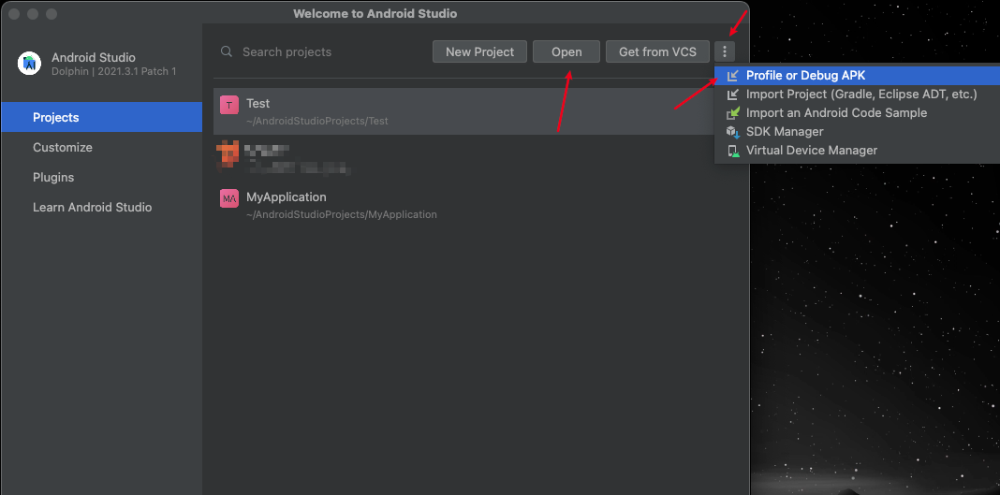

2. 进入项目后，点击右侧`Device Manager` -- `Create device`创建AVD模拟器，挑选Android系统镜像时根据需要选择合适的系统。

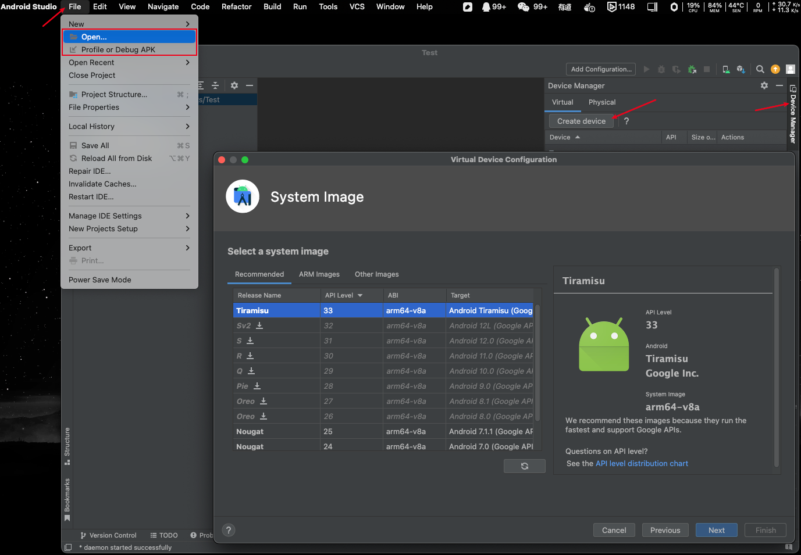

设置完之后就会在`Device Manager`列表中出现一个新的模拟器。

建议先启动一下模拟器，检查纯净状态下网络是否正常、待测试APK能否顺利安装并正常运行。

一切顺利的话，接下去安装Clash和Burp系统证书。

### 3.2 创建burp证书

高版本Android系统，导入证书安装后一般都是用户证书，我们需要花点功夫将其变成系统证书。

打开burp，电脑浏览器访问&#34;`http://burp`&#34;并下载证书cacert.cer，获得证书文件cacert.cer之后，准备将其转换成可放入系统证书库的文件。

下列方法一和二本质是一样的，都行。

#### 方法一：

```shell
openssl x509 -inform DER -subject_hash_old -in 证书文件.cer
```

获得红框中的hash值并把它作为后续的放入到系统证书库的证书名字，一般burp的证书名为（9a5ba575.0）

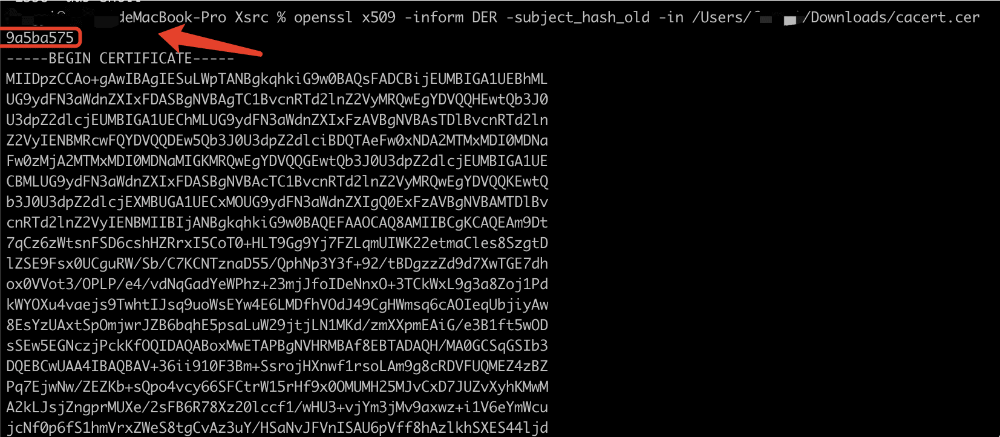

```shell
openssl x509 -inform DER -text -in 证书文件.cer &gt; hash值.0
```


#### 方法二：

先将burp的证书转换为pem格式，再计算其hash值，然后重命名为可以导入Android系统的`xxx.0`文件。

```shell
xavier@Mac Desktop % openssl x509 -inform DER -in 2.der -out 2.pem
xavier@Mac Desktop % openssl x509 -inform PEM -subject_hash_old -in 2.pem| head -1
9a5ba575
xavier@Mac Desktop % cp 2.pem 9a5ba575.0
```


### 3.3、导入系统证书

#### 3.3.1 坑点1：

获得了修改好的证书文件（9a5ba575.0）之后，就需要将证书放入AVD的目录当中，直接adb push会报`command not found`，`Read-only`，直接adb root 、adb remount也会报错。

报错记录：

```shell
xavier@Mac Desktop % adb root
zsh: command not found: adb

xavier@Mac Desktop % adb root
restarting adbd as root

xavier@Mac Desktop % adb remount
/system/bin/sh: remount: inaccessible or not found

xavier@Mac Desktop % adb push 9a5ba575.0 /system/etc/security/cacerts/
9a5ba575.0: 1 file pushed, 0 skipped. 7.2 MB/s (1330 bytes in 0.000s)
adb: error: failed to copy &#39;9a5ba575.0&#39; to &#39;/system/etc/security/cacerts/9a5ba575.0&#39;: remote couldn&#39;t create file: Read-only file system

xavier@Mac Desktop % adb root
adbd is already running as root
```

#### 3.3.2 配置SDK环境变量

启动AVD之前，需要配置一下Android相关的环境变量。

打开 .bash_profile 写入环境变量：`vim ~/.bash_profile`。

```bash
# Android SDK
export ANDROID_HOME=~/Library/Android/sdk
export PATH=&#34;$ANDROID_HOME/emulator:$ANDROID_HOME/tools:$ANDROID_HOME/tools/bin:$ANDROID_HOME/cmdline-tools/latest:$ANDROID_HOME/cmdline-tools/latest/bin:$ANDROID_HOME/platform-tools:$PATH&#34;
```

保存并退出，`source ~/.bash_profile`并使其生效。

注意：如果没有重启终端，新打开的终端默认加载旧的配置，需要手动`source ~/.bash_profile`使其生效。

#### 3.3.3 emulator启动AVD

现在我们必须将 CA 证书放在位于Android 文件系统中的`/system/etc/security/cacerts/`系统证书存储库中。默认情况下，`/system`分区以只读方式挂载。因此需要获得`/system`分区的写入权限并复制上一步中创建的证书。

通过命令行配置启动参数的方式运行AVD（参考：解决Android Studio ADV模拟器无法使用remount命令记录），就可以以写的方式启动AVD并向系统目录写入证书文件。

进入到AVD目录并以 &#34;`-writable-system`&#34; 的方式启动AVD

**注意**：如果你想使用你的证书，你必须使用 `-writable-system` 选项启动模拟器。否则 Android 将加载“干净”的系统镜像。

```shell
cd /Users/xxx/Library/Android/sdk/emulator/
 
#查看模拟器名字
./emulator -list-avds
 
./emulator -avd &#39;@模拟器名字&#39; -writable-system
```

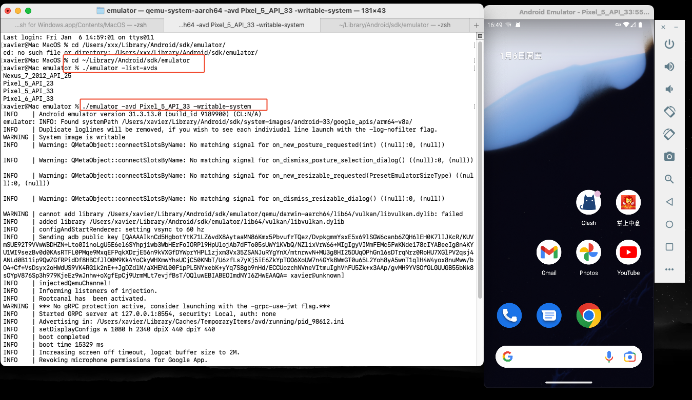

然后就可以看到AVD运行了起来，

如果能选用的Android镜像API Level &gt;28（Android 9.0以上），则可能需要禁用安全启动验证，API Level&lt;=28（Android 9.0及以下）可以跳过这步。

```shell
$ adb root
$ adb shell avbctl disable-verification # 禁用安全启动验证
$ adb reboot
```

此时再在控制台执行remount命令挂载文件系统，接着就可以push我们修改好的系统证书文件了。

```shell
$ adb root
$ adb remount
# 如果 adb 告诉您需要重新启动，请再次重新启动 adb reboot 并再次运行 adb remount

#推入证书
$ adb push /path/to/burp-cert /system/etc/security/cacerts/
$ adb push 9a5ba575.0 /system/etc/security/cacerts/
```

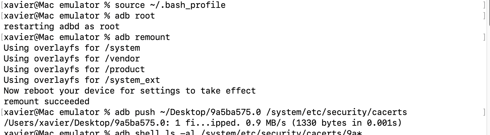

检查证书权限：

```shell
xavier@Mac emulator % adb shell ls -al /system/etc/security/cacerts/ | grep 9a
-rw-r--r-- 1 root root 8650 2022-07-08 05:11 3c9a4d3b.0
-rw-r--r-- 1 root root 1330 2023-01-05 14:50 9a5ba575.0
-rw-r--r-- 1 root root 2938 2022-07-08 05:11 9aef356c.0
-rw-r--r-- 1 root root 2760 2022-07-08 05:11 ed39abd0.0
```

检查是否成功加入系统证书：

安卓模拟器： 设置-安全-更多安全设置-加密与凭据-信任的凭据：

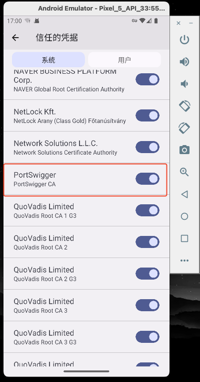

不同版本的Android系统路径也不一样，可以进设置后直接搜索“凭据” 或“cerdentials&#34;。AVD启动后默认语言是英语，可以自行修改。

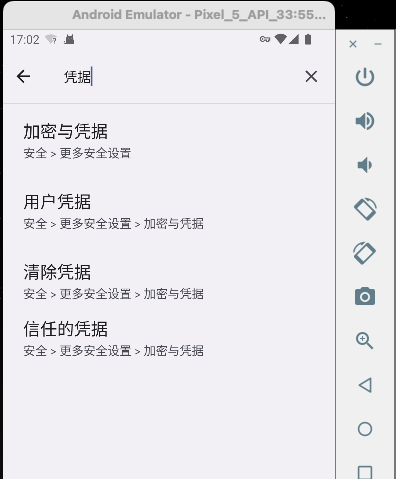


#### 3.3.4 补充说明：

通过命令行启动AVD 根据API差异，可能存在不同。

**API LEVEL &gt; 28** 的说明：

Tested on emulators running API LEVEL 29 and 30

```shell
$ emulator -list-avds
$ emulator -avd &lt;avd_name_here&gt; -writable-system  # (如果要看内核日志，可以加上 -show-kernel)
$ adb root
$ adb shell avbctl disable-verification # 禁用安全启动验证
$ adb reboot
$ adb root
$ adb remount # 将分区重新挂载为读写
$ adb push &lt;path_to_certificate&gt; /system/etc/security/cacerts
$ adb shell chmod 664 /system/etc/security/cacerts/&lt;name_of_pushed_certificate&gt;
$ adb reboot
```

**API LEVEL &lt;= 28** 的说明：

Tested on emulators running API LEVEL 26, 27 and 28

```shell
$ emulator -list-avds
$ emulator -avd &lt;avd_name_here&gt; -writable-system  # (如果要看内核日志，可以加上 -show-kernel)
$ adb root
$ adb remount # 将分区重新挂载为读写
$ adb push &lt;path_to_certificate&gt; /system/etc/security/cacerts
$ adb shell chmod 664 /system/etc/security/cacerts/&lt;name_of_pushed_certificate&gt;
$ adb reboot
```


### 3.4 抓包（clash&#43;burp）

#### 3.4.1.安装配置Clash

网上找了一个clash for Android：[下载链接](https://s.if.ci/clash/cfa-2.5.12-foss-universal-release.apk)

ClashForAndroid：https://github.com/Kr328/ClashForAndroid

[相关教程](https://docs.reiz.link/android/clash-for-android/)（没用到）

安装clash，可以直接用`adb install`：

```shell
xavier@Mac emulator % adb install ~/Downloads/cfa-2.5.12-foss-universal-release.apk
Performing Streamed Install
Success
```

配置yaml规则文件，只要将配置文件中的server和port修改成burp监听的ip和port就可以了（至于其他配置，可以查阅相关文档进行自定义的配置）

```yaml
mixed-port: 7890
allow-lan: false
mode: global
log-level: info
external-controller: 127.0.0.1:9090
proxies:
  - name: &#34;burp&#34;
    type: http
    server: 192.168.70.72
    port: 8080
proxy-groups:
  - name: Proxy
    type: select
    proxies:
      - burp
```

修改完之后直接adb push到AVD当中。

```shell
% adb push ~/Desktop/clash-config.yml /sdcard/
/Users/xavier/Desktop/clash-config.yml...kipped. 1.9 MB/s (252 bytes in 0.000s)
```

然后打开clash，&#34;配置--&gt;&#43;--&gt;文件:从文件导入--&gt;浏览文件--&gt;更多:导入&#34;从文件导入配置就可以了。
使用时在&#34;配置&#34;中勾选刚导入的配置文件

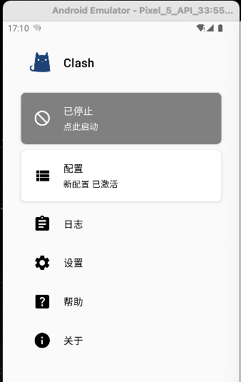

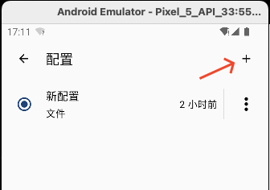

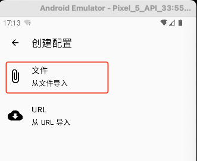

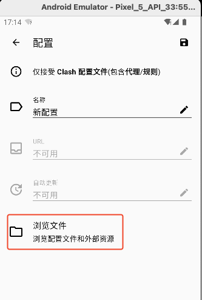

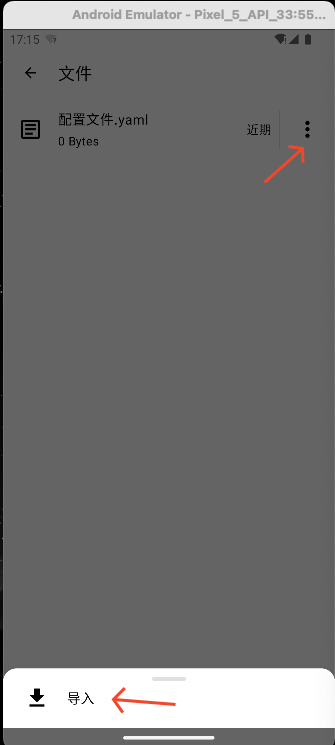

点击运行：

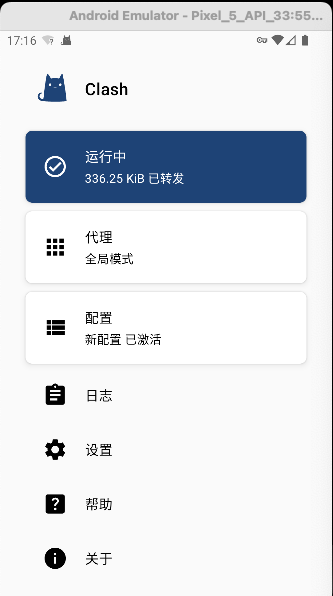

进入”代理“，点击右下角闪电标志，测试代理是否正常，测试连接出现数字表明连接正常。

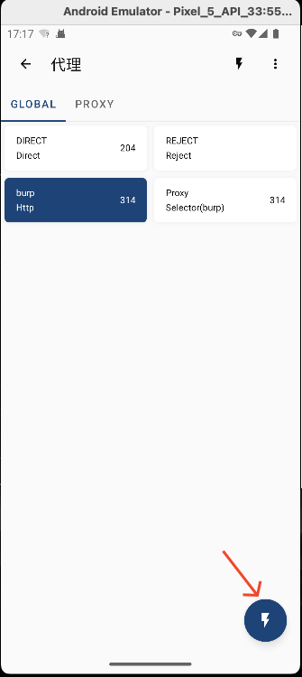


#### 3.4.2 burp代理设置

burp部分的代理不多说了

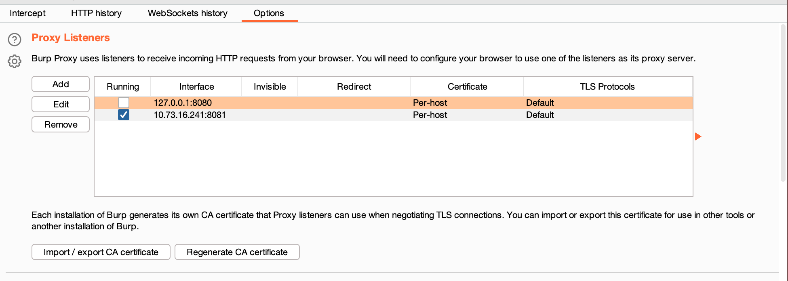

## 四、其他-待补充

burp那一块换成charles和fiddler抓包，也是可以的


## 参考文章：

- [整合一个Android抓包新姿势（AVD&#43;https&#43;remount&#43;clash代{过}{滤}理转发&#43;burp 版）——52破解-Fythem](https://www.52pojie.cn/forum.php?mod=viewthread&amp;tid=1701215&amp;highlight=Android%2B%D7%A5%B0%FC)
- [clash各平台使用教程](https://docs.reiz.link/)：除了下载文件，其他没怎么用上
- [adb 导入 burp 证书](https://blog.csdn.net/song_lee/article/details/118058168)：Android系统证书的制作
- [Android Studio 自带模拟器获取root权限](https://www.jianshu.com/p/31fd1d8fa8a6)：用了第一部分，实现导入系统证书
- [Install System CA Certificate on Android Emulator](https://docs.mitmproxy.org/stable/howto-install-system-trusted-ca-android/)

#解决问题 #APK #AVD #Android #clash #Burp


---

> 作者: Xavier  
> URL: http://localhost:1313/posts/mac%E4%B8%8Bandroidapp%E6%8A%93%E5%8C%85%E9%85%8D%E7%BD%AE/  

