# 002-Nmap进阶学习心得

<!--more-->

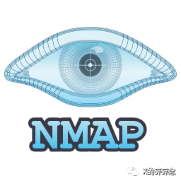

## 0x00 引

​		说起端口扫描，你可以举出一大堆的工具，但有一款神器，一定是登场率最高的，那就是Nmap。作为最为大众所熟悉的工具，相信大家都“熟练掌握”了Nmap的使用技巧，我曾经也是那么认为的，直到我看到了官方出版书刊《Nmap Network Scanning》（电子稿，简称NNS），才知道原来自己一直只是“会用”而已。

​		首先，我们来提出一些问题，如果能清楚回答下列问题，那么恭喜你不用浪费30分钟阅读本文了，问题如下：

1. Nmap支持哪些功能选项？

2. Nmap的执行过程是怎么样的？

3. Nmap 包含了哪些默认选项？如执行了哪些探测技术等

4. Nmap有哪些端口探测技术，有什么区别？

5. Nmap的扫描速度慢一直被人诟病，有什么方法可以加速吗？

    

​		有关Nmap的文章网络上已经很多了，大多数人可能已经看过了不少了，所以有些简单的地方我会一笔带过，大家网上搜索一下，也许会获得更多的知识碰撞。既然网上文章那么多，我为什么还要写呢？首先也是主要目的，是记录自己的学习心得，推动促进自己成长；其次是我发现网上很多文章只是简单的列举了Nmap的功能选项，罗列了一堆却没有深入去说明这些选项的注意事项，因此会造成很多的误解和错误使用，例如：有一个选项 -Pn，用于跳过主机发现阶段，

默认目标主机在线，整个流程少进行一个阶段，这样扫描速度就会加快了吧？（*真的么？:D*）；还有也是类似的，有些文章给出了应对各种场景的Nmap指令，如果不去了解那些指令就盲目的照搬，那么你可能被文章作者的“笔误”所误导。啰嗦了一堆，我们开始吧！

 

​		Nmap功能选项可以查看 `Nmap -h` ，我这里就不一条条去说了，下文涉及到时再说。

## 0x01. 指定扫描目标

​		首先，我打算从最简单的Nmap的命令案例讲起：`nmap 192.168.1.1`。通常绝大多数人使用Nmap时，都是需要针对特定的目标进行扫描的，所以就先来说说Nmap指定扫描目标的几种方式。猜猜以下哪些目标格式是能够被nmap解析的呢？

- 192.168.1.1 192.168.1.2
- 192.168.1.1,2,3
- 192.168.1.1/28
- 192.168.1.-
- 192.168.2-3.1-255
- 192.168.1.250-
- 192.168.1.-20
- 192.168.3-5,7.1
- scanme.nmap.org
- scanme.nmap.org/32
- -.-.1.1
- 0-.0.255.13.37
- 2001:800:40:2a03::3 	

​		答案是除了-.-.1.1以外，都可以作为目标输入。Nmap支持域名形式；支持CIDR寻址（从/0全网到/32当前IP）；支持IPv6地址，但需要指定选项-6来开启IPv6支持。

​		连字符（-）表示从0-255，当指定从0开始，或到255结束时，可以省略0和255。那么为什么-.-.1.1不可以呢？因为直接以连字符（-）开头，Nmap会将它视为一个功能选项解析，而不是作为目标地址。

​		Nmap在命令行上可以同时接受多个主机作为目标，而且不要求是统一类型的，如：nmap scanme.nmap.org 192.168.0.0/8 10.0.0,1,3-7.-

（**注意**：不包括Ipv6，Ipv6和Ipv4不能同时启用）。多个主机之间由一个或多个空格分隔。

​	**-iL**

​		Nmap 还支持从文件列表中读取目标，功能选项为 -iL ，同样也支持上述格式，由一个或多个空格，制表符或换行符分隔。

​		此外Nmap还支持从标准输入中读取目标主机列表，可使用连字符（-）作为 -iL 的文件名，例如：

​	`sort -u IpList.txt | nmap -iL -`		

​	`egrep'^ lease'/var/lib/dhcp/dhcpd.leases | awk'{print $ 2}'| nmap -iL-`

**`--exclude` 和 `--excludefile <filename>`**

​		排除扫描目标有两个功能选项：`--exclude` 和 `--excludefile <filename>`，很明显后者是从文件中读取需排除的扫描目标，就不细说了。

​		这里有一个注意事项：--exclude 功能选项后面接的参数是用逗号分隔的，因此不支持192.168.1.10,20,30来指定排除IP

​	**-iR**

​		其实，除了指定目标进行扫描之外，Nmap还支持漫无目的的全网扫描，功能选项为`-iR <number>`，表示从全网中随机选择指定 number 个主机进行扫描，如果number为0，表示持续扫描直到用户终止，-iR 这个功能一般很少会用到。

​	**-sL**

​		光看不验证容易被骗，如何快速的验证呢，去试一下 -sL 选项吧，它会列出进行扫描的目标清单，而不进行扫描，通常就是用于排查待扫描的目标是否准确。

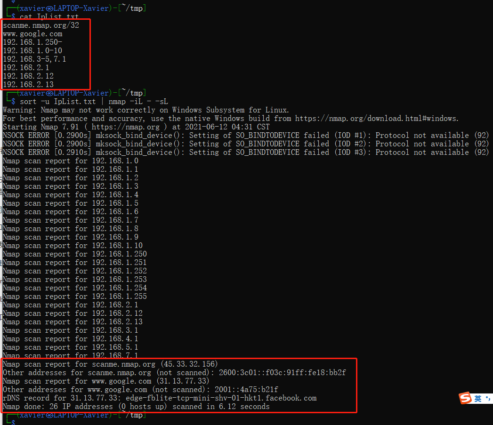

​		我们可以看到IP段能对上，对域名目标，Nmap进行了域名解析和反向DNS，下文就将介绍Nmap的运行顺序了。

## 0x02. Nmap运行流程

​		Nmap的运行过程可见官方文档：https://nmap.org/book/nmap-phases.html

​		一个简单的Nmap运行流程可以描述输入、主机发现、端口扫描、版本探测、操作系统探测、输出，如下图：

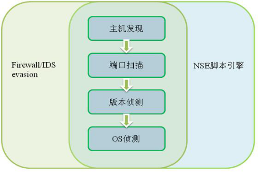

​		一个完整的Nmap扫描流程就是：预扫描脚本加载，目标列举，主机发现，DNS反向解析，端口扫描，服务与版本探测，操作系统探测，网络路由监测，脚本扫描，结果输出，后扫描脚本加载。大意如图：（图源自网络，*PS：这种图是拿什么做的，想修改几个地方*）

​		完整的流程如上所示，但很多流程提供了特定的功能选项来进行开启或跳过该阶段。接下来将介绍各个阶段的设计目，如何开启/关闭该阶段，以及该阶段的一些注意事项。

- **预扫描脚本**（Script pre-scanning）：使用 `--script` 或 `-sC`功能选项开启Nmap脚本引擎时，当指定的脚本中存在相应脚本，才会执行这个阶段，默认不进行该阶段。该阶段实现的功能为指定脚本的功能。
- **目标枚举**：这个阶段用于解析用户输入的目标，将域名、CIDR等解析为IP地址以供扫描，这是必不可少的一个阶段。`-sL -n`输出的结果就是这个阶段的输出结果。（-n 表示不进行反向DNS解析）
- **主机发现**（ping扫描）：该阶段用于判断所指定的目标主机有哪些是在线的，同时还会收集与目标主机之间的网络状况，用于加速后续的端口扫描。这个阶段支持很多主机发现技术，并且是多种探针一同工作。这个阶段默认运行，可以使用`-Pn` 可以跳过主机发现阶段，默认目标主机在线。
- **反向DNS解析**：Nmap会通过ping扫描发现所有在线主机的反向DNS名称，主机名称可能泄露该主机的功能用途。`-n`可以禁用反向解析，而 `-R`则表示对所有主机（即使不在线）也进行反向DNS解析。
- **端口扫描**：Nmap的核心功能，用于获取端口的开放状态，支持多种扫描技术，但同一时间只能选择一种扫描技术探针进行探测，输出结果有六种：open、closed、filtered、unfiltered、open|filtered、closed|filtered。**注意**：*这些状态不是端口本身真实状态，而是描述Nmap如何看待它们。不同的扫描技术得到的状态也不一样，需要学会了解其含义*。默认执行，但`-sn` 可以跳过端口扫描功能
- **服务和版本探测**：当识别到开放的端口时，可对该端口上运行的服务和版本进行探测。使用`-sV`启用版本探测。
- **操作系统检测**：`-O` 开启主机操作系统检测。**注意**：*操作系统检测到的系统可能与版本探测阶段扫描分析得出的系统不一致，能猜到是为什么吗？*
- **网络路由监测**（Traceroute）：`--traceroute` 选项开启该功能。它可以使用之前阶段确定的最佳可用探测数据包，找到并行到达多个主机的网络路由。Traceroute 通常涉及中间主机的另一轮反向 DNS 解析。
- **脚本扫描**：Nmap脚本引擎（NSE）中的脚本大部分运行在这一阶段。使用 `--script` 或`-sC`等选项启用此功能。Nmap支持6种类型的脚本，同时还允许高端玩家根据需求自己编写脚本，掌握Nmap 脚本扩展开发是很有帮助的。
- **结果输出**：这一阶段Nmap会将其收集到的所有信息写入屏幕或文件。支持多种格式输出，默认是输出到屏幕。
- **后扫描脚本**（Script post-scanning）：在 Nmap 完成扫描和正常输出后，此阶段的脚本可以处理结果并提供最终报告和统计信息。默认不包含任何脚本，也就相当于默认不进行这个阶段，只有在用户包含并执行他们自己的扫描后脚本时才会运行。同样也是使用 `--script` 等选项启用。

 

## 0x03. 默认的选项技术

​		Nmap 默认的选项技术，这里我们还是用 `nmap 192.168.1.1/24` 为例分析，在上文了解完运行流程之后，我们可以知道这条命令包含了目标列举、主机发现、反向DNS解析、端口扫描和结果输出这么5个阶段。

### 3.1 目标列举

​		目标列举这里就是将CIDR类解析为IP地址列表，如果有域名的话，需要进行DNS解析将域名转化为IP地址。默认情况下, Nmap 会通过 resolv.conf 文件 (Unix)和注册表 (Win32) 来确定使用的DNS解析器，会向主机上配置的域名服务器进行解析IP地址。Nmap有两个功能选项支持控制DNS解析服务器，分别为`--system-dns` 和 `--dns-servers <server1>[,<server2>[,...]]`，推荐使用后者，原因后面再说。

### 3.2 主机发现

​		主机发现默认使用多种ping 扫描技术探针同时探测，包括有：-PE -PS443 -PA80 -PP  选项。意味着对每个机器发送一个ICMP echo 请求，一个 TCP SYN 包，一个 TCP ACK 包，和一个 ICMP 时间戳请求包。如果是对私有地址，还会使用-PR，arp扫描进行探测。

​		`--packet-trace`允许我们查看Nmap所发起的数据包流，我们可以通过这个选项来进行验证，如图：

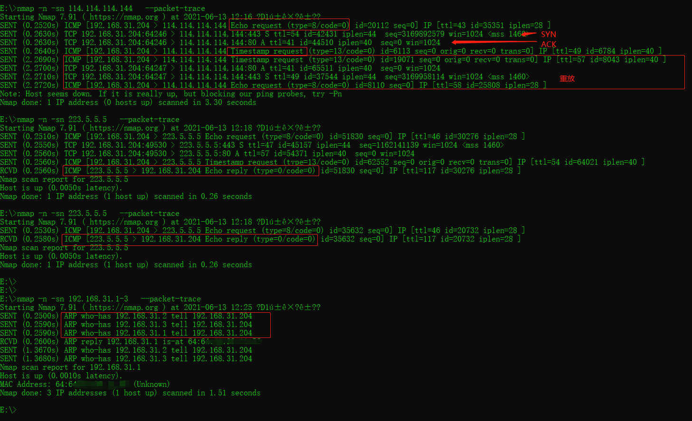

​		根据实验我们可以得出Nmap主机发现探测的顺序，任意探测收到目标主机的响应后将停止主机发现阶段，不在发送其他探针；对于未收到响应的主机，Nmap会进行1次重放，以防因网络因素引起的超时丢包等影响判断。对私有地址则会采用ARP进行探测。

​		Nmap 支持多种主机发现技术，可以用 -h 查看 HOST DISCOVERY 字段，支持的技术选项有：-PS/PA/PU/PY，-PE/PP/PM，-PO，**注意：如果你指定了任何 -P 选项，它会替换默认的发现探针，而不是在默认基础上增加新的探针类型。**

### 3.3 反向DNS解析

​		Nmap会将存活主机列表传入这个阶段进行反向DNS解析，通过解析出的主机名称，用户可以推测该主机的用途，示例如下：

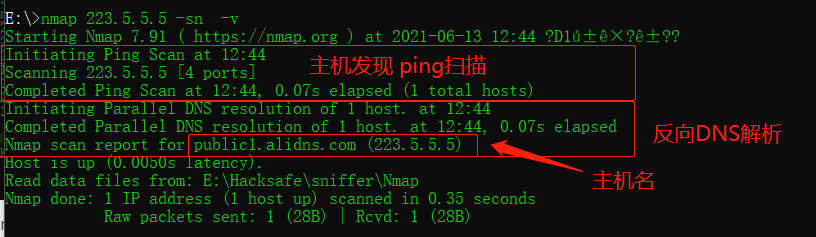

​		从结果我们可以推测出，该IP是阿里的公共DNS服务器。

​		同时我们注意到，对一个IP的反向解析用时0.07s，如果是对多个IP这个时间将会更长，DNS解析会影响扫描时长。例如我对223.5.5.5-10共6个IP进行探测，在反向DNS解析上就需要花费2.63秒。

​		为什么1个IP只要0.07s，而6个却要2.63s，相差那么多？原因其实很简单，如果你了解DNS的解析过程就应该指定，当本地DNS解析不到，它会向其他DNS进行查询，223.5.5.5是一个相对知名的主机，很差很多DNS服务器都会有收录，解析就快，而其他IP就没有知名度，需要向其他DNS进行查询，Nmap需要等待第三方返回结果，耗时就大大增加了。

​		这里来解释一下`--system-dns` 和 `--dns-servers <server1>[,<server2>[,...]]`的区别，前者是限定使用系统DNS解析器，资源有限；而后者可以手动指定DNS服务器且允许多个，尤其是指定一些知名服务器时，解析速度会相对加快一些。

### 3.4 端口扫描

​		Nmap 默认的端口扫描技术是SYN探测，对应的选项是 -sS，这被称为TCP 半连接，原理网上自查，很多扫描器都会用这种方式进行探测，因此很多IDS都能检测到。其他端口扫描技术可见 nmap -h 中 SCAN TECHNIQUES 一节，它给出了技术名称，相信网上能搜到相应的技术原理。《Nmap Network Scanning》第五章：端口扫描技术和算法详细介绍了各种扫描技术及原理。

​		Nmap 默认配置是扫描最常见的1000个端口，那么有没有人跟我一样好奇过这最常见的1000个端口到底是哪些端口呢？nmap-services文件中就记录着，https://nmap.org/book/nmap-services.html 给出了如何阅读和理解该文件，每一行表示在相应端口发现特定服务的可能性，Nmap的这个最常见的1000个就是基于这个文件得出的，我们也可以通过这个文件去统计一下各端口的频率，但是我没去做，所以我还是不知道最常见的1000个是哪些端口 😆 。

​		对于扫描的端口范围，Nmap提供了几个控制选项。

​		`-p`选项，用户指定扫描范围，指定特定的端口，如 -p 80,443，nmap还支持指定协议名称去查询最可能出现的端口，如 -p http,https，Nmap会探测80，8008和433端口。同样也可以通过nmap-services文件查询。这里还支持通配符，例如-p *htttp，结果如下：

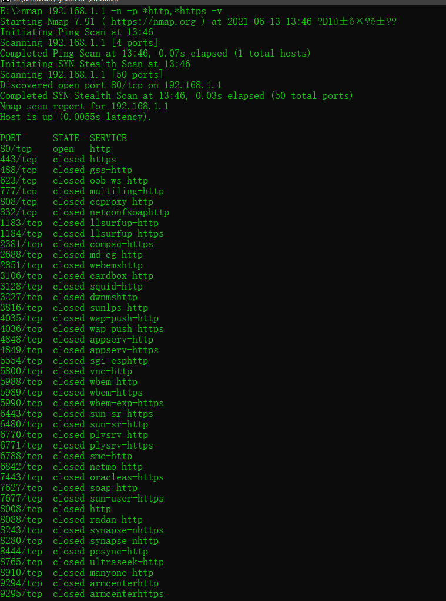

​		`--exclude-ports` 选项，排除特定端口，不进行扫描；

​		`-F`选项，fast模式，扫描最常见的100个端口；

​		`-r` 选项，控制端口从小到大依次进行扫描，而不是随机选择。

​		`--top-ports <number>` 选项，扫描最常见的指定数量个端口。前 n 个端口是由 **/usr/share/nmap/nmap-services**文件确定的。有时候为了全面的目标主机的端口状态，会进行全端口扫描，以免遗漏攻击面。NNS一书[第六章，优化Nmap性能：端口选择数据和策略](https://nmap.org/book/performance-port-selection.html)中，给出了一张关于端口扫描数量和有效性的表格，TCP仅需扫描3328个端口就能达到99%的效率，UDP仅需15094个，而达到100%则需要65536全端口扫描。因此是为了保证准确率仅需全端口扫描，还是牺牲1点准确率换取更短的扫描时长，取决于个人选择。

​		`--port-ratio <ratio>` 选项，控制只扫描可能性大于指定ratio的端口，同样根据 nmap-services 文件统计数据。

### 3.5 结果输出

​		默认结果是输出到命令行界面。其他对输出的控制选项有：

#### 输出文件类型控制：

​		-oN 选项，以人类可读的普通模式（与命令行界面的输出结果一致）保存到指定文件中；

​		-oX 选项，输出为XML文件格式。因为XML的功能性，易与其他工具进行联动；

​		-oS 选项，输出为“脚本小子”格式（Script kiddie），输出内容会有大小写交叉，部分字母由其他符号代替；作者原话：

> It is simply a joke *making fun* of the script kiddies—they don't actually use this mode (I hope).

​		-oG 选项，输出为适合Grep的格式，该格式更适合在Unix环境下使用Grep命令来获取数据。

​		-oA 选项，同时输出Normal（-oN）、XML（-oX）、Grepable（-oG ）格式文件。

​		Nmap的这些参数都支持在文件名中使用类似strftime的转换， %H, %M, %S, %m, %d, %y,和%Y 完全一致，%T 等同于 %H%M%S（时分秒），%R 等同于%H%M, ， %D 等同于 %m%d%y（月日年）。因此 `-oX 'scan-%T-%D.xml'` 会生成文件名为 `scan-144840-121307.xml` 的XML文件。

​		Normal和Grepable格式的文件，支持中断扫描后继续扫描，命令为 `nmap --resume <filename>`，XML文件输出不支持，原因是XML文件追加内容更难。

​		--append-output 选项，在指定文件后面追加内容。上述的 -oN 之类选项默认会覆盖指定文件，当你想保留原文件，在后面附加新结果时，用这个选项。同样也不适合 -oX 选项，因为他会导致XML文件解析失败，需要手动修复。

#### 输出信息控制

​		-v 选项，显示详细信息，可以 -vv 或-v2 获取更详细信息；

​		-d 选项，显示调试信息，可以 -dd 或 -d2 获取更详细的调试信息；

​		--packet-trace 选项，显示数据包追踪；

​		其他还有 --reason、--open、--iflist、--stylesheet、--webxml、-no-stylesheet ，可以查看nmap -h ，没什么要说明的内容。

#### 命令行交互式控制

​		在扫描过程中，可以通过按键进行交互式控制，调整Nmap在命令行界面的输出信息。nmap运行时，所有按键都会被捕获。这允许您与程序交互而无需中止和重新启动它。某些特殊键将更改选项，而任何其他键将打印出一条状态消息，告诉您有关扫描的信息。通常是小写字母增加打印量，大写字母减少打印量。您也可以按“?”寻求帮助。

- v/V		增加/减少详细程度输出，对应 `-v`选项功能
- d/D		增大/减小调试级别，对应 `-d`选项功能
- p/P		打开/关闭数据包跟踪，对应 `--packet-trace` 选项功能
- ? 		  显示帮助信息

### 3.6 小结

​		回归到问题，Nmap 包含了哪些默认选项，如执行了哪些探测技术等？

​		Nmap 1.1.1.1 包含的 -PE（ICMP Echo探测），-PS443（对443端口是SYN探测），-PA80（对80端口的ACK探测），-PP（ICMP 时间戳探测）主机发现技术，反向DNS解析技术，-sS（SYN探测）端口扫描技术扫描1000个端口，将结果输出到交互式命令行中。

## 0x04 端口扫描技术

主机发现技术的原理不说了

Nmap的端口探测技术知道多少种，对应的原理是什么？有什么区别，分别适合什么场景？

### 4.1 -sS SYN扫描

​		-sS	SYN扫描，半连接扫描，优点是扫描速度快，不容易被记录，适用于任何兼容TCP堆栈，可以清晰可靠地区分端口开启、关闭和过滤状态。但需要root权限去构造原始数据包，目前IDS可以检测到这种扫描方式。

​		原理简单来说就是利用了TCP三次握手，向目标发送SYN数据包，

​		若收到SYN/ACK返回，则端口开放，发送RST包终止建立连接（图5.2）；

​		若收到RST返回包，则目标端口关闭（图5.3）；

​		若目标无响应，则该端口可能被过滤（图5.4）。

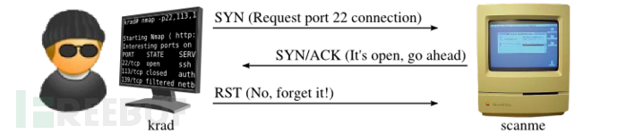

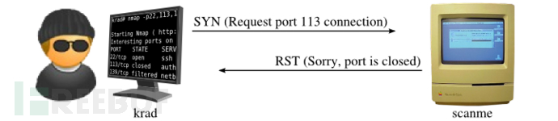

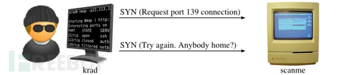

### 4.2 -sT TCP 连接扫描

​		-sT	TCP connect 连接扫描，建立完整的连接，会被日志、IDS等记录。

​		这通常是非高权限用户的默认扫描方式，Nmap会调用系统底层的connect与目标端口建立连接。一次完整的连接建立过程需要SYN、SYN/ACK、ACK、Data、RST 5个数据包，速度比SYN慢。

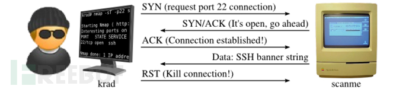

### 4.3 -sA ACK扫描

​		-sA	ACK扫描，适合用来映射防火墙规则。

​		ACK扫描不能确定端口为开发状态，可以用于映射防火墙规则集，确定是否有状态监测防火墙，以及对哪些端口进行了过滤。当扫描被过滤系统时，无论是开启或关闭的端口都会返回RST数据包，则Nmap会标记为 unfiltered ；若端口没有响应包或收到ICMP不可达报错，则标记为 filtered。

### 4.4 -sW 窗口扫描

​		-sW 	Windows扫描，

​		窗口扫描原理与ACK扫描相同，但它会利用系统的实现细节区分端口开放和关闭，而不是都标记为 unfiltered。它会对RST数据包的TCP窗口值进行判断，若窗口字段为0，则该端口标记为closed，若端口字段非0，则标记为open。

​		这种扫描技术依赖于部分操作系统的特性，普遍性不高。某些系统开放的端口上窗口大小为正数，而关闭端口则为0。

### 4.5 -sM Maimon扫描

​		-sM	Maimon扫描，以发现者Uriel Maimon命名，使用 FIN/ACK 数据包为探针。

​		根据RFC 793（TCP），无论端口是打开还是关闭都应生成RST数据包来响应此探测。但是，Uriel注意到，如果端口是开放的，则许多BSD派生的系统只会丢弃该数据包，Nmap借此确定打开的端口。若无响应包，则标记为 open|filtered ；若收到RST包，则端口为 closed；若收到ICMP不可达报错，则端口为 filtered。

​		不过在现代系统上很少出现这种错误，他们都将回复RST数据包，因此用处不大。

### 4.6 -sU UDP扫描

​		-sU	UDP扫描，速度很慢，扫描上千个端口需要至少17分钟，多数Linux系统会限制 ICMP响应速率。

​		UDP扫描会向指定的目标端口发送UDP数据包，对于大多数端口此数据包为空（无有效载荷），但对于一些常见端口，将发送特定协议的有效载荷数据包。根据响应包的存在与否，将端口分为四个状态：

- 目标端口的任何 UDP 响应 (异常)											open
- 未收到返回信息 (即便重传)											   open|filtered
- ICMP 端口不可达错误 (type 3, code 3)								closed
- 其他 ICMP 不可达错误 (type 3, code 1, 2, 9, 10, or 13)	filtered

### 4.7 -sN/sF/sX Null扫描、FIN扫描、Xmas扫描

​		-sN/sF/sX	设置TCP标志位。这三种扫描类型（以及--scanflags选项）利用TCP RFC 标准中的细节来区分开放端口和关闭端口，通常只能确定关闭的端口。

​		当目标主机符合RFC标准时，发送一个不包含SYN，RST，ACK标志的数据包，当目的端口关闭时将返回RST包，当端口开放时目标主机将丢弃数据包，因此无响应包，但也可能是防护设备导致无响应。因此只要不包含SYN、RST、ACK这三个位，则其他三个位（FIN，PSH和URG）的任何组合都可以。

​		-sN 不设置任何标志位；

​		-sF 只设置TCP FIN位，FIN位表示关闭连接（finish）；

​		-sX 设置FIN、PSH和URG标志，PSH表示数据传输（push)，URG表示紧急（urgent）。

​		根据扫描结果，将端口分为三种状态，若无响应包，则标记端口状态为 open|filtered；若收到TCP RST包，则端口状态为 closed；若收到 ICMP不可达错误（type 3, code 1, 2, 9, 10, or 13)，则标记端口状态为 filtered。

​		这三种扫描优点在于可以规避部分非状态防火墙和包过滤路由设备，而且比SYN更加隐蔽；但缺点是并非所有的系统都遵循RFC 793标准，而且无法区分 open 和 filtered 端口。

### 4.8 --scanflags 自定义扫描

​		--scanflags  自定义扫描，可以定制化TCP标志位，原理同上。可以通过该选项设置 URG、ACK、PSH、RST、SYN 和 FIN 的任意组合，这种定制化可以用来研究绕过防火墙设备，这块没有研究，欢迎评论。

### 4.9 -sI 空闲扫描

​		-sI 空闲扫描，也有称之为僵尸扫描，利用僵尸主机进行扫描，优点是隐蔽性强，缺点是需要先找一台合适的僵尸主机。网上有文章。

​		首先我们需要知道：

- 确定TCP端口状态的一种方法是发送SYN数据包到该端口。若端口开放，则目标主机将响应 SYN / ACK（会话请求确认）数据包；若端口关闭，则目标主机将响应RST（重置）数据包。
- 收到未经请求的SYN / ACK数据包的计算机将以RST响应，未经请求的RST将被忽略。
- 每个IP数据包都有一个片段标识号（IP ID）。由于许多操作系统发送的每个数据包时只是增加此数字，因此探测IP ID可以告诉攻击者自上次探测以来已发送了多少个数据包。

​		通过组合这些特点，可以伪造您的身份，同时扫描目标网络，从而看起来像是无辜的僵尸机器进行了扫描。简单来说，空闲扫描技术主要是进行下面三步：

1. 探测僵尸的IP ID并将其记录下来。
2. 伪造来自僵尸的SYN数据包，并将其发送到目标主机的端口上。根据端口状态，目标的反应可能会导致僵尸的IP ID增加。
3. 再次探测僵尸主机的IP ID。然后，通过将此新IP ID与步骤1中记录的IP ID进行比较来确定目标端口状态。若ID加2，则端口开放。

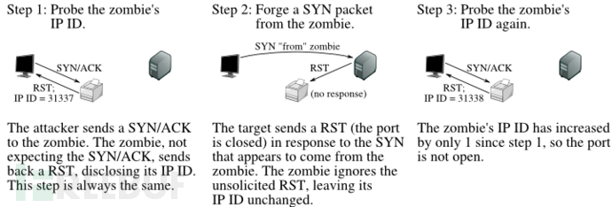

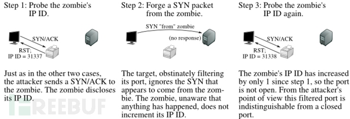

​		这项技术的难点在于如何找到一台合适的僵尸主机。若僵尸主机比较活跃，则IP ID序列号将不准确，无法判断端口状态。

### 4.10 -sY/sZ SCTP INIT/COOKIE-ECHO扫描

​		-sY/sZ	SCTP INIT/COOKIE-ECHO扫描，这两种扫描方式是基于SCTP协议。

​		SCTP（Stream Control Transmission Protocol，流控制传输协议）是IETF（Internet Engineering Task Force）在2000年定义的一个传输层协议。SCTP可以看作是TCP协议的改进，它改进了TCP的一些不足。它一种提供了可靠、高效、有序的数据传输协议。相比之下TCP是面向字节的，而SCTP是针对成帧的消息。RFC 4960详细地定义了SCTP，介绍性的文档是RFC 3286。

​		TCP建立连接的过程是：SYN、SYN/ACK、ACK；

​		而SCTP建立连接的过程是：INIT、INIT-ACK、COOKIE-ECHO、COOKIE-ACK

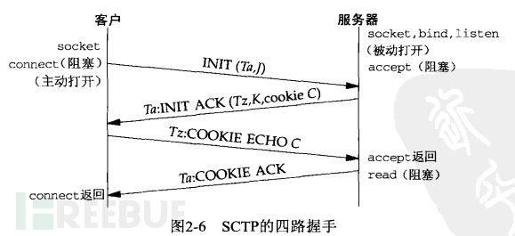

​		主机发现阶段的 -PY 选项与 -sY 原理一样，通过向目标主机的指定端口发送 INIT数据包，根据主机响应判断是否存活。

​		-sY/sZ 与TCP协议下的 -sS/sA，思想是一致的。		-sY SCTP INIT扫描是TCP SYN扫描的SCTP等效物。优点是速度快，不受限制性防火墙的限制。与SYN扫描一样，INIT扫描相对隐蔽，因为它永远不会完成SCTP连接。能有效区分开启，关闭和过滤状态。

​		-sZ  SCTP COOKIE-ECHO扫描，利用了SCTP协议在实现上，若向开放的端口发送COOKIE-ECHO请求，则该端口会直接丢弃该数据包不做响应；而对关闭的端口，则目标主机会返回ABORT响应。同样也可以用于检测基于状态检测的防火墙。缺点是不能区分打开和过滤的端口。

### 4.11 -sO 协议扫描

​		-sO IP层协议扫描，这不算是端口扫描技术，该扫描技术用于判断目标主机所支持的协议。

​		该扫描技术允许用户通过-p选择扫描的协议号，也可以使用-F扫描nmap-protocols文件中的所有协议（共145种协议），默认情况下会扫描256个可能的值，以常规端口表格形式报告结果。

### 4.12 -b FTP bounce scan

​		-b FTP bounce scan，逐渐弃用

​		这种扫描技术是利用FTP服务器的功能。FTP协议（RFC 959）的一个有趣功能是支持所谓的代理FTP连接。这使用户可以连接到一个FTP服务器，然后要求将文件发送到第三方服务器。在许多级别上，这种功能已经很容易被滥用，其中之一是导致FTP服务器对其他主机进行端口扫描。因此大多数FTP服务器都不再支持该功能，所以这项扫描技术也基本弃用了。

### 4.13 组合利用

​		有时候需要通过多种扫描技术来对确定端口状态。例如：

​		先执行FIN扫描，Nmap会找到关闭的端口，同时列出 39个端口为“open|filtered”；然后再对这39个端口进行ACK扫描，其中有2个为filtered，其他37个处于未过滤状态意味着open或closed。如果一种扫描类型将端口标识为open或filtered ，另一种扫描类型将其标识为open或closed，那么该端口必须为打开状态。通过组合这两种扫描类型，我们了解到有37个端口开放，两个已过滤，而961已关闭。

## 0x05 Nmap高效扫描策略

​		Nmap的扫描速度慢一直被人诟病，首先分析一下Nmap扫描慢可能的原因，再根据[NNS 第六章 优化Nmap表现](https://nmap.org/book/performance.html)和平时的使用心得给出一些建议。

### 5.1 Nmap慢在哪？

​		Nmap扫描的慢，一部分是因为其扫描算法，另一部分是部分高级功能的原因。以下是我认为可能导致Nmap慢的原因：

1. **网络状态监测（拥塞控制）**

   Nmap提供网络状态监测，Nmap会基于网络状态适当的调整扫描速度，以保持网络允许的速度。Nmap 使用三种模仿 TCP 的算法来控制扫描的激进程度：拥塞窗口、指数退避和慢启动。拥塞窗口控制 Nmap 一次可能有多少个未完成的探测。若窗口已满，则不再发送，直到收到响应或探测超时。当 Nmap 检测到丢弃的数据包时，指数退避会导致 Nmap 显着变慢。每当检测到丢弃时，拥塞窗口通常会减少到 1。慢启动则用于逐渐提高扫描速度以确定网络的性能限制。

   **拥塞窗口和阈值**：

   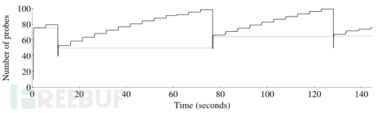

2. **自适应重传**

   最简单的扫描仪（和无状态的） 通常根本不重传探测。如果没有检测到丢包，Nmap 可能只在收到探测响应失败时重传一次。当出现大量丢包现象时，Nmap 可能会重传十次或更多次。这允许 Nmap 快速扫描快速、可靠网络上的主机，同时在扫描有问题的网络或机器时保持准确性（以牺牲一些速度为代价）。当达到某个阈值时，Nmap才会放弃重传。

3. **扫描延迟**

   数据包响应速率限制可能是 Nmap 等端口扫描器面临的最严重的问题。当目标主机存在数据包响应速率限制时，Nmap会试图检测这种情况，启用扫描延迟，它会在发送到单个目标的每个探测之间实现短延迟（低至 5 毫秒）。如果数据包响应速率依然在下降，Nmap 将继续将延迟加倍，直到下降停止或 Nmap 达到允许的最大扫描延迟。

   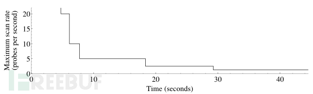

4. DNS解析功能

   ​		Nmap提供DNS解析和反向DNS解析功能。通常正向DNS解析速度很快，但反向DNS解析需要耗费很长时间，尤其是对大量目标进行探测时，反向DNS解析过程会花费大量时间。

5. 服务版本探测

   ​		端口扫描是Nmap的核心功能，同时Nmap还提供对所发现的端口进行服务版本探测。在这一环节需要发送大量的数据包来确定服务版本。在这个阶段Nmap会与TCP端口建立连接并监听该端口服务约5秒，以期望在目标端口服务的欢迎标语banner中获取信息，并与nmap-service-probes文件指纹进行匹配；但若未能匹配，则需要使用其他探针去诱导获取指纹。

6. ……

### 5.2 方法论技巧

1. **保持版本更新**

2. **选择有利的网络位置**

   ​		我的理解有两个方面，一是选一个网络环境好的地方，减少超时重放等现象；

   ​		第二个是从防火墙后面扫，能够从内网扫描就不要从公网扫描，中间少一些路由防火墙等网络设备，这样数据更全面且准确。

   ​		当然很多时候我们没有选择的余地。

3. **多阶段扫描**

   ​		如果计划进行全面的安全审核，对全端口进行扫描，我可能会考虑先对给定资产范围进行一次快速的扫描，如`nmap -n -F <targets>`；同时后台进行忽略主机存活状态的全端口探测，如`nmap -Pn -n <targets> -p-`。		

4. **并发进行Nmap扫描**

   ​		在同一台主机上运行多个Nmap进程，将大任务进行分解。官方说五个或十个都还好，启动太多并发任务容易导致资源竞争。

   ​		另一种并行方式是在不同主机上运行。

   ​		例如：需要扫一个B段，那就是256个C段，我可能会考虑将任务分为在本地移动办公的终端上运行1个C段，在远程主机上运行3个C段+64个*3+60个，这么6个任务。

5. **分离和优化UDP扫描**

   ​		Nmap虽然支持 -sSU，但在注重性能时不建议结合使用TCP和UDP扫描。因为UDP扫描通常会很慢。所以建议分开进行。

   ​		由于UDP端口扫描技术的特殊性，open和filtered的端口都不会发送响应包，因此需要时间去等待；而无响应包的情况为了排除因网络原因导致的丢包还需要进行重传确认。而对于关闭的端口，会收到ICMP端口不可达，部分系统会限制 ICMP 消息发送速率。因此UDP扫描会很慢。

   ​		官方也给出了一些改善UDP扫描性能的建议，整体上与本章其他内容想法相同。增加主机并行数（--min-hostgroup）同时扫描多个主机；优先扫描常见端口-F；版本探测时，指定  --version-intensity 0 仅尝试最有可能针对给定端口号有效的探针；从防火墙后扫描；--host-timeout 指定主机超时时间，跳过响应缓慢的主机；最后一条，保持冷静，做点别的，不要盯着进度条，眼不见心不烦（/doge/）

6. **忽略非关键测试。明确测试目的**

   ​		首先需要想清楚我们的测试目的，明确测试目的后对任务进行划分，选取扫描策略，指定参数选项。

   例如：

   ​		如果你只需探测网络内存活主机，就没必要进行端口扫描，用-sn禁用端口扫描；

   ​		**限制扫描的端口数。**当遇到速率限制和无响应时，Nmap扫描速率会下降，绝大数主机只会开发几百个端口，如果仅扫描100个端口而不是默认的1000个端口，则端口扫描的速度大约是其10倍。全端口扫描的100%准确率与--top-ports 3328 的99%准确率的取舍。

   ​		**跳过高级扫描类型。** -A 选项会同时开启脚本探测 -sC，版本探测-sV，操作系统探测 -O和路由跟踪--traceroute，确定这些功能是否都需要开启；当针对大规模网络进行扫描时，这些高级功能会花费很长的时间，建议跳过-sC -sV，然后根据需要在各端口上执行他们。至于操作系统探测和路由跟踪，绝大部分时候可能并不在意。作为一种折衷方法，您可以指定--osscan-limit --max-os-tries 1，来告诉Nmap不要重试无法匹配的操作系统，并对没有开放至少一个TCP端口和一个关闭的TCP端口的任何主机跳过操作系统检测。

   ​		**不必要时关闭DNS解析。**Nmap默认会主机进行反向DNS解析，尤其是使用-Pn和-R时，会对所有主机执行此操作，这会花费很多时间。可以使用 `--dns-servers` 指定DNS服务器来加速这一过程。不过，在不必要时，建议使用-n禁用DNS解析。对于针对大量主机的简单扫描（例如ping扫描），省略DNS有时可以将扫描时间减少20％或更多。

### 5.3 Nmap选项技巧

1. **加速选项控制。**

   nmap -h 中 TIMING AND PERFORMANCE 部分的选项可以帮到很多。

2. - --min-hostgroup, --max-hostgroup

     可指定最小和最大主机组大小，影响并发扫描主机速率。

   - --min-parallelism, --max-parallelism

     可指定最小和最大并发运行的探针数量

   - --min-rtt-timeout, --max-rtt-timeout, --initial-rtt-timeout

     可指定最小、最大和初始化探针超时值，需写上单位，通常为毫秒ms。Nmap 在每次接收到探针响应时记录耗时，估算网络情况并进行计算得出timeout数值。

   - --max-retries

     允许探针重传的最大值

   - --host-timeout

     指定单个主机扫描的最大时长，当到达最大时间，将放弃该主机。

   - --scan-delay, --max-scan-delay

     指定针对单个主机每个探针之间的最小和最大延迟控制；

   - --min-rate, --max-rate

     指定每秒发送的探针数据包最小和最大速率，这个值允许超过Nmap的拥塞控制算法限制。

   - --defeat-rst-ratelimit

     指定目标主机的RST数据包响应率，这个不太了解。

3. **优化时间参数 -T**

   Nmap提供了一些时间模板-T0-5，随着数字增大，扫描速度将加快。可以使用 `nmap -T5 -d` 的形式查看时间模板的参数

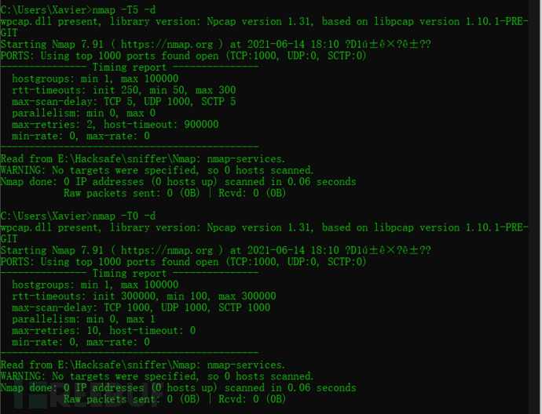

不同级别的参数见下表

|           名称            | T0 (Paranoid) | T1(Sneaky) | T2(Polite) | T3(Normal) | T4(Aggressive) | T5(Insane) |
| :-----------------------: | :-----------: | :--------: | :--------: | :--------: | :------------: | :--------: |
|      min-rtt-timeout      |      100      |    100     |    100     |    100     |      100       |     50     |
|      max-rtt-timeout      |    300,000    |   15,000   |   10,000   |   10,000   |     1,250      |    300     |
|    initial-rtt-timeout    |    300,000    |   15,000   |   1,000    |   1,000    |      500       |    250     |
|        max-retries        |      10       |     10     |     10     |     10     |       6        |     2      |
| 初始化扫描延迟 scan-delay |    300,000    |   15,000   |    400     |     0      |       0        |     0      |
|      最大TCP扫描延迟      |    300,000    |   15,000   |   1,000    |   1,000    |       10       |     5      |
|      最大UDP扫描延迟      |    300,000    |   15,000   |   1,000    |   1,000    |     1,000      |   1,000    |
|       host-timeout        |       0       |     0      |     0      |     0      |       0        |  900,000   |
|      min-parallelism      |     动态      |    动态    |    动态    |    动态    |      动态      |    动态    |
|      max-parallelism      |       1       |     1      |     1      |    动态    |      动态      |    动态    |
|       min-hostgroup       |     动态      |    动态    |    动态    |    动态    |      动态      |    动态    |
|       max-hostgroup       |     动态      |    动态    |    动态    |    动态    |      动态      |    动态    |
|         min-rate          |    无限制     |   无限制   |   无限制   |   无限制   |     无限制     |   无限制   |
|         max-rate          |    无限制     |   无限制   |   无限制   |   无限制   |     无限制     |   无限制   |
|   defeat-rst-ratelimit    |  默认未启用   | 默认未启用 | 默认未启用 | 默认未启用 |   默认未启用   | 默认未启用 |

注意：动态的，不受时间模板限制

### 5.4 -Pn 加速

​		*之前有一个疑问就是 `-Pn` 跳过主机发现阶段，是否能缩短扫描时间？*

​		答案是否定的，因为主机发现阶段所进行的不光是探测主机是否存活，同时也记录了与目标主机之间的网络情况，给出一个RTT评估并调整超时重传等待机制，来提高接下去的端口扫描速度。

​		不过我们可以通过Nmap的一些选项来手动指定这些参数，来加快扫描速度。

​		-Pn 最大的问题就是无法获取到网络状态信息，由于重传和RTT估算的问题，导致整个扫描过程等待时间过长，因此我们可以手动指定--max-rtt-timeout, --initial-rtt-timeout。

​		Nmap没有从每个主机上收集到足够的响应来准确估算延迟和丢包率，那么我们首先需要解决这个问题。我们可以通过命令行来手动收集该信息，可以通过ping 相邻的在线主机获取延迟估计，当然可能会有禁ping的现象，可以用nmap附赠的小工具nping 对开放的端口进行探测，获取延迟估计。

​		根据这个延迟，我们大致能知道到该目标范围主机的网络状况，因此我们只需要手动指定--max-rtt-timeout, --initial-rtt-timeout 为比这个延迟大一定程度的值就可以了。例如延迟为60毫秒，则我们可以将其指定为 --max-rtt-timeout 200ms --initial-rtt-timeout 150ms。

​		一个完整的案例，见 [《NNS》第四章：端口扫描概述——案例：扫描大型网络以查找某个开放的TCP端口](https://nmap.org/book/solution-find-open-port.html)。

## 0x06 总结

​		本文算是基于《Nmap Network Scanning》的读后感吧，全书内容很多也学到了很多，同时也对自己的相关知识进行了一个整理。

​		这里还未涉及到NSE脚本引擎，那是一个宝藏，具有很好的扩展性，可以基于NSE脚本引擎，开发定制化自己的脚本以实现相应的功能。网络上也有很多相关的文章可以学习参考。

​		还有一部分内容是关于防火墙和IDS的对抗技巧，这部分由于实践检验的比较少，没什么发言权，就不说了。

​		最后，感觉大家的阅读，如果觉得本文写的还可以，对您有帮助，麻烦您点个赞；如果您有任何的批评、意见和建议，欢迎在评论区留言。

---

> 作者: Xavier  
> URL: https://www.bthoughts.top/posts/nmap%E8%BF%9B%E9%98%B6%E5%AD%A6%E4%B9%A0%E5%BF%83%E5%BE%97/  

