# 内存马查杀笔记-入门版


## 简述

大型派对活动在即，可能会遇到内存马场景，本篇写给对Java不熟悉的朋友，不会涉及很多技术细节。

**内存马历史**：

内存马历史也很多年了，网上文章也很多，总有能帮助到你的。 

&gt; 其实内存马由来已久，早在17年n1nty师傅的[《Tomcat源码调试笔记-看不见的shell》](https://mp.weixin.qq.com/s/x4pxmeqC1DvRi9AdxZ-0Lw)中已初见端倪，但一直不温不火。
&gt; 后经过rebeyong师傅使用[agent技术](https://www.cnblogs.com/rebeyond/p/9686213.html)加持后，拓展了内存马的使用场景，然终停留在奇技淫巧上。
&gt; 在各类hw洗礼之后，文件shell明显气数已尽。内存马以救命稻草的身份重回大众视野。
&gt;
&gt; 特别是今年（2020）在shiro的回显研究之后，引发了无数安全研究员对内存webshell的研究，其中涌现出了LandGrey师傅构造的[Spring controller内存马](https://landgrey.me/blog/12/)。

**内存马简述**：

常规的Webshell基于文件类形式存在，而内存马是一种无文件攻击手段，因此也被称为**不落地马**或者**无文件马**。

内存马在语言类型上有PHP内存马，Python内存马，而本文主要侧重于“市场占有率”最高的java内存马的检测与查杀，java内存马主要分为三大类型：

1. servlet-api类：filter型、servlet型、listener型
2. spring类：拦截器、controller型
3. Java Instrumentation类：agent型

**原理简述**：

Java Servlet 的实现原理，如下图：

 

客户端发起的web请求会依次经过Listener、Filter、Servlet三个组件，而内存马利用在请求过程中在内存中修改或动态注册新的组件，达到注入Webshell的目的。


## 环境准备

本文侧重在内存马查杀，我们可以准备一个简单环境。

- Tomcat，我用的是 Tomcat 9.0.85
- Webshell管理工具：哥斯拉、冰蝎
- 内存马排查工具：[Arthas](https://github.com/alibaba/arthas)、[java-memshell-scanner](https://github.com/c0ny1/java-memshell-scanner)

首先启动Tomcat服务器

```sh
┌──(xavier💀X-AQ550M)-[~/CodeSpace/Tomcat/apache-tomcat-9.0.85-2/bin]
└─$ chmod &#43;x catalina.sh

┌──(xavier💀X-AQ550M)-[~/CodeSpace/Tomcat/apache-tomcat-9.0.85-2/bin]
└─$ ./catalina.sh start
Using CATALINA_BASE:   /Users/xavier/CodeSpace/Tomcat/apache-tomcat-9.0.85-2
Using CATALINA_HOME:   /Users/xavier/CodeSpace/Tomcat/apache-tomcat-9.0.85-2
Using CATALINA_TMPDIR: /Users/xavier/CodeSpace/Tomcat/apache-tomcat-9.0.85-2/temp
Using JRE_HOME:        /Library/Java/JavaVirtualMachines/jdk-18.0.2.jdk/Contents/Home
Using CLASSPATH:       /Users/xavier/CodeSpace/Tomcat/apache-tomcat-9.0.85-2/bin/bootstrap.jar:/Users/xavier/CodeSpace/Tomcat/apache-tomcat-9.0.85-2/bin/tomcat-juli.jar
Using CATALINA_OPTS:
Tomcat started.
```


## 查杀思路

我们需要了解的是如何去快速确认内存马是否存在，如何确定其位置，如何进行清除。

消息来源：为什么怀疑有内存马，通常是以下集中情况：

- 流量设备的内存马告警，有具体请求的uri可以辅助后面排查
- 主机防护的可疑命令告警，
- 服务器突然进行横向攻击扫描
- 其他人工上报：比如服务器性能异常，某些接口访问异常等。

排查思路：

1. 弄清楚当前环境的服务架构：中间件、组件、框架等
2. **日志排查**：排查服务器web日志，查看是否有可疑的web访问日志，比如有大量请求URL路径相同但参数不同的，或者页面不存在但是返回200的请求，或者同一个URL请求有大量访问记录为500等等。
3. **中间件排查**：如果web日志未发现异常，可以排查是否为中间件漏洞导致代码执行注入内存马，排查中间件的error.log日志查看是否有可疑的报错，根据注入时间和方法，根据业务使用的组件排查是否可能存在java代码执行漏洞以及是否存在过webshell，排查框架漏洞，反序列化漏洞。
4. 查看是否有类似哥斯拉、冰蝎特征的url请求，哥斯拉和冰蝎的内存马注入流量特征与普通webshell的流量特征基本吻合。
5. 通过查找返回200的url路径对应的web目录下是否真实存在文件，如不存在大概率为内存马。
6. 上述是大致思路，接下去要进行具体排查分析，就需要选择合适的工具进行分析。

## 查杀检测工具

本文主要讲解使用 java-memshell-scanner、Arthas进行内存马排查，其他的可自行试验。

首先我们在不注入内存马的情况下，先使用工具查看一下当前状态

### java-memshell-scanner

- [java-memshell-scanner](https://github.com/c0ny1/java-memshell-scanner)，c0ny1师傅编写的jsp内存马检测脚本，通过jsp脚本扫描并查杀各类中间件内存马，比 Java agent 要温和一些。

该脚本的使用非常简单，将 java-memshell-scanner 脚本放在能访问的web路径下，然后直接访问就可以获得结果。支持Filter类和Servlet类内存马查杀。

将java-memshell-scanner下的tomcat-memshell-scanner.jsp复制到网站目录下，

```sh
┌──(xavier💀X-AQ550M)-[~/…/Tomcat/apache-tomcat-9.0.85-2/webapps/ROOT]
└─$ ll
total 384
-rw-r--r--@ 1 xavier  staff  27530  1  5  2024 asf-logo-wide.svg
-rw-r--r--@ 1 xavier  staff    713  1  5  2024 bg-button.png
-rw-r--r--@ 1 xavier  staff   1918  1  5  2024 bg-middle.png
-rw-r--r--@ 1 xavier  staff   1401  1  5  2024 bg-nav.png
-rw-r--r--@ 1 xavier  staff   3103  1  5  2024 bg-upper.png
-rw-r--r--@ 1 xavier  staff  21630  1  5  2024 favicon.ico
-rw-r--r--@ 1 xavier  staff  12453  1  5  2024 index.jsp
-rw-r--r--@ 1 xavier  staff   7075  1  5  2024 RELEASE-NOTES.txt
-rw-r--r--@ 1 xavier  staff   1092  6 17 23:20 shell01.jsp
-rw-rw-r--@ 1 xavier  staff  16876 10 13  2020 tomcat-memshell-scanner.jsp
-rw-r--r--@ 1 xavier  staff   5895  1  5  2024 tomcat.css
-rw-r--r--@ 1 xavier  staff  68761  1  5  2024 tomcat.svg
drwxr-xr-x@ 3 xavier  staff     96  1  5  2024 WEB-INF
```

通过Web端进行访问，可以看得只有默认的Tomcat filter和servlet。

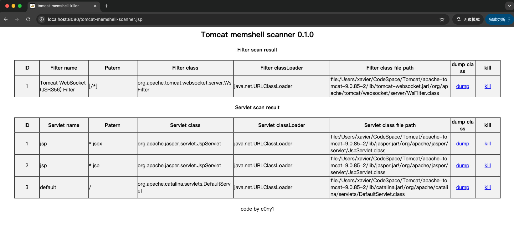

### Arthas

- [Arthas](https://github.com/alibaba/arthas)，Arthas是一款开源的Java诊断工具，基本使用场景是定位复现一些生产环境比较难以定位问题。可以在线排查问题，以及动态追踪Java代码，实时监控JVM状态等等。

**启动**

```sh
java -jar .\arthas-boot.jar #java应用进程PID
```

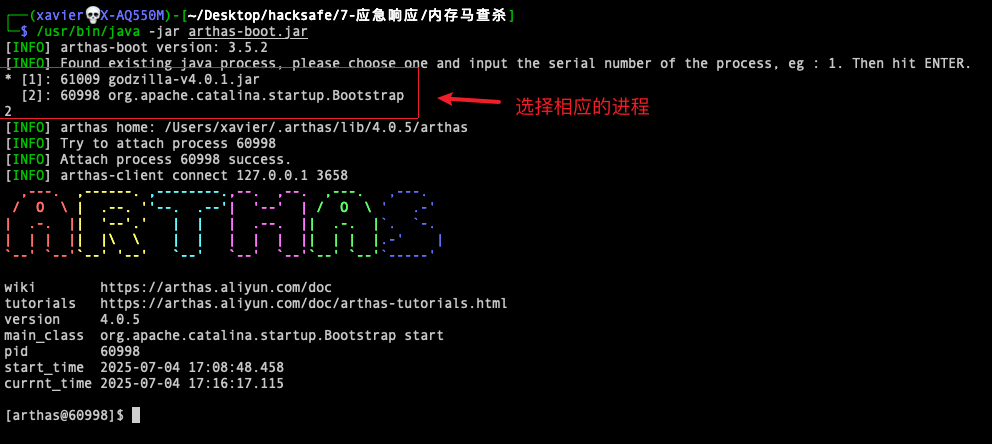

查看当前的Servlet、Filter、Listener

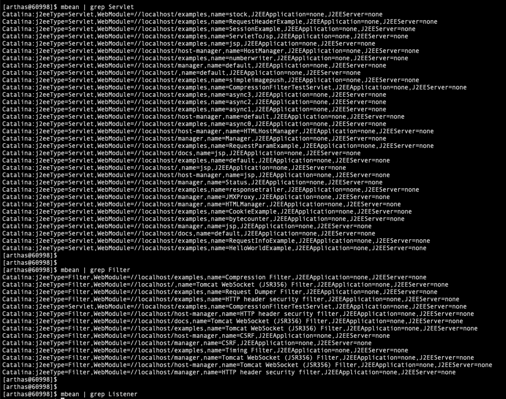

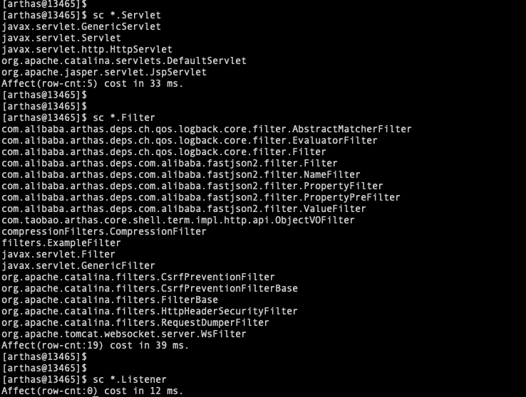


#### **常用命令**

输入Mbean 查看或监控 Mbean 的属性信息，根据内存马的特性，进行筛选出异常组件，

**1.查看URL路由（看Servlet内存马）**

&gt; 内存马访问触发特征：URL地址路径在源码中不存在

```shell
[arthas@38043]$ mbean | grep &#34;name=/&#34;
[arthas@38043]$ mbean | grep Servlet
[arthas@38043]$ mbean | grep Filter
[arthas@38043]$ mbean | grep Listener
```

查看 Mbean 的信息，查看异常Filter、Servlet、Listener节点

**2. sc查看JVM 已加载的类信息**

```shell
sc #(查看JVM已加载的类信息)
sc xxx.* #模糊搜索类
sc *.xxx	#支持各种类型 

sc *.Filter  #搜索符合pattern的Filter
sc *.Servlet 
sc *.Listener

#Spring框架内存马
sc * | grep Controller
sc * | grep Interceptor
```

根据类名判断，搜索是否有相关资料，若没有则下载其源码，查看是否有后门，也可直接上传微步在线


 查看某类加载的类信息

```sh
sc -d &lt;class_name&gt;

# 查看x.AES_BASE64类加载的类信息
sc -d payload x.AES_BASE64
sc -d org.apache.jsp.tomcat_002dmemshell_002dscanner_jsp
```

反编译指定类

```shell
jad --source-only &lt;class_name&gt;
jad --source-only org.apache.jsp.memshell_jsp  #反编译指定类
```

反编译输出的结果能查看到内存马的恶意语句


dump已加载类的字节码

```sh
#dump已加载类的bytecode到特定目录
dump org.apache.coyote.type.PlaceholderForType
```


### 其他工具

- [aLIEz](https://github.com/r00t4dm/aLIEz)，内存马查杀工具，采用反射动态加载JDK依赖，不会直接transformer去改bytecode， 现在是直接dump出来依赖研究人员自己分析。杀各个JavaEE容器、中间件的内存马
- [copagent](https://github.com/LandGrey/copagent)：自动提取项目 需要自己排查，能排查几乎主流内存马技术
- [FindShell](https://github.com/geekmc/FindShell)：内存马查杀工具，尤其针对Agent型，原理是dump出JVM当前的class并进行字节码分析，并加入自动修复的功能
- [NoAgent-memshell-scanner](https://github.com/xyy-ws/NoAgent-memshell-scanner)，NoAgent内存马检测程序，支持检测 agent型内存马、tomcat filter/servlet/listener/valve型内存马、spring interceptor,controller型内存马，支持非agent型内存马的删除功能。
- [shell-analyzer](https://github.com/4ra1n/shell-analyzer)，一款GUI版本的实时内存马查杀工具，支持本地查杀与远程查杀； 仅测试了Tomcat这一种中间件，不过理论上任何实现了Servlet规范的中间件都可以查杀


## 案例-哥斯拉内存马

### 注入内存马

哥斯拉生成普通的Webshell，将shell01.jsp放到Tomcat Web目录下

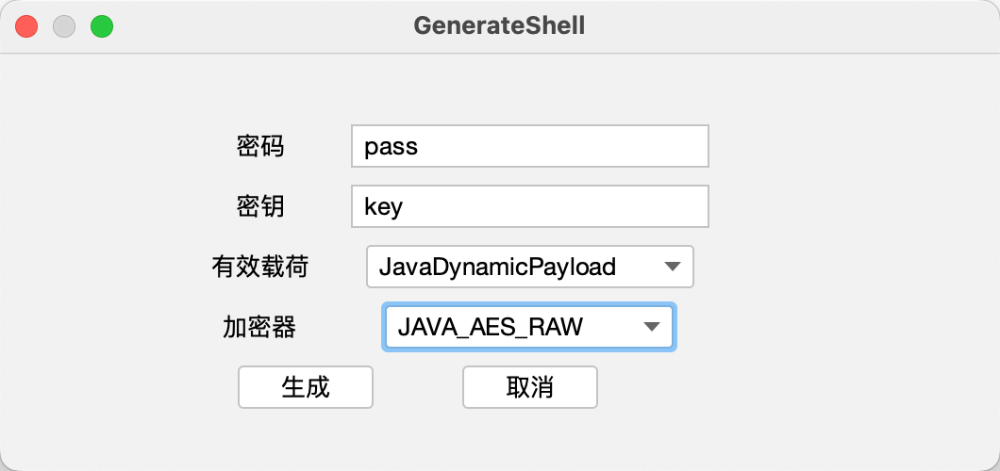

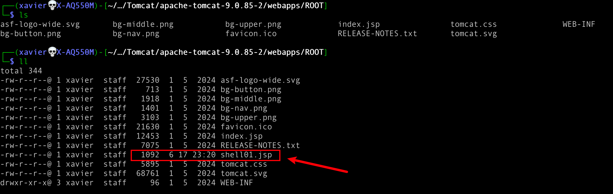

通过哥斯拉连接Webshell，连接正常，

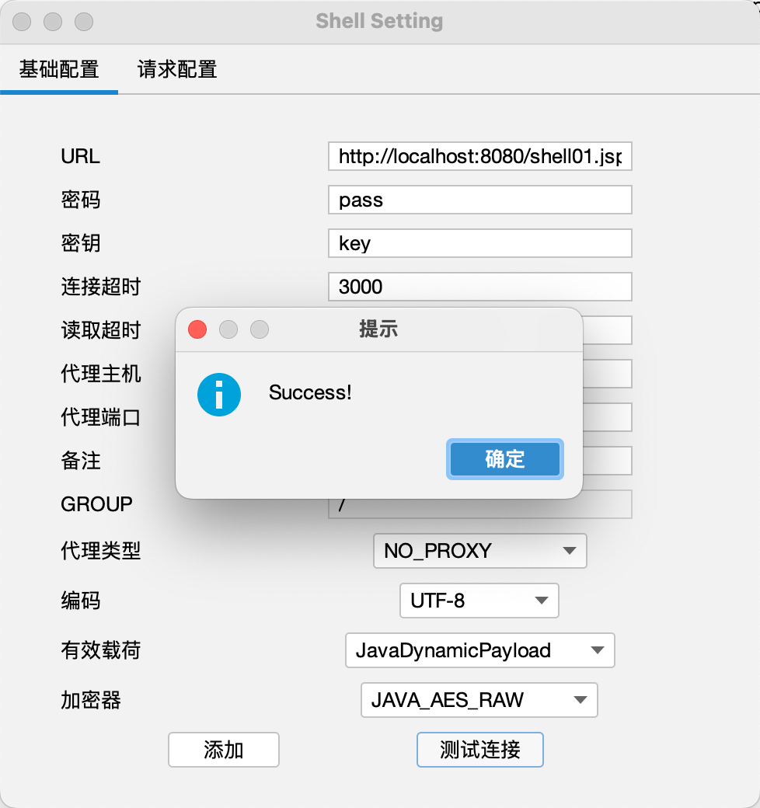

右键进入，在shell页面选择内存马MemoryShell 或 FilterShell，选择相应的类型进行执行。

哥斯拉内存马是servlet型和filter型，这两种相对比较好排查。

**注入Servlet型**

注入前可以先选择 ServletManage 点击 getAllServlet，查看下当前的状态

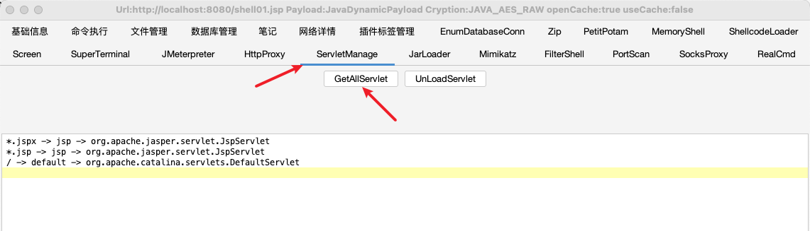

通过MemoryShell，设置好选项后，点击 run 进行注入

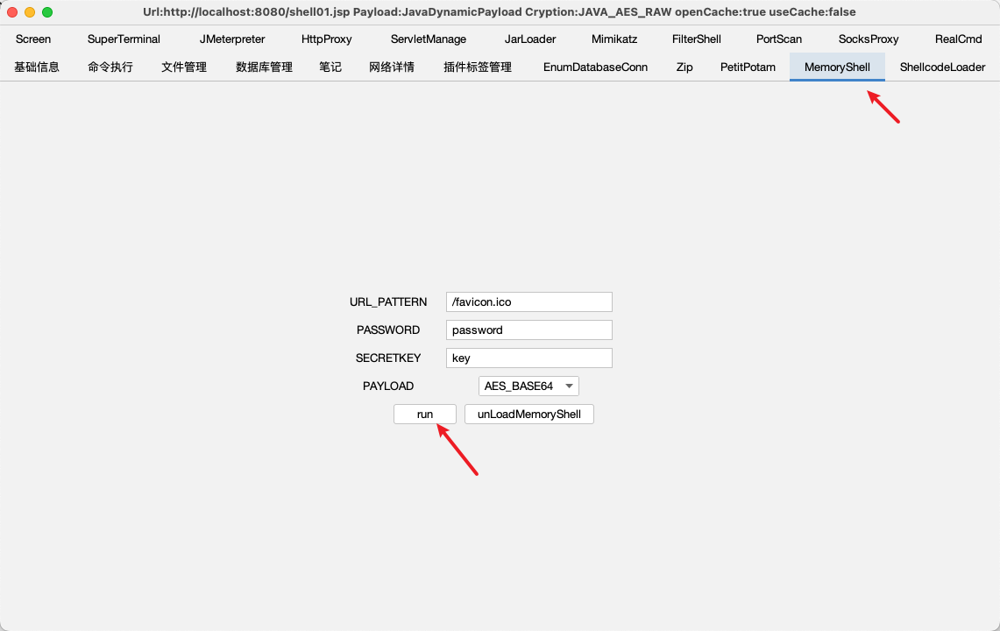

注入后再次点击 ServletManage，点击 getAllServlet，查看下当前的状态，可以看到新增了一条。

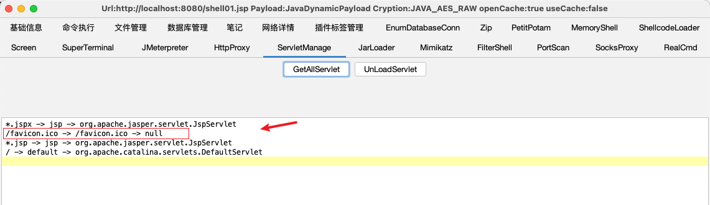

**注入Filter型**

注入前可以先点击 getAllFilter，查看下当前的状态

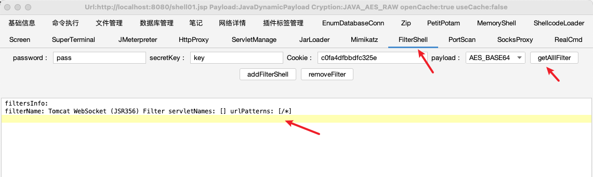

通过点击 addFilterShell 进行注入

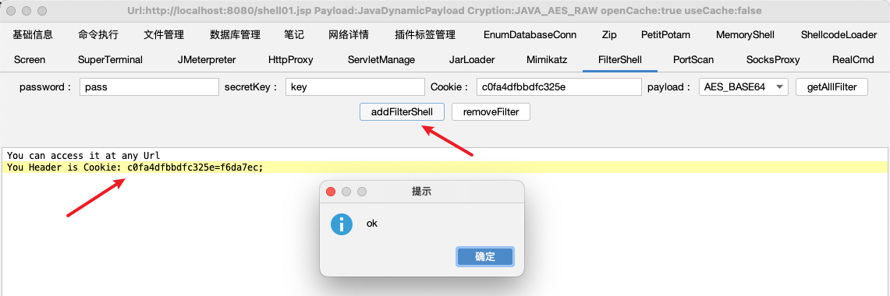

注入后再次点击 getAllFilter，查看下当前的状态，可以看到新增了一条。

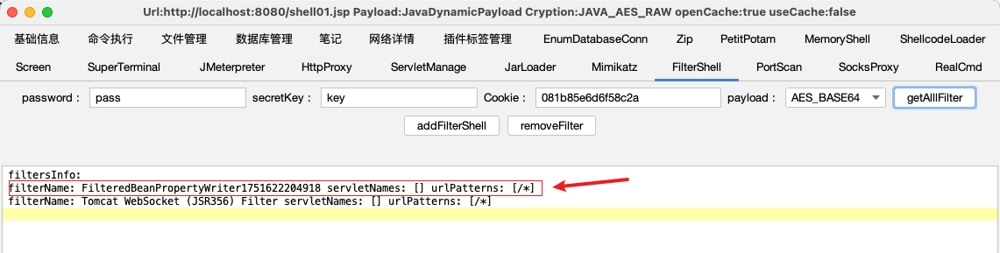


### java-memshell-scanner排查

通过访问 /tomcat-memshell-scanner.jsp 即可进行排查，可以看到新增的两条都被找到了。

```
http://localhost:8080/tomcat-memshell-scanner.jsp
```


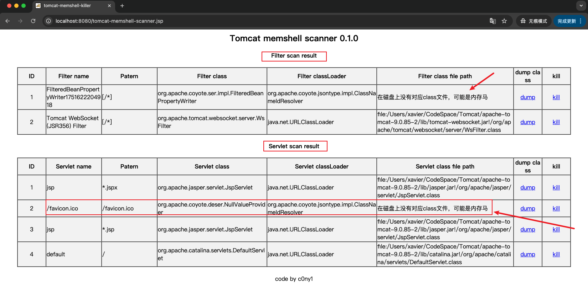

通过dump可以下载相应的class类进行分析，点击Kill即可删除相应内存马。

### Arthas排查

Arthas 只能排查是否存在，提取内存马Class并反编译，无法直接删除。

查看 Mbean 的信息，查看异常Filter/Servlet节点

```sh
mbean | grep &#34;Servlet&#34;
```

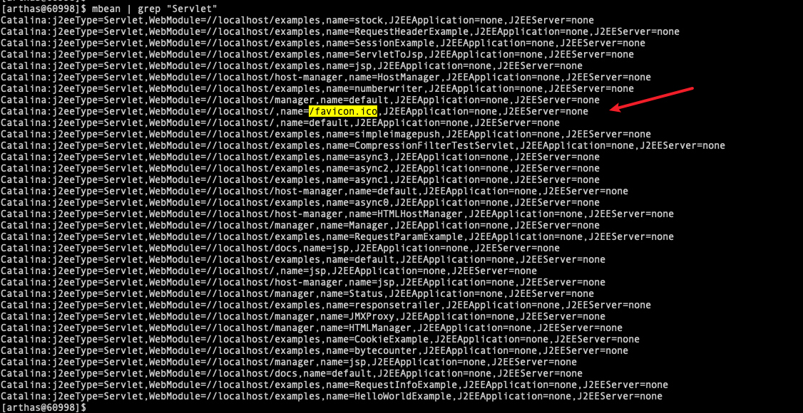

```
mbean | grep Filter
```

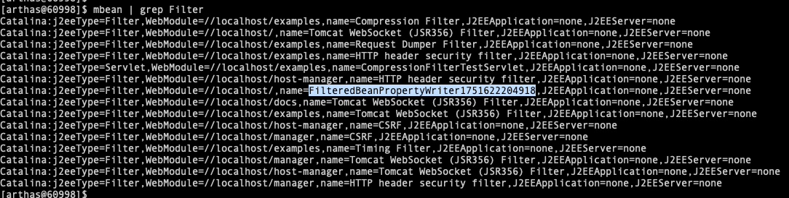

在真实常见中，就需要我们对这些相应的servlet、filter名称有一些了解，从而发现其中的异常可疑类。

搜索查看JVM已加载的类信息，模糊匹配Servlet和Filter类

```sh
sc *.Servlet
sc *.Filter
```

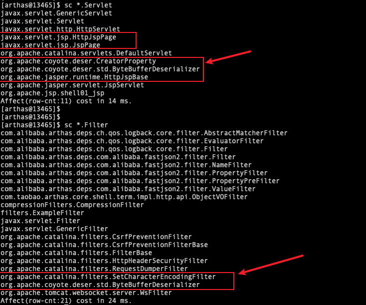

可以看到新增了很多类，其中有些是我们上传的shell01.jsp导致 的，我们对其中可疑的类进行分析。

反编译指定的类 


```sh
jad --source-only org.apache.jsp.shell01_jsp
```

这里可以看到，反编译输出的结果能很清晰的查看到冰蝎马的内容和密码。


dump可疑类进行分析

```sh
dump org.apache.coyote.deser.CreatorProperty
dump org.apache.coyote.deser.std.ByteBufferDeserializer
```

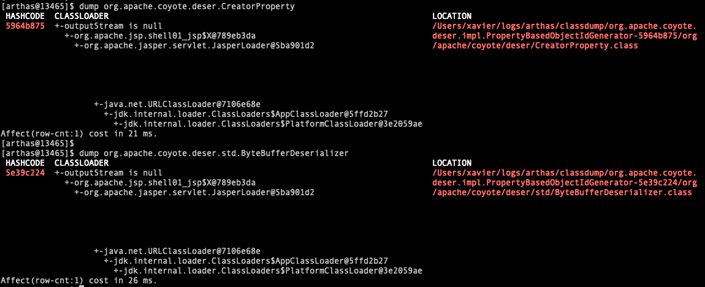

通过反编译工具反编译相关类，可以查看到内存马的恶意语句

`org.apache.coyote.deser.CreatorProperty`对应的Servlet类内存马：

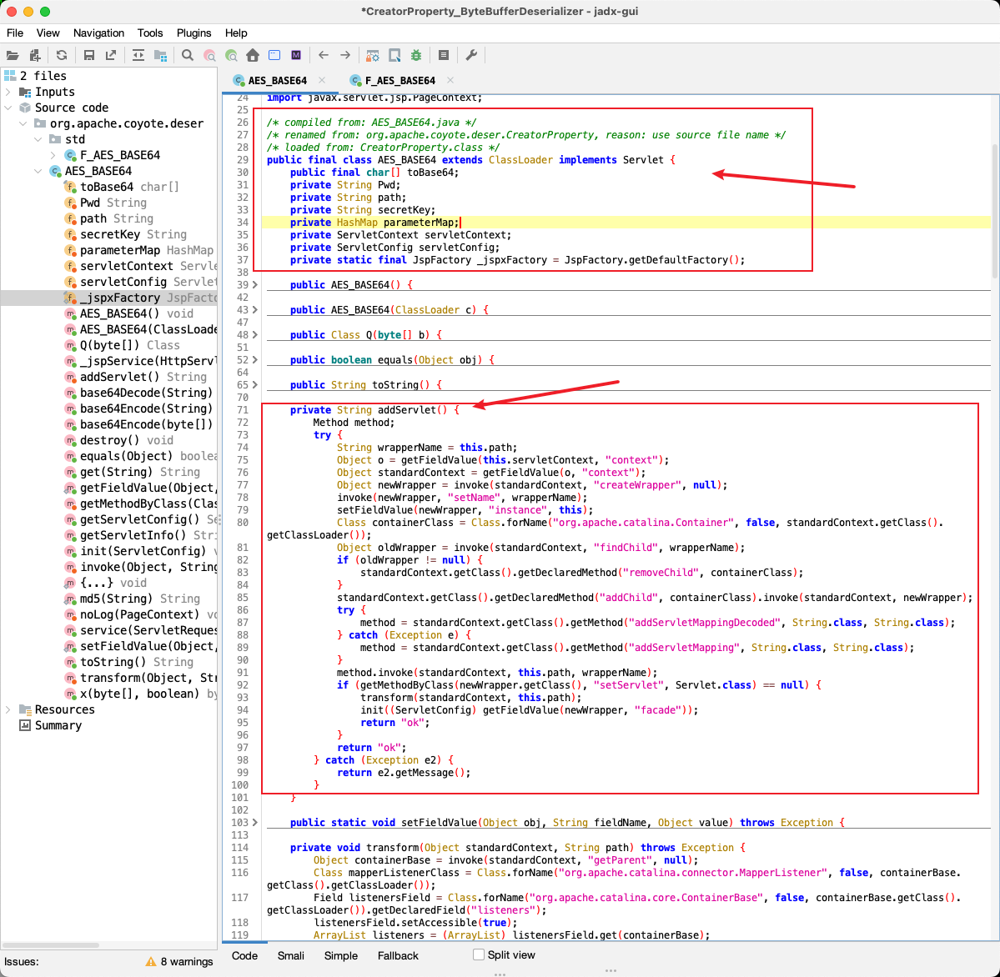

`org.apache.coyote.deser.std.ByteBufferDeserializer`对应的Filter类内存马：

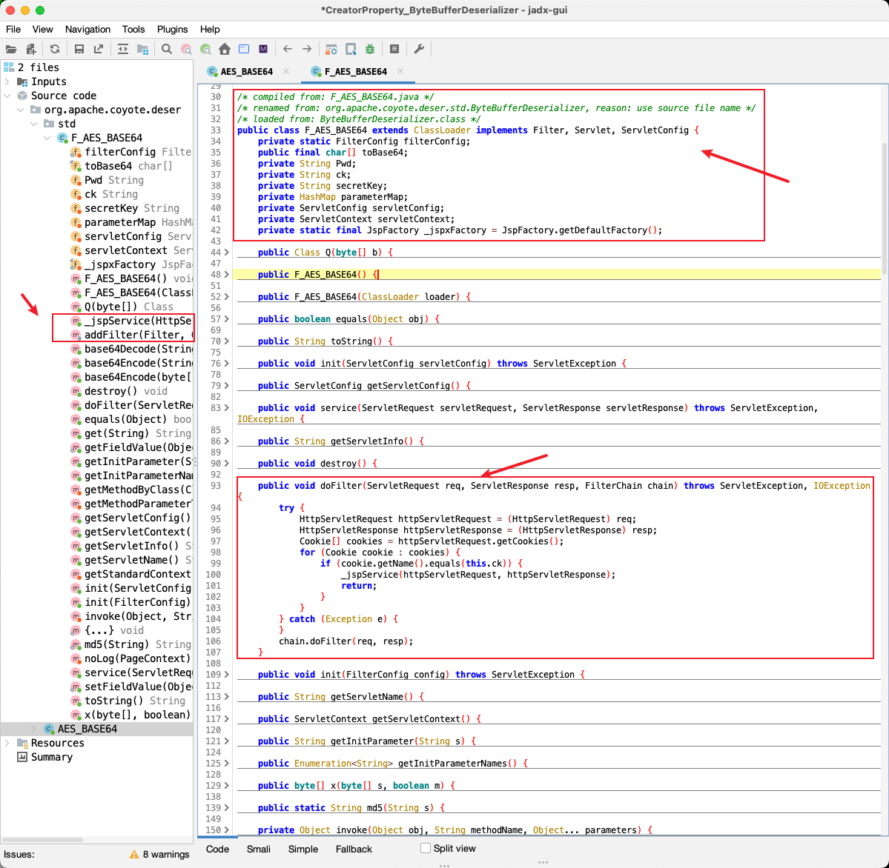

 内存Dump

```sh
[arthas@13465]$ heapdump
Dumping heap to /Users/xavier/CodeSpace/Tomcat/apache-tomcat-9.0.85-2/temp/heapdump2025-07-10-16-325369075522353126614.hprof ...
Heap dump file created

#设置保存路径时建议用绝对路径
[arthas@13465]$ heapdump /Users/xavier/Desktop/Tmp/heapdump-1.hprof 
Dumping heap to /Users/xavier/Desktop/Tmp/heapdump-1.hprof ...
Heap dump file created
```

根据关键词进行检索

```sh
$ strings heapdump-1.hprof | grep &#34;POST /&#34;

$ strings heapdump-1.hprof| grep &#34;favicon.ico&#34;
com/taobao/arthas/core/http/favicon.icoPK
POST //favicon.ico HTTP/1.1
org.apache.catalina.core.ContainerBase.[Catalina].[localhost].[/].[/favicon.ico]!
J2EEApplication=none,J2EEServer=none,WebModule=//localhost/,j2eeType=Servlet,name=/favicon.ico!
Catalina:J2EEApplication=none,J2EEServer=none,WebModule=//localhost/,j2eeType=Servlet,name=/favicon.ico&#34;
/favicon.ico!
/favicon.icoo
```


来自网络的 冰蝎、哥斯拉内存检测命令

```sh
# dump内存，用arthas Dump内存替代
jmap -dump:live,format=b,file=heapdump.hprof pid

# 检测Godzilla
if grep -q &#39;getBasicsInfo&#39; heapdump.hprof &amp;&amp; grep -q &#39;srcFileName&#39; heapdump.hprof &amp;&amp; grep -q &#39;destFileName&#39; heapdump.hprof;then echo &#39;exist Godzilla&#39;;else echo &#39;&#39;;fi;

# 检测冰蝎
if grep -q &#39;basicInfo&#39; heapdump.hprof &amp;&amp; grep -q &#39;currentPath&#39; heapdump.hprof &amp;&amp; grep -q &#39;driveList&#39; heapdump.hprof;then echo &#39;exist behinder&#39;;else echo &#39;&#39;;fi;
```

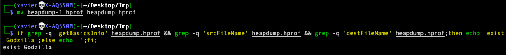

### 清除内存马

清楚内存马最常见的方式就是对服务进行重启。

针对于Servlet类和Filter类，可以采用工具进行清除，比如上面的 Java-Memshell-Scanner 点击 Kill 进行清除。


## 参考文献

- [查杀Java web filter型内存马](https://gv7.me/articles/2020/kill-java-web-filter-memshell/) c0ny1 2020-08-13
- [Filter/Servlet型内存马的扫描抓捕与查杀](https://gv7.me/articles/2020/filter-servlet-type-memshell-scan-capture-and-kill/) c0ny1  2020-09-09
- [冰蝎、哥斯拉 内存马应急排查](https://zgao.top/%e5%86%b0%e8%9d%8e%e3%80%81%e5%93%a5%e6%96%af%e6%8b%89-%e5%86%85%e5%ad%98%e9%a9%ac%e5%ba%94%e6%80%a5%e6%8e%92%e6%9f%a5/)
## 文件属性

创建时间：2025-06-25   10:52

修订记录：
- 2025-06-25 ，此次修订内容| 新建

备注：xxx

---

> 作者: Xavier  
> URL: http://localhost:1313/posts/%E5%86%85%E5%AD%98%E9%A9%AC%E6%9F%A5%E6%9D%80%E7%AC%94%E8%AE%B0/  

