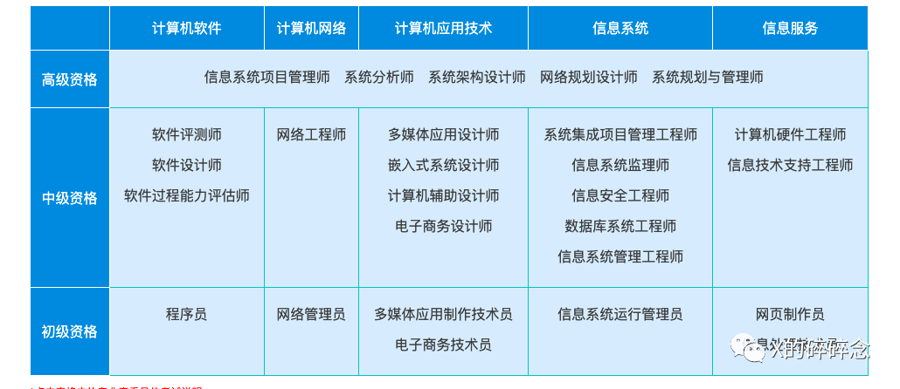
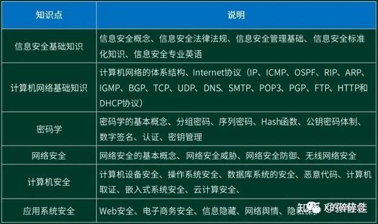
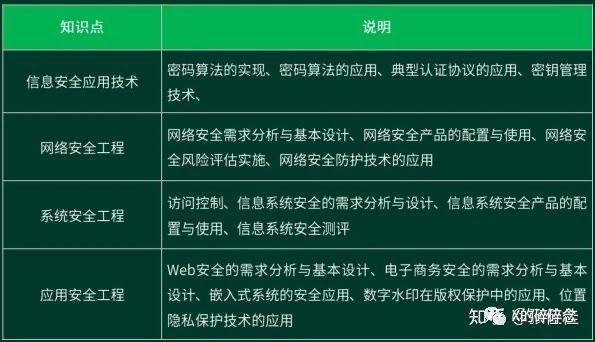
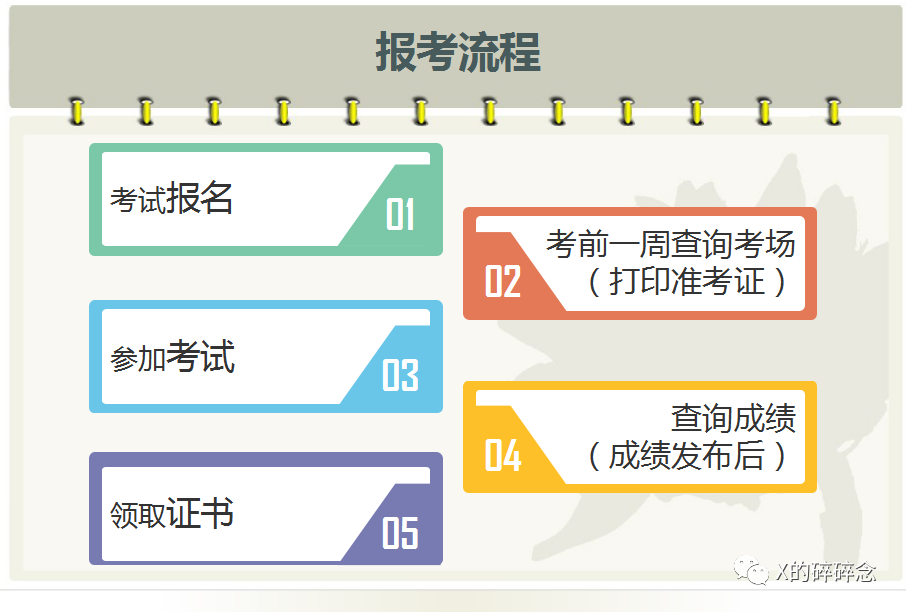

# 软考-中级信息安全工程师

## 一、简介

### 1.1 软考介绍

软考，即计算机技术与软件专业技术资格（水平）考试，以下为官方介绍：

&gt; 计算机技术与软件专业技术资格（水平）考试（以下简称计算机软件资格考试）是原中国计算机软件专业技术资格和水平考试（简称软件考试）的完善与发展。计算机软件资格考试是由国家人力资源和社会保障部、工业和信息化部领导下的国家级考试，其目的是科学、公正地对全国计算机与软件专业技术人员进行职业资格、专业技术资格认定和专业技术水平测试。

更多信息见官网：https://www.ruankao.org.cn/。

软考共设置了27个专业资格，涵盖5个专业领域， 3个级别层次（初级、中级、高级），资格设置见下图：

本文基于个人经历，向大家分享软考中级资格的信息安全工程师报考经验。

### 1.2 信息安全工程师

信息安全工程师，考试科目共两科：

（1）网络信息安全基础知识和技术，考试时间为150分钟，笔试，75道选择题，45分通过；

（2）网络信息安全工程与综合应用实践，考试时间为150分钟，笔试，5/6道问答题，45分通过；

#### 1.信息安全基础知识

上午考试内容为基础知识和技术，单选题，但是知识面广，内容细致，因此只要有针对性地加强复习，多刷刷题，一般没什么问题。下图为知乎网友整理的知识点表格。

#### 2.信息安全应用技术

下午试题内容为综合应用实践，都是问答题，呈由易到难分布。前面的问题少，后面的问题多而复杂，需要多复习，有些难度。

2020年信息安全工程师考试大纲进行了改版，具体考试内容以新版的《信息安全工程师考试大纲》为准。

准备备考资料时，也需要注意版本，新版本增加了物联网、云计算、人工智能、大数据等新兴技术。

## 二、报考流程：

### 关注动态：

- [中国计算机技术职业资格网](https://www.ruankao.org.cn/)：提供相关政策、动态、考试安排

关注[考试安排](https://www.ruankao.org.cn/arrange)，《202x年全国计算机技术与软件专业技术资格(水平)考试工作安排》，会写考试时间，根据这个时间去安排，去年报名是考试前2个月。

### 考试报名：

- 软考[网上报名平台](https://bm.ruankao.org.cn/sign/welcome)

通过网上报名平台进行报名，需要进行信息填报，身份确认，网上缴费等，考试报名费为￥114。

报名缴费完成之后，就可以开始备考了。

等到考前一周左右，可以打印准考证了，这时候也就知道自己在哪个考场了。

仔细核对准考证内容，并按照要求参加考试。

## 三、如何备考

- 知乎：如何备考软考中级信息安全工程师？https://www.zhihu.com/question/314497181

去年报名时间为8月29日-9月7日，考试时间为11月5日，中间有2个月时间备考，当然最好还是提前开始准备。

一般建议4-5个月，对于零基础的学员来说，有可能时间会很长，要想全面掌握知识考点，必须吃透教材和考试大纲，安排充足的学习时长，将软考的书籍知识点吃透吃扎实。

备考需要的材料，一般就是官方教材《信息安全工程师教程》&#43;历年真题（含解析），其他还可以有视频或音频&#43;课件&#43;干货资料&#43;其他资料。报班学习和教辅材料看个人吧。

核心还是**熟读教材&#43;准备复习资料&#43;题海战术**。

### 备考材料：

- 教材（第二版）￥40（盗版）
- 软考通APP ￥0
- 《信息安全工程师5天修炼》（第二版）￥34.2
- 《信息安全工程师考前冲刺100题》￥30

买教材和教辅需要注意一下版本是否最新。注意查看官网每年的考试大纲有没有变化，教程官网有[购买链接](https://www.ruankao.org.cn/book/lists)。

我的备考时间：2个月，中间有个十一假期可以全天学习

### 备考安排：

1.利用碎片时间刷题；

2.通读一遍考试大纲，知道考什么；通读一遍教材，大概有个印象；对照着大纲，把重点内容多看看；

3.错题集，刷题过程中遇到的错题，不光看解析，还要去翻翻书，复习知识点，加深印象；

4.综合应用部分知识点多看多学。

5.教辅中的重点吃透。

总的来说就还是**熟读教材、题海战术**。

## 四、考后查分

### 查成绩：

两门科目成绩都在45分以上则通过考试。

去年查成绩的时间是12月15日，查询方式如下：

- 方式一：登录中国计算机技术职业资格网-[成绩查询入口](https://query.ruankao.org.cn/score/main)：输入“姓名”、“准考证号”（或“证件号码”）查询成绩。
- 方式二：登录中国计算机技术职业资格网-[报名系统](https://bm.ruankao.org.cn/sign/welcome)：输入注册账号和密码查询成绩；

考试通过后，需要再等段时间就可以查询证书，获取证书管理编号。

### 查证书：

时间1月3日，距离考试结束2个月左右

电子证书在线查询：

- [全国专业技术人员职业资格证书-查询验证系统](https://zs.cpta.com.cn/certMng/loginPage.jsp) ：没注册过的同学需要先注册个用户，这里可以先下载电子版证书。
- [计算机技术与软件专业技术资格（水平）考试-证书查询](https://query.ruankao.org.cn/certificate/main) ：可查询证书管理编号及有效性。

### 证书领取（未经历）

证书领取时间一般在考试结束后5-6个月左右开始领取，如上半年5月份软考证书领取时间一般从10月底开始，下半年11月份软考证书领取时间则一般在次年3月底陆续开始。

各省领取时间有所不同，具体请考生关注当地软考办官网或人事考试网。

证书领取方式：

- 个人领证：凭本人有效身份证原件等资料领取;
- 他人(单位)代领：凭代领人及持证人有效身份证原件等资料领取(有些地区不支持代领);
- 证书邮寄：网上申请证书邮寄(部分地区支持)。

证书领取流程：携带相关资料证件，如身份证、准考证、成绩单等;

填写《专业资格考试登记表》。

## 五、注意事项

1. 软考不能补报名或补缴费，错过报名或缴费的，均视为放弃报名，只能来年再战了。
2. 考试报名严格执行属地化管理，现工作地或居住地为北京地区的报考人员方可在北京报名参加考试。
3. 软考没有补考，失败了只能来年再战。
4. 当前是信息安全工程师（第二版），购买教辅材料时注意区分。

tag:
#证书 

---

> 作者: Xavier  
> URL: https://www.bthoughts.top/posts/%E8%BD%AF%E8%80%83-%E4%B8%AD%E7%BA%A7%E4%BF%A1%E6%81%AF%E5%AE%89%E5%85%A8%E5%B7%A5%E7%A8%8B%E5%B8%88/  

